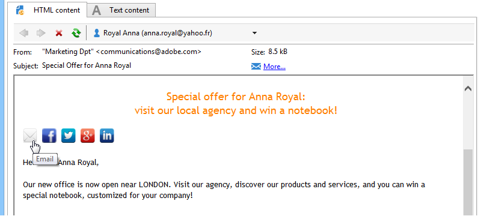

# Viral en social marketing{#viral-and-social-marketing}

## Informatie over virale marketing {#about-viral-marketing}

Met Adobe Campaign kunt u gereedschappen instellen om het op de markt brengen van virussen aan te moedigen.

Hierdoor kunnen ontvangers van de levering of websitebezoekers gegevens delen met hun netwerk: van het toevoegen van een koppeling naar hun Facebook- of Twitter-profiel naar het verzenden van een bericht naar een vriend.

>[!CAUTION]
>
>Voor het correct functioneren van toegevoegde verbindingen, moet de passende spiegelpagina beschikbaar zijn. Hiervoor neemt u de koppeling naar de spiegelpagina op in de levering.

## Sociale netwerken: delen, een koppeling {#social-networks--sharing-a-link}

Om leveringsontvangers toe te laten om de inhoud van berichten met leden van hun netwerk te delen, moet u het passende verpersoonlijkingsblok omvatten.

>[!NOTE]
>
>Deze koppeling wordt standaard niet aangeboden in de lijst met blokken. U kunt tot het toegang hebben door **[!UICONTROL Other...]** te klikken, en &lt;a1 te selecteren/> blok.**[!UICONTROL Social network sharing links]**

De rendering is als volgt:

Wanneer de ontvanger op het pictogram van een van de weergegeven sociale netwerken klikt, wordt deze automatisch omgeleid naar hun account en kan de inhoud van het bericht via een koppeling worden gedeeld. Dit laat de leden van hun netwerk tot de mededeling toegang hebben.

>[!NOTE]
>
>Dit verpersoonlijkingsblok bevat alle koppelingen (voor het verzenden en delen van berichten met alle sociale netwerken). Het kan worden aangepast aan uw behoeften. De configuratie is echter gereserveerd voor geavanceerde gebruikers. Als u het overeenkomende aanpassingsblok wilt bewerken, gaat u naar het knooppunt **[!UICONTROL Resources > Campaign management > Personalization blocks]** van de Adobe Campaign-structuur.

## Virale marketing: doorsturen naar een vriend {#viral-marketing--forward-to-a-friend}

Een virale dienst maakt verwijzingsacties mogelijk: met deze acties kunt u een bericht naar een vriend sturen . Het profiel van de referentie(s) wordt tijdelijk opgeslagen in de database (in een specifieke tabel). De doorgestuurde berichten bevatten een koppeling waarmee de scheidsrechter zich kan abonneren: als ze dat doen, worden ze toegevoegd aan de Adobe Campaign-database.

Het doorsturen van berichten is gebaseerd op de zelfde principes zoals sociale netwerkverbindingen.

Pas de volgende stappen toe:

1. Voeg het **[!UICONTROL Social network sharing links]** verpersoonlijkingsblok in het lichaam van het originele bericht toe.
1. De ontvanger van het bericht kan op het pictogram **[!UICONTROL Email]** klikken om dit bericht naar één of meerdere vrienden te verzenden.

   

   Met een verwijzingsformulier kunt u de e-mailadressen van de scheidsrechters invoeren.

   

   Het bericht wordt naar hen verzonden wanneer de belangrijkste ontvanger **[!UICONTROL Next]** knoop klikt.

   >[!NOTE]
   >
   >De inhoud van dit bericht kan aan uw behoeften worden aangepast. Het wordt gecreeerd gebaseerd op het **[!UICONTROL Transfer of original message]** malplaatje, dat in **[!UICONTROL Administration > Campaign management > Technical delivery templates]** knoop wordt opgeslagen.
   >
   >Het is ook mogelijk om het bericht voorwaartse vorm te veranderen die aan verwijzer wordt ter beschikking gesteld om dit te doen, moet u **Viral vorm** de toepassing van het Web veranderen die in **[!UICONTROL Resources > Online > Web applications]** knoop wordt opgeslagen.

1. In het door:sturen bericht, laat een verbinding de referentie hun profiel in het gegevensbestand opslaan. Hiertoe wordt een formulier voor het invullen van gegevens verstrekt.

   

   >[!NOTE]
   >
   >Deze configuratie kan worden aangepast. Hiervoor moet u het **Recipient-abonnement** webtoepassing wijzigen dat is opgeslagen in het knooppunt **[!UICONTROL Resources > Online > Web applications]**.
   >
   >Raadpleeg [deze sectie](../../web/using/about-web-applications.md) voor meer informatie over webtoepassingen.

   Nadat ze zijn gevalideerd, wordt een bevestigingsbericht naar hen verzonden: ze worden pas goed geregistreerd als ze de koppeling in het bevestigingsbericht activeren. Dit bericht wordt gecreeerd gebaseerd op het **[!UICONTROL Registration confirmation]** malplaatje, dat in **[!UICONTROL Administration > Campaign management > Technical delivery templates]** knoop wordt opgeslagen.

   De referentie wordt toegevoegd aan de **omslag van Ontvangers** van het gegevensbestand en (door gebrek) ingetekend aan **de informatiedienst van het Bulletin**.

## Delen van sociale netwerken bijhouden {#tracking-social-network-sharing}

Het delen van en de toegang tot gedeelde informatie wordt gevolgd. Deze door Adobe Campaign verzamelde informatie is op twee plaatsen toegankelijk:

* op het tabblad **[!UICONTROL Tracking]** van de levering (of afzonderlijk voor elke ontvanger):

   

* in een speciaal **[!UICONTROL Sharing to social networks]**-rapport:

   

