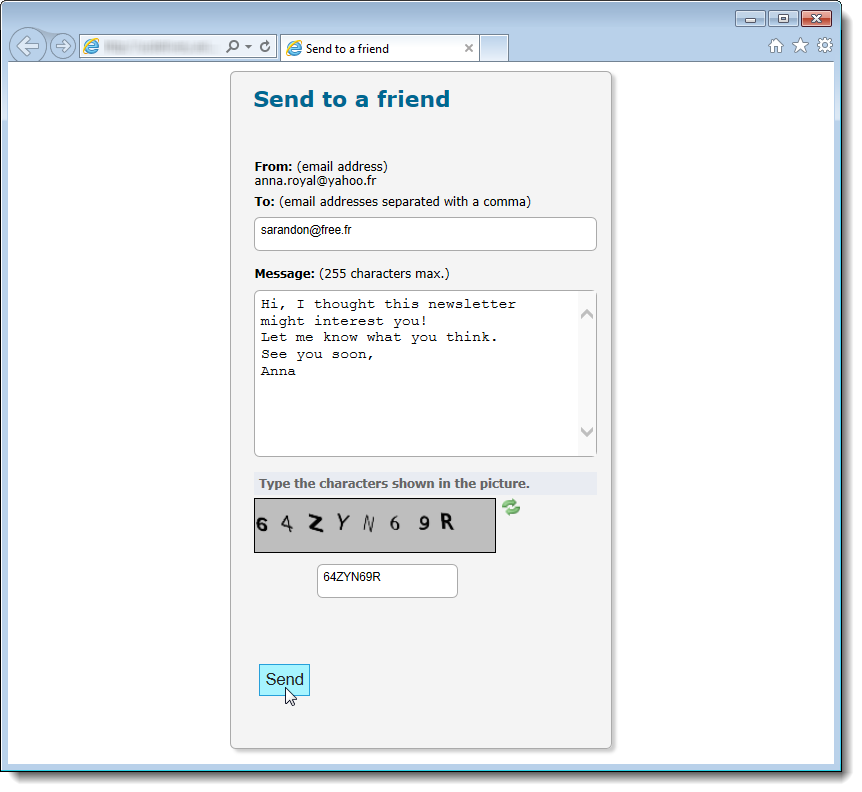

# Viral en social marketing{#viral-and-social-marketing}

Met Adobe Campaign kunt u gereedschappen instellen om het op de markt brengen van virussen aan te moedigen.

Hierdoor kunnen ontvangers of websitebezoekers gegevens delen met hun netwerk: van het toevoegen van een koppeling naar hun Facebook- of X-profiel (voorheen bekend als Twitter) tot het verzenden van een bericht naar een vriend.

>[!CAUTION]
>
>Voor het correct functioneren van toegevoegde verbindingen, moet de passende spiegelpagina beschikbaar zijn. Hiervoor neemt u de koppeling naar de spiegelpagina op in de levering.

## Sociale netwerken: een koppeling delen {#social-networks--sharing-a-link}

Om leveringsontvangers toe te laten om de inhoud van berichten met leden van hun netwerk te delen, moet u het passende verpersoonlijkingsblok omvatten.

>[!NOTE]
>
>Deze koppeling wordt standaard niet aangeboden in de lijst met blokken. U kunt het openen door te klikken **[!UICONTROL Other...]** en selecteert u de **[!UICONTROL Social network sharing links]** blokkeren.

De rendering is als volgt:

Wanneer de ontvanger op het pictogram van een van de weergegeven sociale netwerken klikt, wordt deze automatisch omgeleid naar hun account en kan de inhoud van het bericht via een koppeling worden gedeeld. Dit laat de leden van hun netwerk tot de mededeling toegang hebben.

>[!NOTE]
>
>Dit verpersoonlijkingsblok bevat alle koppelingen (voor het verzenden en delen van berichten met alle sociale netwerken). Het kan worden aangepast aan uw behoeften. De configuratie is echter gereserveerd voor geavanceerde gebruikers. Ga naar het tabblad **[!UICONTROL Resources > Campaign management > Personalization blocks]** knooppunt van de boomstructuur Adobe Campaign.

## Virale marketing: doorsturen naar een vriend {#viral-marketing--forward-to-a-friend}

Een virale dienst staat verwijzingsacties toe om worden uitgevoerd: deze acties laten u toe om een bericht aan een vriend door te sturen. Het profiel van de referentie(s) wordt tijdelijk opgeslagen in de database (in een specifieke tabel). De doorgestuurde berichten bevatten een koppeling waarmee de referentie zich kan abonneren: als deze berichten wel worden verzonden, worden ze toegevoegd aan de Adobe Campaign-database.

Het doorsturen van berichten is gebaseerd op de zelfde principes zoals sociale netwerkverbindingen.

Pas de volgende stappen toe:

1. Voeg de **[!UICONTROL Social network sharing links]** het verpersoonlijkingsblok in het lichaam van het originele bericht.
1. De ontvanger van het bericht kan op **[!UICONTROL Email]** pictogram om dit bericht naar een of meer vrienden te verzenden.

   

   Met een verwijzingsformulier kunt u de e-mailadressen van de scheidsrechters invoeren.

   

   Het bericht wordt naar hen verzonden wanneer de belangrijkste ontvanger klikt **[!UICONTROL Next]** knop.

   >[!NOTE]
   >
   >De inhoud van dit bericht kan aan uw behoeften worden aangepast. Het wordt gemaakt op basis van de **[!UICONTROL Transfer of original message]** sjabloon, dat wordt opgeslagen in de **[!UICONTROL Administration > Campaign management > Technical delivery templates]** knooppunt.
   >
   >Het is ook mogelijk om het bericht te wijzigen dat naar de verwijzende persoon wordt gestuurd. Hiervoor moet u de **Virale vorm** Webtoepassing opgeslagen in de **[!UICONTROL Resources > Online > Web applications]** knooppunt.

1. In het door:sturen bericht, laat een verbinding de referentie hun profiel in het gegevensbestand opslaan. Hiertoe wordt een formulier voor het invullen van gegevens verstrekt.

   

   >[!NOTE]
   >
   >Deze configuratie kan worden aangepast. Hiervoor moet u de **Abonnement ontvangers** Webtoepassing opgeslagen in de **[!UICONTROL Resources > Online > Web applications]** knooppunt.
   >
   >Raadpleeg voor meer informatie over webtoepassingen [deze sectie](../../web/using/about-web-applications.md).

   Nadat ze zijn gevalideerd, wordt hun een bevestigingsbericht gestuurd: ze worden pas goed geregistreerd als ze de koppeling in het bevestigingsbericht activeren. Dit bericht wordt gemaakt op basis van de **[!UICONTROL Registration confirmation]** sjabloon, dat wordt opgeslagen in de **[!UICONTROL Administration > Campaign management > Technical delivery templates]** knooppunt.

   De referentie wordt toegevoegd aan de **Ontvangers** map van de database en is (standaard) geabonneerd op de **Nieuwsbrief** informatiedienst.

## Delen van sociale netwerken bijhouden {#tracking-social-network-sharing}

Het delen van en de toegang tot gedeelde informatie wordt gevolgd. Deze door Adobe Campaign verzamelde informatie is op twee plaatsen toegankelijk:

* in de **[!UICONTROL Tracking]** tabblad van de levering (of afzonderlijk voor elke ontvanger):

  

* in een specifieke **[!UICONTROL Sharing to social networks]** rapport:

  
