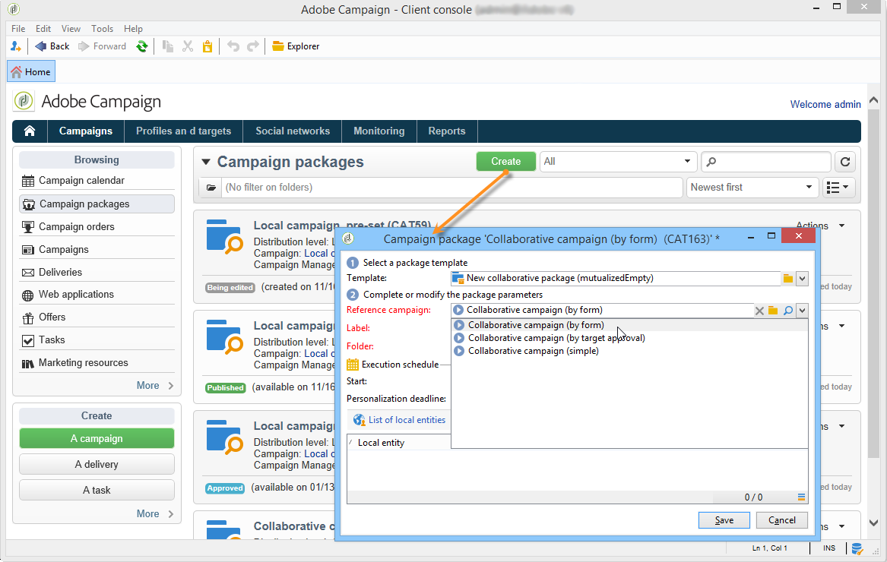
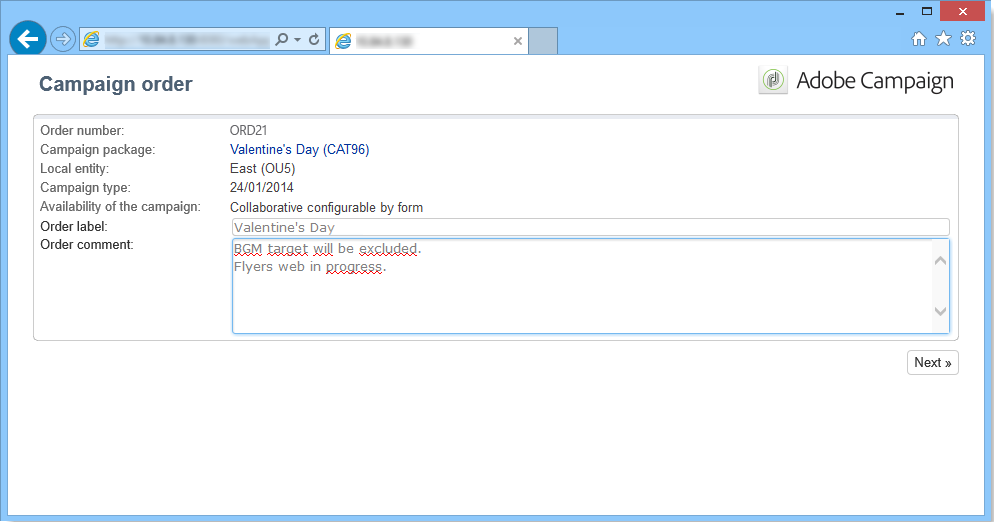

# Een collaboratieve campagne maken{#creating-a-collaborative-campaign-intro}

De centrale entiteit leidt samenwerkingscampagnes van **Verdeelde de campagnemalplaatjes van de Marketing**. Zie [deze pagina](about-distributed-marketing.md#collaborative-campaign).

## Een collaboratieve campagne maken {#creating-a-collaborative-campaign}

Als u een samenwerkingscampagne wilt configureren, klikt u op het knooppunt **[!UICONTROL Campaign management > Campaigns]** en vervolgens op het pictogram **[!UICONTROL New]** .

>[!NOTE]
>
>Naast **[!UICONTROL collaborative campaigns (by campaign)]** kunnen deze campagnes worden geconfigureerd en uitgevoerd via een webinterface.

Het configuratieproces voor een samenwerkingscampagnecadatabase is gelijkaardig aan dat van een lokaal campagnemalplaatje. De specificaties van de verschillende soorten samenwerkingscampagnes worden hieronder beschreven.

### Op formulier {#by-form}

Als u een samenwerkingscampagne wilt maken (op formulier), moet de sjabloon **[!UICONTROL Collaborative campaign (by form)]** zijn geselecteerd.

In het **[!UICONTROL Edit]** lusje, klik de **[!UICONTROL Advanced campaign settings...]** verbinding om tot de **Verdeelde Marketing** tabel toegang te hebben.

Selecteer **door vorm** Webinterface. Met dit type interface kunt u verpersoonlijkingsvelden maken die door lokale entiteiten worden gebruikt wanneer ze een campagne bestellen. Verwijs naar [&#x200B; Creërend een lokale campagne (door vorm) &#x200B;](examples.md#creating-a-local-campaign--by-form-).

Sla uw campagne op. U kunt het van de **pakketten van de Campagne** mening in het **Campagne** lusje nu gebruiken, door de **[!UICONTROL Create]** knoop te klikken.

In de weergave **[!UICONTROL Campaign Package]** kunt u lokale campagnemalplaatjes (out-of-the-box of gedupliceerd) gebruiken, evenals referentiecampagnes voor samenwerkingscampagnes, met als doel campagnes voor uw verschillende organisatorische entiteiten te maken.

### Op campagne {#by-campaign}

Als u een samenwerkingscampagne wilt maken (per campagne), moet u de sjabloon **[!UICONTROL Collaborative campaign (by campaign) (opCollaborativeByCampaign)]** selecteren.

Wanneer het opdracht geven tot de campagne, kan de lokale entiteit de criteria voltooien die door de centrale entiteit vooraf worden bepaald, en de campagne evalueren alvorens het tot opdracht te geven.

Zodra een orde voor a **Samenwerken campagne (door campagne)** door de centrale entiteit wordt goedgekeurd, wordt een kindcampagne gecreeerd voor de lokale entiteit. Zodra zij beschikbaar zijn, kan de lokale entiteit dan wijzigen:

* de campagneworkflow;
* typologieregels;
* en personalisatievelden.

De lokale entiteit voert de onderliggende campagne uit. De centrale entiteit voert de bovenliggende campagne uit.

De centrale entiteit kan alle kindcampagnes bekijken verbonden aan a **collectieve campagne (door campagne)** van dit dashboard (via de **[!UICONTROL List of associated campaigns]** verbinding).

### Op doelgoedkeuring {#by-target-approval}

Als u een samenwerkingscampagne wilt maken (door goedkeuring als doel), moet de sjabloon **[!UICONTROL Collaborative campaign (by target approval)]** zijn geselecteerd.

>[!NOTE]
>
>In deze modus hoeft de centrale entiteit de lokale entiteiten niet op te geven.

Het campagnewerkschema moet **Lokale goedkeurings** typeactiviteit integreren. De activiteitsparameters zijn als volgt:

* **[!UICONTROL Action to perform]** : doel van goedkeuringsmelding.
* **[!UICONTROL Distribution context]** : expliciet.
* **[!UICONTROL Data distribution]** : distributie van lokale entiteiten.

**de Lokale distributie van de entiteitdistributie** typegegevens moet worden gecreeerd. Met de sjabloon voor gegevensdistributie kunt u het aantal records uit een lijst met groeperingswaarden beperken. Klik in **[!UICONTROL Resources > Campaign management > Data distribution]** op het pictogram **[!UICONTROL New]** om een nieuwe **[!UICONTROL Data distribution]** te maken. Voor meer informatie over gegevensdistributie, verwijs naar de [&#x200B; gids van de Werkschema&#39;s &#x200B;](../../workflow/using/using-the-local-approval-activity.md#step-1--creating-the-data-distribution-template-).

Selecteer de **het richten afmeting** en **[!UICONTROL Distribution field]**. Voor **[!UICONTROL Assignment type]**, uitgezochte **Lokale entiteit**.

Voeg op het tabblad **[!UICONTROL Distribution]** een veld toe voor elke lokale entiteit en geef de waarde op.

U kunt een tweede **goedkeuring van het Doel** na de **het type van de Levering** activiteit toevoegen om een rapport over het te vormen.

In het bericht van de campagneverwezenlijking, ontvangt de lokale entiteit een contactlijst die door de centrale entiteitparameters vooraf is bepaald.

De lokale entiteit kan bepaalde contacten schrappen die op de campagneinhoud worden gebaseerd.

### eenvoudig {#simple}

Als u een eenvoudige samenwerkingscampagne wilt maken, moet de sjabloon **[!UICONTROL Collaborative campaign (simple)]** zijn geselecteerd.

## Een gezamenlijk campagnemakket maken {#creating-a-collaborative-campaign-package}

Om een campagne ter beschikking te stellen van lokale entiteiten moet de centrale entiteit een campagnepakket maken.

Voer de volgende stappen uit:

1. In de **[!UICONTROL Navigation]** sectie op de **2&rbrace; pagina van Campagnes &lbrace;, klik de &#x200B;** [!UICONTROL Campaign packages]&#x200B;**verbinding.**
1. Klik op de knop **[!UICONTROL Create]**.
1. In het gedeelte boven in het venster kunt u de sjabloon **[!UICONTROL New collaborative package (mutualizedEmpty)]** selecteren.
1. Selecteer de referentiecampagne.
1. Geef het label, de map en het uitvoeringsschema voor het campagnemakket op.

### Datums {#dates}

De begin- en einddatum bepalen de zichtbaarheidsperiode van de campagne in de lijst met campagnepakketten.

Voor **samenwerkingscampagnes**, moet de centrale entiteit de registratie en verpersoonlijkingsdeadline specificeren.

>[!NOTE]
>
>Met **[!UICONTROL Personalization deadline]** kan de centrale entiteit een deadline kiezen waarbinnen de lokale entiteiten de documenten (spreadsheets, afbeeldingen) moeten hebben afgeleverd om de campagne te configureren. Dit is geen verplichte optie. Zijdelingse datums hebben geen invloed op de uitvoering van de campagne.

### Doelgroep {#audience}

De centrale entiteit moet de betrokken lokale entiteiten per campagne specificeren zodra de samenwerkingscampagne is opgezet.

>[!CAUTION]
>
>**[!UICONTROL Simple, by form and by campaign collaborative campaign kits]** kan alleen worden goedgekeurd als de relevante lokale entiteiten zijn opgegeven.

### Goedkeuringsmodi {#approval-modes}

Voor **samenwerkings campagnes**, kunt u de wijze van de ordegoedkeuring specificeren.

In de handmatige modus moet de lokale entiteit zich abonneren op de campagne om deel te kunnen nemen.

In de automatische modus wordt de lokale entiteit vooraf geabonneerd op de campagne. Het kan het campagneabonnement annuleren of zijn parameters wijzigen zonder goedkeuring van de centrale entiteit te vereisen.

### Meldingen {#notifications}

Configuratie voor meldingen is identiek aan meldingen voor een lokale entiteit. Zie [deze sectie](creating-a-local-campaign.md#notifications).

## Een campagne bestellen {#ordering-a-campaign}

Wanneer een samenwerkingscampagne aan de lijst van campagnepakketten wordt toegevoegd, worden de lokale entiteiten die tot het publiek behoren dat door de centrale entiteit wordt bepaald op de hoogte gebracht (de **samenwerkingscampagnes (door doelgoedkeuring)** hebben geen vooraf bepaald publiek). Het verzonden bericht bevat een koppeling waarmee u zich voor de campagne kunt registreren, zoals hieronder wordt getoond:

Met dit bericht kunnen lokale entiteiten ook de beschrijving bekijken die is ingevoerd door de centrale operator die het pakket heeft gemaakt, en documenten die aan de campagne zijn gekoppeld. Deze horen niet bij de campagne zelf, hoewel ze aanvullende informatie hierover verschaffen.

Zodra lokale operatoren zich via een webinterface hebben aangemeld, kunnen ze gepersonaliseerde informatie invoeren voor de samenwerkingscampagne die ze willen bestellen:

Nadat een lokale entiteit de registratie heeft voltooid, worden centrale entiteiten via e-mail op de hoogte gebracht om hun bestelling goed te keuren.

Voor meer op dit, verwijs naar het [&#x200B; proces van de Goedkeuring &#x200B;](creating-a-local-campaign.md#approval-process) sectie.

## Een bestelling goedkeuren {#approving-an-order}

Het proces voor het goedkeuren van een collectieve campagnepakketorde is het zelfde als wanneer het doen van dit voor een lokale campagne. Zie [deze sectie](creating-a-local-campaign.md#approving-an-order).
