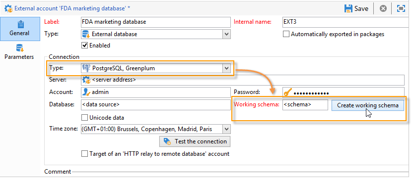

# Aan de slag met Federatieve gegevenstoegang {#about-federated-data-access}

Adobe Campaign provides the **Federated Data Access** (FDA) option in order to process information stored in one or more external databases: you can access external data without changing the structure of Adobe Campaign data.

## Vereisten {#operating-principle}

Met de optie FDA kunt u uw gegevensmodel uitbreiden in een database van derden. Het zal automatisch de structuur van de gerichte lijsten ontdekken en gegevens van de SQL bronnen gebruiken.

Voor het gebruik van deze functie worden de volgende voorwaarden vermeld:

* **Configuratie**: behalve Snowflake hebt u een **on-premise** of **hybride** hostingmodel nodig om Federated Data Access in te stellen. [Meer informatie](../../installation/using/hosting-models.md)
* **Externe databaseversie**: u hebt een externe database nodig die compatibel is met de Adobe Campaign FDA-module. De lijst met databasesystemen en compatibele versies wordt gedetailleerd beschreven in de [compatibiliteitsmatrix](../../rn/using/compatibility-matrix.md#FederatedDataAccessFDA)voor campagnes.
* **Machtigingen**: gebruikers moeten ook over de [benodigde machtigingen](../../installation/using/remote-database-access-rights.md) in Adobe Campaign en in de externe database beschikken.

## Beperkingen {#limitations}

De optie FDA is bedoeld om de gegevens in externe databases in batchmodus te manipuleren in workflows. Om prestatieproblemen te voorkomen, wordt het niet aanbevolen de FDA-module te gebruiken in het kader van eenheidsoperaties, zoals: personalisatie, interactie, real-time overseinen, enz.

Vermijd de bewerkingen die zowel de Adobe Campaign als de externe database zoveel mogelijk moeten gebruiken. Hiervoor kunt u:

* Exporteer de Adobe Campaign-database naar de externe database en voer de bewerkingen alleen uit vanuit de externe database voordat u de resultaten opnieuw importeert in Adobe Campaign.

* Verzamel de gegevens in de externe Adobe Campaign-database en voer de bewerkingen lokaal uit.

Als u personalisatie in uw leveringen wilt uitvoeren gebruikend gegevens van het externe gegevensbestand, verzamel de gegevens in een werkschema te gebruiken om het ter beschikking te stellen in een tijdelijke lijst. Dan gebruik de gegevens van de tijdelijke lijst om uw levering te personaliseren.

Voor de optie FDA gelden de beperkingen van het externe databasesysteem dat u gebruikt.

## Aanbevelingen {#recommendations}

### Tijdelijke schema&#39;s maken {#create-temporary-schemas}

U kunt meerdere toegangsbewerkingen tot de externe database van Greenplum beheren via FDA. Met een speciale optie kunt u rechtstreeks een werkschema maken wanneer u de externe account configureert.

>[!NOTE]
>
>Deze optie is alleen beschikbaar bij PostgreSQL Greenplum.

### E-mailpersonalisatie optimaliseren met externe gegevens {#optimizing-email-personalization-with-external-data}

U kunt berichtpersonalisatie vooraf verwerken in een specifieke workflow. Gebruik hiervoor de **[!UICONTROL Prepare the personalization data with a workflow]** optie die beschikbaar is op het **[!UICONTROL Analysis]** tabblad van de leveringseigenschappen.

Tijdens de leveringsanalyse, leidt deze optie automatisch tot en voert een werkschema uit dat alle gegevens met betrekking tot het doel in een tijdelijke lijst, met inbegrip van gegevens van lijsten verbonden in een extern gegevensbestand opslaat.

Met deze optie worden de prestaties aanzienlijk verbeterd wanneer de stap voor personalisatie wordt uitgevoerd.

### Use data from an external database in a workflow {#using-data-from-an-external-database-in-a-workflow}

Bij meerdere Adobe Campaign-workflowactiviteiten kunt u de gegevens gebruiken die in een externe database zijn opgeslagen.

* **Filter op externe gegevens** - Met de [query](../../workflow/using/targeting-data.md#selecting-data) -activiteit kunt u externe gegevens toevoegen en gebruiken in de gedefinieerde filterconfiguraties. Raadpleeg [deze pagina](../../workflow/using/targeting-data.md#selecting-data) voor meer informatie.

* **Subsets** maken - Met de activiteit [Splitsen](../../workflow/using/split.md) kunt u subsets maken. U kunt externe gegevens gebruiken om de filtercriteria te bepalen aan gebruik. Raadpleeg [deze pagina](../../workflow/using/split.md) voor meer informatie.

* **Externe database** laden - U kunt de externe gegevens gebruiken in de activiteit [Gegevens laden](../../workflow/using/data-loading--rdbms-.md) (RDBMS). Meer weten op [deze pagina](../../workflow/using/data-loading--rdbms-.md)?

* **Informatie en koppelingen** toevoegen - Met de [verrijkingsactiviteit](../../workflow/using/enrichment.md) kunt u aanvullende gegevens toevoegen aan de werktabel van de workflow en koppelingen naar een externe tabel. In deze context kan het gegevens uit een externe database gebruiken. Meer weten op [deze pagina](../../workflow/using/enrichment.md)?
