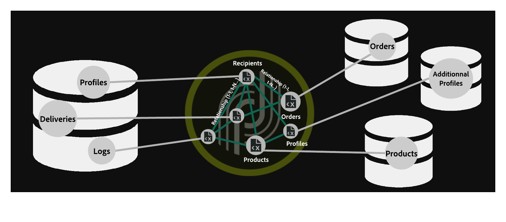

# Toegang tot Snowflake configureren {#configure-access-to-snowflake}

Gebruik de optie Campagne **Federated Data Access** (FDA) om informatie te verwerken die is opgeslagen in externe databases. Voer de onderstaande stappen uit om toegang tot te configureren [!DNL Snowflake].

1. Configureren [!DNL Snowflake] op [CentOS](#snowflake-centos), [Windows](#snowflake-windows) of [Debian](#snowflake-debian)
1. De [!DNL Snowflake] externe account [](#snowflake-external) configureren in Campagne


>[!NOTE]
>
>[!DNL Snowflake] de schakelaar is beschikbaar voor ontvangen en on-premise plaatsingen. Raadpleeg [deze pagina](../../installation/using/capability-matrix.md) voor meer informatie.



## Snowflake op CentOS {#snowflake-centos}

Volg onderstaande stappen om CentOS te configureren: [!DNL Snowflake]

1. Download de ODBC-stuurprogramma&#39;s voor [!DNL Snowflake]. [Klik hier](https://sfc-repo.snowflakecomputing.com/odbc/linux/latest/snowflake-odbc-2.20.2.x86_64.rpm) om te beginnen met downloaden.
1. Vervolgens moet u de ODBC-stuurprogramma&#39;s op CentOs installeren met de volgende opdracht:

   ```
   rpm -Uvh unixodbc
   rpm -Uvh snowflake-odbc-2.20.2.x86_64.rpm
   ```

1. Nadat u de ODBC-stuurprogramma&#39;s hebt gedownload en geïnstalleerd, moet u Campaign Classic opnieuw starten. Voer hiertoe de volgende opdracht uit:

   ```
   /etc/init.d/nlserver6 stop
   /etc/init.d/nlserver6 start
   ```

1. In Campagne, kunt u uw [!DNL Snowflake] externe rekening dan vormen. Raadpleeg [deze sectie](#snowflake-external)voor meer informatie over het configureren van uw externe account.

## Snowflake in Windows {#snowflake-windows}

1. Download het [ODBC-stuurprogramma voor Windows](https://docs.snowflake.net/manuals/user-guide/odbc-download.html). U hebt beheerdersrechten nodig om het stuurprogramma te installeren. Raadpleeg [deze pagina](https://docs.snowflake.net/manuals/user-guide/admin-user-management.html) voor meer informatie

1. Configureer het ODBC-stuurprogramma. Raadpleeg [deze pagina](https://docs.snowflake.net/manuals/user-guide/odbc-windows.html#step-2-configure-the-odbc-driver) voor meer informatie

1. In Campagne, kunt u uw [!DNL Snowflake] externe rekening dan vormen. Raadpleeg [deze sectie](#snowflake-external)voor meer informatie over het configureren van uw externe account.

## Snowflake op Debian {#snowflake-debian}

1. Download de ODBC-stuurprogramma&#39;s voor [!DNL Snowflake]. [Klik hier](https://sfc-repo.snowflakecomputing.com/odbc/linux/latest/index.html) om te downloaden.

1. Vervolgens moet u de ODBC-stuurprogramma&#39;s op Debian installeren met de volgende opdracht:

   ```
   apt-get install unixodbc
   apt-get install snowflake-odbc-x.xx.x.x86_64.deb
   ```

1. Nadat u de ODBC-stuurprogramma&#39;s hebt gedownload en geïnstalleerd, moet u Campaign Classic opnieuw starten. Voer hiertoe de volgende opdracht uit:

   ```
   systemctl stop nlserver.service
   systemctl start nlserver.service
   ```

1. In Campagne, kunt u uw [!DNL Snowflake] externe rekening dan vormen. Raadpleeg [deze sectie](#snowflake-external)voor meer informatie over het configureren van uw externe account.

## Snowflake externe rekening {#snowflake-external}

U moet een [!DNL Snowflake] externe account maken om uw Campagne-instantie te verbinden met uw [!DNL Snowflake] externe database.

1. Klik in Campagne **[!UICONTROL Explorer]** op **[!UICONTROL Administration]** &#39;>&#39; **[!UICONTROL Platform]** &#39;>&#39; **[!UICONTROL External accounts]**.

1. Klik op **[!UICONTROL New]**.

1. Selecteren **[!UICONTROL External database]** als externe account **[!UICONTROL Type]**.

1. Configureer de **[!UICONTROL Snowflake]** externe account. Geef de volgende instellingen op:

   * **[!UICONTROL Type]**: [!DNL Snowflake]

   * **[!UICONTROL Server]**: URL van de [!DNL Snowflake] server

   * **[!UICONTROL Account]**: Naam van de gebruiker

   * **[!UICONTROL Password]**: Wachtwoord gebruikersaccount

   * **[!UICONTROL Database]**: Naam van de database

   

1. Klik op het **[!UICONTROL Parameters]** tabblad en vervolgens op de **[!UICONTROL Deploy functions]** knop om functies te maken.

   

De connector ondersteunt de volgende opties:

| Option | Beschrijving |
|---|---|
| werkschema | Databaseschema dat moet worden gebruikt voor werktabellen |
| entrepot | Naam van het standaardentrepot aan gebruik. De standaardinstelling van de gebruiker wordt hierdoor genegeerd. |
| TimeZoneName | Standaard leeg, wat betekent dat de systeemtijdzone van de Campaign Classic-toepassingsserver wordt gebruikt. De optie kan worden gebruikt om de TIMEZONE-sessieparameter te forceren. <br>Raadpleeg [deze pagina](https://docs.snowflake.net/manuals/sql-reference/parameters.html#timezone) voor meer informatie. |
| WeekStart | WEEK_START, sessieparameter. Standaard ingesteld op 0. <br>Raadpleeg [deze pagina](https://docs.snowflake.com/en/sql-reference/parameters.html#week-start) voor meer informatie. |
| UseCachedResult | USE_CACHED_RESULTS sessieparameter. Standaard ingesteld op TRUE. U kunt deze optie gebruiken om resultaten in de Snowflake-cache uit te schakelen. <br>Raadpleeg [deze pagina](https://docs.snowflake.net/manuals/user-guide/querying-persisted-results.html) voor meer informatie. |
