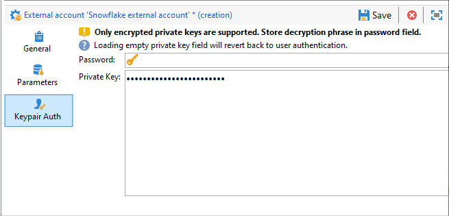

# Toegang tot Snowflake configureren {#configure-access-to-snowflake}

De optie van de Toegang van Gegevens van de Campagne van het gebruik **Federated** (FDA) om informatie te verwerken die in een extern gegevensbestand wordt opgeslagen. Voer de onderstaande stappen uit om toegang tot [!DNL Snowflake] te configureren.

1. Vorm [!DNL Snowflake] op [ Linux ](#snowflake-linux).
1. Vorm de [!DNL Snowflake] [ externe rekening ](#snowflake-external) in Campagne

>[!CAUTION]
>
>+ [!DNL Snowflake] -connector is beschikbaar voor gehoste en on-premise implementaties. Raadpleeg [deze pagina](../../installation/using/capability-matrix.md) voor meer informatie.
>
>* De minimale gesteunde versie van de [!DNL Snowflake] bestuurder ODBC is **2.24.4**.


## Snowflake op Linux {#snowflake-linux}

Voer de onderstaande stappen uit om [!DNL Snowflake] op Linux te configureren:

1. Controleer vóór de ODBC-installatie of de volgende pakketten op uw Linux-distributie zijn geïnstalleerd:

   * Voor Red Hat/CentOS:

     ```
     yum update
     yum upgrade
     yum install -y grep sed tar wget perl curl
     ```

   * Voor Debian:

     ```
     apt-get update
     apt-get upgrade
     apt-get install -y grep sed tar wget perl curl
     ```

1. Voordat u het script uitvoert, hebt u toegang tot meer informatie met de optie `--help` :

   ```
   cd /usr/local/neolane/nl6/bin/fda-setup-scripts/
   ./snowflake_odbc-setup.sh --help
   ```

1. Open de map waarin het script zich bevindt en voer het volgende script als een hoofdgebruiker uit:

   ```
   cd /usr/local/neolane/nl6/bin/fda-setup-scripts
   ./snowflake_odbc-setup.sh
   ```

1. Nadat u de ODBC-stuurprogramma&#39;s hebt geïnstalleerd, moet u het Campaign Classic opnieuw starten. Voer hiertoe de volgende opdracht uit:

   ```
   systemctl stop nlserver.service
   systemctl start nlserver.service
   ```

1. In Campagne, kunt u uw [!DNL Snowflake] externe rekening dan vormen. Voor meer op hoe te om uw externe rekening te vormen, verwijs naar [ deze sectie ](#snowflake-external).

## Externe rekening van Snowflake {#snowflake-external}

U moet een [!DNL Snowflake] externe account maken om uw Campagne-instantie te verbinden met uw [!DNL Snowflake] externe database.

1. Klik in Campagne **[!UICONTROL Explorer]** op **[!UICONTROL Administration]** &#39;>&#39; **[!UICONTROL Platform]** &#39;>&#39; **[!UICONTROL External accounts]** .

1. Klik op **[!UICONTROL New]**.

1. Selecteer **[!UICONTROL External database]** als de externe account van uw account **[!UICONTROL Type]** .

1. Selecteer onder **[!UICONTROL Configuration]** de optie [!DNL Snowflake] in de vervolgkeuzelijst **[!UICONTROL Type]** .

   

1. Voeg uw **[!UICONTROL Server]** URL en **[!UICONTROL Database]** toe.

1. Configureer de verificatie van de externe account van **[!UICONTROL Snowflake]** :

   * Voor account-/wachtwoordverificatie moet u opgeven:

      * **[!UICONTROL Account]**: Naam van de gebruiker

      * **[!UICONTROL Password]**: wachtwoord gebruikersaccount.

     

   * Voor Keypair-verificatie klikt u op het tabblad **[!UICONTROL Keypair Auth]** om uw **[!UICONTROL Private key]** te gebruiken voor het verifiëren en kopiëren van het plakken van uw **[!UICONTROL Private key]** .

     

1. Klik op de tab **[!UICONTROL Parameters]** en vervolgens op de knop **[!UICONTROL Deploy functions]** om functies te maken.

   >[!NOTE]
   >
   >Alle functies zijn alleen beschikbaar als u de Adobe Campaign SQL-functies maakt in de externe database. Voor meer informatie, verwijs naar deze [ pagina ](../../configuration/using/adding-additional-sql-functions.md).

   

1. Klik op **[!UICONTROL Save]** wanneer de configuratie is voltooid.

De connector ondersteunt de volgende opties:

| Optie | Beschrijving |
|---|---|
| werkschema | Databaseschema dat moet worden gebruikt voor werktabellen |
| entrepot | Naam van het standaardentrepot aan gebruik. De standaardinstelling van de gebruiker wordt hierdoor genegeerd. |
| TimeZoneName | Standaard leeg, wat betekent dat de systeemtijdzone van de Campaign Classic-app-server wordt gebruikt. De optie kan worden gebruikt om de TIMEZONE-sessieparameter te forceren. <br> voor meer op dit, verwijs naar [ deze pagina ](https://docs.snowflake.net/manuals/sql-reference/parameters.html#timezone). |
| WeekStart | WEEK_START, sessieparameter. Standaard ingesteld op 0. <br> voor meer op dit, verwijs naar [ deze pagina ](https://docs.snowflake.com/en/sql-reference/parameters.html#week-start). |
| UseCachedResult | USE_CACHED_RESULTS sessieparameter. Standaard ingesteld op TRUE. Deze optie kan worden gebruikt om Snowflake caching resultaten onbruikbaar te maken. <br> voor meer op dit, verwijs naar [ deze pagina ](https://docs.snowflake.net/manuals/user-guide/querying-persisted-results.html). |
| bulkThreads | Het aantal draden dat moet worden gebruikt voor bulksgewijs laden van Snowflaken, meer threads betekenen betere prestaties voor grotere bulkladingen. Standaard ingesteld op 1. Het aantal kan, afhankelijk van het aantal van de machindraad worden aangepast. |
| chunkSize | Hiermee bepaalt u de bestandsgrootte van het segment voor bulksloader. Standaard ingesteld op 128 MB. Kan worden aangepast voor een betere prestatie, wanneer gebruikt met bulkThreads. Meer tegelijkertijd actieve threads betekenen betere prestaties. <br> voor meer op dit, verwijs naar [ documentatie van de Snowflake ](https://docs.snowflake.net/manuals/sql-reference/sql/put.html). |
| StageName | Naam van het vooraf ingestelde interne werkgebied. Het wordt gebruikt in bulk lading in plaats van het creëren van een nieuwe tijdelijke fase. |
