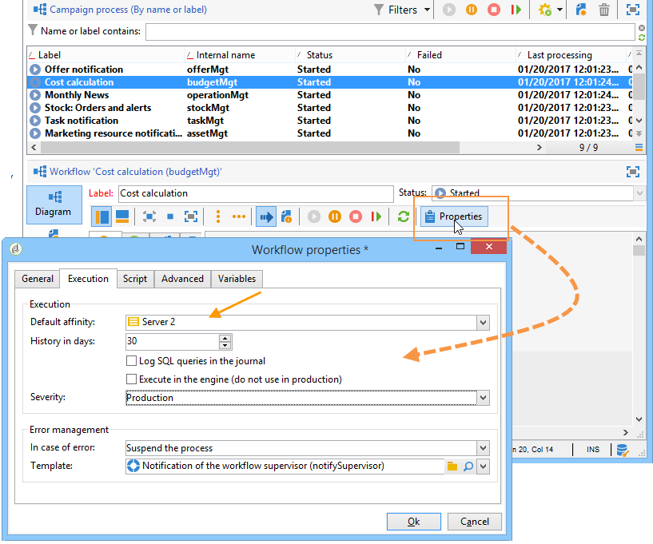

# Campagneserver configureren{#configuring-campaign-server}

In de onderstaande sectie vindt u informatie over configuraties aan de serverzijde die kunnen worden uitgevoerd om aan uw behoeften en uw specifieke omgeving te voldoen.

>[!IMPORTANT]
>
>Deze configuraties moeten alleen door beheerders worden uitgevoerd en voor **hostmodellen op locatie** .
>
>Voor **gehoste** implementaties kunnen instellingen aan de serverzijde alleen door Adobe worden geconfigureerd. Sommige instellingen kunnen echter worden ingesteld in het Configuratiescherm (bijvoorbeeld voor IP-wittekst of URL-machtigingen).

Raadpleeg de volgende secties voor meer informatie:

* [Documentatie van het regelpaneel](https://docs.adobe.com/content/help/en/control-panel/using/control-panel-home.html)
* [Hostmodellen](../../installation/using/hosting-models.md)
* [Campagne Classic On-premise &amp; Hosted Capaciteitmatrix](https://helpx.adobe.com/campaign/kb/acc-on-prem-vs-hosted.html)
* [Configuratiestappen voor hybride en gehoste modellen](https://docs.campaign.adobe.com/doc/AC/en/INS_Hybrid_and_Hosted_models_About_hybrid_and_hosted_models.html)

Campagne Classic-configuratiebestanden worden opgeslagen in de map **conf** in de installatiemap van Adobe Campagne. De configuratie wordt verspreid over twee bestanden:

* **serverConf.xml**: algemene configuratie voor alle instanties. In dit bestand worden de technische parameters van de Adobe Campaign-server gecombineerd: deze worden door alle instanties gedeeld . Hieronder wordt een beschrijving van een aantal van deze parameters gegeven. De verschillende knooppunten en parameters en vermeld in deze [sectie](../../installation/using/the-server-configuration-file.md).
* **config-`<instance>`.xml** (waarbij **instantie** de naam van de instantie is): specifieke configuratie van de instantie. Als u uw server onder verschillende exemplaren deelt, gelieve de parameters specifiek voor elk geval in hun relevant dossier in te gaan.

## Beveiligingszones definiëren {#defining-security-zones}

### Beveiligingszones {#about-security-zones}

Elke exploitant moet met een streek worden verbonden om aan een geval te login en exploitant IP moet in de adressen of adresreeksen worden omvat die in de veiligheidsstreek worden bepaald. De configuratie van de beveiligingszone wordt uitgevoerd in het configuratiebestand van de Adobe Campaign-server.

De exploitanten zijn verbonden met een veiligheidsstreek van zijn profiel in de console ( **[!UICONTROL Administration > Access management > Operators]** knoop). Leer hoe u zones kunt koppelen aan Campagneontwikkelaars in [deze sectie](#linking-a-security-zone-to-an-operator).

### Beveiligingszones maken {#creating-security-zones}

Een zone wordt gedefinieerd door:

* één of meerdere waaiers van IP adressen (IPv4 en IPv6)
* een technische naam verbonden aan elke waaier van IP adressen

Beveiligingszones zijn onderling vergrendeld, wat betekent dat het definiëren van een nieuwe zone binnen een andere zone het aantal operatoren verlaagt dat zich daarop kan aanmelden, terwijl de rechten die aan elke operator zijn toegewezen, worden vergroot.

De zones moeten tijdens serverconfiguratie, in het **serverConf.xml** - dossier worden bepaald. Alle parameters beschikbaar in **serverConf.xml** zijn vermeld in deze [sectie](../../installation/using/the-server-configuration-file.md).

Elke zone definieert rechten, zoals:

* HTTP-verbinding in plaats van HTTPS
* Foutweergave (Java-fouten, JavaScript, C++, enz.)
* Voorvertoning van rapport en webApp
* Verificatie via aanmelding/wachtwoord
* Niet-beveiligde verbindingsmodus

>[!NOTE]
>
>**Elke exploitant moet met een zone** worden verbonden. Als het IP adres van de exploitant tot de waaier behoort die door de streek wordt bepaald, kan de exploitant aan de instantie het programma openen.\
>Het IP van de exploitant adres kan in verscheidene streken worden bepaald. In dit geval ontvangt de exploitant de **reeks** beschikbare rechten voor elke zone.

Het uit-van-de-doos **serverConf.xml** - dossier omvat drie streken: **public, VPN en LAN**.

>[!NOTE]
>
>**De uit-van-de-doos configuratie is veilig**. Voordat u echter migreert van een eerdere versie van Adobe Campaign, kan het nodig zijn de beveiliging tijdelijk te verlagen om de nieuwe regels te migreren en goed te keuren.

Voorbeeld van het definiëren van een zone in het bestand **serverConf.xml** :

```
<securityZone allowDebug="false" allowHTTP="false" label="Public Network" name="public">
<subNetwork label="All addresses" mask="*" name="all"/>

<securityZone allowDebug="true" allowHTTP="false" label="Private Network (VPN)"
              name="vpn" showErrors="true">

  <securityZone allowDebug="true" allowEmptyPassword="true" allowHTTP="true"
                allowUserPassword="false" label="Private Network (LAN)" name="lan"
                sessionTokenOnly="true" showErrors="true">
    <subNetwork label="Lan 1" mask="192.168.0.0/16" name="lan1"/>
    <subNetwork label="Lan 2" mask="172.16.0.0/12" name="lan2"/>
    <subNetwork label="Lan 3" mask="10.0.0.0/8" name="lan3"/>
    <subNetwork label="Localhost" mask="127.0.0.1/16" name="locahost"/>
    <subNetwork label="Lan (IPv6)" mask="fc00::/7" name="lan6"/>
    <subNetwork label="Localhost (IPv6)" mask="::1/128" name="localhost6"/>
  </securityZone>

</securityZone>
</securityZone>
```

Alle rechten die een zone definiëren, zijn als volgt:

* **allowDebug**: schakelt een webApp in om te worden uitgevoerd in de modus &quot;foutopsporing&quot;
* **allowEmptyPassword**: Hiermee wordt een verbinding met een instantie zonder wachtwoord toegestaan
* **allowHTTP**: een sessie kan worden gemaakt zonder het HTTPS-protocol te gebruiken
* **allowUserPassword**: het zittingsteken kan de volgende vorm &quot;`<login>/<password>`&quot;hebben
* **sessionTokenOnly**: het beveiligingstoken is niet vereist in de verbindings-URL
* **showErrors**: fouten aan de serverzijde worden doorgestuurd en weergegeven

>[!IMPORTANT]
>
>In een zonedefinitie, vermindert elk attribuut met de **ware** waarde veiligheid.

Wanneer het gebruiken van het Centrum van het Bericht, als er verscheidene uitvoeringsinstanties zijn, moet u een extra veiligheidsstreek met de **sessionTokenOnly** attributen tot stand brengen die als **waar** worden bepaald, waar slechts de noodzakelijke IP adressen moeten worden toegevoegd. Raadpleeg [dit document](../../message-center/using/creating-a-shared-connection.md)voor meer informatie over het configureren van instanties.

### Aanbevolen procedures voor beveiligingszones {#best-practices-for-security-zones}

In de definitie van de **LAN** veiligheidsstreek, is het mogelijk om een IP adresmasker toe te voegen dat technische toegang bepaalt. Hierdoor wordt toegang mogelijk tot alle instanties die op de server worden gehost.

```
<securityZone allowDebug="true" allowEmptyPassword="false" allowHTTP="true"
                    allowUserPassword="false" label="Private Network (LAN)" name="lan"
                    sessionTokenOnly="true" showErrors="true">
        <subNetwork label="Lan 1" mask="192.168.0.0/16" name="lan1"/>
        <subNetwork label="Lan 2" mask="172.16.0.0/12" name="lan2"/>
        <subNetwork label="Lan 3" mask="10.0.0.0/8" name="lan3"/>
        <subNetwork label="Localhost" mask="127.0.0.1/16" name="locahost"/>
        <subNetwork label="Lan (IPv6)" mask="fc00::/7" name="lan6"/>
        <subNetwork label="Localhost (IPv6)" mask="::1/128" name="localhost6"/>
  
        <!-- Customer internal IPs -->
        <subNetwork id="internalNetwork" mask="a.b.c.d/xx"/>

      </securityZone>
```

Wij adviseren direct bepalend IP adreswaaiers in het configuratiedossier dat aan de instantie voor exploitanten wordt gewijd die tot slechts een specifieke instantie toegang hebben.

In het **`config-<instance>.xml`** bestand:

```
  <securityZone name="public">
   ...
    <securityZone name="vpn">
      <subNetwork id="cus1" mask="a.b.c.d/xx"/>
```

### Subnetwerken en proxy&#39;s in een beveiligingszone {#sub-networks-and-proxies-in-a-security-zone}

De **volmachtsparameter** kan in een **subNetwork** element worden gebruikt om volmachtsgebruik in een veiligheidsstreek te specificeren.

Wanneer naar een proxy wordt verwezen en een verbinding via deze proxy wordt ingeschakeld (zichtbaar via de HTTP X-Forwarded-For-header), is de geverifieerde zone die van de clients van de proxy en niet die van de proxy.

>[!IMPORTANT]
>
>Als een volmacht wordt gevormd en het mogelijk is om het (of het als niet bestaat) met voeten te treden, zal het IP adres dat zal worden getest kunnen worden vervalst.
>
>Bovendien worden nu relais gegenereerd als proxy&#39;s. U kunt daarom het IP adres 127.0.0.1 aan de lijst van volmachten in uw configuratie van de veiligheidszone toevoegen.
>
>Bijvoorbeeld: &quot; `<subnetwork label="Lan 1" mask="192.168.0.0/16" name="lan1" proxy="127.0.0.1,10.100.2.135" />`&quot;.

Er kunnen verschillende gevallen optreden:

* Een subnetwerk wordt direct van verwijzingen voorzien in de veiligheidsstreek en geen volmacht wordt gevormd: gebruikers van het subnetwerk kunnen rechtstreeks verbinding maken met de Adobe Campagneserver.

   

* Een volmacht wordt gespecificeerd voor een subnetwerk in de veiligheidsstreek: gebruikers van dit subnetwerk hebben via deze proxy toegang tot de Adobe Campagneserver.

   

* Een volmacht is inbegrepen in een subnetwerk van de veiligheidszone: gebruikers die via deze proxy toegang hebben, ongeacht de oorsprong, hebben toegang tot de Adobe Campagneserver.

   

De IP adressen van volmachten die waarschijnlijk tot de server van de Campagne van Adobe zullen toegang hebben moeten in zowel **`<subnetwork>`** betrokken als eerste niveau subnetwork **`<subnetwork name="all"/>`**. zijn ingegaan. Bijvoorbeeld, hier voor een volmacht de waarvan IP adres 10.131.146.102 is:

```
<securityZone allowDebug="false" allowHTTP="false" label="Public Network" 
                      name="public">
    <subNetwork label="All addresses" mask="*" name="all"
                      proxy="10.131.146.102,127.0.0.1, ::1"/>

    <securityZone allowDebug="true" allowHTTP="false" label="Private Network (VPN)" 
                      name="vpn" showErrors="true">
        <securityZone allowDebug="true" allowEmptyPassword="false" allowHTTP="true" 
                      allowUserPassword="false" label="Private Network (LAN)" 
                      name="lan" sessionTokenOnly="true" showErrors="true">
            <subNetwork label="Lan proxy" mask="10.131.193.182" name="lan3" 
                      proxy="10.131.146.102,127.0.0.1, ::1"/>
            <subNetwork label="Lan 1" mask="192.168.0.0/16" name="lan1" 
                      proxy="127.0.0.1, ::1"/>

        </securityZone>
    </securityZone>
</securityZone>
```

### Een beveiligingszone koppelen aan een operator {#linking-a-security-zone-to-an-operator}

Zodra de streken worden bepaald, moet elke exploitant met één van hen worden verbonden om aan een instantie te kunnen het programma openen en het IP adres van de exploitant moet in de adressen of de waaier van adressen inbegrepen zijn die in de streek van verwijzingen worden voorzien.

De technische configuratie van de zones wordt uitgevoerd in het configuratiebestand van de Campagneserver: **serverConf.xml**.

Voorafgaand aan dit, moet u beginnen door de uit-van-de-doos **[!UICONTROL Security zone]** opsomming te vormen om een etiket met de interne naam van de streek te verbinden die in het **serverConf.xml** - dossier wordt bepaald.

Deze configuratie wordt gedaan in de ontdekkingsreiziger van de Campagne:

1. Klik op het **[!UICONTROL Administration > Platform > Enumerations]** knooppunt.
1. Selecteer de **[!UICONTROL Security zone (securityZone)]** systeemopsomming.

   

1. Voor elke veiligheidsstreek die in het configuratiedossier van de server wordt bepaald, klik de **[!UICONTROL Add]** knoop.
1. Voer in het **[!UICONTROL Internal name]** veld de naam in van de zone die is gedefinieerd in het bestand **serverConf.xml** . Het komt overeen met het kenmerk **@name** van het `<securityzone>` element. Voer in het **** veld Labelveld het label in dat is gekoppeld aan de interne naam.

   

1. Klik op OK en sla de wijzigingen op.

Zodra de streken worden bepaald en de **[!UICONTROL Security zone]** opsomming wordt gevormd, moet u elke exploitant aan een veiligheidsstreek verbinden:

1. Klik op het **[!UICONTROL Administration > Access management > Operators]** knooppunt.
1. Selecteer de operator waaraan u een beveiligingszone wilt koppelen en klik op het **[!UICONTROL Edit]** tabblad.
1. Ga naar het **[!UICONTROL Access rights]** tabblad en klik op de **[!UICONTROL Edit access parameters...]** koppeling.

   

1. Een zone selecteren in de **[!UICONTROL Authorized connection zone]** vervolgkeuzelijst

   

1. Klik op de wijzigingen **[!UICONTROL OK]** en sla deze op.

## Tomcat configureren {#configuring-tomcat}

### Standaardpoort voor Tomcat {#default-port-for-tomcat}

Wanneer de 8080 luisterpoort van de Tomcat-server al bezig is met een andere toepassing die vereist is voor uw configuratie, moet u de 8080-poort vervangen door een gratis poort (bijvoorbeeld 8090). Als u dit wilt wijzigen, bewerkt u het bestand **server.xml** dat is opgeslagen in de map **/tomcat-7/conf** van de installatiemap van Adobe Campagne.

Pas dan de haven van de JSP relaispagina&#39;s aan. Hiervoor wijzigt u het bestand **serverConf.xml** dat is opgeslagen in de map **/conf** van de installatiemap van Adobe Campagne. Alle parameters beschikbaar in **serverConf.xml** zijn vermeld in deze [sectie](../../installation/using/the-server-configuration-file.md).

```
<serverConf>
   ...
   <web controlPort="8005" httpPort="8090"...
   <url ... targetUrl="http://localhost:8090"...
```

### Een map toewijzen in Tomcat {#mapping-a-folder-in-tomcat}

Als u klantspecifieke instellingen wilt definiëren, kunt u een bestand **user_context.xml** maken in de map **/tomcat-7/conf** , dat ook het bestand **context.xml** bevat.

Dit bestand bevat het volgende type informatie:

```
 <Context path='/foo' docBase='../customers/foo'   crossContext='true' debug='0' reloadable='true' trusted='false'/>
```

Deze bewerking kan zo nodig op de server worden gereproduceerd.

## Leveringsparameters aanpassen {#personalizing-delivery-parameters}

De leveringsparameters worden gedefinieerd in het configuratiebestand **serverConf.xml** . Alle parameters beschikbaar in **serverConf.xml** zijn vermeld in deze [sectie](../../installation/using/the-server-configuration-file.md).

De algemene serverconfiguratie en de bevelen zijn gedetailleerd in de [serverconfiguratie](../../installation/using/campaign-server-configuration.md)van de Campagne.

Afhankelijk van uw behoeften en instellingen kunt u ook de volgende configuraties uitvoeren.

### SMTP-relais {#smtp-relay}

De module MTA doet dienst als inheemse agent van de postoverdracht voor uitzending SMTP (haven 25).

Het is echter mogelijk deze te vervangen door een relaisserver als dit voor uw beveiligingsbeleid is vereist. In dat geval is de wereldwijde doorvoer het relais één (op voorwaarde dat de doorvoer van de relaisserver lager is dan die van de Adobe-campagne).

In dit geval, worden deze parameters geplaatst door de server SMTP in de **`<relay>`** sectie te vormen. U moet het IP adres (of de gastheer) van de server specificeren SMTP die wordt gebruikt om post en zijn bijbehorende haven (25 door gebrek) over te brengen.

```
<relay address="192.0.0.3" port="25"/>
```

>[!IMPORTANT]
>
>Deze werkende wijze impliceert ernstige beperkingen op leveringen, aangezien het de productie wegens de intrinsieke prestaties van de relaisserver (latentie, bandbreedte...) kan zeer verminderen. Bovendien zal de capaciteit om synchrone leveringsfouten (die door het analyseren van verkeer SMTP worden ontdekt) te kwalificeren beperkt zijn, en het verzenden zal niet mogelijk zijn als de relaisserver niet beschikbaar is.

### MTA onderliggende processen {#mta-child-processes}

Het is mogelijk om de populatie van kindprocessen (maxSpareServers door gebrek 2) te controleren om uitzendingsprestaties volgens de macht van cpu van de servers en de beschikbare netwerkmiddelen te optimaliseren. Deze configuratie moet in de **`<master>`** sectie van configuratie MTA op elke individuele computer worden gemaakt.

```
<master dataBasePoolPeriodSec="30" dataBaseRetryDelaySec="60" maxSpareServers="2" minSpareServers="0" startSpareServers="0">
```

Raadpleeg ook optimalisatie voor verzending [via e-mail](../../installation/using/email-deliverability.md#email-sending-optimization).

### Het leiden van uitgaand verkeer SMTP met affiniteiten {#managing-outbound-smtp-traffic-with-affinities}

>[!IMPORTANT]
>
>De affiniteitsconfiguratie moet van de ene server op de andere coherent zijn. We raden u aan contact op te nemen met Adobe voor de configuratie van affiniteit, aangezien configuratiewijzigingen moeten worden gerepliceerd op alle toepassingsservers waarop de MTA wordt uitgevoerd.

U kunt uitgaand verkeer SMTP door affiniteiten met IP adressen verbeteren.

Hiervoor voert u de volgende stappen uit:

1. Voer de affiniteiten in de **`<ipaffinity>`** sectie van het bestand **serverConf.xml** in.

   Een affiniteit kan verschillende namen hebben: om ze te scheiden, gebruik de **;** teken.

   Voorbeeld:

   ```
    IPAffinity name="mid.Server;WWserver;local.Server">
             <IP address="XX.XXX.XX.XX" heloHost="myserver.us.campaign.net" publicId="123" excludeDomains="neo.*" weight="5"/
   ```

   Raadpleeg het bestand **serverConf.xml** om de relevante parameters weer te geven.

1. Als u affiniteitselectie wilt inschakelen in de vervolgkeuzelijsten, moet u de affiniteitsnaam of -namen toevoegen aan de **IPAffinity** -opsomming.

   

   >[!NOTE]
   >
   >Opsommingen worden in [dit document](../../platform/using/managing-enumerations.md)beschreven.

   Vervolgens kunt u de affiniteit selecteren die u wilt gebruiken, zoals hieronder voor typologieën wordt getoond:

   

   >[!NOTE]
   >
   >U kunt ook naar de configuratie [van de](../../installation/using/email-deliverability.md#delivery-server-configuration)leveringsserver verwijzen.

## URL-machtigingen {#url-permissions}

De standaardlijst met URL&#39;s die door JavaScript-codes kunnen worden aangeroepen (workflows, enz.) door uw Classic-instanties van de Campagne is beperkt. Dit zijn URL&#39;s waarmee uw instanties correct kunnen werken.

Instanties mogen standaard geen verbinding maken met externe URL&#39;s. Het is echter mogelijk om sommige externe URL&#39;s toe te voegen aan de lijst met geoorloofde URL&#39;s, zodat uw instantie hiermee verbinding kan maken. Hierdoor kunt u uw Campagne-instanties verbinden met externe systemen, zoals bijvoorbeeld SFTP-servers of websites, om de overdracht van bestanden en/of gegevens mogelijk te maken.

Wanneer een URL is toegevoegd, wordt hiernaar verwezen in het configuratiebestand van de instantie (serverConf.xml).

De manier waarop u URL-machtigingen kunt beheren, is afhankelijk van uw hostingmodel:

* **Hybride** of **op locatie**: Voeg de toe te staan URLs in het **serverConf.xml- dossier** toe. Gedetailleerde informatie is beschikbaar in de onderstaande sectie.
* **Gehost**: Voeg de URL&#39;s toe die u via het **Configuratiescherm** wilt toestaan. Raadpleeg de [desbetreffende documentatie](https://docs.adobe.com/content/help/en/control-panel/using/instances-settings/url-permissions.html)voor meer informatie.

Met **Hybride** en **Op-gebouw** het ontvangen modellen, moet de beheerder een nieuwe **urlPermission** in het **serverConf.xml** - dossier van verwijzingen voorzien. Alle parameters beschikbaar in **serverConf.xml** zijn vermeld in deze [sectie](../../installation/using/the-server-configuration-file.md).

Er zijn drie modi voor verbindingsbeveiliging:

* **Blokkeren**: alle URL&#39;s die niet bij de whitelist horen, worden geblokkeerd, met een foutbericht. Dit is de standaardwijze na een postupgrade.
* **Toestemming**: alle URL&#39;s die niet bij de whitelist horen, zijn toegestaan.
* **Waarschuwing**: alle niet-witte URL&#39;s zijn toegestaan, maar de JS-interpreter geeft een waarschuwing weer, zodat de beheerder deze kan verzamelen. In deze modus worden JST-310027-waarschuwingsberichten toegevoegd.

```
<urlPermission action="warn" debugTrace="true">
  <url dnsSuffix="abc.company1.com" urlRegEx=".*" />
  <url dnsSuffix="def.partnerA_company1.com" urlRegEx=".*" />
  <url dnsSuffix="xyz.partnerB_company1.com" urlRegEx=".*" />
</urlPermission>
```

>[!IMPORTANT]
>
>Standaard gebruikt de client van nieuwe klanten de **blokkeermodus**. Als ze een nieuwe URL moeten toestaan, moeten ze contact opnemen met hun beheerder om de URL te whitelist.
>
>Bestaande klanten die uit een migratie komen, kunnen de **waarschuwingsmodus** een tijdje gebruiken. Ondertussen moeten zij het uitgaande verkeer analyseren alvorens URLs toe te laten. Zodra de lijst met geoorloofde URL&#39;s is gedefinieerd, moeten ze contact opnemen met de beheerder om de URL&#39;s te whiteliseren en de **blokkeermodus** te activeren.

## Dynamische paginabeveiliging en -bedekkingen {#dynamic-page-security-and-relays}

Door gebrek, zijn alle dynamische pagina&#39;s automatisch verwant met de **lokale** server van Tomcat van de machine de waarvan module van het Web is begonnen. Deze configuratie is ingegaan in de **`<url>`** sectie van de configuratie van het vraagrelais voor het **ServerConf.xml** - dossier. Alle parameters beschikbaar in **serverConf.xml** zijn vermeld in deze [sectie](../../installation/using/the-server-configuration-file.md).

Om uitvoering van de dynamische pagina op een **verre** server terug te geven; als de module Web niet op de computer wordt geactiveerd. Om dit te doen, moet u **localhost** met de naam van de verre computer voor JSP en JSSP, de toepassingen van het Web, rapporten en koorden vervangen.

Raadpleeg het configuratiebestand **serverConf.xml** voor meer informatie over de verschillende beschikbare parameters.

Voor JSP-pagina&#39;s is de standaardconfiguratie:

```
<url relayHost="true" relayPath="true" targetUrl="http://localhost:8080" urlPath="*.jsp"/>
```

Adobe Campaign gebruikt de volgende JSP-pagina&#39;s:

* /nl/jsp/**soaprouter.jsp**: client console- en webserviceverbindingen (SOAP API&#39;s),
* /nl/jsp/**m.jsp**: spiegelpagina&#39;s,
* /nl/jsp/**opening van een sessie.jsp**: Web-based toegang tot rapporten en tot plaatsing van de cliëntconsole,
* /nl/jsp/**s.jsp** : Het gebruik van virale marketing (sponsoring en sociale netwerken).

De JSSPs die voor het Mobiele Kanaal van de App wordt gebruikt zijn als volgt:

* nms/mobile/1/registerIOS.jssp
* nms/mobile/1/registerAndroid.jssp

**Voorbeeld:**

Het is mogelijk om clientmachineverbindingen van buitenaf te verhinderen. Om dit te doen, eenvoudig de uitvoering van **soaprouter.jsp** beperken en slechts de uitvoering van spiegel pagina&#39;s, virale verbindingen, Webvormen en openbare middelen toestaan.

De parameters zijn als volgt:

```
<url IPMask="<IP_addresses>" deny=""     hostMask="" relayHost="true"  relayPath="true"  targetUrl="http://localhost:8080" timeout="" urlPath="*.jsp"/>
<url IPMask="<IP_addresses>" deny=""     hostMask="" relayHost="true"  relayPath="true"  targetUrl="http://localhost:8080" timeout="" urlPath="*.jssp"/> 
<url IPMask=""               deny=""     hostMask="" relayHost="true" relayPath="true" targetUrl="http://localhost:8080" timeout="" urlPath="m.jsp"/>
<url IPMask=""               deny=""     hostMask="" relayHost="true" relayPath="true" targetUrl="http://localhost:8080" timeout="" urlPath="s.jsp"/>
<url IPMask=""               deny=""     hostMask="" relayHost="true" relayPath="true" targetUrl="http://localhost:8080" timeout="" urlPath="webForm.jsp"/>
<url IPMask=""               deny=""     hostMask="" relayHost="true"  relayPath="true"  targetUrl="http://localhost:8080" timeout="" urlPath="/webApp/pub*"/>
<url IPMask=""               deny=""     hostMask="" relayHost="true"  relayPath="true"  targetUrl="http://localhost:8080" timeout="" urlPath="/jssp/pub*"/>
<url IPMask=""               deny=""     hostMask="" relayHost="true"  relayPath="true"  targetUrl="http://localhost:8080" timeout="" urlPath="/strings/pub*"/>
<url IPMask=""               deny=""     hostMask="" relayHost="true"  relayPath="true"  targetUrl="http://localhost:8080" timeout="" urlPath="/interaction/pub*"/>
<url IPMask=""               deny="true" hostMask="" relayHost="false" relayPath="false" targetUrl="http://localhost:8080" timeout="" urlPath="*.jsp"/>
<url IPMask=""               deny="true" hostMask="" relayHost="false" relayPath="false" targetUrl="http://localhost:8080" timeout="" urlPath="*.jssp"/>
```

In dit voorbeeld valt de **`<IP_addresses>`** waarde samen met de lijst met IP-adressen (gescheiden door komma&#39;s) die zijn geautoriseerd om de relaismodule voor dit masker te gebruiken.

>[!NOTE]
>
>De waarden zullen worden aangepast volgens uw configuratie en uw netwerkbeperkingen, vooral als specifieke configuraties voor uw installatie zijn ontwikkeld.

## Toegestane externe opdrachten beperken {#restricting-authorized-external-commands}

>[!NOTE]
>
>De volgende configuratie wordt slechts vereist voor op-gebouw installaties.

Vanuit build 8780 kunnen technische beheerders de lijst met geoorloofde externe opdrachten beperken die in Adobe Campagne kunnen worden gebruikt.

Hiervoor moet u een tekstbestand maken met de lijst met opdrachten die u niet wilt gebruiken, bijvoorbeeld:

```
ln
dd
openssl
curl
wget
python
python3
perl
ruby
sh
```

>[!IMPORTANT]
>
>Deze lijst is niet limitatief.

In het **exec** knooppunt van het serverconfiguratiebestand moet u verwijzen naar het eerder gemaakte bestand in het kenmerk **blacklistFile** .

**Alleen** voor Linux: in het dossier van de serverconfiguratie, adviseren wij dat u een gebruiker specificeert die aan het uitvoeren van externe bevelen wordt gewijd om uw veiligheidsconfiguratie te verbeteren. Deze gebruiker wordt geplaatst in de **exec** knoop van het configuratiedossier. Alle parameters beschikbaar in **serverConf.xml** zijn vermeld in deze [sectie](../../installation/using/the-server-configuration-file.md).

>[!NOTE]
>
>Als er geen gebruiker is opgegeven, worden alle opdrachten uitgevoerd in de gebruikerscontext van de Adobe Campagne-instantie. De gebruiker moet anders zijn dan de gebruiker die de Campagne van Adobe in werking stelt.

Bijvoorbeeld:

```
<serverConf>
 <exec user="theUnixUser" blacklistFile="/pathtothefile/blacklist"/>
</serverConf>
```

Deze gebruiker moet worden toegevoegd aan de vervolgkeuzelijst van de Adobe Campagneoperator &#39;neolane&#39;.

>[!IMPORTANT]
>
>Gebruik geen aangepast sudo. Er moet een standaardsudo op het systeem worden geïnstalleerd.

## HTTP-headers beheren {#managing-http-headers}

Standaard worden niet alle HTTP-headers weergegeven. U kunt specifieke kopballen in de antwoorden toevoegen die door relais worden verzonden. Dit doet u als volgt:

1. Ga naar het bestand **serverConf.xml** . Alle parameters beschikbaar in **serverConf.xml** zijn vermeld in deze [sectie](../../installation/using/the-server-configuration-file.md).
1. Ga in het **`<relay>`** knooppunt naar de lijst met afgeloste HTTP-headers.
1. Voeg een **`<responseheader>`** element toe met de volgende kenmerken:

   * **naam**: koptekstnaam
   * **waarde**: naam van waarde.
   Bijvoorbeeld:

   ```
   <responseHeader name="Strict-Transport-Security" value="max-age=16070400; includeSubDomains"/>
   ```

## Overbodige tekstspatiëring {#redundant-tracking}

Wanneer de veelvoudige servers voor redirection worden gebruikt, moeten zij met elkaar via de vraag van de ZEEP kunnen communiceren om informatie van URLs te delen om worden omgeleid. Op het moment dat de levering wordt gestart, is het mogelijk dat niet alle omleidingsservers beschikbaar zijn; zij zouden derhalve niet dezelfde mate van informatie kunnen hebben .

>[!NOTE]
>
>Wanneer u de standaard- of bedrijfsarchitectuur gebruikt, moet de hoofdtoepassingsserver zijn geautoriseerd om trackinggegevens te uploaden naar elke computer.

De URL&#39;s van de redundante servers moeten worden opgegeven in de omleidingsconfiguratie via het bestand **serverConf.xml** . Alle parameters beschikbaar in **serverConf.xml** zijn vermeld in deze [sectie](../../installation/using/the-server-configuration-file.md).

**Voorbeeld:**

```
<spareserver enabledIf="$(hostname)!='front_srv1'" id="1" url="http://front_srv1:8080" />
<spareserver enabledIf="$(hostname)!='front_srv2'" id="2" url="http://front_srv2:8080" />
```

De eigenschap **enableIf** is optioneel (standaard leeg) en stelt u in staat de verbinding alleen in te schakelen als het resultaat waar is. Dit laat u een identieke configuratie op alle omleidingsservers verkrijgen.

Voer de volgende opdracht uit om de hostnaam van de computer op te halen: hostnaam - **s**.

## Openbare middelen beheren {#managing-public-resources}

Overheidsmiddelen worden gepresenteerd in het [beheer van openbare middelen](../../installation/using/deploying-an-instance.md#managing-public-resources).

Ze worden opgeslagen in de map **/var/res/instance** in de installatiemap van Adobe Campagne.

De overeenkomende URL is: **http://server/res/instance** , waarbij de **instantie** de naam van de instantie tracking is.

U kunt een andere map opgeven door een knooppunt toe te voegen aan het bestand **conf-`<instance>`.xml** om de opslag op de server te configureren. Dit betekent dat de volgende regels moeten worden toegevoegd:

```
<serverconf>
  <shared>
    <dataStore hosts="media*" lang="fra">
      <virtualDir name="images" path="/var/www/images"/>
     <virtualDir name="publicFileRes" path="$(XTK_INSTALL_DIR)/var/res/$(INSTANCE_NAME)/"/>
    </dataStore>
  </shared>
</serverconf>
```

In dit geval, zou nieuwe URL voor de openbare middelen die in het hogere gedeelte van het venster van de plaatsingstovenaar worden gegeven aan deze omslag moeten richten.

## Workflows en affiniteiten met hoge beschikbaarheid {#high-availability-workflows-and-affinities}

U kunt verschillende workflowservers (wfserver) configureren en deze op twee of meer computers distribueren. Als u dit type architectuur kiest, configureert u de verbindingsmodus van de taakverdelingsmechanisme op basis van de toegang tot de Adobe-campagne.

Voor toegang van het Web, selecteer de wijze van het **ladingsverdelingsmechanisme** om verbindingstijden te beperken.

Als u deze functie opent via de Adobe Campaign-console, kiest u de **hash** - of **sticky ip** -modus. Zo kunt u de verbinding tussen de rijke client en de server onderhouden en voorkomen dat een gebruikerssessie wordt onderbroken tijdens bijvoorbeeld het importeren of exporteren.

U kunt ervoor kiezen de uitvoering van een workflow of een workflowactiviteit op een bepaalde computer af te dwingen. Hiervoor moet u een of meer affiniteiten definiëren voor de betreffende workflow of activiteit.

1. Maak de affiniteiten van de workflow of activiteit door deze in het **[!UICONTROL Affinity]** veld in te voeren.

   U kunt de affiniteitsnamen vrij kiezen. Zorg er echter voor dat u geen spaties of leestekens gebruikt. Geef verschillende namen op als u verschillende servers gebruikt.

   

   

   De vervolgkeuzelijst bevat eerder gebruikte affiniteiten. Het wordt voltooid in tijd met de verschillende ingegaan waarden.

1. Open het bestand **nl6/conf/config-`<instance>.xml`**.
1. Wijzig de lijn die met de **[!UICONTROL wfserver]** module overeenkomt als volgt:

   ```
   <wfserver autoStart="true" affinity="XXX,"/>
   ```

   Als u meerdere affiniteiten definieert, moeten deze worden gescheiden door komma&#39;s zonder spaties:

   ```
   <wfserver autoStart="true" affinity="XXX,YYY,"/>
   ```

   De komma achter de naam van de affiniteit is nodig voor het uitvoeren van workflows waarvoor geen affiniteit is gedefinieerd.

   Als u alleen werkstromen wilt uitvoeren waarvoor een affiniteit is gedefinieerd, voegt u geen komma toe aan het einde van de lijst met affiniteiten. Wijzig bijvoorbeeld de regel als volgt:

   ```
   <wfserver autoStart="true" affinity="XXX"/>
   ```

## Automatisch proces opnieuw opstarten {#automatic-process-restart}

Standaard worden de verschillende Adobe Campagne-processen elke dag om zes uur (servertijd) automatisch opnieuw gestart.

U kunt deze configuratie echter wijzigen.

Hiervoor gaat u naar het bestand **serverConf.xml** in de **conf** -opslagruimte van uw installatie. Alle parameters beschikbaar in **serverConf.xml** zijn vermeld in deze [sectie](../../installation/using/the-server-configuration-file.md).

Elk in dit bestand geconfigureerd proces heeft een **processRestartTime** -kenmerk. U kunt de waarde van dit kenmerk wijzigen om de opstarttijd van elk proces aan te passen aan uw wensen.

>[!IMPORTANT]
>
>Verwijder dit kenmerk niet. Elke dag moeten alle processen opnieuw worden opgestart.

## Uploadbare bestanden beperken {#limiting-uploadable-files}

Met een nieuw kenmerk **uploadWhiteList** kunt u de bestandstypen beperken die beschikbaar zijn voor uploaden naar de Adobe Campagneserver.

Dit kenmerk is beschikbaar in het element **dataStore** van het bestand **serverConf.xml** . Alle parameters beschikbaar in **serverConf.xml** zijn vermeld in deze [sectie](../../installation/using/the-server-configuration-file.md).

De standaardwaarde van dit kenmerk is **.+** en u kunt elk bestandstype uploaden.

Als u de mogelijke indelingen wilt beperken, moet u de kenmerkwaarde vervangen door een geldige reguliere Java-expressie. U kunt verschillende waarden invoeren door deze met een komma te scheiden.

Bijvoorbeeld: **uploadWhiteList=&quot;.*.png,.Met *.jpg&quot;** kunt u PNG- en JPG-indelingen uploaden naar de server. Er worden geen andere indelingen geaccepteerd.

>[!IMPORTANT]
>
>In Internet Explorer moet het volledige bestandspad worden gecontroleerd door de reguliere expressie.

## Configuratie proxyverbinding {#proxy-connection-configuration}

Als u de server van de Campagne met de buitenkant door een volmacht (gebruikend een activiteit van het dossieroverdrachtwerkschema bijvoorbeeld) moet verbinden, moet u de volmachtConfig sectie van serverConf via een bevel vormen. De volgende proxyverbindingen zijn mogelijk: HTTP, HTTPS, FTP, SFTP. Alle parameters beschikbaar in **serverConf.xml** zijn vermeld in deze [sectie](../../installation/using/the-server-configuration-file.md).

>[!NOTE]
>
>SOCKS-proxy&#39;s worden niet ondersteund.

Gebruik de volgende opdracht:

```
nlserver config -setproxy:[protocol]/[serverIP]:[port]/[login][:‘https’|'http’]
```

protocolparameters zijn &quot;http&quot;, &quot;https&quot; of &quot;ftp&quot;.

Als u FTP instelt op dezelfde poort als HTTP/HTTPS-verkeer, kunt u het volgende gebruiken:

```
nlserver config -setproxy:http/198.51.100.0:8080/user
```

De opties &quot;http&quot; en &quot;https&quot; worden alleen gebruikt wanneer de protocolparameter &quot;ftp&quot; is en geven aan of de tunnelmethode op de opgegeven poort via HTTPS of via HTTP wordt uitgevoerd.

Als u verschillende poorten gebruikt voor FTP/SFTP- en HTTP/HTTPS-verkeer via proxyserver, moet u de parameter &#39;ftp&#39;-protocol instellen.


Bijvoorbeeld:

```
nlserver config -setproxy:ftp/198.51.100.0:8080/user:’http’
```

Voer vervolgens het wachtwoord in.

HTTP-verbindingen worden gedefinieerd in de parameter proxyHTTP:

```
<proxyConfig enabled=“1” override=“localhost*” useSingleProxy=“0”>
<proxyHTTP address=“198.51.100.0" login=“user” password=“*******” port=“8080”/>
</proxyConfig>
```

HTTPS-verbindingen worden gedefinieerd in de parameter proxyHTTPS:

```
<proxyConfig enabled=“1" override=“localhost*” useSingleProxy=“0">
<proxyHTTPS address=“198.51.100.0” login=“user” password=“******” port=“8080"/>
</proxyConfig>
```

FTP-/FTPS-verbindingen worden gedefinieerd in de proxyFTP-parameter:

```
<proxyConfig enabled=“1" override=“localhost*” useSingleProxy=“0">
<proxyFTP address=“198.51.100.0” login=“user” password=“******” port=“5555" https=”true”/>
</proxyConfig>
```

Als u dezelfde proxy voor verschillende verbindingstypen gebruikt, wordt alleen proxyHTTP gedefinieerd met useSingleProxy ingesteld op &quot;1&quot; of &quot;true&quot;.

Als u interne verbindingen hebt die door de volmacht zouden moeten gaan, voeg hen in de opheffingsparameter toe.

Als u de proxyverbinding tijdelijk wilt uitschakelen, stelt u de ingeschakelde parameter in op &quot;false&quot; of &quot;0&quot;.
