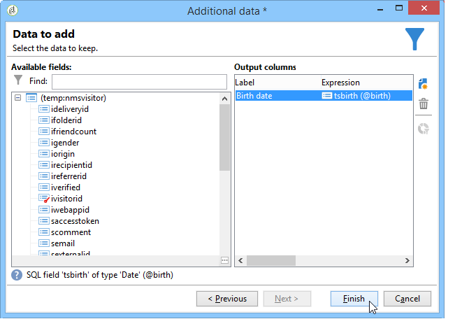

# Verbinding maken met de database {#connecting-to-the-database}

Als u een verbinding met de externe database wilt inschakelen, moet u de verbindingsparameters aangeven, dat wil zeggen de doelgegevensbron en de naam van de tabel met gegevens die moeten worden geladen.

>[!CAUTION]
>
>De Adobe Campaign-gebruiker heeft specifieke rechten nodig voor de externe database en de Adobe Campaign-toepassingsserver om gegevens uit een externe database te verwerken. Raadpleeg voor meer informatie de [Toegangsrechten externe database](../../installation/using/remote-database-access-rights.md) sectie.
>
>Om storingen te voorkomen, moeten operatoren die toegang krijgen tot externe, gedeelde gegevens werken vanuit aparte ruimten.

## Een gedeelde verbinding maken {#creating-a-shared-connection}

Als u een verbinding met een gedeelde externe database wilt inschakelen, zolang deze verbinding actief is, kunt u de database openen via Adobe Campaign.

1. De configuratie moet vooraf via de **[!UICONTROL Administration > Platform > External accounts]** knooppunt.
1. Klik op de knop **[!UICONTROL New]** en selecteert u de **[!UICONTROL External database]** type.
1. Definieer de **[!UICONTROL Connection]** parameters van de externe database.

   Voor verbindingen met een **ODBC** type database **[!UICONTROL Server]** veld moet de naam van de ODBC-gegevensbron bevatten en niet de servernaam. Bovendien kunnen bepaalde aanvullende configuraties noodzakelijk zijn, afhankelijk van de gebruikte databanken. Zie de [Specifieke configuraties per databasetype](../../installation/using/configure-fda.md) sectie.

1. Wanneer de parameters zijn ingevoerd, klikt u op de knop **[!UICONTROL Test the connection]** om deze goed te keuren.

   

1. Schakel indien nodig de optie **[!UICONTROL Enabled]** optie om toegang tot dit gegevensbestand zonder zijn configuratie onbruikbaar te maken.
1. Als u Adobe Campaign toegang wilt geven tot deze database, moet u de SQL-functies implementeren. Klik op de knop **[!UICONTROL Parameters]** dan de **[!UICONTROL Deploy functions]** knop.

   

U kunt specifieke werktabelruimten definiëren voor de tabellen en voor de index in het dialoogvenster **[!UICONTROL Parameters]** tab.

## Tijdelijke verbinding maken {#creating-a-temporary-connection}

U kunt rechtstreeks vanuit workflowactiviteiten een verbinding met een externe database definiëren. In dit geval bevindt het bestand zich in een lokale externe database die is gereserveerd voor gebruik in een huidige workflow: het wordt niet opgeslagen op de externe accounts. Dit type punctuele verbinding kan op verschillende activiteiten van het werkschema, met name worden tot stand gebracht **[!UICONTROL Query]** de **[!UICONTROL Data loading (RDBMS)]** de **[!UICONTROL Enrichment]** of de **[!UICONTROL Split]** activiteit.

>[!CAUTION]
>
>Dit type configuratie wordt niet aanbevolen, maar kan periodiek worden gebruikt om gegevens te verzamelen. Desalniettemin dient u een externe rekening te maken, zoals weergegeven in het [Een gedeelde verbinding maken](#creating-a-shared-connection) sectie.

In de queryactiviteit ziet u bijvoorbeeld de volgende stappen voor het maken van een periodieke verbinding met een externe database:

1. Klik op de knop **[!UICONTROL Add data...]** en selecteert u de **[!UICONTROL External data]** opties.
1. Selecteer **[!UICONTROL Locally defining the data source]** optie.

   

1. Selecteer de doeldatabase-engine in de vervolgkeuzelijst. Voer de naam van de server in en geef de verificatieparameters op.

   Geef ook de naam van de externe database op.

   

   Klik op de knop **[!UICONTROL Next]**.

1. Selecteer de tabel waarin de gegevens zijn opgeslagen.

   U kunt de naam van de tabel rechtstreeks in het desbetreffende veld invoeren of op het pictogram Bewerken klikken om de lijst met databasetabellen te openen.

   

1. Klik op de knop **[!UICONTROL Add]** om een of meer afstemmingsvelden te definiëren tussen de externe databasegegevens en de gegevens in de Adobe Campaign-database. De **[!UICONTROL Edit expression]** pictogrammen van de **[!UICONTROL Remote field]** en **[!UICONTROL Local field]** geeft u toegang tot de lijst van gebieden van elk van de lijsten.

   

1. Geef zo nodig een filtervoorwaarde en de gegevenssorteermodus op.
1. Selecteer de aanvullende gegevens die in de externe database moeten worden verzameld. Dubbelklik hiertoe op de velden die u wilt toevoegen om deze weer te geven in het dialoogvenster **[!UICONTROL Output columns]**.

   

   Klikken **[!UICONTROL Finish]** om deze configuratie te bevestigen.

## Beveiligde verbinding {#secure-connection}

>[!NOTE]
>
>Beveiligde verbinding is alleen beschikbaar voor PostSQL.

U kunt toegang tot een extern gegevensbestand beveiligen wanneer het vormen van een externe rekening FDA.

Voeg &quot;**:ssl**&quot; na het serveradres en het adres van de gebruikte poort. Bijvoorbeeld: **192 168 0,52:4501:ssl**.

De gegevens worden vervolgens verzonden via het veilige SSL-protocol.

## Aanvullende configuraties {#additional-configurations}

Indien nodig, kunt u het schema voor de verwerking van gegevens in een extern gegevensbestand tot stand brengen. Op dezelfde manier kunt u in Adobe Campaign toewijzingen definiëren voor de gegevens in een externe tabel. Deze configuraties zijn algemeen en zijn niet uitsluitend van toepassing op workflows.

>[!NOTE]
>
>Raadpleeg voor meer informatie over het maken van schema&#39;s in Adobe Campaign en het definiëren van een nieuwe gegevenstoewijzing [deze pagina](../../configuration/using/about-schema-edition.md).
