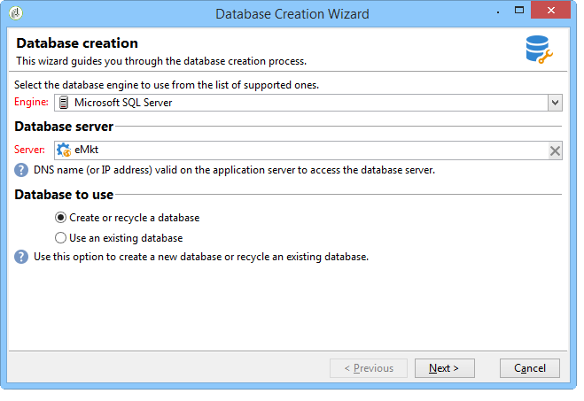
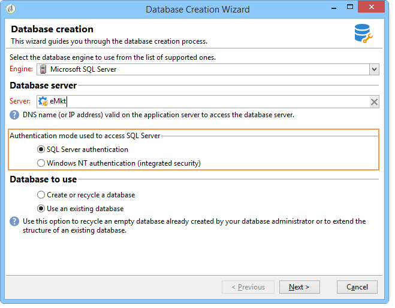

# De database maken en configureren{#creating-and-configuring-the-database}

Als u een database maakt, biedt Adobe Campaign twee verschillende opties:

1. Een database maken of recyclen: kies deze opties als u een nieuwe database wilt maken of een bestaande database opnieuw wilt gebruiken. Verwijs naar [ Geval 1: Creërend/recycling een gegevensbestand ](#case-1--creating-recycling-a-database).
1. Gebruikend een bestaand gegevensbestand: kies deze optie als een leeg gegevensbestand reeds door uw beheerder is gecreeerd en u het wilt gebruiken; of de structuur van een bestaand gegevensbestand uitbreiden. Verwijs naar [ Geval 2: Gebruikend een bestaand gegevensbestand ](#case-2--using-an-existing-database).

De configuratiestappen worden hieronder beschreven.

>[!CAUTION]
>
>Namen van databases, gebruikers en schema&#39;s mogen niet beginnen met een getal of speciale tekens bevatten.
>
>Slechts kan het **interne** herkenningsteken deze verrichtingen uitvoeren. Raadpleeg [deze sectie](../../installation/using/configuring-campaign-server.md#internal-identifier) voor meer informatie.

## Geval 1: Een database maken/recyclen {#case-1--creating-recycling-a-database}

De stappen voor het creëren van een database of het recyclen van een bestaande basis worden hieronder beschreven. Sommige configuraties zijn afhankelijk van de gebruikte database-engine:

De volgende stappen zijn hierbij betrokken:

* [ Stap 1 - het Selecteren van de gegevensbestandmotor ](#step-1---selecting-the-database-engine),
* [ Stap 2 - het Verbinden met de server ](#step-2---connecting-to-the-server),
* [ Stap 3 - Verbinding en kenmerken van het gegevensbestand ](#step-3---connection-and-characteristics-of-the-database),
* [ Stap 4 - Pakketten om ](#step-4---packages-to-install) te installeren,
* [ Stap 5 - de stappen van de creatie ](#step-5---creation-steps),
* [ Stap 6 - Creërend het gegevensbestand ](#step-6---creating-the-database).

### Stap 1 - De database-engine selecteren {#step-1---selecting-the-database-engine}

Selecteer de database-engine in de vervolgkeuzelijst.


De gesteunde gegevensbestanden zijn vermeld in de matrijs van de Verenigbaarheid van de Campagne [&#128279;](../../rn/using/compatibility-matrix.md).

Identificeer de server en kies het type van verrichting om uit te voeren. In dit geval, **[!UICONTROL Create or recycle a database]**.


Afhankelijk van de geselecteerde database-engine kan de identificatie-informatie van de server variëren.

* Voor een **Oracle** motor, bevolk de **naam TNS** die voor de toepassingsserver wordt bepaald.
* Voor a **PostgreSQL** motor, moet u de DNS naam (of IP adres) specificeren die op de toepassingsserver wordt bepaald om tot de gegevensbestandserver toegang te hebben.
* Voor de motor van de Server van a **SQL**, moet u bepalen: de DNS naam (of IP adres) op de toepassingsserver wordt bepaald om tot de gegevensbestandserver toegang te hebben: **DNS** of **DNS`\<instance>`** (instantiemodus),

  >[!CAUTION]
  >
  > Beginnend 20.3, wordt de authentificatie van NT van Vensters ontmanteld. **[!UICONTROL SQL Server authentication]** is nu de enige verificatiemodus beschikbaar voor Microsoft SQL Server. [Meer informatie](../../rn/using/deprecated-features.md)

  

### Stap 2 - Verbinding maken met de server {#step-2---connecting-to-the-server}

Definieer in het **[!UICONTROL Server access]** -venster de toegang tot de databaseserver.


Om dit te doen, ga de naam en het wachtwoord van een **het systeemrekening van het Beleid** in die toestemming heeft om tot de gegevensbestanden, d.w.z.:

* **systeem** voor een gegevensbestand van het Oracle,
* **sa** voor een gegevensbestand van de Server van Microsoft SQL,
* **postgres** voor een gegevensbestand PostgreSQL,

### Stap 3 - Verbinding en kenmerken van de database {#step-3---connection-and-characteristics-of-the-database}

In de volgende stap kunt u de instellingen configureren voor het aanmelden bij de database.


U moet de volgende instellingen definiëren:

* Geef de naam op van de database die u wilt maken.
* Voer het wachtwoord in van de account die aan deze database is gekoppeld.
* Geef aan of de database zich in Unicode moet bevinden.

  Met de optie **[!UICONTROL Unicode database]** kunt u alle tekentypen in Unicode opslaan, ongeacht de taal.

  >[!NOTE]
  >
  >Met een gegevensbestand van het Oracle, laat de **[!UICONTROL Unicode storage]** optie u **NCLOB** en **NVARCHAR** typegebieden gebruiken.
  > 
  >Als u deze optie niet selecteert, moet de tekenset (charset) van de database van het Oracle gegevensopslag in alle talen inschakelen (AL32UTF8 wordt aanbevolen).

* Kies een tijdzone voor de database en geef op of u deze in UTC wilt plaatsen (indien beschikbaar).

  Voor meer op dit, verwijs naar [ het beheer van de tijdzone ](../../installation/using/time-zone-management.md).

### Stap 4 - Te installeren pakketten {#step-4---packages-to-install}

Selecteer de pakketten die u wilt installeren.

Raadpleeg de licentieovereenkomst om te controleren welke oplossingen en opties u mag installeren, zoals &quot;Interactie&quot; of &quot;Sociale marketing&quot;.


### Stap 5 - Aanmaakstappen {#step-5---creation-steps}

In het venster **[!UICONTROL Creation steps]** kunt u het SQL-script weergeven en bewerken dat wordt gebruikt om de tabellen te maken.


* Voor een Oracle, de Server van Microsoft SQL of het gegevensbestand PostgreSQL, kan de beheerder de **opslagparameters** ook bepalen die moeten worden gebruikt wanneer het creëren van gegevensbestandvoorwerpen.

  Deze parameters krijgen de exacte tabelnamen (waarschuwing: hoofdlettergevoelig). Zij worden respectievelijk opgeslagen in de **[!UICONTROL Administration > Platform > Options]** knoop in de volgende opties (zie [ deze sectie ](../../installation/using/configuring-campaign-options.md#database)):

   * **WdbcOptions_TableSpaceUser**: gebruikerstabellen die op een schema worden gebaseerd
   * **WdbcOptions_TableSpaceIndex**: index van gebruikerslijsten die op een schema worden gebaseerd
   * **WdbcOptions_TableSpaceWork**: de werklijsten zonder schema
   * **WdbcOptions_TableSpaceWorkIndex**: index van het werklijsten zonder schema

* Voor een gegevensbestand van het Oracle, moet de gebruiker van Adobe Campaign toegang tot de bibliotheken van het Oracle hebben, typisch als lid van de **installeert** groep.
* Met de optie **[!UICONTROL Set or change the administrator password]** kunt u het wachtwoord invoeren dat is gekoppeld aan de Adobe Campaign-operator met beheerdersrechten.

  We raden u aan om voor beveiligingsdoeleinden een Adobe Campaign-beheerderswachtwoord te definiëren.

### Stap 6 - De database maken {#step-6---creating-the-database}

Het definitieve stadium van de medewerker laat u toe om het gegevensbestand tot stand te brengen. Klik op **[!UICONTROL Start]** om te bevestigen.


Zodra het gegevensbestand wordt gecreeerd, kunt u opnieuw verbinden om instantieconfiguratie te voltooien.

U moet nu de plaatsingstovenaar beginnen om het vormen van de instantie te beëindigen. Verwijs naar [ plaatsingstovenaar ](../../installation/using/deploying-an-instance.md#deployment-assistant).

De verbindingsinstellingen voor de database die aan de instantie is gekoppeld, worden opgeslagen in het bestand **`/conf/config-<instance>.xml`** in de installatiemap van Adobe Campaign.

Voorbeeld van een Microsoft SQL Server-configuratie in de base61-database die is gekoppeld aan de &#39;campagne&#39;-account met het bijbehorende gecodeerde wachtwoord:

```
<dbcnx encrypted="1" login="campaign:myBase" password="myPassword" provider="DB" server="dbServer"/>
```

## Geval 2: Het gebruiken van een bestaande gegevensbestand {#case-2--using-an-existing-database}

Het gegevensbestand, evenals de gebruiker, moet door de gegevensbestandbeheerder en de correct gevormde toegangsrechten zijn gecreeerd.

Bijvoorbeeld, voor een gegevensbestand van het Oracle, zijn de minimaal vereiste rechten: GRANT CONNECT, BRON en UNLIMITED TABLESPACE.

Om een bestaand gegevensbestand te gebruiken, zijn de configuratiestappen als volgt:

* [ Stap 1 - het Kiezen van de gegevensbestandmotor ](#step-1---choosing-the-database-engine),
* [ Stap 2 - de verbindingsmontages van het Gegevensbestand ](#step-2---database-connection-settings),
* [ Stap 3 - Pakketten om ](#step-3---packages-to-install) te installeren,
* [ Stap 4 - de stappen van de creatie ](#step-4---creation-steps),
* [ Stap 5 - Creërend het gegevensbestand ](#step-5---creating-the-database).

### Stap 1 - De database-engine kiezen {#step-1---choosing-the-database-engine}

Kies de database-engine in de vervolgkeuzelijst.


Identificeer de server en kies het type van verrichting u wilt uitvoeren. In dit geval, **[!UICONTROL Use an existing database]**.


Afhankelijk van de geselecteerde database-engine kan de identificatie-informatie van de server variëren.

* Voor een **Oracle** motor, bevolk de **naam TNS** die voor de toepassingsserver wordt bepaald.
* Voor a **PostgreSQL** motor, moet u de DNS naam (of IP adres) specificeren die op de toepassingsserver wordt bepaald om tot de gegevensbestandserver toegang te hebben.
* Voor de motor van de Server van a **Microsoft SQL**, moet u bepalen:

   1. de DNS-naam (of het IP-adres) die op de toepassingsserver is gedefinieerd voor toegang tot de databaseserver;
   1. de beveiligingsmethode die wordt gebruikt voor toegang tot Microsoft SQL Server: **[!UICONTROL SQL Server authentication]** of **[!UICONTROL Windows NT authentication]** .

      

### Stap 2 - Verbindingsinstellingen database {#step-2---database-connection-settings}

Definieer in het venster **[!UICONTROL Database]** de instellingen voor de databaseverbinding.


U moet de volgende instellingen definiëren:

* Voer de naam in van de database die moet worden gebruikt,
* Voer de naam en het wachtwoord in van de account die aan deze database is gekoppeld.

  >[!NOTE]
  >
  >Zorg ervoor dat zowel de naam van het schema als de gebruikersnaam overeenkomen. De geadviseerde manier om gegevensbestand te creëren is door cliënt van de campagneconsole.
  >Voor een database van een Oracle hoeft u de accountnaam niet in te voeren.

* Geef aan of de database Unicode moet zijn of niet.

### Stap 3 - Te installeren pakketten {#step-3---packages-to-install}

Selecteer de pakketten die u wilt installeren.

Raadpleeg de licentieovereenkomst om te controleren welke oplossingen en opties u mag installeren, zoals &quot;Interactie&quot; of &quot;Leads&quot;.


### Stap 4 - Aanmaakstappen {#step-4---creation-steps}

In het venster **[!UICONTROL Creation steps]** kunt u het SQL-script weergeven en bewerken dat wordt gebruikt om de tabellen te maken.


* Voor Oracle, de Server van Microsoft SQL of de gegevensbestanden PostgreSQL, kan de beheerder de **opslagparameters** bepalen die moeten worden gebruikt wanneer het creëren van gegevensbestandvoorwerpen.
* Voor een gegevensbestand van het Oracle, moet de gebruiker van Adobe Campaign toegang tot de bibliotheken van het Oracle hebben, typisch als lid van de **installeert** groep.
* Met de optie **[!UICONTROL Set or change the administrator password]** kunt u het wachtwoord invoeren dat is gekoppeld aan de Adobe Campaign-operator met beheerdersrechten.

  We raden u aan om voor beveiligingsdoeleinden een Adobe Campaign-beheerderswachtwoord te definiëren.

### Stap 5 - De database maken {#step-5---creating-the-database}

Het definitieve stadium van de medewerker laat u toe om het gegevensbestand tot stand te brengen. Klik op **[!UICONTROL Start]** om te bevestigen.


Wanneer het maken van een database is voltooid, kunt u opnieuw verbinding maken om de instantieconfiguratie te voltooien.

U moet nu de plaatsingstovenaar beginnen om het vormen van de instantie te beëindigen. Verwijs naar [ plaatsingstovenaar ](../../installation/using/deploying-an-instance.md#deployment-assistant).

De verbindingsinstellingen voor de database die aan de instantie is gekoppeld, worden opgeslagen in het bestand **`/conf/config-<instance>.xml`** in de installatiemap van Adobe Campaign.

Voorbeeld van een Microsoft SQL Server-configuratie in de base61-database die is gekoppeld aan de &#39;campagne&#39;-account met het bijbehorende gecodeerde wachtwoord:

```
<dbcnx encrypted="1" login="campaign:myBase" password="myPassword" provider="DB" server="dbServer"/>
```
