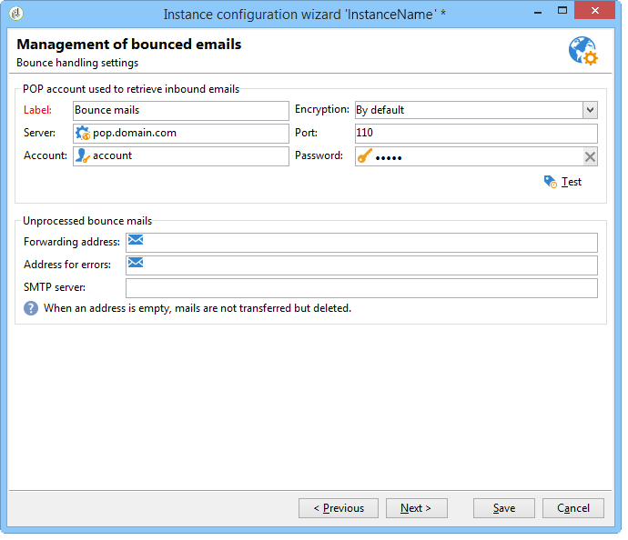
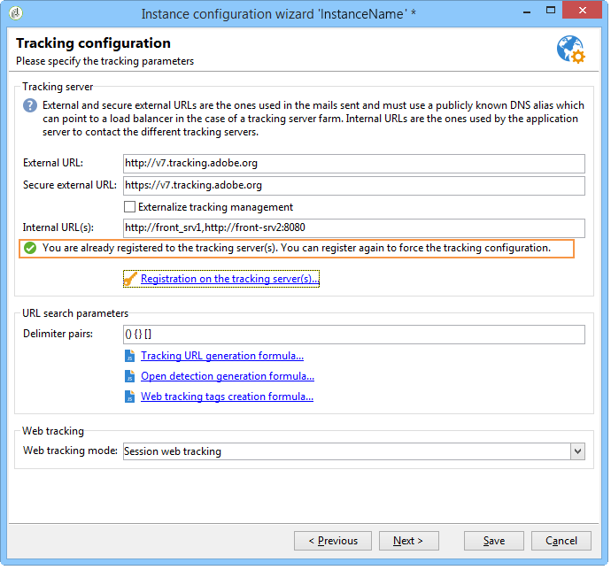
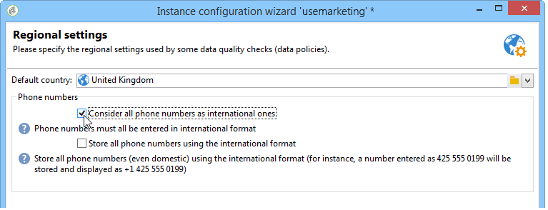

# Een instantie implementeren{#deploying-an-instance}

>[!NOTE]
>
>Serverconfiguraties kunnen alleen worden uitgevoerd door Adobe voor implementaties die worden gehost door Adobe. Voor meer informatie over de verschillende implementaties raadpleegt u de [Hostmodellen](../../installation/using/hosting-models.md) van [deze pagina](../../installation/using/capability-matrix.md).

## Implementatiewizard {#deployment-wizard}

Adobe Campaign biedt een grafische assistent, beschikbaar in de Adobe Campaign-clientconsole, om de parameters van de instantie te definiëren waarmee u verbinding gaat maken.

Selecteer **Gereedschappen > Geavanceerd > Implementatiewizard**.


De configuratiestappen zijn als volgt:

1. [Algemene parameters](#general-parameters)
1. [Parameters voor e-mailkanaal](#email-channel-parameters)
1. [Beknopte e-mails beheren](#managing-bounced-emails)
1. [Configuratie bijhouden](#tracking-configuration)
1. [Parameters van mobiele kanalen](#mobile-channel-parameters)
1. [Regionale instellingen](#regional-settings)
1. [Toegang vanaf internet](#access-from-the-internet)
1. [Openbare middelen beheren](#managing-public-resources)
1. [Gegevens wissen](#purging-data)

## Algemene parameters {#general-parameters}

De eerste stap van de plaatsingstovenaar laat u algemene informatie over de instantie ingaan.


### Algemene informatie {#general-information}

In de onderste sectie van het venster kunt u de opties selecteren die moeten worden geactiveerd.

* **[!UICONTROL Customer identifier used in billing]** : dit kan de naam van de instantie en het versienummer zijn.
* **[!UICONTROL Common name of the customer]** : Voer een tekenreeks in met de naam van uw bedrijf. Deze informatie kan in de unsubscription verbindingen worden gebruikt.
* **[!UICONTROL Namespace]** : Voer een korte id in kleine letters in. Het doel is om bij een upgrade onderscheid te maken tussen uw specifieke configuratie en de fabrieksconfiguratie. De standaardnaamruimte is **cus** - voor de klant.

### Technische opties {#technical-options}

In de onderste sectie van het venster kunt u de opties selecteren die moeten worden geactiveerd.

De volgende opties zijn beschikbaar:

* **[!UICONTROL Email channel]** : om e-maillevering te activeren. Zie [Parameters e-mailkanaal](#email-channel-parameters).
* **[!UICONTROL Tracking]** : Om het volgen van de doelbevolking (opent en klikt) toe te laten. Zie [Configuratie bijhouden](#tracking-configuration).
* **[!UICONTROL Managing bounced emails]** : Het POP-account definiëren waarmee inkomende e-mail wordt opgehaald. Zie [Beknopte e-mails beheren](#managing-bounced-emails).
* **[!UICONTROL LDAP integration]** : Gebruikersverificatie configureren via een LDAP-directory. Zie [Verbinding maken via LDAP](../../installation/using/connecting-through-ldap.md).

## Parameters voor e-mailkanaal {#email-channel-parameters}

In de volgende stap kunt u de informatie definiëren die in berichtkoppen moet worden weergegeven.

Deze parameters kunnen in leveringsmalplaatjes, en individueel voor elke levering worden overbelast (als de gebruikers de vereiste rechten hebben).

### Parameters voor geleverde e-mails {#parameters-for-delivered-emails}


Geef de volgende parameters op:

* **[!UICONTROL Sender name]** : Voer de naam van de afzender in.
* **[!UICONTROL Sender address]** : Voer het e-mailadres van de afzender in.

  >[!NOTE]
  >
  > Wanneer u e-mailberichten verzendt vanuit Adobe Campaign, worden de **Adres van afzender** de brievenbus wordt niet gecontroleerd en de marketing gebruikers hebben geen toegang tot deze brievenbus. Adobe Campaign biedt ook niet de mogelijkheid om e-mails die in dit postvak zijn ontvangen automatisch te beantwoorden of door te sturen. Meer informatie over aanbevolen werkwijzen voor levering [in deze documentatie](https://experienceleague.adobe.com/docs/deliverability-learn/deliverability-best-practice-guide/additional-resources/campaign/ac-starting-new-platform.html){_blank}.

* **[!UICONTROL Reply address text]** : Voer de naam in die wordt gebruikt wanneer de ontvanger op de knop **[!UICONTROL Reply]** knop.
* **[!UICONTROL Reply address]** : Voer het e-mailadres in dat moet worden gebruikt wanneer de ontvanger op de knop **[!UICONTROL Reply]** in hun e-mailclientsoftware.

  >[!NOTE]
  >
  >Het doel van de **Reactieadres** het veld is wanneer de ontvanger op een ander adres moet antwoorden dan het veld **Adres van afzender**.  Dit adres moet een geldig e-mailadres zijn, verbonden aan een gecontroleerd brievenbus, en ontvangen door de klant.  Dit kan bijvoorbeeld een ondersteuningsmailbox zijn, customer-care@customer.com, waar e-mails worden gelezen en waarop wordt gereageerd.

* **[!UICONTROL Error address]** : Voer het e-mailadres in van berichten met fouten. Dit is het technische adres dat wordt gebruikt om stuiterende post, met inbegrip van e-mails te behandelen die door de server van Adobe Campaign wegens niet bestaande doeladressen worden ontvangen.

  >[!NOTE]
  >
  > Dit adres moet een geldig e-mailadres zijn, verbonden aan een gecontroleerd brievenbus, en ontvangen door de klant. Het zou een stuiterende brievenbus kunnen zijn, bijvoorbeeld, errors@customer.com.


Daarnaast kunt u de opdracht **maskers** geoorloofd voor het afzenderadres en het foutenadres. Indien nodig, kunnen deze maskers met komma&#39;s worden gescheiden. Deze configuratie is optioneel. Wanneer de gebieden zijn ingegaan, controleert Adobe Campaign op het tijdstip van levering (tijdens analyse, als het adres geen variabelen omvat) dat de adressen geldig zijn. Deze werkende wijze zorgt ervoor dat geen adressen worden gebruikt die leveringskwesties konden teweegbrengen. De adressen van de levering moeten op de leveringsserver worden gevormd.

>[!NOTE]
>
>* Deze instellingen worden opgeslagen in de opties voor het campagneplatform. [Meer informatie](../../installation/using/configuring-campaign-options.md).
> 
>* Voor configuraties met meerdere branding kunt u het adres van de Fout aanpassen en deze configuratie overschrijven vanuit de e-mail die externe account verplettert. [Meer informatie](../../installation/using/external-accounts.md#email-routing-external-account).
>


### Tekens geautoriseerd in adressen {#characters-authorized-in-addresses}

<!--This window enables you to define, for all email campaigns, the delivery and address-quality management options.-->

In de Adobe Campaign-database moeten alle e-mailadressen als volgt worden gemaakt: `x@y.z`. De **x**, **y** en **z** tekens mogen niet leeg zijn en mogen geen niet-geautoriseerde tekens bevatten.

Hier kunt u de geoorloofde tekens (&#39;gegevensbeleid&#39;) definiëren in het e-mailveld van de database. Tekens die niet in de lijst staan, worden verboden en daarom geweigerd wanneer gegevens in de database worden ingevoerd via de interface, via een webformulier en ook wanneer gegevens worden geïmporteerd.

Er zijn twee lijsten beschikbaar: **Alleen Europees** of **Alleen VS**. Indien nodig kunnen andere tekens worden toegevoegd.

### Bezorgingsparameters {#delivery-parameters}

De **Geavanceerde parameters...** de verbinding laat u toe om tot leveringsopties, parameters toegang te hebben verbonden aan retry en quarantines.


In dit venster kunt u voor alle e-mailcampagnes de opties voor levering en beheer van de adreskwaliteit definiëren.

De volgende opties zijn beschikbaar:

* **[!UICONTROL Delivery duration of messages]** : Daarna wordt de levering gestopt (standaard 5 dagen).
* **[!UICONTROL Online resources validity duration]** : Tijd waarvoor informatie van het ontvankelijke profiel wordt gehouden om spiegelpagina&#39;s te produceren.
* **[!UICONTROL Exclude recipients who no longer wish to be contacted]** : Als deze optie is ingeschakeld, wordt geen contact opgenomen met de ontvangers van de lijst van gewezen personen.
* **[!UICONTROL Automatically ignore doubles]** : Als deze optie is geselecteerd, wordt de levering niet uitgevoerd naar dubbele adressen.

>[!NOTE]
>
>Voor gehoste of hybride installaties, als u hebt geüpgraded naar de [Enhanced MTA](../../delivery/using/sending-with-enhanced-mta.md)de **[!UICONTROL Delivery duration of the messages]** wordt alleen gebruikt als ingesteld op **3,5 dagen of minder**. Als u een waarde definieert die hoger is dan 3,5 dagen, wordt hiermee geen rekening gehouden.

### Parameters opnieuw proberen {#retry-parameters}

De informatie over terugvorderingen is te vinden in het **Herstelperioden** en **Aantal terugvorderingen** velden: wanneer een ontvanger onbereikbaar is, bijvoorbeeld als hun inbox volledig is, door gebrek zal het programma proberen contacterend hen vijf keer, met een interval van één uur tussen elke poging (tijdens de maximumleveringstijd). U kunt deze waarden naar wens wijzigen.

>[!NOTE]
>
>Voor gehoste of hybride installaties, als u hebt geüpgraded naar de [Enhanced MTA](../../delivery/using/sending-with-enhanced-mta.md), worden de parameters voor het opnieuw proberen van de campagne niet meer gebruikt. De zachte stuitpogingen en de tijdsduur tussen hen worden bepaald door Verbeterde MTA gebaseerd op het type en de strengheid van de stuiteringsreacties die van het e-maildomein van het bericht terugkomen.

### Quarantaine-parameters {#quarantine-parameters}

De configuratieopties voor quarantines zijn als volgt:

* **[!UICONTROL Duration between two significant errors]** : Voer standaard een waarde in (&quot;1d&quot;): 1 dag) om de tijd te bepalen die de toepassing wacht alvorens de foutenteller in het geval van mislukking te verhogen,
* **[!UICONTROL Maximum number of errors before quarantine]** : zodra deze waarde is bereikt, wordt het e-mailadres in quarantaine geplaatst (standaard &quot;5&quot;: het adres zal in quarantined op de zesde fout) zijn. Dit betekent dat het contact automatisch van volgende bezorgingen wordt uitgesloten.

## Beknopte e-mails beheren {#managing-bounced-emails}

Bounce mail is uiterst belangrijk om leveringsfouten te kwalificeren. Deze fouten worden gecategoriseerd in NP@I zodra de regels hun oorzaak hebben bepaald.

Deze stap is alleen beschikbaar als de **E-mailkanaal** en **Bounce mail** beheeropties worden geselecteerd in de eerste fase van de implementatiewizard. Zie [Algemene parameters](#general-parameters).

In dit werkgebied kunt u instellingen definiëren voor het beheer van stuiterende berichten.



### POP-account gebruikt om inkomende mails op te halen {#pop-account-used-to-retrieve-incoming-mails}

Geef de parameters op waarmee u verbinding wilt maken met de account voor het ophalen van inkomende e-mails.

* **[!UICONTROL Label]** : Naam die alle hieronder vermelde parameters bevat;
* **[!UICONTROL Server]** : Server gebruikt om stuiterende post (inkomende post) terug te winnen,
* **[!UICONTROL Security]** : Selecteer indien nodig **[!UICONTROL SSL]** in de vervolgkeuzelijst,
* **[!UICONTROL Port]** : serverpoort (doorgaans 110),
* **[!UICONTROL Account]** : Naam van de rekening die voor stuiterende post wordt gebruikt,
* **[!UICONTROL Password]** : Wachtwoord dat aan het account is gekoppeld.

Als de POP-instellingen zijn opgegeven, klikt u op **Testen** om ervoor te zorgen dat zij correct zijn.

### Onverwerkte stuitberichten {#unprocessed-bounce-mails}

Bounces worden automatisch afgehandeld door Adobe Campaign, waarbij de regels worden toegepast die in de **Beheer > Campaign Management > Beheer van niet-te leveren items > Kwalificatie van leveringslogboek** knooppunt. Raadpleeg voor meer informatie hierover [Bounce mail management](../../delivery/using/understanding-delivery-failures.md#bounce-mail-management).

Onverwerkte grenzen worden niet weergegeven in de Adobe Campaign-interface. Zij worden automatisch geschrapt tenzij zij aan een derdebrievenbus gebruikend de volgende gebieden worden overgebracht:

* **[!UICONTROL Forwarding address]** : Vul dit veld in om alle foutberichten (verwerkt of onverwerkt) die door het Adobe Campaign-platform zijn verzameld, over te brengen naar een adres van een derde.
* **[!UICONTROL Address for errors]** : Vul dit gebied in om aan een derdeadres slechts de foutenmeldingen over te brengen die het inMail proces niet in aanmerking kwam.
* **[!UICONTROL SMTP server]** : Server die wordt gebruikt om onverwerkte e-mails over bounce te verzenden.

>[!IMPORTANT]
>
>Als u onverwerkte e-mails met bounce wilt doorsturen, raadt Adobe u aan alleen de **[!UICONTROL Address for errors]** veld. Nochtans, zorg ervoor het adres dat wordt gebruikt regelmatig wordt gecontroleerd, aangezien dit een zware lading op uw postserver kon zetten. Neem contact op met uw accountmanager voor meer informatie.

## Configuratie bijhouden {#tracking-configuration}

In de volgende stap kunt u tracering voor de instantie configureren. De instantie moet worden gedeclareerd en geregistreerd bij de volgende server(s).

Deze stap wordt alleen aangeboden als de **E-mailkanaal** en **Tekstspatiëring** de opties worden geselecteerd in de eerste pagina van de plaatsingstovenaar. Zie [Algemene parameters](#general-parameters).

Voor meer gedetailleerde informatie over webtracking (tracingsmodus, tags maken en invoegen...) raadpleegt u [dit document](../../configuration/using/about-web-tracking.md).

### Werkwijze {#operating-principle}

Wanneer u tracking op een instantie activeert, worden de URL&#39;s in de leveringen tijdens het verzenden gewijzigd om tracking in te schakelen.

* De informatie over externe (of veilig of niet) ingevoerde URLs op deze pagina van de plaatsingstovenaar wordt gebruikt om nieuwe URL te bouwen. De gewijzigde koppeling bevat naast deze informatie ook: de identificatiecodes van de levering, de ontvanger en de URL.

  De trackinggegevens worden door Adobe Campaign verzameld op de trackingserver(s) om de ontvangende profielen en de aan de levering gekoppelde gegevens te verrijken ( **[!UICONTROL Tracking]** tabs).

  Informatie over interne URL&#39;s wordt alleen door de Adobe Campaign-toepassingsserver gebruikt om contact op te nemen met de trackingserver(s).

  Raadpleeg voor meer informatie hierover [Trackingserver](#tracking-server).

* Zodra URLs wordt gevormd, moet u het volgen toelaten. Hiervoor moet de instantie zijn geregistreerd op de volgende server(s).

  Raadpleeg voor meer informatie hierover [Tekstspatiëring opslaan](#saving-tracking).

### Trackingserver {#tracking-server}


Om de efficiëntie van het bijhouden van wijzigingen op dit exemplaar te garanderen, moet de volgende informatie worden weergegeven:
<!--With Mid-sourcing architecture, you can externalize tracking management. To do this:-->

* **[!UICONTROL External URL]** en/of **[!UICONTROL Secure external URL]** : Voer de URL voor omleiding in die moet worden gebruikt in de e-mail die moet worden verzonden.
* **[!UICONTROL Internal URL(s)]** : URL&#39;s die alleen door de Adobe Campaign-server worden gebruikt om contact op te nemen met de trackingserver(s) voor het verzamelen van logbestanden en het uploaden van de URL&#39;s. Het is niet nodig deze aan de instantie te koppelen.

  Als u geen URL opgeeft, wordt standaard de URL voor bijhouden gebruikt.

Met de architectuur van de middelste-sourcing, kunt u het volgen beheer externaliseren. Dit doet u als volgt:

1. Selecteer de optie **[!UICONTROL Externalize tracking management]** : hiermee kunt u een server voor midsourcing gebruiken als een trackingserver.
1. Vul de **[!UICONTROL External account]** en **[!UICONTROL Instance name]** velden die verbinding kunnen maken met de server voor midsourcing.

   Raadpleeg voor meer informatie [Server voor midsourcing](../../installation/using/mid-sourcing-server.md).

1. Klik op de knop **[!UICONTROL Enable the tracking instance]** om verbinding met de server goed te keuren.

   

### Tekstspatiëring opslaan {#saving-tracking}

Wanneer de URL&#39;s zijn gevuld, moet u de trackingserver registreren.

Klik op de koppeling **Registratie op de trackingserver(s)** en selecteer vervolgens een van de beschikbare opties.


Er zijn drie mogelijke soorten architectuur voor het uitvoeren van het volgen:

1. **Ondersteuning voor tekstspatiëring toevoegen in een bestaande instantie**

   Deze keuze is van toepassing als de instantie al voor andere behoeften is gemaakt (MTA-server, enz.) op servers die worden gebruikt als trackingservers.

   

   Voer het wachtwoord voor de **internal** account op de omleidingsserver(s) om de trackinginstantie te configureren.

   >[!NOTE]
   >
   >Als er meerdere trackingservers worden gebruikt, moeten deze allemaal dezelfde naam en hetzelfde wachtwoord gebruiken.

   Geef de naam van de instantie en het wachtwoord op.

1. **Een nieuwe instantie maken die is gewijd aan bijhouden**

   Deze optie is handig wanneer trackingsinstanties zijn gereserveerd voor tracering en geen andere toepassingsmodules hebben.

   

   Voer het wachtwoord voor de **internal** account op de omleidingsserver(s) om de trackinginstantie te configureren.

   >[!NOTE]
   >
   >Als er meerdere trackingservers zijn geconfigureerd, moeten ze allemaal hetzelfde wachtwoord gebruiken.

   Geef de naam van de instantie, het wachtwoord en eventuele bijbehorende DNS-maskers op, zoals **[!UICONTROL Campaign*]**.

1. **Valideer een volgende instantie reeds pre-gevormd voor u**

   Deze optie wordt gebruikt wanneer u niet het wachtwoord voor **internal** rekening; In dit geval is een account voor bijhouden vooraf geconfigureerd op de volgende server(s). Voer het wachtwoord in van de traceringsaccount van de omleidingsserver(s) om de volgende instantie te valideren.

   

   Geef de naam op van de instantie die moet worden gevalideerd.

Klikken **Goedkeuren** om het opnameproces met de volgende server te beginnen.

Terug in het vorige venster, bevestigt een bericht de registratie op het volgende serverniveau:



De parameters die zijn gekoppeld aan URL-zoekopdrachten **mag niet worden gewijzigd** voor een standaardinstallatie. Neem voor alle andere parameters contact op met Adobe.

## Parameters van mobiele kanalen {#mobile-channel-parameters}

In de volgende stap kunt u de standaardinstellingen definiëren voor leveringen aan mobiele apparaten (SMS en WAP Push).

>[!NOTE]
>
>Het mobiele kanaal is optioneel: dit stadium wordt alleen weergegeven als het is aangeschaft . Controleer hiervoor uw licentieovereenkomst.


### Standaardaccount voor SMS-levering {#default-account-for-sms-delivery}

Voer de volgende gegevens in:

* **[!UICONTROL Label]** : Voer een naam in voor dit SMS/Wap Push-account. Bijvoorbeeld, kunt u wensen om de naam van uw router te gebruiken.
* Voor de **[!UICONTROL Server]**, **[!UICONTROL Port]**, **[!UICONTROL Account]**, **[!UICONTROL Password]**, **[!UICONTROL Connector]**, **[!UICONTROL Send Endpoint]**, **[!UICONTROL Reception Endpoint]**, **[!UICONTROL Notification Endpoint]** velden: Neem contact op met het prepress-bureau voor de vereiste instellingen.

### Parameters van verzonden SMS {#parameters-of-sms-sent}

In de **Prioriteit** vervolgkeuzelijst: Selecteer &quot;Normaal&quot;, &quot;Hoog&quot; of &quot;Dringend&quot; om het op de te verzenden berichten toe te passen.

### Geavanceerde parameters {#advanced-parameters}

De **Geavanceerde parameters...** Via de koppeling hebt u toegang tot de opties voor opnieuw proberen en quarantaine.


Informatie over pogingen is beschikbaar in het dialoogvenster **Herhalingsperiode** en **Aantal pogingen** velden: Wanneer een mobiele telefoon niet bereikbaar is, probeert het programma standaard vijf keer opnieuw met intervallen van ten minste 15 minuten (voor de maximale leveringsperiode). Deze waarden kunnen aan uw behoeften worden aangepast.

De configuratieopties voor quarantines zijn als volgt:

* **[!UICONTROL Time between two significant errors]** : Voer een standaardwaarde in (standaard &quot;1d&quot;: dag) om de tijd te bepalen die de toepassing wacht alvorens de foutenteller voor een mislukking te verhogen.
* **[!UICONTROL Maximum number of errors before quarantine]** : Zodra deze waarde is bereikt, wordt het mobiele nummer in quarantaine geplaatst (standaard &quot;5&quot;: het nummer wordt in quarantaine geplaatst bij de zesde fout). Dit betekent dat het contact automatisch van toekomstige leveringen zal worden uitgesloten.

## Regionale instellingen {#regional-settings}

In dit stadium kunt u voorkeuren voor gegevensbeleid opnemen.



* **[!UICONTROL Consider all phone numbers as international ones]** : Als deze optie is geselecteerd, past de toepassing de internationale indeling toe op telefoonnummers (het voorvoegsel van het land is dan verplicht omdat het aantal cijfers niet wordt gecontroleerd voordat de opmaak wordt toegepast). Als deze optie niet is geselecteerd, moet u het internationale telefoonnummer zelf voorvoegsel &quot;+&quot; of &quot;00&quot; geven.
* **[!UICONTROL Store all phone numbers using the international format]** : Deze optie heeft alleen betrekking op **binnenlands** telefoonaantallen die worden ingevoerd of uitgegeven. Bepaal of u een binnenlandse indeling (zoals 425 555 0150) of de internationale indeling (bijvoorbeeld +1 425 555 0150)

## Toegang vanaf internet {#access-from-the-internet}

>[!IMPORTANT]
>
>Om privacyredenen raden we aan HTTPS te gebruiken voor alle externe bronnen.

Met deze stap kunt u toegangs-URL&#39;s definiëren voor Adobe Campaign-pagina&#39;s die op internet worden weergegeven.

U moet hier ook de publicatieopties aangeven die aan webformulieren zijn gekoppeld.


### Servers die op het Web worden blootgesteld {#servers-exposed-on-the-web}

Gebruik deze pagina om de server-URL&#39;s te vullen met:

1. Toegang tot de toepassingsserver die beschikbaar is op internet: Abonnementsformulieren/abonnementsformulieren, extranet, enz.
1. Open de toepassingsserver voor bronnen die niet op het web beschikbaar zijn: formulieren, intranet, bevestigingspagina&#39;s.
1. Open de spiegelpagina&#39;s van leveringen.

   Een spiegelpagina is een dynamische pagina waarop de inhoud van het e-mailbericht wordt weergegeven. Het wordt betreden via een verbinding die in het bericht wordt opgenomen dat naar de ontvanger wordt verzonden en kan gepersonaliseerde elementen bevatten. De spiegelpagina geeft de ontvanger de mogelijkheid om het bericht in Internet browser in plaats van de e-mailsoftware te lezen, ongeacht het leveringsformaat (tekst of HTML). Er worden echter alleen spiegelpagina&#39;s gegenereerd voor een bepaalde levering als de vereiste HTML-inhoud is gedefinieerd.

Met Adobe Campaign kunt u deze drie URL&#39;s onderscheiden om de laadbewerking over meerdere platforms te spreiden.


>[!NOTE]
>
>* Deze instellingen worden opgeslagen in de opties voor het campagneplatform. [Meer informatie](../../installation/using/configuring-campaign-options.md).
>* Voor configuraties met meerdere branding kunt u de URL van de pagina Mirror aanpassen en deze configuratie overschrijven via de e-mail die een externe account verplettert. [Meer informatie](../../installation/using/configuring-campaign-options.md).


## Openbare middelen beheren {#managing-public-resources}

>[!IMPORTANT]
>
>Om privacyredenen raden we aan HTTPS te gebruiken voor alle externe bronnen.

Om van buitenaf gezien te kunnen worden, moeten de afbeeldingen die worden gebruikt in e-mails en openbare middelen die aan campagnes zijn gekoppeld, aanwezig zijn op een extern toegankelijke server. Ze kunnen vervolgens beschikbaar zijn voor externe ontvangers of operatoren.


Voor deze stap, moet u ingaan:

1. De nieuwe URL voor openbare bronnen. Zie voor meer informatie de [URL van openbare bronnen](#public-resources-url) sectie.
1. De modus voor beelddetectie in een levering. Raadpleeg voor meer informatie de [Afbeeldingsdetectie leveren](#delivery-image-detection) sectie.
1. Publicatieopties Raadpleeg voor meer informatie de [Publicatiemodi](#publication-modes) sectie.

Openbare middelen zijn toegankelijk via **Beheer > Bronnen > Online > Public Resources** knooppunt van de boomstructuur Adobe Campaign. Ze worden verzameld in een bibliotheek en kunnen worden opgenomen in e-mails, maar ook worden gebruikt in campagnes of taken en in inhoudsbeheer.


### URL van openbare bronnen {#public-resources-url}

In het eerste veld kunt u het begin opgeven van de URL die wordt gebruikt voor de bronnen nadat deze zijn geüpload. Wanneer de bronnen zijn geüpload, zijn ze toegankelijk via deze nieuwe URL.

In een levering, kunt u beelden gebruiken die in de openbare middelbibliotheek of een ander lokaal beeld of beeld worden opgeslagen op een server worden opgeslagen.

* Voor e-mailafbeeldingen **https://** server **/res/img** URL.

  Deze waarde kan voor elke levering worden overschreven.

* Voor openbare middelen, URL **https://** server **/res/** instance ****waar **instance**is de naam van de instantie tracking.

### Afbeeldingsdetectie leveren {#delivery-image-detection}

In een levering, kunt u beelden gebruiken die in de openbare middelbibliotheek of een ander lokaal beeld of beeld worden opgeslagen op een server worden opgeslagen.

Het veld **URL-maskers** Hiermee kunt u een lijst opgeven met URL-maskers die moeten worden overgeslagen wanneer afbeeldingen automatisch worden geüpload. Als u bijvoorbeeld afbeeldingen gebruikt die zijn opgeslagen op een site die van buitenaf toegankelijk is, met name op een website, kunt u de site-URL in dit veld invoeren.


U kunt meerdere URL-maskers opgeven door een komma te gebruiken om ze van elkaar te scheiden.

* Voor informatie over het gebruik en het beheer van afbeeldingen in e-mails raadpleegt u [deze sectie](../../delivery/using/defining-the-email-content.md#adding-images).
* In de leveringstovenaar, zullen de beelden die van deze URLs worden geroepen de status &quot;Genegeerd&quot;hebben.

### Publicatiemodi {#publication-modes}

In het onderste gedeelte van de wizard kunt u de publicatieopties van openbare bronnen en afbeeldingen selecteren.

De volgende publicatiemodi zijn beschikbaar:

* Volgserver(s)

  De bronnen worden automatisch naar de verschillende trackingservers gekopieerd. Zij worden gevormd in de stap [Configuratie bijhouden](#tracking-configuration).

* Andere Adobe Campaign-servers

  U kunt een of meer andere Adobe Campaign-servers gebruiken waar de bronnen worden gekopieerd.

  Als u een specifieke Adobe Campaign-server wilt gebruiken aan de serverzijde, moet u een nieuwe instantie maken met de volgende opdracht:

  ```
  nlserver config -addtrackinginstance:<trackingA>/<trackingA*>
  ```

  Voer vervolgens het wachtwoord in.

  De parameters van de toegewijde server(s) worden gegeven in de **[!UICONTROL Media URL(s)]**, **[!UICONTROL Password]** en **[!UICONTROL Instance name]** velden.

  

* Handmatig publicatiescript (alleen voor openbare bronnen)

  

  U kunt de afbeeldingen publiceren met behulp van een script:

   * U moet dit script maken: Zijn inhoud hangt van uw configuratie af.
   * Het script wordt aangeroepen door de volgende opdracht:

     ```
     [INSTALL]/copyToFrontal.vbs "$(XTK_INSTALL_DIR)\var\<instance>\upload\" "img1,img2,img3"
     ```

     waar `[INSTALL]` is het toegangspad naar de installatiemap van Adobe Campaign.

   * Controleer in Unix of het script uitvoerbaar is.

Voor afbeeldingen moet het bestand deze kopiëren uit de map &quot;images&quot; die via het dialoogvenster **NmsDelivery_ImageSubDirectory** aan een of meer frontale servers. Deze servers slaan de afbeeldingen op zodat ze toegankelijk zijn via de nieuwe geconfigureerde URL.

In het geval van publicatie op een Adobe Campaign-server zonder handmatig publicatiescript worden de afbeeldingen van een levering standaard opgeslagen in de `$(XTK_INSTALL_DIR)/var/res/img/ directory`. De bijbehorende URL is: **`https://server/res/img`**.

`XTK_INSTALL_DIR)/var/res/$(INSTANCE_NAME)`. De bijbehorende URL is als volgt: **`https://server/res/instance`** waarbij instantie de naam van de instantie tracking is.

>[!NOTE]
>
>Het is mogelijk om de openbare folder van de middelopslag te veranderen. Raadpleeg voor meer informatie hierover [Openbare middelen beheren](#managing-public-resources).

### Openbare bronnen synchroniseren {#synchronizing-public-resources}

Met deze functionaliteit kunt u **openbare middelen synchroniseren** op meerdere reserveservers.

Als een openbaar middel niet aanwezig op de volgende server is of als het middel een 404 fout terugkeert, zal de volgende server proberen om het middel op één van reserve-servers te vinden.

Het verklaren en het vormen reserve-servers moeten in de server van de Marketing worden gedaan **serverConf.xml** bestand. Alle parameters die beschikbaar zijn in het dialoogvenster **serverConf.xml** worden vermeld in deze [sectie](../../installation/using/the-server-configuration-file.md).

**Verklaring**

```
<redirection>
<spareServer enabledIf="" id="" url=""/>
</redirection>
```

**Configuratie**

Voor elk openbaar middel dat moet worden gesynchroniseerd, moet u een statusattribuut aan toevoegen `<url>` in het `<relay>` deel:

Het kenmerk status kan een van de volgende drie waarden hebben:

* reserve: De openbare bron is gesynchroniseerd

* normaal: Bestaand gedrag (zonder synchronisatie)

* zwarte lijst: De URL wordt toegevoegd aan de lijst van gewezen personen als deze een fout van 404 retourneert. De duur (in seconden) van de URL die zich in de lijst van gewezen personen bevindt, wordt gedefinieerd door een **timeout** kenmerk waarvan de standaardwaarde 60 seconden is.

De uit-van-de-doos configuratie van de synchronisatie is:

```
(extracted from the serverConf.xml file)

<redirection P3PCompactPolicy="CAO DSP COR CURa DEVa TAIa OUR BUS IND UNI COM NAV"
databaseId="" defLogCount="30" expirationURL="" maxJobsInCache="100"
startRedirection="true" startRedirectionInModule="true" trackWebVisitors="false" trackingPassword="">
<spareServer enabledIf="" id="1" url=""/>
</redirection>

....


<relay debugRelay="false" forbiddenCharsInAuthority="?#.@/:" forbiddenCharsInPath="?#/"
           modDir="index.html" startRelay="false" startRelayInModule="true" timeout="60">
   <url IPMask="" deny="" hostMask="" relayHost="true" relayPath="true" status="normal" targetUrl="https://localhost:8080" timeout="" urlPath="/view/*"/>
      <url IPMask="" deny="" hostMask="" relayHost="true" relayPath="true" status="blacklist" targetUrl="https://localhost:8080" timeout="" urlPath="*.jsp"/>
      <url IPMask="" deny="" hostMask="" relayHost="true" relayPath="true" status="blacklist" targetUrl="https://localhost:8080" timeout="" urlPath="*.jssp"/>
      <url IPMask="" deny="" hostMask="" relayHost="true" relayPath="true" status="blacklist" targetUrl="https://localhost:8080" timeout="" urlPath="/webApp/*"/>
      <url IPMask="" deny="" hostMask="" relayHost="true" relayPath="true" status="blacklist" targetUrl="https://localhost:8080" timeout="" urlPath="/report/*"/>
      <url IPMask="" deny="" hostMask="" relayHost="true" relayPath="true" status="blacklist" targetUrl="https://localhost:8080" timeout="" urlPath="/jssp/*"/>
      <url IPMask="" deny="" hostMask="" relayHost="true" relayPath="true" status="normal" targetUrl="https://localhost:8080" timeout="" urlPath="/strings/*"/>
      <url IPMask="" deny="" hostMask="" relayHost="true" relayPath="true" status="normal" targetUrl="https://localhost:8080" timeout="" urlPath="/interaction/*"/>
      <url IPMask="" deny="" hostMask="" relayHost="true" relayPath="true" status="normal" targetUrl="https://localhost:8080" timeout="" urlPath="/barcode/*"/>

      <url IPMask="" deny="" hostMask="" relayHost="false" relayPath="false" status="spare" targetUrl="" timeout="" urlPath="/favicon.*"/>
      <url IPMask="" deny="" hostMask="" relayHost="false" relayPath="false" status="spare" targetUrl="" timeout="" urlPath="/*.html"/>
      <url IPMask="" deny="" hostMask="" relayHost="false" relayPath="false" status="spare" targetUrl="" timeout="" urlPath="/*.png"/>
      <url IPMask="" deny="" hostMask="" relayHost="false" relayPath="false" status="spare" targetUrl="" timeout="" urlPath="/*.jpg"/>

 </relay>
```

## Gegevens wissen {#purging-data}

Het laatste stadium van de plaatsingstovenaar laat u het automatische zuiveren van verouderde gegevens vormen. De waarden worden uitgedrukt in dagen.


Gegevens worden automatisch verwijderd via de workflow voor het opschonen van databases. Raadpleeg voor meer informatie over het configureren en gebruiken van deze workflow en informatie over de verwijderde items [document](../../production/using/database-cleanup-workflow.md).
