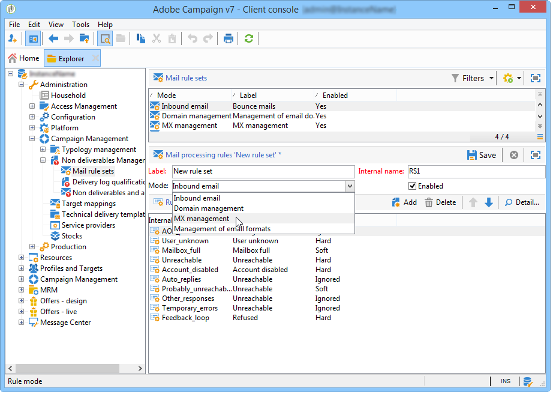
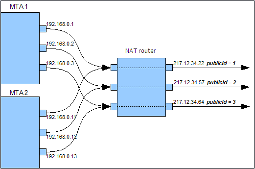

# Technische e-mailconfiguraties{#email-deliverability}

## Overzicht {#overview}

In het volgende gedeelte vindt u een overzicht van de configuratie die is vereist voor het beheren van de uitvoer van Adobe Campaign-instanties bij het verzenden van e-mails.

>[!NOTE]
>
>Sommige configuraties kunnen alleen door Adobe worden uitgevoerd voor implementaties die door Adobe worden gehost, bijvoorbeeld voor toegang tot de server- en instantieconfiguratiebestanden. Meer over de verschillende plaatsingen leren, verwijs naar de [Hosting modelsectie](../../installation/using/hosting-models.md) of naar [dit artikel](https://helpx.adobe.com/campaign/kb/acc-on-prem-vs-hosted.html).

Raadpleeg deze [sectie](../../delivery/using/about-deliverability.md)voor meer informatie over de concepten en beste praktijken met betrekking tot de leverbaarheid.

Alle technische aanbevelingen met betrekking tot het efficiënt verzenden en ontvangen van e-mails door een Adobe Campagneplatform zijn beschikbaar in deze [sectie](../../delivery/using/technical-recommendations.md).

## Exploitatiebeginsel {#operating-principle}

Het is mogelijk om de uitvoer van een of meer Adobe Campagne-instanties te beheren om het aantal verzonden e-mails te beperken, afhankelijk van een domein. Bijvoorbeeld, kunt u de output tot 20.000 per uur voor adressen **yahoo.com** beperken, terwijl het vormen van 100.000 berichten per uur voor alle andere domeinen.

De output van het bericht moet voor elk IP adres worden gecontroleerd dat door de leveringsservers (**mta**) wordt gebruikt. Verschillende **gegevens die** zijn opgesplitst op meerdere computers en die tot verschillende Adobe Campagne-instanties behoren, kunnen hetzelfde IP-adres delen voor het verzenden van e-mail: Er moet een proces worden ingesteld om het gebruik van deze IP-adressen te coördineren.

Dit is wat de **staatsmodule** doet: het door:sturen alle verbindingsverzoeken en berichten die naar de postservers voor een reeks IP adressen moeten worden verzonden. De statistiekserver houdt leveringen bij en kan verzending op basis van ingestelde quota in- of uitschakelen.


* De statistische server (**stat**) is gekoppeld aan een Adobe Campagnebasis om de configuratie ervan te laden.
* De leveringsservers (**mta**) gebruiken UDP om een statistiekserver te contacteren die niet altijd tot hun eigen instantie behoort.

### Leveringsservers {#delivery-servers}

De **mta** module verdeelt berichten aan zijn **mtachild** modules. Elk **mtachild** bereidt berichten voor alvorens om een vergunning van de statistiekserver te verzoeken, en hen te verzenden.

De stappen zijn als volgt:

1. De **mta** selecteert in aanmerking komende berichten en wijst hen een beschikbaar **kind** toe.
1. Het **onderliggende element** laadt alle informatie die nodig is voor het samenstellen van het bericht (inhoud, personalisatie-elementen, bijlagen, afbeeldingen, enz.) en stuurt het bericht door naar de **Email Traffic Shaper**.
1. Zodra de vormer van het e-mailverkeer de vergunning van de statistiekserver (**smtp stat**) ontvangt, wordt het bericht verzonden naar de ontvanger.


### Statistieken en beperkingen van e-mailservers {#email-server-statistics-and-limitations}

De statistische server onderhoudt de volgende statistieken voor elke e-mailserver die berichten ontvangt:

* Aantal open point-in-time verbindingen,
* Aantal verzonden berichten in het laatste uur,
* Snelheid van geslaagde/geweigerde verbindingen,
* Het tarief van verbindingen aan onbereikbare servers.

Tegelijkertijd laadt de module een lijst met beperkingen voor bepaalde e-mailservers:

* maximumaantal gelijktijdige aansluitingen,
* Maximum aantal berichten per uur,
* Maximum aantal berichten per verbinding.

### IP-adressen beheren {#managing-ip-addresses}

De statistiekserver kan verscheidene instanties of verscheidene machines met het zelfde openbare IP adres combineren. Het is daarom niet verbonden met een specifieke instantie, maar het moet een instantie contacteren om beperkingen per domein terug te krijgen.

De statistieken van de levering worden gehouden voor elke doel MX en voor elke bronIP. Als het doeldomein bijvoorbeeld 5 MX heeft en het platform 3 verschillende IP-adressen kan gebruiken, kan de server maximaal 15 reeksen indicatoren voor dit domein beheren.

Het bronIP adres past het openbare IP adres, d.w.z. het adres aan zoals het door de verre e-mailserver wordt gezien. Dit IP adres kan van het adres van de machine verschillend zijn die gastheren de **mta**, als een NATIONAAL router wordt verstrekt. Dit is waarom de statistiekserver een herkenningsteken gebruikt dat openbare IP (**publicId**) aanpast. De koppeling tussen het lokale adres en deze id wordt gedeclareerd in het configuratiebestand **serverConf.xml** . Alle parameters beschikbaar in **serverConf.xml** zijn vermeld in deze [sectie](../../installation/using/the-server-configuration-file.md).

## Uitvoercontrole van levering {#delivery-output-controlling}

Om berichten aan e-mailservers te leveren, vraagt de **component E-mail** van de Deel van het Verkeer een verbinding van de statistiekserver. Nadat het verzoek is geaccepteerd, wordt de verbinding geopend.

Voordat de berichten worden verzonden, vraagt de module &#39;tokens&#39; van de server. Dit zijn over het algemeen reeksen van minstens 10 tokens, die het aantal vragen aan de server verminderen.

De server slaat alle statistieken op met betrekking tot verbindingen en leveringen. In geval van opnieuw opstarten gaat de informatie tijdelijk verloren: elke cliënt bewaart een lokaal exemplaar van hun verzendende statistieken en keert hen aan de server op regelmatige basis (om de 2 minuten) terug. De server kan de gegevens vervolgens opnieuw samenvoegen.

In de volgende secties wordt de verwerking van een bericht door de component **Email Traffic Shaper** beschreven.

### Berichtlevering {#message-delivery}

Wanneer een bericht wordt verzonden, zijn er 3 mogelijke resultaten:

1. **Geslaagd**: het bericht is verzonden. Het bericht wordt bijgewerkt.
1. **Bericht mislukt**: de gecontacteerde server verwierp het bericht voor de gekozen ontvanger. Dit resultaat komt overeen met de retourcodes 550 tot en met 599, maar er kunnen uitzonderingen worden gedefinieerd.
1. **Sessie mislukt** (voor 5.11 naar boven): als de **mta** een antwoord voor dit bericht ontvangt, wordt het bericht verlaten (verwijs naar de [beëindiging](#message-abandonment)van het Bericht). Het bericht wordt verzonden naar een ander pad of ingesteld op In behandeling als er geen andere paden beschikbaar zijn (zie [Bericht in behandeling](#message-pending)).

   >[!NOTE]
   >
   >Een **pad** is een verbinding tussen de Adobe Campagne **Mta** en de doel **mta**. De Adobe Campagne **mta** kan van verscheidene beginIPs en verscheidene doeldomeinIPs kiezen.

### Berichten verlaten {#message-abandonment}

Verlaten berichten zijn teruggekeerd aan de **mta** en niet meer beheerd door **mtachild**.

De **gegevensbank** beslist over de procedure voor dit bericht (terugwinning, stopzetting, quarantaine, enz.) afhankelijk van de antwoordcode en de regels.

### Bericht in behandeling {#message-pending}

Een bericht wordt toegevoegd wanneer het in de actieve rij aankomt en er geen beschikbare wegen zijn.

Een pad wordt doorgaans als niet beschikbaar gemarkeerd voor een variabele hoeveelheid tijd na een verbindingsfout. De periode van onbeschikbaarheid is afhankelijk van de frequentie en leeftijd van fouten.

## Configuratie van de Statistieken-server {#statistics-server-configuration}

De statistische server kan door verscheidene instanties worden gebruikt: het moet onafhankelijk van de instanties worden gevormd die het zullen gebruiken.

Begin door het gegevensbestand van de Campagne van Adobe te bepalen dat de configuratie zal ontvangen.

### Configuratie starten {#start-configuration}

Standaard wordt de **Startmodule** voor elke instantie gestart. Wanneer de instanties op de zelfde machine worden mutualiseerd, of wanneer de instanties het zelfde IP adres delen, wordt één enkele statistiekenserver gebruikt: de andere moeten worden uitgeschakeld .

### Definitie van de serverpoort {#definition-of-the-server-port}

Door gebrek, luistert de statistiekserver op haven 7777. Deze poort kan worden gewijzigd in het bestand **serverConf.xml** . Alle parameters beschikbaar in **serverConf.xml** zijn vermeld in deze [sectie](../../installation/using/the-server-configuration-file.md).

```
<stat port="1234"/>
```

## MX-configuratie {#mx-configuration}

### Informatie over MX-regels {#about-mx-rules}

MX-regels (Mail eXchanger) zijn de regels die de communicatie tussen een verzendende server en een ontvangende server beheren.

>[!IMPORTANT]
>
>Voor ontvangen of hybride installaties, als u aan Verbeterde MTA hebt bevorderd, worden de regels van de **[!UICONTROL MX management]** leveringsproductie niet meer gebruikt. Verbeterde MTA gebruikt zijn eigen MX regels die het toestaan om uw productie door domein aan te passen die op uw eigen historische e-mailreputatie wordt gebaseerd, en op real time terugkoppelen die uit de domeinen komt waar u e-mails verzendt.
>
>Raadpleeg dit [document](https://helpx.adobe.com/campaign/kb/campaign-enhanced-mta.html)voor meer informatie over de verbeterde MTA voor Adobe-campagne.

Deze regels worden automatisch elke ochtend om 6AM (servertijd) opnieuw geladen om de cliëntinstantie regelmatig te leveren.

Afhankelijk van de materiaalcapaciteiten en het interne beleid, zal ISP een vooraf bepaald aantal verbindingen en berichten per uur goedkeuren. Deze variabelen kunnen automatisch door het ISP systeem afhankelijk van de reputatie van IP worden gewijzigd en domein verzenden. Via zijn leverbaarheidsplatform, beheert de Campagne van Adobe meer dan 150 specifieke regels door ISP, en, daarnaast, één generische regel voor andere domeinen.

Het maximumaantal verbindingen hangt niet uitsluitend van het aantal openbare IP adressen af die door MTA worden gebruikt.

Bijvoorbeeld, als u 5 verbindingen in de MX regels hebt toegestaan en u 2 openbare IPs hebt gevormd zou u kunnen denken dat u niet meer dan 10 verbindingen kunt hebben gelijktijdig die aan dit domein worden geopend. Dit is niet waar, in feite verwijst het maximumaantal verbindingen naar een weg en een weg die een combinatie van één van onze MTA openbare IPs en openbaar IP van MTA van de cliënt MTA is.

In het onderstaande voorbeeld heeft de gebruiker twee openbare IP-adressen geconfigureerd en is het domein yahoo.com.

```
user:~ user$ host -t mx yahoo.com
                yahoo.com mail is handled by 1 mta5.am0.yahoodns.net.
                yahoo.com mail is handled by 1 mta6.am0.yahoodns.net.
                yahoo.com mail is handled by 1 mta7.am0.yahoodns.net.
```

MX-records voor yahoo.com vertellen ons dat yahoo.com 3 Mail Exchangers heeft. Om de Peer Uitwisseling van de Post aan te sluiten, gaat MTA om het IP adres van IP van DNS verzoeken.

```
user:~ user$ host -t a mta5.am0.yahoodns.net
                mta5.am0.yahoodns.net has address 98.136.216.26
                mta5.am0.yahoodns.net has address 98.136.217.202
                mta5.am0.yahoodns.net has address 98.138.112.38
                mta5.am0.yahoodns.net has address 66.196.118.37
                mta5.am0.yahoodns.net has address 63.250.192.46
                mta5.am0.yahoodns.net has address 66.196.118.240
                mta5.am0.yahoodns.net has address 98.136.217.203
                mta5.am0.yahoodns.net has address 98.138.112.35
```

Voor deze record kan de gebruiker contact opnemen met 8 peer-IP-adressen. Aangezien hij 2 openbaar IP adres heeft geeft dit hem 8 * 2 = 16 combinaties om de yahoo.com postservers te bereiken. Elk van deze combinaties wordt een pad genoemd.

De tweede MX-record wordt weergegeven als:

```
user:~ user$ host -t a mta6.am0.yahoodns.net
                mta6.am0.yahoodns.net has address 98.138.112.38
                mta6.am0.yahoodns.net has address 98.136.216.26
                mta6.am0.yahoodns.net has address 63.250.192.46
                mta6.am0.yahoodns.net has address 66.196.118.35
                mta6.am0.yahoodns.net has address 98.136.217.203
                mta6.am0.yahoodns.net has address 98.138.112.32
                mta6.am0.yahoodns.net has address 98.138.112.37
                mta6.am0.yahoodns.net has address 66.196.118.33
```

4 van deze 8 IP-adressen worden al gebruikt in mta5 (98.136.216.26, 98.138.112.38, 63.250.192.46 en 98.136.217.203). Met deze record kan de gebruiker 4 nieuwe IP-adressen gebruiken. De derde MX-record doet hetzelfde.

In totaal, hebben wij 16 verre IP adressen. In combinatie met onze 2 lokale openbare IPs hebben wij 32 wegen om yahoo.com postservers te bereiken.

>[!NOTE]
>
>Als 2 MX- verslagen van verwijzingen voorzien het zelfde IP adres, zal dit tellen als één weg en niet twee.

Hieronder volgen enkele voorbeelden van het gebruik van MX-regels:


In het onderstaande voorbeeld heeft de gebruiker een limiet van 10.000 berichten per uur voor een bepaald domein, maar de MTA-productiecapaciteit is hoger dan deze limiet.

In dit geval, is het verkeer verdeeld in 12 periodes van 5 minuten voor elk uur, en de echte grens is 833 berichten per periode.

Deze berichten worden zo snel mogelijk verzonden.


### MX-beheer configureren {#configuring-mx-management}

De regels die voor MX moeten worden nageleefd, worden bepaald in het **[!UICONTROL MX management]** document van de **[!UICONTROL Administration > Campaign Management > Non deliverables Management > Mail rule sets]** knoop van de boom.

Als het **[!UICONTROL MX management]** document niet bestaat in het knooppunt, kunt u het handmatig maken. Dit doet u als volgt:

1. Maak een nieuwe set regels voor e-mail.
1. Kies de **[!UICONTROL MX management]** modus.

   

1. Voer **defaultMXRules** in het **[!UICONTROL Internal name]** veld in.

Als u rekening wilt houden met wijzigingen, moet u de statistische server opnieuw starten.

Om de configuratie opnieuw te laden zonder de statistiekenserver opnieuw te beginnen, gebruik het volgende bevel op de machine die gastheren de server: `nlserver stat -reload`

>[!NOTE]
>
>Deze opdrachtregel heeft de voorkeur boven **opnieuw opstarten** van de server. Het voorkomt dat statistische gegevens die zijn verzameld voordat het opnieuw opstarten verloren gaat en voorkomt pieken in gebruik die in strijd kunnen zijn met de in de MX-regels vastgestelde quota.

### MX-regels configureren {#configuring-mx-rules}

In het **[!UICONTROL MX management]** document worden alle domeinen weergegeven die aan een MX-regel zijn gekoppeld.

Deze regels worden achtereenvolgens toegepast: de eerste regel wordt toegepast waarvan MX-masker compatibel is met de beoogde MX.

De volgende parameters beschikbaar voor elke regel zijn:

* **[!UICONTROL MX mask]**: domein waarop de regel wordt toegepast. Elke regel bepaalt een adresmasker voor MX. Elke MX waarvan de naam overeenkomt met dit masker is daarom in aanmerking. Het masker kan &quot;*&quot; en &quot;?&quot; bevatten algemene tekens.

   De volgende adressen zijn bijvoorbeeld:

   * a.mx.yahoo.com
   * b.mx.yahoo.com
   * c.mx.yahoo.com
   zijn compatibel met de volgende maskers:

   * *.yahoo.com
   * ?.mx.yahoo.com
   Voor het e-mailadres foobar@gmail.com is het domein bijvoorbeeld gmail.com en de MX-record is:

   ```
   gmail.com mail exchanger = 20 alt2.gmail-smtp-in.l.google.com.
   gmail.com mail exchanger = 10 alt1.gmail-smtp-in.l.google.com.
   gmail.com mail exchanger = 40 alt4.gmail-smtp-in.l.google.com.
   gmail.com mail exchanger = 5  gmail-smtp-in.l.google.com.
   gmail.com mail exchanger = 30 alt3.gmail-smtp-in.l.google.com.
   ```

   In dit geval wordt de MX-regel `*.google.com` gebruikt. Zoals u kunt zien, past het MX-regelmasker niet noodzakelijk het domein in de e-mail aan. De MX-regels die zijn toegepast op e-mailadressen van gmail.com, zijn de regels met het masker `*.google.com`.

* **[!UICONTROL Range of identifiers]**: Met deze optie kunt u de bereiken van id&#39;s (publicID) aangeven waarop de regel van toepassing is. U kunt het volgende opgeven:

   * Een getal: de regel geldt alleen voor deze publicId;
   * Een reeks getallen (**getal1-getal2**): de regel zal op alle publicIds tussen deze twee aantallen van toepassing zijn.
   >[!NOTE]
   >
   >Als het veld leeg is, geldt de regel voor alle id&#39;s.

   Een openbare identiteitskaart is een intern herkenningsteken van Openbare IP die door één of verscheidene MTAs wordt gebruikt. Deze id&#39;s worden gedefinieerd in de MTA-servers in het bestand **config-instance.xml** .

   

* **[!UICONTROL Shared]**: bepaalt het werkingsgebied van de eigenschappen voor deze MX regel. Wanneer gecontroleerd, worden alle parameters gedeeld op alle IPs beschikbaar op de instantie. Als deze optie uitgeschakeld is, worden de MX-regels voor elk IP gedefinieerd. Het maximumaantal berichten wordt vermenigvuldigd met het aantal beschikbare IPs.
* **[!UICONTROL Maximum number of connections]**: maximumaantal gelijktijdige verbindingen aan het domein van de afzender.
* **[!UICONTROL Maximum number of messages]**: maximum aantal berichten dat op een verbinding kan worden verzonden. Wanneer de berichten dit aantal overschrijden, wordt de verbinding gesloten en nieuw geopend.
* **[!UICONTROL Messages per hour]**: maximumaantal berichten dat in één uur naar het domein van de afzender kan worden verzonden.
* **[!UICONTROL Connection time out]**: tijddrempel voor verbinding maken met een domein.

   >[!NOTE]
   >
   >Windows kan vóór deze drempelwaarde een **time-out** geven, afhankelijk van uw versie van Windows.

* **[!UICONTROL Timeout Data]**: maximumaantal wachttijd na het verzenden van berichtinhoud (sectie DATA van het SMTP-protocol).
* **[!UICONTROL Timeout]**: maximum wachttijd voor andere uitwisselingen met de server SMTP.
* **[!UICONTROL TLS]**: Het TLS-protocol, waarmee u e-mailleveringen kunt coderen, kan selectief worden ingeschakeld. Voor elk MX-masker zijn de volgende opties beschikbaar:

   * **[!UICONTROL Default configuration]**: Dit is de algemene configuratie die is opgegeven in het configuratiebestand serverConf.xml dat wordt toegepast.

      >[!CAUTION]
      >
      >Het wordt niet aanbevolen de standaardconfiguratie te wijzigen.

   * **[!UICONTROL Disabled]** : De berichten worden systematisch zonder encryptie verzonden.
   * **[!UICONTROL Opportunistic]** : De levering van berichten wordt gecodeerd als de ontvangende server (SMTP) het TLS-protocol kan genereren.

Voorbeeld van configuratie:


### E-mailindelingen beheren {#managing-email-formats}

U kunt de indeling van verzonden berichten definiëren, zodat de weergegeven inhoud automatisch wordt aangepast aan het domein van het adres van elke ontvanger.

Hiervoor gaat u naar het **[!UICONTROL Management of email formats]** document in **[!UICONTROL Administration]** > **[!UICONTROL Campaign management]** > **[!UICONTROL Non deliverables management]** > **[!UICONTROL Mail rule sets]**.

Dit document bevat een lijst met alle vooraf gedefinieerde domeinen die overeenkomen met de Japanse indelingen die worden beheerd door Adobe Campaign. Raadpleeg [dit document](../../delivery/using/defining-the-email-content.md#sending-emails-on-japanese-mobiles)voor meer informatie.


Met de **MIME-parameter structure** (Multipurpose Internet Mail Extensions) kunt u de berichtstructuur definiëren die naar de verschillende e-mailclients wordt verzonden. Er zijn drie opties beschikbaar:

* **Multipart**: Het bericht wordt verzonden in tekst of formaat HTML. Als de HTML-indeling niet wordt geaccepteerd, kan het bericht nog steeds in tekstopmaak worden weergegeven.

   Standaard is de multipart-structuur **multipart/alternatief**, maar deze wordt automatisch **multipart/related** wanneer een afbeelding aan het bericht wordt toegevoegd. Bepaalde providers verwachten standaard de indeling voor **meerdelige/verwante** bestanden. Deze **[!UICONTROL Force multipart/related]** optie stelt deze indeling ook in als er geen afbeelding is gekoppeld.

* **HTML**: Er wordt alleen een HTML-bericht verzonden. Als de HTML-indeling niet wordt geaccepteerd, wordt het bericht niet weergegeven.
* **Tekst**: Er wordt een bericht in alleen-tekstopmaak verzonden. Het voordeel van tekstformaatberichten is hun zeer kleine grootte.

Als de **[!UICONTROL Image inclusion]** optie is ingeschakeld, worden deze rechtstreeks in de tekst van de e-mail weergegeven. De afbeeldingen worden vervolgens geüpload en de URL-koppelingen worden vervangen door de inhoud ervan.

Deze optie wordt vooral gebruikt door de Japanse markt voor **Deco-mail**, **Decore Mail** of **Decoration Mail**. Raadpleeg [dit document](../../delivery/using/defining-the-email-content.md#sending-emails-on-japanese-mobiles)voor meer informatie.

>[!CAUTION]
>
>Als u afbeeldingen in een e-mail invoegt, neemt de grootte aanzienlijk toe.

## Configuratie van de leveringsserver {#delivery-server-configuration}

### Synchronisatie vergrendelen {#clock-synchronization}

De klokken van alle servers die het Adobe Campagne-platform (inclusief de database) vormen, moeten worden gesynchroniseerd en hun systemen moeten in dezelfde tijdzone worden ingesteld.

### Coördinaten van de statistiekserver {#coordinates-of-the-statistics-server}

Het adres van de statistische server moet in de **mta** worden verstrekt.

Het **statServerAddress** bezit van het **mta** element van de configuratie laat u het adres en het aantal van de te gebruiken haven specificeren.

```
<mta statServerAddress="emailStatServer:7777">
   [...]
 </mta>
```

Als u de statistische server op dezelfde computer wilt gebruiken, moet u ten minste de naam van de computer met de **localhost** -waarde invoeren:

```
 <mta statServerAddress="localhost">
```

>[!CAUTION]
>
>Als dit veld niet wordt gevuld, wordt de **mta** niet gestart.

### Lijst met IP-adressen die moeten worden gebruikt {#list-of-ip-addresses-to-use}

De configuratie betreffende verkeersbeheer wordt gevestigd in het **mta/kind/smtp** element van het configuratiedossier.

Voor elk **element IPAffinity** , moet u de IP adressen verklaren die voor de machine kunnen worden gebruikt.

Voorbeeld:

```
<IPAffinity localDomain="<domain>" name="default">
  <IP address="192.168.0.11" publicId="1" weight="5"/>
  <IP address="192.168.0.12" heloHost="revdns1.campaign.com" publicId="2" weight="5"/>
  <IP address="192.168.0.13" publicId="3" weight="1"/>
</IPAffinity>
```

De parameters zijn als volgt:

* **adres**: dit is het IP adres van de MTA gastheermachine die moet worden gebruikt.
* **heloHost**: dit herkenningsteken vertegenwoordigt het IP adres aangezien het door de server SMTP zal worden gezien.

* **publicId**: deze informatie is nuttig wanneer een IP adres door verscheidene **mtas** van de Campagne van Adobe achter een NATIONAAL router wordt gedeeld. De statistiekserver gebruikt deze id om verbinding te onthouden en statistieken tussen dit uitgangspunt en de doelserver te verzenden.
* **gewicht**: Hiermee kunt u de relatieve gebruiksfrequentie van het adres definiëren. Standaard hebben alle adressen een dikte gelijk aan 1.

>[!NOTE]
>
>In het serverConf.xml- dossier, moet u verifiëren dat één IP aan één enkele helohost met een uniek herkenningsteken (public_id) beantwoordt. Het kan niet aan veelvoudige helohosts worden in kaart gebracht, wat in leveringsvertragende kwesties zou kunnen resulteren.

In het vorige voorbeeld, met normale voorwaarden, zullen de adressen als volgt worden verdeeld:

    * &quot;1&quot;: 5 / (5+5+1) = 45%
    * &quot;2&quot;: 5 / (5+5+1) = 45%
    * &quot;3&quot;: 1 / (5+5+1) = 10%

Als, bijvoorbeeld, het eerste adres niet voor een bepaalde MX kan worden gebruikt, zullen de berichten als volgt worden verzonden:

    * &quot;2&quot;: 5 / (5+1) = 83%
    * &quot;3&quot;: 1 / (5+1) = 17%

* **includeDomains**: Hiermee kunt u dit IP-adres reserveren voor e-mailberichten die tot een bepaald domein behoren. Dit is een lijst met maskers die een of meer jokertekens (&#39;*&#39;) kunnen bevatten. Als het attribuut niet wordt gespecificeerd, kunnen alle domeinen dit IP adres gebruiken.

   Voorbeeld: **includeDomains=&quot;wanadoo.com,orange.com,yahoo.*&quot;**

* **excludeDomains**: sluit een lijst van domeinen voor dit IP adres uit. Dit filter wordt toegepast na het **filter includeDomains** .

   

## Optimalisatie van e-mailverzending {#email-sending-optimization}

De interne architectuur van de Adobe Campaign- **database** heeft een invloed op de configuratie voor het optimaliseren van de e-maillevering. Hier volgen enkele tips voor het verbeteren van uw leveringen.

### De parameter maxWaitingMessages aanpassen {#adjust-the-maxwaitingmessages-parameter}

De **parameter maxWaitingMessages** geeft het hoogste aantal berichten aan die vooraf door het **mtachild** worden voorbereid. Berichten worden pas uit deze lijst verwijderd nadat ze zijn verzonden of verlaten.

Deze parameter is zeer belangrijk en vooral kritiek als de berichten niet door domein worden gesorteerd.

Zodra de drempel **maxWorkingSetMb** (256) wordt bereikt, houdt de leveringsserver op verzendend berichten. De prestaties zullen beduidend dalen tot **mtachild** opnieuw begint. Om deze kwestie te negeren, kunt u of de drempel van de parameter **maxWorkingSetMb** verhogen, of de drempel van de parameter **maxWaitingMessages** verminderen.

De **parameter maxWorkingSetMb** wordt berekend empirisch door het maximumaantal berichten met de gemiddelde berichtgrootte te vermenigvuldigen en het resultaat met 2.5 te vermenigvuldigen. Bijvoorbeeld, als een bericht een gemiddelde grootte van 50 kB heeft en de **parameter maxWaitingMessages** 1.000 evenaart, zal het gebruikte geheugen gemiddeld 125 MB.

### Het aantal onderliggende items aanpassen {#adjust-the-number-of-mtachild}

Het aantal kinderen mag niet groter zijn dan het aantal processoren in de machine (ongeveer 1000 sessies). We raden u aan niet meer dan 8 **kinderen** te gebruiken. U kunt het aantal berichten per **kind** (**maxMsgPerChild**) dan verhogen om voldoende levensduur-spanwijdte te bereiken.
