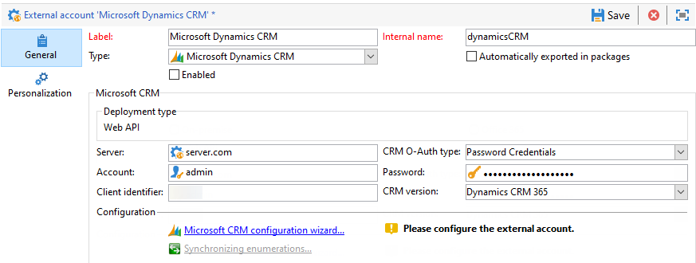
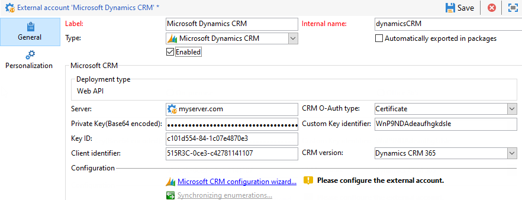

# Externe accounts{#external-accounts}

Adobe Campaign wordt geleverd met een set vooraf gedefinieerde externe accounts. Als u verbindingen met externe systemen wilt instellen, kunt u nieuwe externe accounts maken.

Externe accounts worden gebruikt door technische processen, zoals technische workflows of workflows voor campagnes. Wanneer u een bestandsoverdracht instelt in een workflow of een data-uitwisseling met een andere applicatie (Adobe Target, Experience Manager, enz.), moet u een extern account selecteren.

U kunt de volgende typen externe accounts instellen:

* [Externe account routeren](#routing-external-account)
* [Externe FTP-account](#ftp-external-account)
* [Externe externe database-account](#external-database-external-account)
* [Externe account voor webanalyse](#web-analytics-external-account)
* [Externe account voor Facebook connect](#facebook-connect-external-account)
* [Uitvoerinstantie externe account](#execution-instance-external-account)
* [Externe Adobe Experience Cloud-account](#adobe-experience-cloud-external-account)
* [Extern SFTP-account](#sftp-external-account)
* [Extern Adobe Experience Manager-account](#adobe-experience-manager-external-account)
* [Amazon Simple Storage Service (S3) externe account](#amazon-simple-storage-service--s3--external-account)
* [Externe account voor Microsoft Dynamics CRM](#microsoft-dynamics-crm-external-account)
* [Oracle op verzoek externe rekening](#oracle-on-demand-external-account)
* [Externe rekening Salesforce CRM](#salesforce-crm-external-account)

## Een extern account maken {#creating-an-external-account}

Voer de onderstaande stappen uit om een nieuwe externe account te maken. Gedetailleerde instellingen zijn afhankelijk van het type externe account.

1. Selecteer in Campagne **[!UICONTROL Explorer]** de optie **[!UICONTROL Administration]** &#39;>&#39; **[!UICONTROL Platform]** &#39;>&#39; **[!UICONTROL External accounts]**.

   

1. Klik op de knop **[!UICONTROL New]**.

   

1. Enter a **[!UICONTROL Label]** and an **[!UICONTROL Internal Name]**.
1. Selecteer de externe account **[!UICONTROL Type]** die u wilt maken.
1. Configureer de toegang tot de account door referenties op te geven, afhankelijk van het gekozen type externe account.

   De benodigde informatie wordt meestal verstrekt door de provider van de server waarmee u verbinding maakt.

1. Schakel de **[!UICONTROL Enabled]** optie in om de verbinding te activeren.
1. Klik op **[!UICONTROL Save]**.

De externe account wordt gemaakt en toegevoegd aan de lijst met externe accounts.

## Externe account voor stuiterende berichten {#bounce-mails-external-account}

Met de externe account **Bounce mails** wordt de externe POP3-account opgegeven die moet worden gebruikt om verbinding te maken met de e-mailservice. For more on this external account, refer to this [page](../../workflow/using/inbound-emails.md).

Alle servers die voor POP3 toegang worden gevormd kunnen worden gebruikt om terugkeerpost te ontvangen.


De **[!UICONTROL Bounce mails (defaultPopAccount)]** externe account configureren:

* **[!UICONTROL Server]**

   URL van de POP3-server.

* **[!UICONTROL Port]**

   POP3-poortnummer van verbinding. De standaardpoort is 110.

* **[!UICONTROL Account]**

   Naam van de gebruiker.

* **[!UICONTROL Password]**

   Wachtwoord voor gebruikersaccount.

* **[!UICONTROL Encryption]**

   Type van gekozen encryptie tussen **[!UICONTROL By default]**, **[!UICONTROL POP3 + STARTTLS]**, **[!UICONTROL POP3]** of **[!UICONTROL POP3S]**.

## Externe account routeren {#routing-external-account}

Met de **[!UICONTROL Routing]** externe account kunt u elk kanaal configureren dat beschikbaar is in Adobe Campaign, afhankelijk van de geïnstalleerde pakketten.


De volgende kanalen kunnen worden gevormd:

* [E-mail](../../installation/using/deploying-an-instance.md#email-channel-parameters)
* [Mobile (SMS)](../../delivery/using/sms-channel.md#creating-an-smpp-external-account)
* [Telefoon](../../delivery/using/steps-about-delivery-creation-steps.md#other-channels)
* [Direct mail](../../delivery/using/about-direct-mail-channel.md)
* [Bureau](../../delivery/using/steps-about-delivery-creation-steps.md#other-channels)
* [Facebook](../../social/using/publishing-on-facebook-walls.md#delegating-write-access-to-adobe-campaign)
* [Twitter](../../social/using/configuring-publishing-on-twitter.md)
* [iOS-kanaal](../../delivery/using/configuring-the-mobile-application.md)
* [Android-kanaal](../../delivery/using/configuring-the-mobile-application-android.md)

## Externe FTP-account {#ftp-external-account}

Met de externe FTP-account kunt u toegang tot een server buiten Adobe Campaign configureren en testen. Als u verbindingen wilt instellen met externe systemen, zoals FTP-servers 898 die worden gebruikt voor bestandsoverdracht, kunt u uw eigen externe accounts maken. Raadpleeg [deze pagina](../../workflow/using/file-transfer.md) voor meer informatie.

Hiertoe geeft u in deze externe account het adres en de referenties op waarmee de verbinding met de FTP-server tot stand wordt gebracht


* **[!UICONTROL Server]**

   Naam van de FTP-server.

* **[!UICONTROL Port]**

   FTP-poortnummer. De standaardpoort is 21.

* **[!UICONTROL Account]**

   Naam van de gebruiker.

* **[!UICONTROL Password]**

   Wachtwoord voor gebruikersaccount.

* **[!UICONTROL Encryption]**

   Type gekozen encryptie tussen **[!UICONTROL None]** of **[!UICONTROL SSL]**.

Op deze [pagina](https://help.dreamhost.com/hc/en-us/articles/115000675027-FTP-overview-and-credentials)vindt u de locatie van deze referenties.

## Externe externe database-account {#external-database-external-account}

Gebruik het **externe databasetype** externe account om verbinding te maken met een externe database. Meer informatie over de FDA-optie (Federated Data Access) vindt u in [deze sectie](../../installation/using/about-fda.md).

Externe databases die compatibel zijn met Campagne, worden vermeld in de [compatibiliteitsmatrix](../../rn/using/compatibility-matrix.md)


De instellingen voor externe accountconfiguratie zijn afhankelijk van de database-engine. Meer informatie vindt u in de volgende secties:

* Toegang tot [Azure synapse configureren](../../installation/using/configure-fda-synapse.md)
* Toegang tot [Hadoop configureren](../../installation/using/configure-fda-hadoop.md)
* Toegang tot [Oracle configureren](../../installation/using/configure-fda-oracle.md)
* Toegang tot [Netezza configureren](../../installation/using/configure-fda-netezza.md)
* Toegang tot [SAP HANA configureren](../../installation/using/configure-fda-sap-hana.md)
* Toegang tot [Snowflake configureren](../../installation/using/configure-fda-snowflake.md)
* Toegang tot [Sybase IQ configureren](../../installation/using/configure-fda-sybase.md)
* Toegang tot [Teradata configureren](../../installation/using/configure-fda-teradata.md)

## Externe account voor webanalyse {#web-analytics-external-account}

Met de **[!UICONTROL Web Analytics (Adobe Analytics - Data connector)]** externe account kunt u gegevens van Adobe Analytics naar Adobe Campaign doorsturen in de vorm van segmenten. Omgekeerd verzendt het programma indicatoren en kenmerken van e-mailcampagnes die door Adobe Campaign worden geleverd aan Adobe Analytics - Gegevensconnector.


Voor deze externe account moet de berekeningsformule voor bijgehouden URL&#39;s worden verrijkt en moet de verbinding tussen de twee oplossingen worden goedgekeurd. Raadpleeg [deze pagina](../../platform/using/adobe-analytics-data-connector.md#step-2--create-the-external-account-in-campaign) voor meer informatie.

## Externe account voor Facebook connect {#facebook-connect-external-account}

Met de **[!UICONTROL Facebook Connect]** externe account kunt u persoonlijke inhoud weergeven in uw Facebook-toepassingen, waardoor het eenvoudiger wordt om vooruitzichten te krijgen via dit sociale netwerk.

Voor elke Facebook-toepassing moet u een **[!UICONTROL Facebook Connect]** type extern account maken. For more on this, refer to [page](../../social/using/creating-a-facebook-application.md#configuring-external-accounts).


* **[!UICONTROL Hosting mode]**

   De hostingmodus van de toepassing tussen **[!UICONTROL hosted by a partner]** of **[!UICONTROL hosted by this instance]**.

* **[!UICONTROL Application ID]**

   Toepassings-id van uw Facebook-toepassing.

* **[!UICONTROL Application secret]**

   App-geheim van uw Facebook-toepassing.

Als u de host kiest in deze instantiemodus, moet de URL van het beveiligde canvas worden geplakt in het veld **Facebook-webgames (https)** op Facebook

Op deze [pagina](https://developers.facebook.com/docs/facebook-login/access-tokens)vindt u de locatie van deze referenties.

## Uitvoerinstantie externe account {#execution-instance-external-account}

Als u een opgesplitste architectuur hebt, moet u de uitvoeringsinstanties specificeren verbonden aan de controleinstantie en hen verbinden. Transactieberichtsjablonen worden geïmplementeerd in de uitvoeringsinstantie


* **[!UICONTROL URL]**

   URL van de server waarop de uitvoeringsinstantie is geïnstalleerd.

* **[!UICONTROL Account]**

   Naam van de rekening, moet het de Agent van het Centrum van het Bericht aanpassen zoals die in de exploitantomslag wordt bepaald.

* **[!UICONTROL Password]**

   Wachtwoord van de account zoals gedefinieerd in de map met operatoren.

For more information on this configuration, refer to this [page](../../message-center/using/creating-a-shared-connection.md#control-instance).

## Adobe Experience Cloud external account {#adobe-experience-cloud-external-account}

Als u verbinding wilt maken met de Adobe Campaign-console via een Adobe ID, moet u de **[!UICONTROL Adobe Experience Cloud (MAC)]** externe account configureren.


* **[!UICONTROL IMS server]**

   URL van uw IMS-server. Zorg ervoor zowel stadium als de productie instanties aan het zelfde IMS productieeindpunt richten.

* **[!UICONTROL IMS scope]**

   De hier gedefinieerde bereiken moeten een subset zijn van de gebieden die door IMS zijn ingericht.

* **[!UICONTROL IMS client identifier]**

   ID van uw IMS-client.

* **[!UICONTROL IMS client secret]**

   Credentials van het geheim van de IMS-client.

* **[!UICONTROL Callback server]**

   Toegang tot URL van je Adobe Campaign-instantie.

* **[!UICONTROL IMS organization ID]**

   ID van uw IMS-organisatie. Raadpleeg deze [pagina](https://docs.adobe.com/content/help/en/core-services/interface/manage-users-and-products/faq.html) om uw organisatie-id te zoeken (**Waar vind ik mijn IMS-organisatie-id?**).

* **[!UICONTROL Association mask]**

   Syntaxis waarmee configuratienamen in Enterprise-dashboard kunnen worden gesynchroniseerd met de groepen in Adobe Campaign.

* **[!UICONTROL Server]**

   URL van je Adobe Experience Cloud-exemplaar.

* **[!UICONTROL Tenant]**

   Naam van je Adobe Experience Cloud Tenant.

For more information on this configuration, refer to this [page](../../integrations/using/configuring-ims.md).

## Extern SFTP-account {#sftp-external-account}

Met de externe SFTP-account kunt u toegang tot een server buiten Adobe Campaign configureren en testen. Als u verbindingen wilt instellen met externe systemen, zoals SFTP, die worden gebruikt voor bestandsoverdracht, kunt u uw eigen externe accounts maken. Raadpleeg [deze pagina](../../workflow/using/file-transfer.md) voor meer informatie.


* **[!UICONTROL Server]**

   URL van de SFTP-server.

* **[!UICONTROL Port]**

   FTP-poortnummer. De standaardpoort is 22.

* **[!UICONTROL Account]**

   Accountnaam gebruikt om verbinding te maken met de SFTP-server.

* **[!UICONTROL Password]**

   Wachtwoord gebruikt om verbinding te maken met de SFTP-server.

## Extern Adobe Experience Manager-account {#adobe-experience-manager-external-account}

Met het **[!UICONTROL AEM (AEM instance)]** externe account kunt u de inhoud van uw e-mailleveringen en uw formulieren rechtstreeks in Adobe Experience Manager beheren.


* **[!UICONTROL Server]**

   URL van de Adobe Experience Manager-server.

* **[!UICONTROL Port]**

   Accountnaam gebruikt om verbinding te maken met de Adobe Experience Manager-ontwerpinstantie.

* **[!UICONTROL Password]**

   Wachtwoord waarmee verbinding wordt gemaakt met de Adobe Experience Manager-ontwerpinstantie.

Raadpleeg deze [sectie](../../integrations/using/about-adobe-experience-manager.md) voor meer informatie.

## Amazon Simple Storage Service (S3) externe account {#amazon-simple-storage-service--s3--external-account}

De Amazon Simple Storage Service (S3)-connector kan worden gebruikt voor het importeren of exporteren van gegevens naar Adobe Campaign. Deze kan worden ingesteld in een workflowactiviteit. Raadpleeg [deze pagina](../../workflow/using/file-transfer.md) voor meer informatie.


Wanneer u dit nieuwe externe account instelt, moet u de volgende data opgeven:

* **[!UICONTROL AWS S3 Account Server]**

   URL van uw server, zou het als volgt moeten worden gevuld:

   ```
   <S3bucket name>.s3.amazonaws.com/<s3object path>
   ```

* **[!UICONTROL AWS access key ID]**

   Raadpleeg deze [pagina](https://docs.aws.amazon.com/general/latest/gr/aws-sec-cred-types.html#access-keys-and-secret-access-keys) om te weten waar u uw AWS-toegangstoets-id kunt vinden.

* **[!UICONTROL Secret access key to AWS]**

   Raadpleeg deze [pagina](https://aws.amazon.com/fr/blogs/security/wheres-my-secret-access-key/)om te weten waar u uw geheime toegangssleutel voor AWS vindt.

* **[!UICONTROL AWS Region]**

   Raadpleeg deze [pagina](https://aws.amazon.com/about-aws/global-infrastructure/regions_az/)voor meer informatie over het AWS-gebied.

* Met het **[!UICONTROL Use server side encryption]** selectievakje kunt u het bestand opslaan in de modus S3.

Leer waar te om toegangs zeer belangrijke identiteitskaart en geheime toegangssleutel te vinden, verwijs naar de [documentatie](https://docs.aws.amazon.com/general/latest/gr/aws-sec-cred-types.html#access-keys-and-secret-access-keys) van de Diensten van het Web van Amazon.

## Externe account voor Microsoft Dynamics CRM {#microsoft-dynamics-crm-external-account}

Met de **[!UICONTROL Microsoft Dynamics CRM]** externe account kunt u Microsoft Dynamics-gegevens importeren en exporteren naar Adobe Campaign.

De configuratie voor de schakelaar van de Dynamiek van Microsoft om met Adobe Campaign te werken hangt van uw plaatsingstype af.
Met **[!UICONTROL On-premise]** en **[!UICONTROL Office 365]** plaatsingstypes, moet u de volgende details verstrekken:


* **[!UICONTROL Account]**

   Account gebruikt om u aan te melden bij Microsoft CRM.

* **[!UICONTROL Server]**

   URL van uw Microsoft CRM-server.

* **[!UICONTROL Password]**

   Wachtwoord gebruikt om binnen aan Microsoft CRM te ondertekenen.

* **[!UICONTROL Company name]** voor on-premise en de plaatsing van Office 365

   Naam van uw bedrijf.

* **[!UICONTROL Organization name]** voor on-premise implementatie

   Naam van uw organisatie.
De naam van de organisatie die in het dashboard van de Middelen van Ontwikkelaars op de Dynamica van Microsoft, **[!UICONTROL Unique Name]** gebied kan worden gevonden.

* **[!UICONTROL CRM version]** voor on-premise

   Versie van de CRM tussen **[!UICONTROL Dynamics CRM 2007]**, **[!UICONTROL Dynamics CRM 2015]** of **[!UICONTROL Dynamics CRM 2016]**.

Met **[!UICONTROL Web API]** plaatsingstype en **[!UICONTROL Password credentials]** authentificatie, moet u de volgende details verstrekken:



* **[!UICONTROL Account]**

   Account gebruikt om u aan te melden bij Microsoft CRM.

* **[!UICONTROL Server]**

   URL van uw Microsoft CRM-server.

* **[!UICONTROL Client identifier]**

   Client-id die u kunt vinden op de Microsoft Azure-beheerportal in de **[!UICONTROL Update your code]** categorie en het **[!UICONTROL Client ID]** veld.

* **[!UICONTROL CRM version]**

   Versie van de CRM tussen **[!UICONTROL Dynamics CRM 2007]**, **[!UICONTROL Dynamics CRM 2015]** of **[!UICONTROL Dynamics CRM 2016]**.

Met **[!UICONTROL Web API]** plaatsingstype en **[!UICONTROL Certificate]** authentificatie, moet u de volgende details verstrekken:



* **[!UICONTROL Server]**

   URL van uw Microsoft CRM-server.

* **[!UICONTROL Private Key (Base64 encoded)]**

   Persoonlijke sleutel die aan Base64 wordt gecodeerd

* **[!UICONTROL Custom Key identifier]**

* **[!UICONTROL Key ID]**

* **[!UICONTROL Client identifier]**

   Client-id die u kunt vinden op de Microsoft Azure-beheerportal in de **[!UICONTROL Update your code]** categorie en het **[!UICONTROL Client ID]** veld.

* **[!UICONTROL CRM version]**

   Versie van de CRM tussen **[!UICONTROL Dynamics CRM 2007]**, **[!UICONTROL Dynamics CRM 2015]** of **[!UICONTROL Dynamics CRM 2016]**.

For more information on this configuration, refer to this [page](../../platform/using/crm-connectors.md#example-for-microsoft-dynamics).

## Oracle op verzoek externe rekening {#oracle-on-demand-external-account}

Met de **[!UICONTROL Oracle on demand]** externe account kunt u Oracle-gegevens importeren en exporteren naar Adobe Campaign.


Als u de externe Oracle-account op aanvraag wilt configureren voor gebruik met Adobe Campaign, moet u de volgende gegevens opgeven:

* **[!UICONTROL Account]**

   Account gebruikt om u aan te melden bij Oracle CRM op aanvraag.

* **[!UICONTROL Server]**

   URL van uw Oracle CRM op aanvraag-server.

* **[!UICONTROL Password]**

   Wachtwoord gebruikt om u aan te melden bij Oracle CRM op aanvraag.

For more information on this configuration, refer to this [page](../../platform/using/crm-connectors.md#example-for-oracle-on-demand).

## Externe rekening Salesforce CRM {#salesforce-crm-external-account}

Met de **[!UICONTROL Salesforce CRM]** externe account kunt u Salesforce-gegevens importeren en exporteren naar Adobe Campaign.


Om de externe rekening van Salesforce CRM te vormen om met Adobe Campaign te werken, moet u de volgende details verstrekken:

* **[!UICONTROL Account]**

   Account gebruikt om u aan te melden bij Salesforce CRM.

* **[!UICONTROL Password]**

   Wachtwoord gebruikt om u aan te melden bij Salesforce CRM.

* **[!UICONTROL Client identifier]**

   Raadpleeg deze [pagina](https://help.salesforce.com/articleView?id=000205876&amp;type=1)om te weten waar u uw client-id kunt vinden.

* **[!UICONTROL Security token]**

   Als u wilt weten waar u uw beveiligingstoken vindt, raadpleegt u deze [pagina](https://help.salesforce.com/articleView?id=000205876&amp;type=1).

* **[!UICONTROL API version]**

   Versie van de API tussen **[!UICONTROL Version 37]**, **[!UICONTROL Version 21]** of **[!UICONTROL Version 15]**.

Voor deze externe rekening, moet u u Salesforce CRM met de configuratietovenaar vormen.

For more information on this configuration, refer to this [page](../../platform/using/crm-connectors.md#example-for-salesforce-com).
