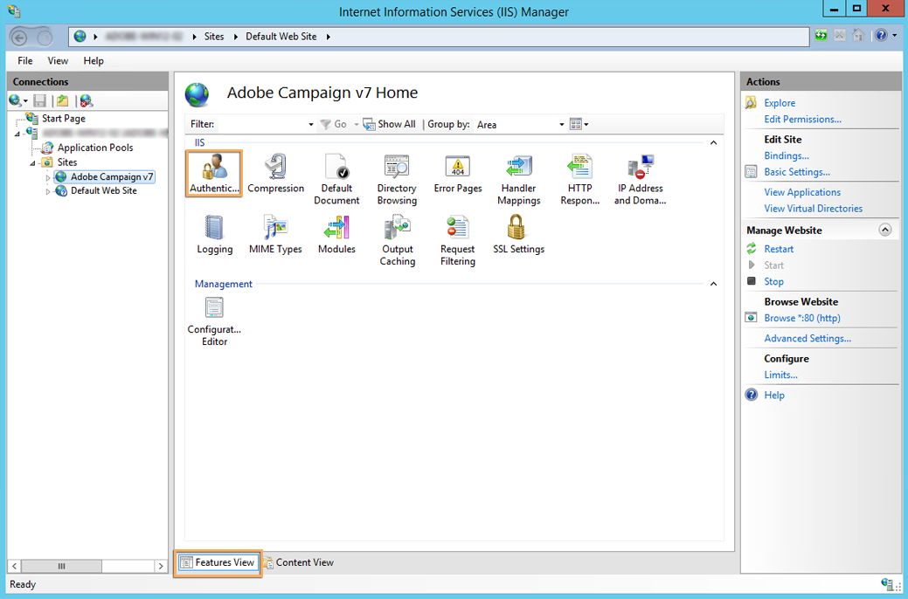
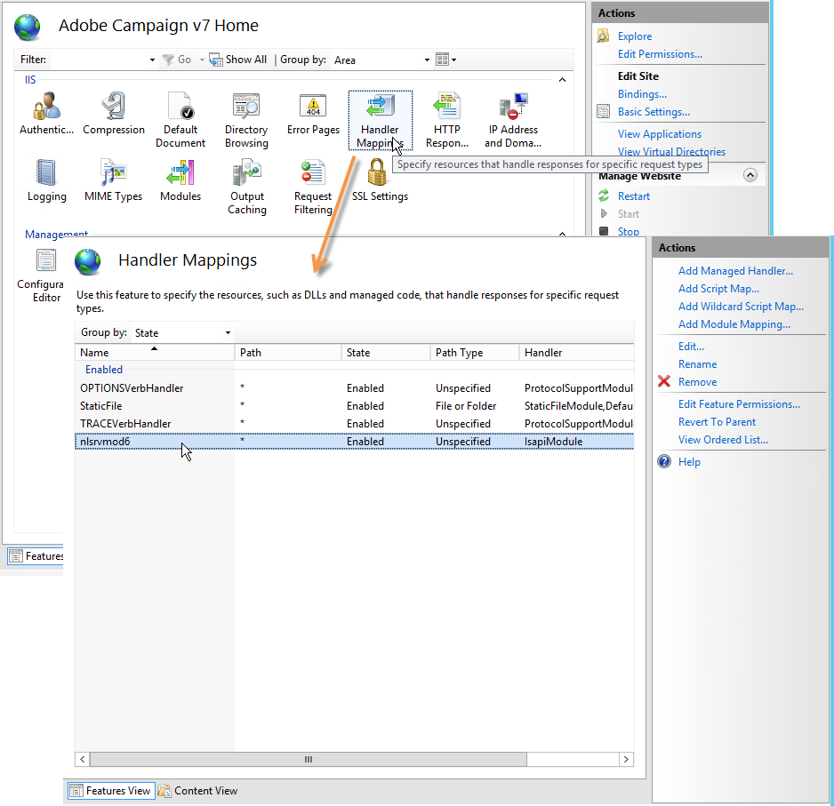

# Integratie in een webserver voor Windows{#integration-into-a-web-server-for-windows}

Adobe Campagne omvat Apache Tomcat die via HTTP (en SOAP) als ingangspunt in de toepassingsserver fungeert.

U kunt deze geïntegreerde Tomcat-server gebruiken om HTTP-aanvragen te bedienen.

In dit geval:

* de standaard luisterpoort is 8080. Om het te veranderen, verwijs naar het [Vormen Tomcat](../../installation/using/configuring-campaign-server.md#configuring-tomcat).
* De clientconsoles maken vervolgens verbinding met een URL zoals [https:// `<computer>`:8080](https://machine:8080).

Nochtans, voor veiligheid en beleid, adviseren wij gebruikend een specifieke server van het Web als belangrijkste ingangspunt voor het verkeer van HTTP wanneer de computer die de Campagne van Adobe in werking stelt op Internet wordt blootgesteld en u wenst om toegang tot de console buiten uw netwerk te openen.

Een server van het Web laat u ook gegevensvertrouwelijkheid met het protocol van HTTPs waarborgen.

Eveneens, moet u een server van het Web gebruiken wanneer u wenst om de volgende functionaliteit te gebruiken, die slechts als de module van de de serveruitbreiding van het Web beschikbaar is.

>[!NOTE]
>
>Als u de trackingfunctionaliteit niet gebruikt, kunt u een standaardinstallatie van Apache of IIS uitvoeren met een omleiding naar Campagne. De volgende de serveruitbreidingsmodule van het Web wordt niet vereist.

## Het vormen van de server van het Web IIS {#configuring-the-iis-web-server}

De configuratieprocedure voor een server van het Web IIS is meestal grafisch. Hiervoor gebruikt u een website (die u al hebt gemaakt of nog moet maken) om toegang te krijgen tot de bronnen van de Adobe Campagneserver: Java-bestanden (.jsp), opmaakmodellen (.css, .xsl), afbeeldingen (.png), de ISAPI DLL voor omleiding, enz.

De volgende secties detailconfiguratie in IIS 7. De configuratie voor IIS8 is fundamenteel het zelfde.

Als de Web IIS-server nog niet op uw computer is geïnstalleerd, kunt u deze via het **[!UICONTROL Add > Remove Programs > Enable or disable Windows functionalities]** menu installeren.

In IIS 7, naast de standaarddiensten, moet u de Extensies ISAPI en filters installeren ISAPI.


### Configuratiestappen {#configuration-steps}

Pas de volgende configuratiestappen toe:

1. Open IIS via het **[!UICONTROL Control panel > Administrative tools > Services]** menu.
1. Maak en configureer de site (bijvoorbeeld Adobe Campaign) op basis van de parameters van uw netwerk (TCP-verbindingspoort, DNS-host, IP-adres).

   

   U moet ten minste de naam van de site en het toegangspad naar de virtuele map opgeven. Aangezien het pad voor toegang tot de map Website niet wordt gebruikt, kunt u de volgende map gebruiken.

   ```
   C:\inetpub\wwwroot
   ```

   

1. Met een **VBS** -script kunt u de bronnen die door de Adobe Campaign-server worden gebruikt, automatisch configureren in de virtuele map die we zojuist hebben gemaakt. Als u de toepassing wilt starten, dubbelklikt u op het bestand **is_neolane_setup.vbs** in de `[INSTALL]\tomcat-7\conf` map, waar `[INSTALL]` zich het pad bevindt voor toegang tot de installatiemap van Adobe Campagne.

   

   >[!NOTE]
   >
   >In het geval van een server 2008/IIS7 van Vensters installatie, moet u als beheerder worden aangemeld om het manuscript in werking te stellen VBS of het manuscript uit te voeren als beheerder.

   Klik **[!UICONTROL OK]** als de server van het Web als het volgen omleidingsserver wordt gebruikt, anders klik **[!UICONTROL Cancel]**.

   Wanneer de veelvoudige plaatsen reeds op de server van het Web worden gevormd, wordt een middenpagina getoond om te specificeren op welke Website de installatie van toepassing is: Voer het nummer in dat aan de site is gekoppeld en klik op **[!UICONTROL OK]**.

   

   Er moet een bevestigingsbericht worden weergegeven:

   

1. Controleer op het **[!UICONTROL Content View]** tabblad of de website correct is geconfigureerd met de Adobe-campagnebronnen:

   

   Als de boom niet wordt getoond, begin IIS opnieuw.

### Rechten beheren {#managing-rights}

Vervolgens moet u de beveiligingsinstellingen configureren voor de ISAPI DLL en voor de bronnen in de installatiemap van Adobe Campagne.

Hiervoor voert u de volgende stappen uit:

1. Selecteer het **[!UICONTROL Features View]** tabblad en dubbelklik op de koppeling **Verificatie** .

   

1. In het lusje van de Veiligheid **van de** Folder van de Website, zorg ervoor dat de anonieme toegang wordt toegelaten. Klik zo nodig op de **[!UICONTROL Edit]** koppeling om de instellingen te wijzigen.

   

### De server van het Web lanceren en de configuratie testen {#launching-the-web-server-and-testing-the-configuration}

U moet nu testen of de configuratie correct is.

Hiervoor volgt u de volgende procedure:

1. Start de IIS-server opnieuw via de opdrachtregel **iisreset** .
1. Test de volgende module door volgende URL in browser van het Web op te nemen:

   ```
   https://<computer>/r/test
   ```

   De browser moet de volgende reactie weergeven:

   ```
   <redir status='OK' date='YYYY/MM/DD HH:MM:SS' build='XXXX' host='myserver.mydomain.com' localHost='localhost'/>
   ```

Voer de volgende opdrachtregel uit om te testen of de omleidingsmodule aanwezig is:

```
nlserver pdump
```

Zij moet de volgende informatie teruggeven:

```
12:00:33 >   Application server for Adobe Campaign Classic (7.X YY.R build XXX@SHA1) of DD/MM/YYYY
webmdl@default (1644) - 18.2 Mo
```

U kunt ook ervoor zorgen ISAPI DLL correct wordt geladen.

Hiervoor voert u de volgende stappen uit:

1. Bewerk de ISAPI-filters voor de Adobe Campagne-site door op het **[!UICONTROL Driver mapping]** pictogram te klikken.
1. Controleer de inhoud van het ISAPI-filter:

   

## Aanvullende configuraties {#additional-configurations}

### De maximale bestandsgrootte voor uploaden wijzigen {#changing-the-upload-file-size-limit}

Wanneer het vormen van de server van het Web IIS, is een grens van ongeveer 28 MB automatisch voor vastgestelde dossiers die aan de server worden geupload.

Dit kan gevolgen hebben in de Campagne van Adobe, vooral als u dossiers zou willen uploaden die groter zijn dan deze grens.

Als u bijvoorbeeld een activiteit van het type **Gegevens laden (bestand)** in een werkstroom gebruikt om een bestand van 50 MB te importeren, wordt de workflow door een fout niet correct uitgevoerd.

In dit geval moet u deze limiet verhogen:

1. Open IIS via het **[!UICONTROL Start > (Control panel) > Administration tools]** menu.
1. Selecteer in het deelvenster **Verbindingen** de site die voor uw Adobe-installatie is gemaakt en dubbelklik vervolgens op **Aanvraag filteren** in het hoofdvenster.
1. Selecteer in het deelvenster **Handelingen** de optie Instellingen **functie** bewerken om de waarde in het veld **Maximaal toegestane inhoudsgrootte (bytes)** te kunnen bewerken.

   Als u bijvoorbeeld toestemming wilt geven voor het uploaden van bestanden van 50 MB, moet u een waarde opgeven van meer dan &quot;52428800&quot; bytes.

>[!NOTE]
>
>Voor meer informatie over deze optie IIS, verwijs naar de &quot;hoe te&quot;sectie van de [officiële documentatie](https://www.iis.net/configreference/system.webserver/security/requestfiltering/requestlimits).

### De weergave van http-foutberichten configureren {#configuring-http-error-message-display}

Als u een 6.1 versie IIS server gebruikt, kunnen de geproduceerde foutenmeldingen moeilijk zijn te lezen toe te schrijven aan ongewenste HTML code die in het bericht wordt getoond.

Pas de volgende configuratie toe om dit te verhelpen en de fout correct weer te geven:

1. Open IIS via het **[!UICONTROL Start > Control Panel > Administrative tools]** menu.
1. Selecteer in het deelvenster **Verbindingen** de site die u voor de installatie van Adobe Campagne hebt gemaakt en dubbelklik vervolgens op **Configuration Editor** in het hoofdvenster.
1. Selecteer in de vervolgkeuzelijst **Sectie** de optie **system.webServer** > **httpErrors**.
1. Selecteer de **waarde PassThrough** op de **bestaandeReactie** lijn.


