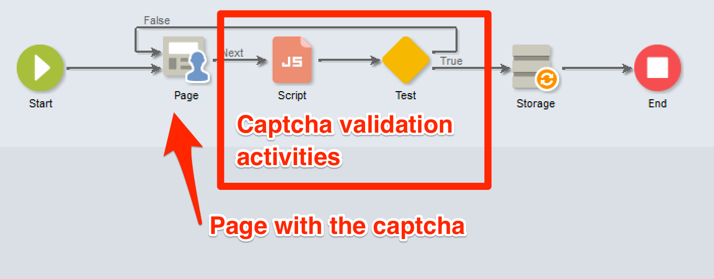

# Richtlijnen voor scripting en versleuteling {#scripting-coding-guidelines}


## Scripts

Voor meer details, verwijs naar [ documentatie van JSAPI van de Campagne ](https://experienceleague.adobe.com/developer/campaign-api/api/index.html?lang=nl).

Als u een script maakt met behulp van workflow, webtoepassingen of jssp, volgt u de volgende aanbevolen procedures:

* Probeer SQL-instructies zoveel mogelijk te vermijden.

* Als dat nodig is, gebruikt u parameterized (prepare statement) functies in plaats van tekenreekssamenvoeging.

  Slechte praktijk:

  ```
  sqlGetInt( "select iRecipientId from NmsRecipient where sEmail ='" + request.getParameter('email') +  "'  limit 1" )
  ```

  Goede praktijken:

  ```
  sqlGetInt( "select iRecipientId from NmsRecipient where sEmail = $(sz) limit 1", request.getParameter('email'));
  ```

  >[!IMPORTANT]
  >
  >sqlSelect biedt geen ondersteuning voor deze functie, dus u moet de queryfunctie van de klasse DBEngine gebruiken:

  ```
  var cnx = application.getConnection()
  var stmt = cnx.query("SELECT sFirstName, sLastName FROM NmsRecipient where sEmail = $(sz)", request.getParameter('email'))
  for each(var row in stmt) logInfo(row[0] + " : " + row[1])
  cnx.dispose()
  ```

Om SQL-injecties te voorkomen, moeten SQL-functies worden toegevoegd aan de lijst van gewenste personen die in Adobe Campaign moet worden gebruikt. Zodra zij aan de lijst van gewenste personen worden toegevoegd, worden zij zichtbaar aan uw exploitanten in de uitdrukkingsredacteur. Zie [deze pagina](../../configuration/using/adding-additional-sql-functions.md).

>[!IMPORTANT]
>
>Als u een bouwstijl gebruikt die ouder is dan 8140, zou de **optie XtkPassUnknownSQLFunctionsToRDBMS** aan &quot;1&quot;kunnen worden geplaatst. Als u uw database wilt beveiligen, verwijdert u deze optie (of stelt u deze in op &#39;0&#39;).

Als u gebruikersinput gebruikt om filters in vragen of SQL verklaringen te bouwen, moet u hen altijd ontsnappen (verwijs naar [ de documentatie van JSAPI van de Campagne ](https://experienceleague.adobe.com/developer/campaign-api/api/index.html?lang=nl) - de bescherming van Gegevens: het ontsnappen van functies). Deze functies zijn:

* NL.XML.escape(data)
* NL.SQL.escape(data)
* NL.JS.escape(data)
* NL.XML.escapeAttribute(data)

## Uw nieuwe gegevensmodel beveiligen

### Basismap

Raadpleeg de volgende pagina&#39;s:

* [Eigenschappen voor maptoegang](../../platform/using/access-management.md)
* [Gekoppelde map](../../configuration/using/configuration.md#linked-folder)

### Benoemde rechten

Naast het op mappen gebaseerde beveiligingsmodel kunt u benoemde rechten gebruiken om de acties van de operator te beperken:

* U kunt sommige systeemfilters (sysFilter) toevoegen om het lezen/het schrijven aan uw gegevens (zie [ te verhinderen deze pagina ](../../configuration/using/filtering-schemas.md)).

  ```
  <sysFilter name="writeAccess">    
      <condition enabledIf="hasNamedRight('myNewRole')=false" expr="FALSE"/>  
  </sysFilter>
  ```

* U kunt ook bepaalde acties (SOAP methode) beschermen die in schema&#39;s zijn gedefinieerd. Plaats enkel het toegangsattribuut met het overeenkomstige genoemde recht als waarde.

  ```
  <method name="grantVIPAccess" access="myNewRole">
      <parameters>
  ...
      </parameters>
  </method>
  ```

  Raadpleeg [deze pagina](../../configuration/using/implementing-soap-methods.md) voor meer informatie.

>[!IMPORTANT]
>
>U kunt benoemde rechten gebruiken in het opdrachtknooppunt in een navtree. Het biedt een betere gebruikerservaring, maar biedt geen bescherming (gebruik alleen clientzijde om ze te verbergen/uitschakelen). U moet het toegangsattribuut gebruiken.

### Overlopende tabel

Als u vertrouwelijke gegevens (deel van een schema) afhankelijk van het niveau van de exploitanttoegang moet beschermen, verberg hen niet in de vormdefinitie (enabledIf/visibleIf voorwaarden).

De volledige entiteit wordt geladen door het scherm, kunt u hen in kolomdefinitie ook tonen. Hiervoor moet u een overlooptabel maken. Verwijs [ deze pagina ](../../configuration/using/examples-of-schemas-edition.md#overflow-table).

## Bijschriften toevoegen in webtoepassingen

Het is aan te raden een Captcha toe te voegen op openbare aanlandingspagina&#39;s/abonnementspagina&#39;s. Helaas is het niet eenvoudig om een captcha toe te voegen aan DCE-pagina&#39;s (Digital Content Editor). We tonen u hoe u een v5-captcha of een Google reCAPTCHA toevoegt.

De algemene manier om een captcha in DCE toe te voegen is een verpersoonlijkingsblok tot stand te brengen om het gemakkelijk binnen de paginacontent te omvatten. U zult a **activiteit 0} van het Manuscript {en a** Test **moeten toevoegen.**

### Personalization-blok

1. Ga naar **[!UICONTROL Resources]** > **[!UICONTROL Campaign Management]** > **[!UICONTROL Personalization blocks]** en maak een nieuwe.

1. Gebruik het inhoudstype **[!UICONTROL Web application]** en controleer **[!UICONTROL Visible in the customization menus]** .

   Raadpleeg [deze sectie](../../delivery/using/personalization-blocks.md) voor meer informatie.

   Hier is een voorbeeld van a **Campagne captcha**:

   ```javascript
   <%
   var captchaID = CaptchaIDGen();
   %>
   &width=200&height=50&minWordSize=8&maxWordSize=8"/>
   <input id="captchaValue" name="captchaValue" <%= String(ctx.vars.captchaValid) === "false" ? class="ui-state-error" : "" %>>
   <input type="hidden" name="captchaID" value="<%=captchaID%>"/>
   <%
   if( serverForm.isInputErroneous("captchaValue") ) {
   %>
   <script type="text/javascript"> 
   $("#captchaValue").addClass("ui-state-error")
   </script>
   <%
   }
   %>
   ```

   * Met de lijnen 1 tot en met 6 worden alle benodigde inputs gegenereerd.
   * Regels 7 tot het eind behandelen fouten.
   * Met regel 4 kunt u de grootte van het grijze vak (breedte/hoogte) en de lengte van het gegenereerde woord (minWordSize/maxWordSize) wijzigen.
   * Voordat u Google reCAPTCHA kunt gebruiken, moet u zich registreren bij Google en een nieuwe reCAPTCHA-site maken.

     `<div class="g-recaptcha" data-sitekey="YOUR_SITE_KEY"></div>`

   U zou de bevestigingsknoop moeten kunnen onbruikbaar maken, maar aangezien wij geen standaardknoop/verbinding hebben, is het beter om het in de HTML zelf te doen. Leren hoe te om het te doen, verwijs naar [ deze pagina ](https://developers.google.com/recaptcha/).

### De webtoepassing bijwerken

1. Heb toegang tot de eigenschappen van uw Webtoepassing om een booleaanse variabele toe te voegen genoemd **captchaValid**.

   

1. Voeg tussen de laatste pagina en de **[!UICONTROL Storage]** -activiteit een **[!UICONTROL Script]** en een **[!UICONTROL Test]** toe.

   Sluit de vertakking **[!UICONTROL True]** aan op de **[!UICONTROL Storage]** en de andere op de pagina die de captcha zal hebben.

   

1. Bewerk de voorwaarde van de vertakking Waar met `"[vars/captchaValid]"` is gelijk aan Waar.

   

1. Bewerk de **[!UICONTROL Script]** -activiteit. De inhoud is afhankelijk van de gekozen captcha-engine.

1. Tot slot kunt u uw gepersonaliseerd blok in de pagina toevoegen: verwijs naar [ deze pagina ](../../web/using/editing-content.md).

   

   

>[!IMPORTANT]
>
>Voor reCAPTCHA-integratie moet u JavaScript aan de clientzijde toevoegen in de HTML (in `<head>...</head>`):
>
>`<script src="https://www.google.com/recaptcha/api.js" async defer></script>`

### Campagne captcha

```javascript
var captchaID = request.getParameter("captchaID");
var captchaValue = request.getParameter("captchaValue");
  
if( !CaptchaValidate(captchaID, captchaValue) ) {
  serverForm.logInputError("captchaValue",
                           "The characters you typed for the captcha must match the image ones.",
                           "captchaValue")
  ctx.vars.captchaValid = false
}
else
  ctx.vars.captchaValid = true
```

Regel 6: u kunt om het even welk soort foutenmelding zetten.

### Google recaptcha

Gelieve te verwijzen naar de [ officiële documentatie ](https://developers.google.com/recaptcha/docs/verify).

```javascript
ctx.vars.captchaValid = false
var gReCaptchaResponse = request.getParameter("g-recaptcha-response");
  
// Call reCaptcha API to validate it
var req = new HttpClientRequest("https://www.google.com/recaptcha/api/siteverify")
req.method = "POST"
req.header["Content-Type"] = "application/x-www-form-urlencoded"
req.body = "secret=YOUR_SECRET_HERE&response=" + encodeURIComponent(gReCaptchaResponse)
req.execute()
var response = req.response
if( response.code == 200 ) {
  captchaRes = JSON.parse(response.body.toString(response.codePage));
  ctx.vars.captchaValid = captchaRes.success
}
  
if( ctx.vars.captchaValid == false ) {
  serverForm.logInputError("reCaptcha",
                           "Please validate the captcha",
                           "reCaptcha")
  logInfo("reCaptcha not validated")
}
```

Als u JSON.parse wilt gebruiken, moet u &quot;shared/json2.js&quot; opnemen in uw webApp:


Sinds build 8797, om de verificatie API URL te gebruiken, moet u het aan de lijst van gewenste personen in het serverConf- dossier toevoegen door in urlPermission knoop toe te voegen:

`<url dnsSuffix="www.google.com" urlRegEx="https://www.google.com/recaptcha/api/siteverify"/>`
