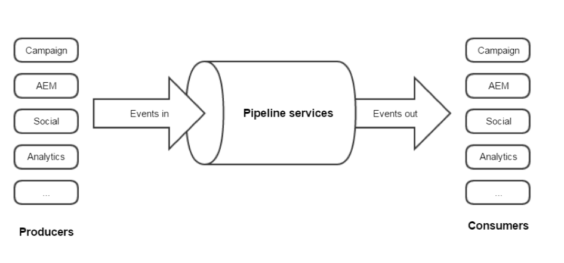

# Informatie over Adobe Experience Cloud-triggers{#about-adobe-experience-triggers}

[!DNL Triggers] is een integratie tussen Adobe Campaign en Adobe Analytics via de pijplijn. De pijplijn haalt gebruikersacties of trekkers van uw website terug. Een achterlating van een winkelwagen is een voorbeeld van een trigger. Triggers worden in Adobe Campaign verwerkt om e-mails in bijna real-time te verzenden.

[!DNL Triggers] Voer marketingacties uit binnen een korte tijdspanne na de actie van een gebruiker. De gemiddelde responstijd is minder dan een uur.

Het staat voor meer flexibele integratie toe aangezien de configuratie minimaal is en een derde niet betrokken is.
Ook wordt steun verleend aan grote verkeersvolumes zonder dat dit van invloed is op de prestaties van marketingactiviteiten. De integratie kan bijvoorbeeld een miljoen triggers per uur verwerken.

## [!DNL Triggers] architectuur {#triggers-architecture}

### Wat is Pipeline? {#pipeline-explanation}

>[!CAUTION]
>
>Alleen met Adobe Cloud-oplossingen kunt u gebeurtenissen maken en consumeren via de Adobe Pipeline-services. Systemen die geen deel uitmaken van Adobe, kunnen dit niet.

De pijpleiding is een overseinensysteem dat in Experience Cloud wordt ontvangen dat [Apache Kafka](http://kafka.apache.org/)gebruikt. Het is een manier om gegevens gemakkelijk tussen oplossingen door te geven. Verder, is de Pijpleiding een berichtrij eerder dan een gegevensbestand. Producenten zetten gebeurtenissen in de pijplijn en de consumenten luisteren naar de stroom en doen wat ze willen met de gebeurtenis. De gebeurtenissen worden een paar dagen bewaard, maar niet langer. Het doel is 24/7 te luisteren en gebeurtenissen onmiddellijk te verwerken.

### Hoe werkt Pipeline? {#how-pipeline-work}

Het &#39;gepipeleerde&#39; proces wordt altijd uitgevoerd op de Adobe Campaign-marketingserver. Het verbindt met de pijpleiding, wint de gebeurtenissen terug, en verwerkt hen onmiddellijk.

Het gepipetteerde proces meldt zich aan bij de Experience Cloud gebruikend de authentificatiedienst en verzendt een privé sleutel. De verificatieservice retourneert een token. Het token wordt gebruikt voor verificatie bij het ophalen van de gebeurtenissen. [!DNL Triggers] worden teruggewonnen van een REST Webdienst gebruikend een eenvoudig GET verzoek. De reactie is JSON-indeling. De parameters aan het verzoek omvatten de naam van de trekker en een wijzer die op het laatste opgehaalde bericht wijst. Het gepipetteerde proces handelt het automatisch af.

## Integratie met Adobe Experience Cloud Triggers gebruiken met Adobe Campaign Classic

Hier volgen enkele [!DNL Triggers] aanbevolen procedures:

* De [!DNL Trigger] gegevens moeten worden opgeslagen als ze in de campagne worden geplaatst. Het zou niet direct verwerkt moeten worden aangezien het latentie zou creëren.
* Tijdstempel moet worden gecontroleerd vanuit het bericht en niet vanuit de database.
* Gebruik TriggerTimestamp en trekker identiteitskaart om duplicaten te verwijderen.

>[!CAUTION]
>
>Het onderstaande voorbeeld is niet offline beschikbaar. Dit is een specifiek voorbeeld van verschillende mogelijke implementaties.

De pijpleidingsgebeurtenissen worden automatisch gedownload. Deze gebeurtenissen kunnen worden gecontroleerd met behulp van een formulier.

Het knooppunt voor gebeurtenissen via de pijpleiding is niet ingebouwd en moet worden toegevoegd. Het gerelateerde formulier moet ook in Campagne worden gemaakt. Deze bewerkingen zijn alleen bestemd voor deskundige gebruikers. Raadpleeg de volgende secties voor meer informatie: [Navigatiehiërarchie](../../configuration/using/about-navigation-hierarchy.md) en formulieren [bewerken](../../configuration/using/editing-forms.md).

Een terugkerende campagnewerkstroom vraagt naar triggers en als deze aan de marketingcriteria voldoen, begint het levering.

