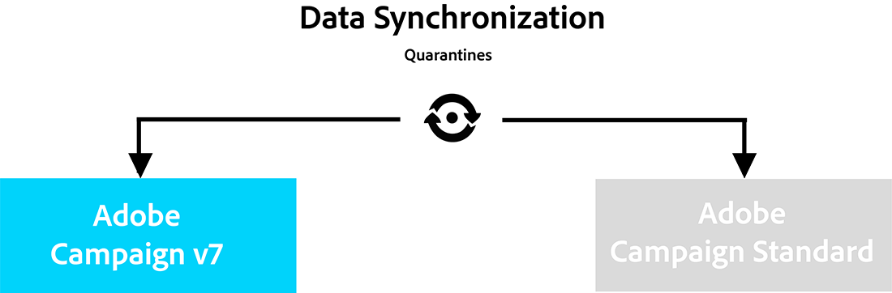
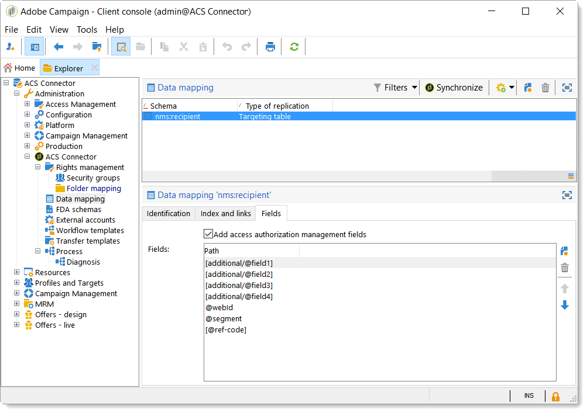

# ACS-verbindingsbeginselen en gegevenscyclus{#acs-connector-principles-and-data-cycle}

## Inleiding {#introduction}

ACS Connector bridges Adobe Campaign v7 en Adobe Campaign Standard. Het is een geïntegreerde eigenschap in Campagne v7 die automatisch gegevens aan de Norm van de Campagne herhaalt, die het beste van beide toepassingen verenigt. Campagne v7 heeft geavanceerde hulpmiddelen om het primaire marketing gegevensbestand te beheren. De gegevensreplicatie van Campagne v7 staat de Norm van de Campagne toe om de rijke gegevens in een gebruikersvriendelijk milieu te gebruiken.

Met de Schakelaar ACS, blijft de Norm van de Campagne door digitale marketers worden gebruikt om, campagnes te ontwerpen te richten en uit te voeren terwijl de Campagne v7 voor gegeven-georiënteerde gebruikers zoals gegevensbestandmarketers wordt gemaakt.

>[!CAUTION]
>
>ACS Connector is alleen beschikbaar als onderdeel van de Adobe Campagne Premier-aanbieding. Neem contact op met uw accountmanager voor meer informatie over het in licentie geven van Adobe Campaign Premier.
>
>ACS Connector is slechts beschikbaar voor ontvangen en hybride architecturen. Het is niet beschikbaar voor volledige installaties op locatie.
>
>Als u deze functie wilt gebruiken, moet u verbinding maken met een campagne met een Adobe-id (IMS). Zie [Verbinding maken via een Adobe-id](../../integrations/using/about-adobe-id.md).

Dit document stelt de mogelijkheden ACS-Connector voor. In de volgende secties vindt u informatie over de manier waarop de functie gegevens en instructies over het werken met gerepliceerde profielen retourneert.

* [Proces](#process): Overzicht van de Schakelaar ACS en hoe de gegevensreplicatie wordt beheerd.
* [Implementatie](#implementation): Overzicht van hoe te beginnen met de Schakelaar ACS evenals instructies op hoe te om basis en geavanceerde gegevens te herhalen.
* [Profielen](../../integrations/using/synchronizing-profiles.md)synchroniseren: Instructies voor het repliceren van profielen en het maken van leveringen met deze profielen.
* [Synchroniserend publiek](../../integrations/using/synchronizing-audiences.md): Instructies over hoe te om een lijst van ontvangers in Campagne v7 te richten en dan de lijst aan de Norm van de Campagne als publiek te herhalen.
* [Webtoepassingen](../../integrations/using/synchronizing-web-applications.md)synchroniseren: Instructies voor het koppelen van Campagne v7-webtoepassingen aan Campagnestandaard.
* [Het oplossen van problemen de Schakelaar](../../integrations/using/troubleshooting-the-acs-connector.md)ACS: Herzie antwoorden op gemeenschappelijke problemen.

>[!NOTE]
>
>De Schakelaar ACS is inbegrepen met Campaign v7 onder vergunningsovereenkomst. Om de Schakelaar ACS te gebruiken, zorg ervoor dat u tussen de Standaard van de Campagne v7 en van de Campagne kunt schakelen. Neem contact op met de beheerder als u niet zeker weet van uw versie en de opgenomen functies.

## Proces {#process}

### Gegevensreplicatie {#data-replication}

De Schakelaar ACS herhaalt periodiek de volgende punten van Campagne v7 aan de Norm van de Campagne:

* **Ontvangers**
* **Abonnementen**
* **Services**
* **Openingspagina&#39;s**

Door gebrek, is de periodieke replicatie voor Schakelaar ACS eens om de 15 minuten. De periode van de periodieke replicatie kan aan uw behoeften worden aangepast. Neem contact op met uw consultant als er wijzigingen nodig zijn.

Gegevensreplicatie voor ontvangers, abonnementen, services en bestemmingspagina&#39;s is incrementeel, wat betekent dat alleen nieuwe ontvangers en wijzigingen aan bestaande ontvangers worden gerepliceerd van Campagne v7 naar Campagnestandaard. Nochtans, komt de replicatie voor een publiek in één enkele instantie voor. U kunt een publiek in Campagne v7 tot stand brengen en dan het één keer herhalen aan de Norm van de Campagne. De replicatie is direct en kan niet voor regelmatige updates worden gevormd. Zie [Soorten publiek](../../integrations/using/synchronizing-audiences.md)synchroniseren voor instructies.

>[!NOTE]
>
>Wees geduldig met de eerste replicatie van een grote database, omdat dit enkele uren kan duren. De volgende replicaties zijn echter incrementeel en veel sneller.

De Schakelaar ACS herhaalt periodiek de volgende punten van de Norm van de Campagne aan Campagne v7:

* **[!UICONTROL Delivery IDs]**
* **[!UICONTROL Email broad logs]**
* **[!UICONTROL Email tracking logs]**

Dankzij replicatie van bezorgings-id&#39;s en e-maillogboeken hebt u toegang tot de geschiedenis van leveringen en traceringsgegevens voor uw v7-ontvangers vanuit Campagne v7.

>[!CAUTION]
>
>Alleen e-mailuitzendingen en trackinglogboeken worden gerepliceerd van Campaign Standard naar Campaign v7.

### Gegevenssynchronisatie {#data-synchronization}

De Schakelaar ACS synchroniseert quarantines tussen Campagne v7 en de Norm van de Campagne.

Een profiel dat is gerepliceerd van Campagne v7 naar Campagnestandaard, bevat bijvoorbeeld een e-mailadres. Als het e-mailadres in quarantined door de Norm van de Campagne is, worden de gegevens overgegaan tot Campagne v7 tijdens de volgende synchronisatie. Voor meer informatie over quarantines, zie het beheer [van de](../../delivery/using/understanding-quarantine-management.md) Quarantaine en de StandaardQuarantines van de [Campagne](https://docs.adobe.com/content/help/en/campaign-standard/using/testing-and-sending/monitoring-messages/understanding-quarantine-management.html).

### Gepliceerde profielen gebruiken {#using-replicated-profiles}

De gekopieerde profielen kunnen door de Norm van de Campagne en Campagne v7 voor gerichte werkschema&#39;s in marketing campagnes worden gebruikt.

Zie [Profielen](../../integrations/using/synchronizing-profiles.md)synchroniseren voor instructies over het verzenden van leveringen in Campagnestandaard met behulp van gerepliceerde profielen. Er zijn aanvullende instructies voor het delen van de gegevens voor abonnementen tussen Campagne v7 en Campagnestandaard.

### Beperkingen {#limitations}

Gedetailleerde profielen zijn gemakkelijk beschikbaar voor leveringen, maar hebben bepaalde beperkingen in de campagnestandaard. Bekijk de onderstaande objecten voor meer informatie over hoe u ze het beste kunt beheren.

* **Alleen-lezen profielen voor de standaard** campagne: Gedetailleerde profielen zijn alleen-lezen in Campagnestandaard. Nochtans, kunt u ontvangers in Campagne v7 uitgeven en de wijzigingen worden automatisch bijgewerkt in de Norm van de Campagne door Schakelaar ACS.
* **Profielen die zijn gemaakt in de campagnestandaard**: De Schakelaar ACS herhaalt ontvankelijke gegevens in één richting, van Campagne v7 aan de Norm van de Campagne. Daarom repliceren profielen die in de Norm van de Campagne voortkomen niet aan Campagne v7.
* **Basisgegevens voor ontvangers voor campagnestandaard**: De Schakelaar ACS herhaalt ontvankelijke gegevens die voor de Norm van de Campagne geschikt zijn. Hieronder vallen namen, adressen, e-mailadressen, mobiele telefoonnummers, thuistelefoonnummers en andere relevante contactgegevens van ontvangers. Neem contact op met uw consultant als extra ontvangende velden en aangepaste doeltabellen in Campagne v7 van essentieel belang zijn voor uw workflow.
* **In quarantaine geplaatste profielen** importeren: Lijsten met profielen waarmee u geen contact wilt opnemen, kunnen als quarantaine-profielen worden geïmporteerd in Campagne v7 of Campagnestandaard. De status voor de profielen wordt opgenomen in de quarantainesynchronisatie tussen de toepassingen en wordt niet gebruikt in leveringen.
* **Abonnement op een service in Campagnestandaard** opzeggen: De keuze om het abonnement op een levering op te zeggen, wordt niet gesynchroniseerd van Campagnestandaard naar Campagne v7. Nochtans, kunt u een Standaardlevering van de Campagne vormen om zijn unsubscription verbinding aan Campaign v7 te richten. Het profiel voor een ontvanger die op de koppeling voor het opzeggen van abonnementen klikt, wordt bijgewerkt in Campagne v7 en de gegevens worden gerepliceerd naar Campagnestandaard. Zie [De koppeling](../../integrations/using/synchronizing-profiles.md#changing-the-unsubscription-link)voor abonnementen wijzigen.
* Alleen e-mailuitzendingen en trackinglogboeken worden gerepliceerd van Campaign Standard naar Campaign v7.

### Facturering {#billing}

Het factureren wordt niet beïnvloed door uw keuze van toepassing om leveringen, Campagne v7 of Campagnestandaard te verzenden. Factureringsgegevens worden afgestemd tussen Campagne v7 en Campagnestandaard. Daarom als u leveringen naar de zelfde ontvanger verzendt gebruikend beide toepassingen, wordt het nog geteld als één actief profiel.

## Implementatie {#implementation}

Er bestaan twee soorten implementatie voor ACS-connector. Beide worden altijd uitgevoerd door het Adobe Campagne Consulting-team.

>[!CAUTION]
>
>Deze sectie is alleen bedoeld voor professionele gebruikers, zodat zij een algemeen overzicht krijgen van het implementatieproces en de belangrijkste stappen ervan.
>
>Probeer op geen enkele manier zelf een van deze implementaties uit te voeren. Het is uitsluitend voorbehouden aan de Adobe Campagneconsultants.

De **basisimplementatie** staat u toe om ontvangers (uit-van-de-doos gebieden), de diensten en abonnementen, Webtoepassingen en publiek te herhalen. Dit is een eenrichtingsreplicatie van Campaign v7 naar Campaign Standard.

De **geavanceerde implementatie** zal u toestaan om complexere gebruiksgevallen uit te voeren, bijvoorbeeld als u extra ontvankelijke gebieden of douane ontvankelijke lijsten (transactietabel bijvoorbeeld) hebt. Zie [Geavanceerde implementatie](#advanced-implementation).

### Het pakket installeren {#installing-the-package}

Als u deze functie wilt gebruiken, moet het **[!UICONTROL ACS Connector]** pakket zijn geïnstalleerd. Dit wordt altijd uitgevoerd door de technische beheerder of consultant van Adobe.

Alle technische elementen met betrekking tot de Schakelaar ACS zijn beschikbaar in de **[!UICONTROL Administration > ACS Connector]** knoop van de ontdekkingsreiziger.

### Technische en replicatieworkflows {#technical-and-replication-workflows}

Na de installatie van het pakket zijn onder **[!UICONTROL Administration > ACS Connector > Process]**.

>[!CAUTION]
>
>Probeer nooit deze workflows te wijzigen. Ze mogen nooit fout zijn of gepauzeerd zijn. Neem contact op met uw Adobe Campagneconsultant als dit gebeurt.

* **[!UICONTROL `[ACS] Quarantine synchronization`]** (quarantaineSync): in deze workflow worden alle quarantainegegevens gesynchroniseerd. Alle nieuwe quarantines in Campagne v7 worden herhaald in de Norm van de Campagne. Alle nieuwe quarantines van de Norm van de Campagne worden herhaald in Campagne v7. Dit waarborgt dat alle uitsluitingsregels tussen Campagne v7 en de Norm van de Campagne worden gesynchroniseerd.
* **[!UICONTROL `[ACS] Security group synchronization`]** (securityGroupSync): deze workflow wordt gebruikt voor het converteren van rechten. Zie [Rechtenomzetting](#rights-conversion).

De volgende replicatiewerkschema&#39;s zijn beschikbaar als &quot;klaar om&quot;malplaatjes worden gebruikt. Ze moeten worden geïmplementeerd door uw Adobe Campagneconsultant.

* **[!UICONTROL `[ACS] Profile replication`]** (newProfileReplication): Deze incrementele workflow repliceert ontvangers naar de campagnestandaard. Standaard worden alle ontvangende velden buiten het vak gerepliceerd. Zie [Standaardontvangende velden](#default-recipient-fields).
* **[!UICONTROL `[ACS] Service replication`]** (newServiceReplication): deze incrementele workflow repliceert de gekozen services naar Campagnestandaard. Zie het gebruik van hoofdletters en kleine letters [synchroniseren van webtoepassingen](../../integrations/using/synchronizing-web-applications.md).
* **[!UICONTROL `[ACS] Landing pages replication`]** (newLandingPageReplication): Deze incrementele workflow repliceert de gekozen webtoepassingen naar de Campagnestandaard. De Campagne v7-webtoepassingen worden weergegeven als bestemmingspagina&#39;s in de Campagnestandaard. Zie het gebruik van hoofdletters en kleine letters [synchroniseren van webtoepassingen](../../integrations/using/synchronizing-web-applications.md).
* **[!UICONTROL `[ACS] New replication`]** (newReplication): deze incrementele workflow is een voorbeeld dat kan worden gebruikt om een aangepaste tabel te repliceren. Zie [Geavanceerde implementatie](#advanced-implementation).
* **[!UICONTROL `[ACS] Delivery-mesage replication`]** (newDlvMsgQualification): deze incrementele workflow repliceert leveringsberichten van Campagnestandaard naar Campagne v7.
* **[!UICONTROL `[ACS] Profile delivery log replication`]** (newRcpDeliveryLogReplication): deze incrementele workflow bevat een kopie van bezorgings-id&#39;s, e-mailbrede logboeken en e-mailtrackinglogboeken van Campagnestandaard naar Campagne v7. Er wordt alleen rekening gehouden met leveringen die vanuit Campagnestandaard zijn verzonden naar profielen die deel uitmaken van de tabel nms:receivers van Campaign v7.
* **[!UICONTROL `[ACS] New delivery log replication`]** (newRcpDeliveryLogReplication): deze incrementele workflow bevat een kopie van bezorgings-id&#39;s, e-mailbrede logboeken en e-mailtrackinglogboeken van Campagnestandaard naar Campagne v7. Er wordt alleen rekening gehouden met leveringen die vanuit Campagnestandaard zijn verzonden naar profielen die deel uitmaken van een specifieke tabel (om te definiëren, anders dan nms:ontvangers) van Campagne v7.

### Standaardvelden voor ontvangers {#default-recipient-fields}

Als u extra velden of aangepaste tabellen hebt (bijvoorbeeld een tabel met transacties), worden deze niet standaard gerepliceerd. Geavanceerde configuratie moet worden uitgevoerd. Zie [Geavanceerde implementatie](#advanced-implementation).

U vindt onder de lijst met ontvangende velden die worden gerepliceerd met de basisimplementatie. Dit zijn de velden buiten het vak:

<table> 
 <tbody> 
  <tr> 
   <td> <strong>Label</strong>  </td> 
   <td> <strong>Interne naam</strong>  </td> 
  </tr> 
  <tr> 
   <td> Bron-id  </td> 
   <td> @sourceId  </td> 
  </tr> 
  <tr> 
   <td> Aanmaakdatum  </td> 
   <td> @created  </td> 
  </tr> 
  <tr> 
   <td> Wijzigingsdatum  </td> 
   <td> @lastModified  </td> 
  </tr> 
  <tr> 
   <td> E-mail  </td> 
   <td> @email  </td> 
  </tr> 
  <tr> 
   <td> Achternaam  </td> 
   <td> @lastName  </td> 
  </tr> 
  <tr> 
   <td> Voornaam  </td> 
   <td> @firstName  </td> 
  </tr> 
  <tr> 
   <td> Tweede voornaam  </td> 
   <td> @middleName  </td> 
  </tr> 
  <tr> 
   <td> Mobiel  </td> 
   <td> @mobilePhone  </td> 
  </tr> 
  <tr> 
   <td> Geboortedatum  </td> 
   <td> @bornDate  </td> 
  </tr> 
  <tr> 
   <td> Geslacht  </td> 
   <td> @gender  </td> 
  </tr> 
  <tr> 
   <td> Aanhef  </td> 
   <td> @salutation  </td> 
  </tr> 
  <tr> 
   <td> Geen contact meer (via een kanaal)  </td> 
   <td> @blackList  </td> 
  </tr> 
  <tr> 
   <td> Geen contact meer per e-mail  </td> 
   <td> @blackListEmail  </td> 
  </tr> 
  <tr> 
   <td> Geen contact meer met SMS  </td> 
   <td> @blackListMobile  </td> 
  </tr> 
  <tr> 
   <td> Telefoon  </td> 
   <td> @phone  </td> 
  </tr> 
  <tr> 
   <td> Fax  </td> 
   <td> @fax  </td> 
  </tr> 
  <tr> 
   <td> Adres 1 (appartement)  </td> 
   <td> [locatie/@adres1]  </td> 
  </tr> 
  <tr> 
   <td> Adres 2  </td> 
   <td> [locatie/@adres2]  </td> 
  </tr> 
  <tr> 
   <td> Adres 3 (nummer en straat)  </td> 
   <td> [locatie/@adres3]  </td> 
  </tr> 
  <tr> 
   <td> Adres 4 (provincie)  </td> 
   <td> [locatie/@adres4]  </td> 
  </tr> 
  <tr> 
   <td> Postcode  </td> 
   <td> [locatie/@zipCode]  </td> 
  </tr> 
  <tr> 
   <td> Plaats  </td> 
   <td> [locatie/@stad]  </td> 
  </tr> 
  <tr> 
   <td> Provincie  </td> 
   <td> [location/@stateCode]  </td> 
  </tr> 
  <tr> 
   <td> Landcode  </td> 
   <td> [locatie/@landcode]  </td> 
  </tr> 
 </tbody> 
</table>

### Omzetting van rechten {#rights-conversion}

De rechten worden verschillend behandeld in Campagne v7 en de Norm van de Campagne. In Campaign v7 is het rechtenbeheer gebaseerd op mappen, terwijl het in Campaign Standard is gebaseerd op eenheidstoegang (organisatorische/geografische eenheden). Een gebruiker van de Standaard van de Campagne behoort tot veiligheidsgroep die de beperkingscontext bevat. Daarom moet het systeem van de rechten van de Campagne v7 worden omgezet om aan norm één te passen van de Campagne. Er zijn verschillende manieren om de rechtenconversie uit te voeren. Hieronder ziet u een voorbeeld van implementatie.

1. Onder **[!UICONTROL Administration > ACS Connector > Rights management > Security groups]**, gebruik de **[!UICONTROL Synchronize]** knoop om alle de veiligheidsgroepen van de Standaard van de Campagne terug te winnen. Buiten-de-box de Standaard groepen van de Campagne worden uitgesloten.

   

1. Als uw rechtenbeheer een mappenbasis heeft, gaat u naar elke benodigde map **[!UICONTROL Administration > ACS Connector > Rights management > Folder mapping]** en wijst u deze toe aan een beveiligingsgroep.

   

1. De replicatiewerkstromen zullen dan deze informatie gebruiken en de overeenkomstige organisatorische/geografische eenheden toevoegen aan elk voorwerp om te herhalen.

### Geavanceerde implementatie {#advanced-implementation}

In dit gedeelte worden enkele mogelijkheden beschreven voor een geavanceerde implementatie.

>[!CAUTION]
>
>Deze informatie kan alleen als algemene richtsnoeren worden gebruikt. Neem contact op met uw Adobe Campagneconsultant voor de implementatie.

De geavanceerde implementatie voegt aangepaste replicatieworkflows toe, afhankelijk van de behoeften van de klant. Hier volgen enkele voorbeelden:

* Leveringsreplicatie
* Campagnereplicatie
* Programmareplicatie
* Replicatie zaadleden
* Transactionele replicatie
* enz.

**Uitgebreide velden repliceren op ontvangers**

Met de basisimplementatie, worden de uit-van-de-doos ontvankelijke gebieden herhaald. Als u douanegebieden wilt herhalen die u aan het ontvankelijke schema toevoegde, moet u hen identificeren.

1. Maak onder **[!UICONTROL Administration > ACS Connector > Data mapping]** een doelafbeelding voor de **[!UICONTROL nms:recipient]** tabel.

   

1. Selecteer de aanvullende velden die u wilt repliceren en andere benodigde gegevens (index, koppelingen, identificatietoetsen).

   

1. Open de toepassingsworkflow voor de toegewezen profielreplicatie (niet de sjabloon, maar de werkstroominstantie zelf). Wijzig de **[!UICONTROL Query]** en de **[!UICONTROL Update data]** activiteiten om deze gebieden op te nemen. Zie [Technische workflows en replicatieworkflows](#technical-and-replication-workflows).

   

   

**Repliceren van aangepaste profieltabellen**

Met de basisimplementatie, wordt de uit-van-de-doos ontvankelijke lijst herhaald. Als u aangepaste ontvankelijke lijsten hebt toegevoegd, is hier hoe u hen identificeert.

1. Maak onder **[!UICONTROL Administration > ACS Connector > Data mapping]** een doelafbeelding in de tabel met aangepaste profielen.

   

1. Definieer de identificatiegegevens, -index, -koppelingen en -velden die u wilt repliceren.

   

1. Als uw rechtenbeheer is gebaseerd op mappen, gaat u naar **[!UICONTROL Administration > ACS Connector > Rights management > Folder mapping]** en definieert u een beveiligingsgroep voor de mappen die zijn gekoppeld aan uw aangepaste tabellen. Zie [Rechtenomzetting](#rights-conversion).
1. Gebruik de **[!UICONTROL New replication]** workflow (niet de sjabloon, maar de werkstroominstantie zelf) om de aangepaste tabel en de velden op te nemen die u wilt repliceren. Zie [Technische workflows en replicatieworkflows](#technical-and-replication-workflows).

