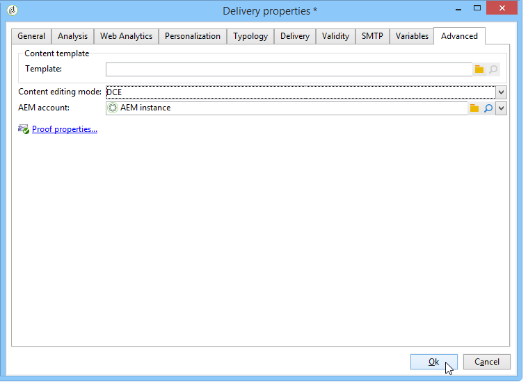

# Toegang tot elementen configureren{#configuring-access-to-assets}

In deze sectie worden de benodigde configuratiestappen in Adobe Campagne beschreven voor het gebruik van de integratiefuncties met de Assets Core-service of de Adobe Experience Manager-bibliotheek.

>[!CAUTION]
>
>Deze integraties zijn gelijktijdig. Lees de volgende informatie zorgvuldig door alvorens om het even welke configuratie te maken.

* Integratie met **Experience Cloud Assets**: Dankzij deze integratie kunt u afbeeldingen uit uw Adobe Experience Cloud-bibliotheek invoegen. Afhankelijk van uw configuratie en licentiemodel kan deze bibliotheek de kernservice Middelen of Middelen op aanvraag zijn. Deze integratie moet worden ingesteld door het **[!UICONTROL Integration with the Adobe Experience Cloud]** ingebouwde pakket te installeren in Adobe Campaign.
* Integratie met **AEM Assets**: Dankzij deze integratie kunt u afbeeldingen invoegen vanuit de middelenbibliotheek van Adobe Experience Manager. Deze integratie moet worden ingesteld door het **[!UICONTROL AEM Integration]** ingebouwde pakket te installeren in Adobe Campaign.

>[!NOTE]
>
>Als de twee pakketten (**[!UICONTROL AEM Integration]** en **[!UICONTROL Integration with the Adobe Experience Cloud]** ) zijn geïnstalleerd, kunnen alleen de middelen in de Adobe Experience Cloud-bibliotheek worden gebruikt. Als u ook toegang wilt krijgen tot de elementen in uw AEM Assets-bibliotheek, moet u AEM Assets en Adobe Experience Cloud synchroniseren. De elementen in AEM Assets zijn vervolgens ook beschikbaar in de Adobe Experience Cloud-bibliotheek. Raadpleeg de [gedetailleerde documentatie](https://docs.adobe.com/docs/en/aod/overview/collaborating/aem-assets-aod-sync.html)voor meer informatie over het synchroniseren van AEM Assets en Adobe Experience Cloud.

## Integreren met Experience Cloud Assets {#integrating-with-experience-cloud-assets}

Als u de integratie tussen Adobe Campaign en Experience Cloud Assets wilt gebruiken, moet u beschikken over:

* Een Adobe Experience Cloud-organisatie
* De verificatiemodus van Adobe IMS is ingeschakeld

Als u de verbinding tussen Adobe Campaign en Adobe Experience Cloud wilt inschakelen, configureert u de verbinding via IMS (Adobe-id-verbindingsservice). Deze configuratie wordt in detail beschreven in het [Verbinden via een document van identiteitskaart](../../integrations/using/about-adobe-id.md) van Adobe. Het gaat om:

* Het **[!UICONTROL Integration with the Adobe Experience Cloud]** pakket installeren.
* Een externe account voor Adobe Experience Cloud configureren.

>[!NOTE]
>
>De functies die aan deze integratie zijn gekoppeld, zijn alleen beschikbaar voor gebruikers die via IMS zijn verbonden met hun Adobe-id.

## Integreren met AEM-middelen {#integrating-with-aem-assets}

Als u AEM Assets wilt integreren met Adobe Campaign, moet u eerst de integratie tussen Adobe Experience Manager en Adobe Campaign configureren. Voor deze configuratie is voornamelijk het volgende vereist:

* Het **[!UICONTROL AEM Integration]** ingebouwde pakket installeren
* Een externe account configureren die specifiek is voor Adobe Experience Manager

Leer hoe u Adobe Campaign en Adobe Experience Manager kunt integreren in de [gedetailleerde documentatie](../../integrations/using/about-adobe-experience-manager.md).

Zodra deze integratie is ingesteld, kunt u een nieuwe leveringssjabloon configureren in Adobe Campaign om de AEM Assets-bibliotheek te gebruiken. Hiervoor voert u de volgende stappen uit:

1. Een nieuwe leveringssjabloon maken - of een bestaande sjabloon dupliceren. Raadpleeg [deze pagina](../../delivery/using/about-templates.md)voor meer informatie over leveringssjablonen.
1. Bewerk de **eigenschappen** van deze sjabloon.
1. Stel op het **[!UICONTROL Advanced]** tabblad de waarde in **[!UICONTROL Content editing mode]** op **DCE**.
1. Selecteer de externe **[!UICONTROL AEM account]** die u nodig hebt voor toegang tot uw AEM Assets-bibliotheek.

   

Wanneer u afbeeldingen invoegt in de inhoud van een levering die op deze sjabloon is gebaseerd, kunt u met deze **[!UICONTROL Select a shared asset]** optie door afbeeldingen bladeren in de AEM Assets-bibliotheek. Meer informatie vindt u in [deze sectie](../../integrations/using/inserting-a-shared-asset.md).

>[!NOTE]
>
>Als het **[!UICONTROL Integration with the Adobe Experience Cloud]** pakket ook op uw Adobe Campagne-instantie is geïnstalleerd, kunt u alleen de middelen gebruiken die beschikbaar zijn in de Adobe Experience Cloud-bibliotheek. Als u ook toegang wilt krijgen tot de elementen in uw AEM Assets-bibliotheek, moet u AEM Assets en Adobe Experience Cloud synchroniseren. De elementen in AEM Assets zijn vervolgens ook beschikbaar in de Adobe Experience Cloud-bibliotheek. In dit geval hoeft u geen specifieke leveringssjabloon te maken. Raadpleeg de [gedetailleerde documentatie](https://docs.adobe.com/docs/en/aod/overview/collaborating/aem-assets-aod-sync.html)voor meer informatie over het synchroniseren tussen AEM Assets en Adobe Experience Cloud.

