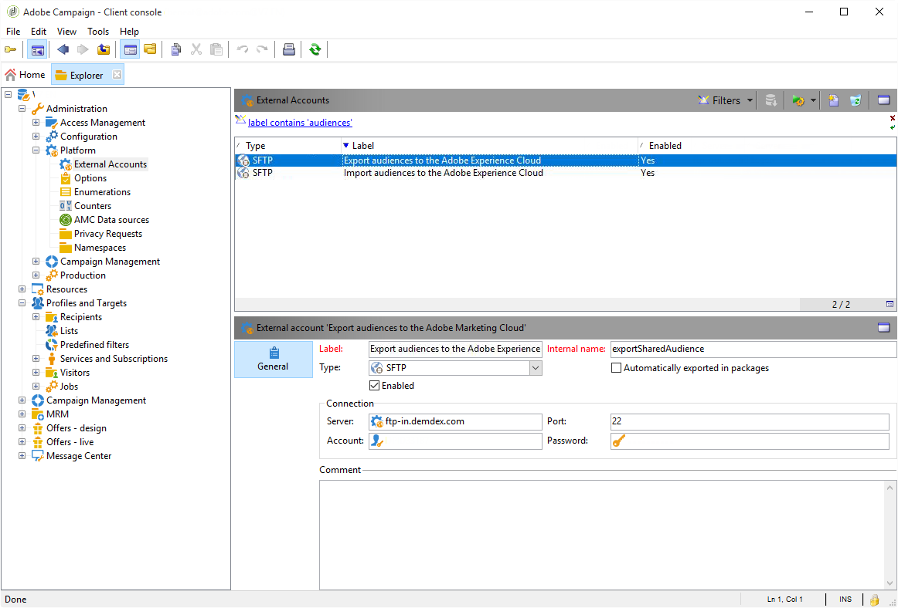

# Integratie van gedeelde soorten publiek configureren in Adobe-campagne{#configuring-shared-audiences-integration-in-adobe-campaign}

Nadat u dit verzoek hebt verzonden, gaat Adobe door met de levering van de integratie voor u. Neem contact op met u voor meer informatie en informatie over de definitieve configuratie:

1. [Stap 1: Externe accounts configureren of controleren in Adobe-campagne](#step-1--configure-or-check-the-external-accounts-in-adobe-campaign)
1. [Stap 2: De gegevensbron configureren](#step-2--configure-the-data-source)
1. [Stap 3: Campagne bijhouden-server configureren](#step-3--configure-campaign-tracking-server)
1. [Stap 4: De service voor de bezoekersidentiteitskaart configureren](#step-4--configure-the-visitor-id-service)

## Stap 1: Externe accounts configureren of controleren in Adobe-campagne {#step-1--configure-or-check-the-external-accounts-in-adobe-campaign}

Ten eerste moeten we de externe accounts in Adobe Campaign als volgt configureren of controleren:

1. Klik op het **[!UICONTROL Explorer]** pictogram.
1. Ga naar **[!UICONTROL Administration > Platform > External accounts]**. De vermelde SFTP-accounts zouden door Adobe moeten zijn geconfigureerd en de benodigde informatie had aan u moeten worden doorgegeven.

   * **[!UICONTROL importSharedAudience]** : SFTP-account voor het importeren van soorten publiek.
   * **[!UICONTROL exportSharedAudience]** : SFTP-account voor het exporteren van soorten publiek.
   

1. Vul het **[!UICONTROL Server]** veld in: **ftp-out.demdex.com** domein voor de invoer externe rekening en **ftp-in.demdex.com** domein voor de uitvoer externe rekening.

   Herinner dat de uitvoer van Campagne de invoer voor de Manager van de Publiek of de de kerndienst van Mensen is.

   >[!NOTE]
   >
   >Als u S3 gebruikt, ga uw **[!UICONTROL AWS S3 Account Server]** volgende syntaxis in:\
   `<S3bucket name>.s3.amazonaws.com/<s3object path>`\
   Voor meer informatie over hoe te om uw S3 rekening te vormen, verwijs naar deze [pagina](../../platform/using/external-accounts.md#amazon-simple-storage-service--s3--external-account).

   

1. Voeg de inhoud **[!UICONTROL Account]** en **[!UICONTROL Password]** informatie van Adobe toe.

Uw externe accounts zijn nu geconfigureerd.

## Stap 2: De gegevensbron configureren {#step-2--configure-the-data-source}

De **ontvanger - Bezoeker-id** wordt gemaakt in Audience Manager. Dit is een uit-van-de-doos gegevensbron die door gebrek voor identiteitskaart van de Bezoeker wordt gevormd. Segmenten die zijn gemaakt op basis van campagne maken deel uit van deze gegevensbron.

De **[!UICONTROL Recipient - Visitor ID]** gegevensbron configureren:

1. Selecteer in het **[!UICONTROL Explorer]** knooppunt **[!UICONTROL Administration > Platform > AMC Data sources]**.
1. Selecteer **[!UICONTROL Recipient - Visitor ID]**.
1. Voer de gegevens in **[!UICONTROL Data Source ID]** en **[!UICONTROL AAM Destination ID]** die door Adobe worden geleverd.

   

## Stap 3: Campagne bijhouden-server configureren {#step-3--configure-campaign-tracking-server}

Voor de configuratie van de integratie met de dienst van de Kern van Mensen of de manager van het Publiek, moeten wij ook de server van het Volgen van de Campagne vormen.

U moet ervoor zorgen de het Volgen van de Campagne Server op het domein (CNAME) wordt geregistreerd. Meer informatie over domeinnaamdelegatie vindt u in [dit artikel](https://helpx.adobe.com/campaign/kb/domain-name-delegation.html).

## Stap 4: De service voor de bezoekersidentiteitskaart configureren {#step-4--configure-the-visitor-id-service}

Raadpleeg het volgende [document](https://marketing.adobe.com/resources/help/en_US/mcvid/mcvid-setup-aam-analytics.html) voor informatie over het configureren van uw service of de volgende [video](https://helpx.adobe.com/marketing-cloud/how-to/email-marketing.html#step-two) als uw bezoeker-id nog nooit is geconfigureerd op uw webeigenschappen of websites.

Uw configuratie en levering worden voltooid, kan de integratie nu worden gebruikt om publiek of segmenten in te voeren en uit te voeren.
