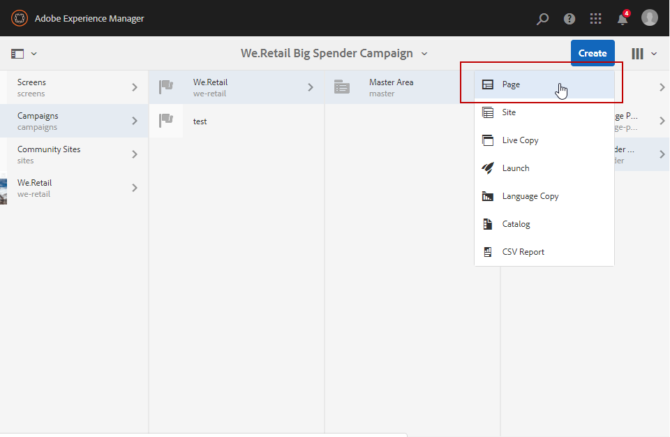

# Creating an Experience Manager newsletter{#creating-an-experience-manager-newsletter}

Deze integratie kan bijvoorbeeld worden gebruikt voor het maken van een nieuwsbrief in Adobe Experience Manager die vervolgens in Adobe Campaign wordt gebruikt als onderdeel van een e-mailcampagne.

Raadpleeg deze [stapsgewijze handleiding](https://helpx.adobe.com/campaign/kb/acc-aem.html)voor een meer gedetailleerd voorbeeld van het gebruik van deze integratie.

**Uit Adobe Experience Manager:**

1. Klik in de AEM instantie van de auteur op het **Adobe Experience** -logo linksboven op de pagina en selecteer **[!UICONTROL Sites]**.

   

1. Selecteer **[!UICONTROL Campaigns > Name of your brand (here We.Retail) > Main Area > Email campaigns]**.
1. Klik op de **[!UICONTROL Create]** knop rechtsboven op de pagina en selecteer **[!UICONTROL Page]**.

   

1. Selecteer de **[!UICONTROL Adobe Campaign Email (AC 6.1)]** sjabloon en geef de nieuwsbrief een naam.
1. Nadat de pagina is gemaakt, opent u het **[!UICONTROL Page information]** menu en klikt u **[!UICONTROL Open Properties]**.

   

1. Selecteer op het **[!UICONTROL Cloud Services]** tabblad **[!UICONTROL Adobe Campaign]** als **[!UICONTROL Cloud service configuration]** en uw Adobe Campaign-instantie in de tweede vervolgkeuzelijst.

   

1. Bewerk uw e-mailinhoud door onderdelen toe te voegen, zoals personalisatievelden uit Adobe Campaign.
1. Als uw e-mail gereed is, opent u het **[!UICONTROL Page information]** menu en klikt u **[!UICONTROL Start workflow]**.

   

1. Selecteer in de eerste keuzelijst het workflowmodel en klik op **[!UICONTROL Publish to Adobe Campaign]** **[!UICONTROL Start workflow]**.

   

1. Start vervolgens de **[!UICONTROL Approve for Campaign]** workflow als de vorige stap.
1. Boven op de pagina wordt een disclaimer weergegeven. Klik **[!UICONTROL Complete]** om de revisie te bevestigen en klik op **[!UICONTROL Ok]**.

   

1. Klik nogmaals **[!UICONTROL Complete]** en selecteer **[!UICONTROL Newsletter approval]** in de **[!UICONTROL Next Step]** vervolgkeuzelijst.

   

Uw nieuwsbrief is nu klaar en gesynchroniseerd in Adobe Campaign.

**Uit Adobe Campaign:**

1. From the **[!UICONTROL Campaigns]** tab, click **[!UICONTROL Deliveries]** then **[!UICONTROL Create]**.

   

1. Selecteer de **[!UICONTROL Delivery template]** sjabloon in de **[!UICONTROL Email delivery with AEM content (mailAEMContent)]** vervolgkeuzelijst.

   

1. Voeg een **[!UICONTROL Label]** object toe aan uw levering en klik op **[!UICONTROL Continue]**.
1. Klik op de knop **[!UICONTROL Synchronize]**.

   Als deze knoop niet in uw interface verschijnt, klik de **[!UICONTROL Properties]** knoop en selecteer het **[!UICONTROL Advanced]** lusje. Het **[!UICONTROL Content editing mode]** veld moet worden ingesteld op **[!UICONTROL AEM]** het AEM in het **[!UICONTROL AEM account]** veld.

   

1. Selecteer de levering die eerder in Adobe Experience Manager is gemaakt en klik op **[!UICONTROL Ok]**.
1. Klik op de **[!UICONTROL Refresh content]** knop zodra er wijzigingen in de AEM zijn aangebracht.

   

Uw e-mail kan nu naar uw publiek worden verzonden.
