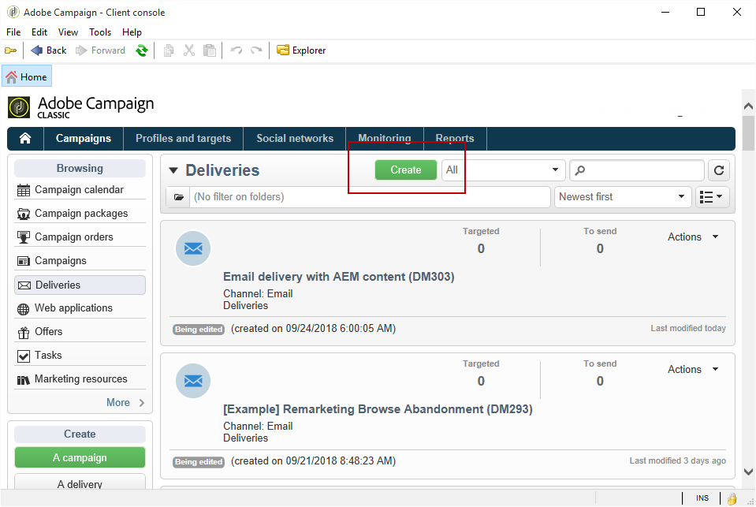

# Een nieuwsbrief voor Experience Managers maken{#creating-an-experience-manager-newsletter}

Deze integratie kan bijvoorbeeld worden gebruikt voor het maken van een nieuwsbrief in Adobe Experience Manager die vervolgens in Adobe Campaign wordt gebruikt als onderdeel van een e-mailcampagne.

**Uit Adobe Experience Manager:**

1. Klik in de AEM auteur op de knop **Adobe-ervaring** logo in de linkerbovenhoek van de pagina en selecteer **[!UICONTROL Sites]**.

   

1. Selecteer **[!UICONTROL Campaigns > Name of your brand (here We.Retail) > Main Area > Email campaigns]**.
1. Klik op de knop **[!UICONTROL Create]** in de rechterbovenhoek van de pagina en selecteert u vervolgens **[!UICONTROL Page]**.

   

1. Selecteer de **[!UICONTROL Adobe Campaign Email (AC 6.1)]** sjabloon en naam van nieuwsbrief.
1. Als uw pagina is gemaakt, opent u de **[!UICONTROL Page information]** menu en klik op **[!UICONTROL Open Properties]**.

   

1. In de **[!UICONTROL Cloud Services]** tab, selecteert u **[!UICONTROL Adobe Campaign]** als **[!UICONTROL Cloud service configuration]** en uw Adobe Campaign-exemplaar in de tweede vervolgkeuzelijst.

   

1. Bewerk uw e-mailinhoud door onderdelen toe te voegen, zoals personalisatievelden uit Adobe Campaign.
1. Als uw e-mail gereed is, opent u de **[!UICONTROL Page information]** menu en klik op **[!UICONTROL Start workflow]**.

   

1. Selecteer in de eerste vervolgkeuzelijst de optie **[!UICONTROL Publish to Adobe Campaign]** als workflowmodel en klik op **[!UICONTROL Start workflow]**.

   

1. Start vervolgens, als de vorige stap, de **[!UICONTROL Approve for Campaign]** workflow.
1. Boven op de pagina wordt een disclaimer weergegeven. Klikken **[!UICONTROL Complete]** om de revisie te bevestigen en klik op **[!UICONTROL Ok]**.

   

1. Klik nogmaals **[!UICONTROL Complete]** en selecteert u **[!UICONTROL Newsletter approval]** in de **[!UICONTROL Next Step]** vervolgkeuzelijst.

   

Uw nieuwsbrief is nu klaar en gesynchroniseerd in Adobe Campaign.

**Uit Adobe Campaign:**

1. Van de **[!UICONTROL Campaigns]** tabblad, klikt u op **[!UICONTROL Deliveries]** dan **[!UICONTROL Create]**.

   

1. In de **[!UICONTROL Delivery template]** vervolgkeuzelijst, selecteert u de **[!UICONTROL Email delivery with AEM content (mailAEMContent)]** sjabloon.

   

1. Voeg een **[!UICONTROL Label]** aan uw levering en klik op **[!UICONTROL Continue]**.
1. Klik op de knop **[!UICONTROL Synchronize]**.

   Als deze knop niet in uw interface wordt weergegeven, klikt u op de knop **[!UICONTROL Properties]** en selecteert u de **[!UICONTROL Advanced]** tab. De **[!UICONTROL Content editing mode]** veld moet worden ingesteld op **[!UICONTROL AEM]** met uw AEM in de **[!UICONTROL AEM account]** veld.

   

1. Selecteer de eerder in Adobe Experience Manager gemaakte levering en klik op **[!UICONTROL Ok]**.
1. Klik op de knop **[!UICONTROL Refresh content]** zodra er wijzigingen in de AEM zijn aangebracht.

   

Uw e-mail kan nu naar uw publiek worden verzonden.
