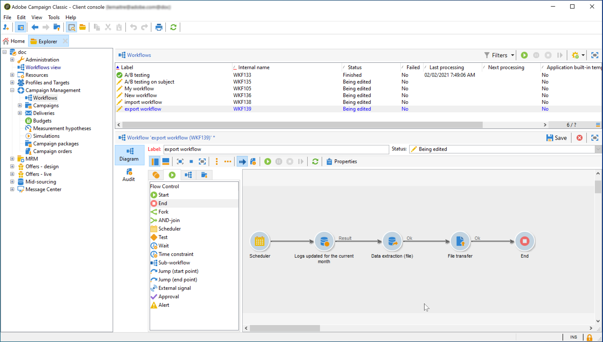

# Gegevens exporteren van Campaign naar Adobe Experience Platform {#sources}

Als u Campaign Classic-gegevens wilt exporteren naar het Adobe Real-time Customer Data Platform (RTCDP), moet u eerst een workflow in Campaign Classic maken om de gegevens die u wilt delen naar de opslaglocatie van uw S3- of Azure-blok te exporteren.

Zodra het werkschema is gevormd en de gegevens die naar uw opslagplaats worden verzonden, moet u uw S3 of Azure opslagplaats van de blob als a **Source** in de ervaringsplatform van Adobe verbinden.

>[!NOTE]
>
>Houd er rekening mee dat we het exporteren van gegevens die zijn gegenereerd door campagne alleen aanbevelen (bijvoorbeeld verzenden, openen, klikken, enz.) naar Adobe Experience Platform. Gegevens die van een bron van derden (zoals uw CRM) worden ontvangen, moeten rechtstreeks in Adobe Experience Platform worden geïmporteerd.

## Een exportworkflow maken in Campaign Classic

Als u gegevens van Campaign Classic naar de opslaglocatie van de S3- of Azure Blob wilt exporteren, moet u een workflow maken om de gegevens die u wilt exporteren als doel in te stellen en deze naar de opslaglocatie te verzenden.

Hiervoor kunt u toevoegen en configureren:

* Een **[!UICONTROL Data extraction (file)]** -activiteit om de doelgegevens uit te pakken in een CSV-bestand. Voor meer op hoe te om deze activiteit te vormen, verwijs naar de [&#x200B; documentatie van de Campagne v8 &#x200B;](https://experienceleague.adobe.com/docs/campaign/automation/workflows/wf-activities/action-activities/extraction-file.html?lang=nl-NL){target="_blank"}.

  

* Een **[!UICONTROL File transfer]** -activiteit om het CSV-bestand over te brengen naar de opslaglocatie. Voor meer op hoe te om deze activiteit te vormen, verwijs naar de [&#x200B; documentatie van de Campagne v8 &#x200B;](https://experienceleague.adobe.com/docs/campaign/automation/workflows/wf-activities/event-activities/file-transfer.html?lang=nl-NL){target="_blank"}.

  

In de onderstaande workflow worden logbestanden regelmatig uitgepakt in een CSV-bestand en wordt het bestand vervolgens overgebracht naar een opslaglocatie.

## Sluit uw opslaglocatie aan als een Source

De belangrijkste stappen om uw S3 of Azure blob opslagplaats als a **Source** in het de ervaringsplatform van Adobe te verbinden zijn hieronder vermeld. De gedetailleerde informatie over elk van deze stappen is beschikbaar in de [&#x200B; connectordocumentatie van Source &#x200B;](https://experienceleague.adobe.com/docs/experience-platform/sources/home.html?lang=nl).

1. Maak in het menu van het Adobe Experience-platform een verbinding met uw opslaglocatie:**[!UICONTROL Sources]**

   * [&#x200B; creeer een Amazon S3 bronverbinding &#x200B;](https://experienceleague.adobe.com/docs/experience-platform/sources/ui-tutorials/create/cloud-storage/s3.html?lang=nl-NL)
   * [&#x200B; Azure Blob schakelaar &#x200B;](https://experienceleague.adobe.com/docs/experience-platform/sources/connectors/cloud-storage/blob.html?lang=nl-NL)

   >[!NOTE]
   >
   >De opslaglocatie kan Amazon S3, SFTP met wachtwoord, SFTP met SSH-sleutel of Azure Blob-verbindingen zijn. De voorkeursmethode voor het verzenden van gegevens naar Adobe Campaign is Amazon S3 of Azure Blob:

   

1. Configureer een gegevensstroom voor een batchverbinding voor cloudopslag. Een dataflow is een geplande taak die gegevens van de opslagplaats aan een dataset van Adobe Experience Platform terugwint en opneemt. Met deze stappen kunt u de gegevensinvoer vanaf uw opslaglocatie configureren, inclusief gegevensselectie en de toewijzing van de CSV-velden aan een XDM-schema.

   De gedetailleerde informatie is beschikbaar in [&#x200B; deze pagina &#x200B;](https://experienceleague.adobe.com/docs/experience-platform/sources/ui-tutorials/dataflow/cloud-storage.html?lang=nl-NL).

   

1. Nadat de Source is geconfigureerd, importeert Adobe Experience Platform het bestand vanaf de opslaglocatie die u hebt opgegeven.

   Deze bewerking kan volgens uw behoeften worden gepland. We raden u aan de exportbewerking tot zes keer per dag uit te voeren, afhankelijk van de belasting die al op het exemplaar aanwezig is.
