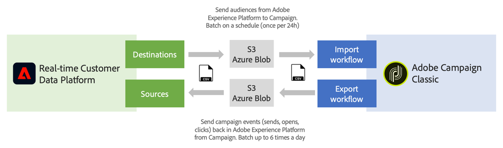

# Werken met bronnen en bestemmingen {#rtcdp}

## Informatie over bronnen en doelen

Met Adobe Experience Platform kunt u gegevens delen tussen Campaign Classic en Adobe Real-time Customer Data Platform (RTCDP). Op deze manier kunt u Adobe Experience Platform-doelgroepen in uw campagneworkflows gebruiken en vervolgens gegevens naar Adobe Real-time Customer Data Platform sturen die betrekking hebben op deze doelgroepen, zoals verzenden, openen en klikken.

* Met **Doelen**, neemt het publiek van Adobe Experience Platform op in Campaign Classic. Hierdoor kunt u uw bekende en onbekende gegevens activeren voor uw marketingcampagnes.
* Met **Bronnen** Campaign Classic-gegevens (bijvoorbeeld verzenden, openen, klikken) naar Adobe Experience Platform exporteren. Op deze manier kunt u gegevens die u van verschillende bronnen verzamelt, centraliseren in één locatie en de daaruit verkregen inzichten gebruiken om meer te doen.

>[!IMPORTANT]
>
>Houd bij het uitvoeren van deze integratie rekening met de opslaglimieten van SFTP, de opslaglimieten van de database en de limieten van het actieve profiel zoals vastgelegd in uw Adobe Campaign-contract.

Raadpleeg de volgende pagina&#39;s voor een gedetailleerder overzicht van Adobe Real-time Customer Data Platform, Doelen en Bronnen:

* [Adobe Real-time Customer Data Platform](https://experienceleague.adobe.com/docs/experience-platform/rtcdp/overview.html?lang=nl)
* [Documentatie voor bestemmingen](https://experienceleague.adobe.com/docs/experience-platform/destinations/home.html?lang=nl)
* [Documentatie voor bronnen](https://experienceleague.adobe.com/docs/experience-platform/sources/home.html?lang=nl)

## Connect Campaign Classic met Adobe Experience Platform

Als u gegevens wilt delen tussen Adobe Experience Platform en Campaign Classic, moet u eerst Adobe Campaign verbinden als een **Doel** en sluit uw AWS S3- of Azure-blob-opslaglocatie aan als **Bron** Adobe ervaren Platform.

Zodra de schakelaars zijn gevormd, kunt u opstelling een gegevensinvoer of uitvoer naar Campaign Classic gebruikend werkschema&#39;s.

Raadpleeg de volgende secties voor meer informatie over het instellen van deze import- en exportprocessen:

* [Adobe Experience Platform-segmenten in campagne plaatsen](../../integrations/using/ingest-aep-data.md)
* [Gegevens exporteren van Campaign naar Adobe Experience Platform](../../integrations/using/export-campaign-data.md)
