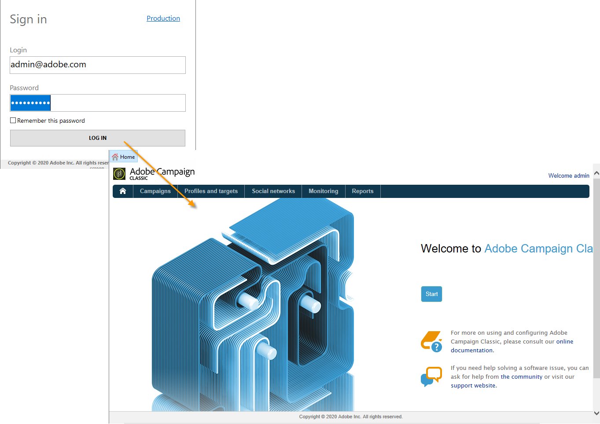

# IMS implementeren{#implementing-ims}

## De IMS-verbinding inschakelen {#enabling-the-ims-connection}

1. Als u verbinding wilt maken via de IMS, checkt u het verbindingsvenster van de console **[!UICONTROL Connect with an Adobe ID]** in.

   

1. Voer uw Adobe-id en wachtwoord in. Het startscherm van Adobe Campaign wordt dan weergegeven.

   

## De IMS-verbinding uitschakelen {#disabling-the-ims-connection}

Als u de verbinding via de Adobe-id wilt uitschakelen, verbreekt u de verbinding, klikt u op **[!UICONTROL File > Connections]** en schakelt u de optie uit **[!UICONTROL Connect with an Adobe ID]**.

