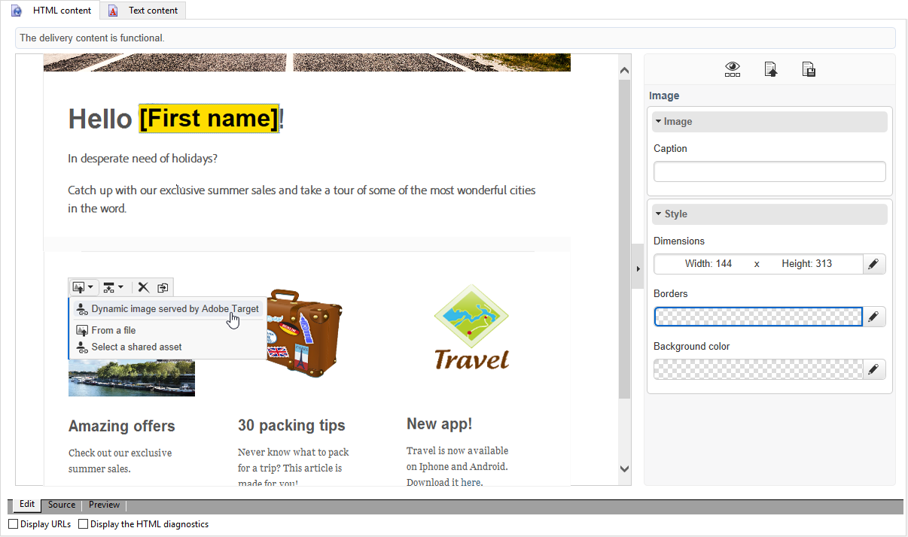
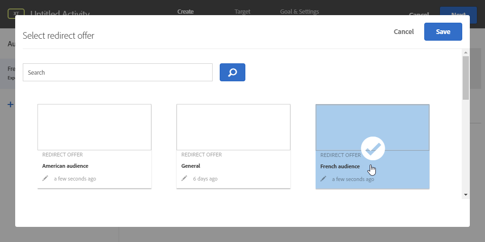

# Dynamische doelinhoud invoegen {#inserting-a-dynamic-image}

In deze handleiding wordt uitgelegd hoe u een dynamische aanbieding van Target kunt integreren in een e-mailbericht in Adobe Campaign.

Wij willen een levering tot stand brengen die een beeldblok zal omvatten dat dynamisch afhankelijk van het land van de ontvanger zal veranderen. De gegevens worden samen met elke mbox-aanvraag verzonden en zijn afhankelijk van het IP-adres van de bezoeker.

In deze e-mail, willen wij één van de beelden dynamisch volgens de volgende gebruiker-ervaringen variëren:

* Het e-mailbericht wordt geopend in Frankrijk.
* Het e-mailbericht wordt geopend in de Verenigde Staten.
* Als geen van deze voorwaarden van toepassing is, wordt een standaardafbeelding weergegeven.

Hiervoor moeten de volgende stappen worden uitgevoerd in Adobe Campagne en Target:

1. [De dynamische aanbieding in een e-mail invoegen](../../integrations/using/inserting-a-dynamic-image.md#inserting-dynamic-offer)
1. [Omleidingsvoorstellen maken](../../integrations/using/inserting-a-dynamic-image.md#create-redirect-offers)
1. [Soorten publiek maken](../../integrations/using/inserting-a-dynamic-image.md#audiences-target)
1. [Een ervaring maken die gericht is op activiteiten](../../integrations/using/inserting-a-dynamic-image.md#creating-targeting-activity)
1. [Een voorbeeld weergeven en de e-mail verzenden](../../integrations/using/inserting-a-dynamic-image.md#preview-send-email)

## De dynamische aanbieding in een e-mail invoegen {#inserting-dynamic-offer}

Als u klaar bent met het definiëren van het doel en de inhoud van uw e-mail in Adobe Campaign, kunt u een dynamische afbeelding invoegen vanuit Target.

Hiervoor geeft u de URL van de standaardafbeelding, de locatienaam en de velden op die u naar Doel wilt overbrengen.

In Adobe Campaign kunt u op twee manieren een dynamische afbeelding van Target invoegen in een e-mailbericht:

* Als u de editor voor digitale inhoud gebruikt, kiest u een bestaande afbeelding en kiest u **[!UICONTROL Insert]** **[!UICONTROL Dynamic image served by Adobe Target]** > in de werkbalk.

   

* Als u de standaardeditor gebruikt, plaatst u de cursor op de plaats waar u de afbeelding wilt invoegen en kiest u **[!UICONTROL Include]** > **[!UICONTROL Dynamic image served by Adobe Target...]** in het vervolgkeuzemenu Verpersoonlijking.

   

### De afbeeldingsparameters definiëren {#defining-image-parameters}

* De URL **[!UICONTROL Default image]** van de URL: De afbeelding die wordt weergegeven wanneer aan geen van de voorwaarden is voldaan. U kunt ook een afbeelding selecteren in de middelenbibliotheek.
* De **[!UICONTROL Target location]**: Voer een naam in voor de locatie van uw dynamische aanbieding. U moet deze locatie selecteren in uw doelactiviteit.
* De **[!UICONTROL Landing Page]**: Als u wilt dat de standaardafbeelding wordt omgeleid naar een standaardbestemmingspagina. Deze URL is alleen bedoeld voor gevallen waarin de standaardafbeelding in de uiteindelijke e-mail wordt weergegeven en optioneel is.
* De **[!UICONTROL Additional decision parameters]**: Geef de toewijzing op tussen de velden die zijn gedefinieerd in de Adobe Target-segmenten en de Adobe Campagne-velden. De Adobe-campagnevelden moeten zijn opgegeven in de keuzelijst. In ons voorbeeld hebben we het veld Land toegevoegd.

Als u Enterprise-machtigingen gebruikt in uw instellingen in Adobe Target, voegt u de bijbehorende eigenschap in dit veld toe. Meer informatie over de rechten van Target Enterprise vindt u op [deze pagina](https://marketing.adobe.com/resources/help/en_US/target/target/properties-overview.html).

## Omleidingsvoorstellen maken {#create-redirect-offers}

In Target kunt u verschillende versies van uw aanbieding maken. Afhankelijk van elke gebruikerservaring kan een omleidingsaanbod worden gemaakt en kunt u opgeven welke afbeelding wordt weergegeven.

In ons geval hebben we twee omleidingsaanbiedingen nodig, de derde (de standaard) moet worden gedefinieerd in Adobe Campagne.

1. Als u een nieuwe omleidingsaanbieding wilt maken in Target Standard, klikt u op het **[!UICONTROL Content]** tabblad **[!UICONTROL Code offers]**.

1. Klik **[!UICONTROL Create]** dan **[!UICONTROL Redirect Offer]**.

   

1. Voer een naam in voor het voorstel en de URL van de afbeelding.

   

1. Volg dezelfde procedure voor het resterende doorleidingsaanbod. Raadpleeg deze [pagina](https://docs.adobe.com/help/en/target/using/experiences/offers/offer-redirect.html)voor meer informatie.

## Soorten publiek maken {#audiences-target}

In Target moet u de twee soorten publiek maken waarin de personen die uw aanbieding bezoeken, worden ingedeeld voor de verschillende inhoud die moet worden geleverd. Voor elk publiek, voeg een regel toe om te bepalen wie de aanbieding zal kunnen zien.

1. Als u een nieuw publiek wilt maken in Doel, klikt u op het **[!UICONTROL Audiences]** tabblad **[!UICONTROL Create Audience]**.

   

1. Voeg een naam toe aan uw publiek.

   

1. Klik **[!UICONTROL Add a rule]** en selecteer een categorie. De regel gebruikt specifieke criteria om de bezoekers te richten. U kunt de regels verfijnen door voorwaarden toe te voegen of door nieuwe regels te maken in andere categorieën.

1. Volg dezelfde procedure voor het resterende publiek.

## Een ervaring maken die gericht is op activiteiten {#creating-targeting-activity}

In Doel, moeten wij een Ervaring creëren richtend activiteit, de verschillende ervaringen bepalen, en hen associëren met de overeenkomstige aanbiedingen.

### Het publiek definiëren {#defining-the-audience}

1. Als u een Experience Targeting-activiteit wilt maken, klikt u op het **[!UICONTROL Activities]** tabblad **[!UICONTROL Create Activity]** en vervolgens **[!UICONTROL Experience Targeting]**.

   

1. Selecteren **[!UICONTROL Form]** als **[!UICONTROL Experience Composer]**.

1. Kies een publiek door op de **[!UICONTROL Change audience]** knop te klikken.

   

1. Selecteer het publiek dat in de vorige stappen is gemaakt.

   

1. Maak een andere ervaring door op **[!UICONTROL Add Experience Targeting]** te klikken.

### De locatie en inhoud definiëren {#defining-location-content}

Voeg inhoud toe voor elk publiek:

1. Selecteer de locatienaam die u hebt gekozen bij het invoegen van de dynamische aanbieding in Adobe Campaign.

   

1. Klik op de vervolgkeuzelijst en selecteer **[!UICONTROL Change Redirect Offer]**.

   

1. Selecteer het omleidingsvoorstel dat u eerder hebt gemaakt.

   

1. Voer dezelfde stappen uit voor de tweede ervaring.

### De activiteit definiëren {#defining-activity}

Het **[!UICONTROL Target]** venster geeft een overzicht van uw activiteiten. Indien nodig kunt u andere ervaringen toevoegen.

In het **[!UICONTROL Goal & Settings]** venster kunt u uw activiteit aanpassen door een prioriteit, een doelstelling of een duur in te stellen.

In de **[!UICONTROL Reporting Settings]** sectie kunt u een actie selecteren en de parameters bewerken die bepalen wanneer uw doel wordt bereikt.

## E-mail voorvertonen en verzenden in Campaign Classic {#preview-send-email}

In Adobe Campaign kunt u nu een voorbeeld van uw e-mail bekijken en de rendering ervan testen op verschillende ontvangers. U zult merken dat de afbeelding verandert op basis van de verschillende ervaringen die zijn gemaakt. Raadpleeg deze [pagina](../../delivery/using/defining-the-email-content.md)voor meer informatie over het maken van e-mailberichten.

U kunt nu uw e-mail verzenden, inclusief een dynamisch voorstel van Target.

