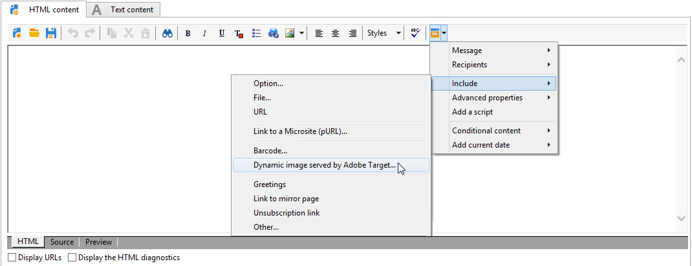
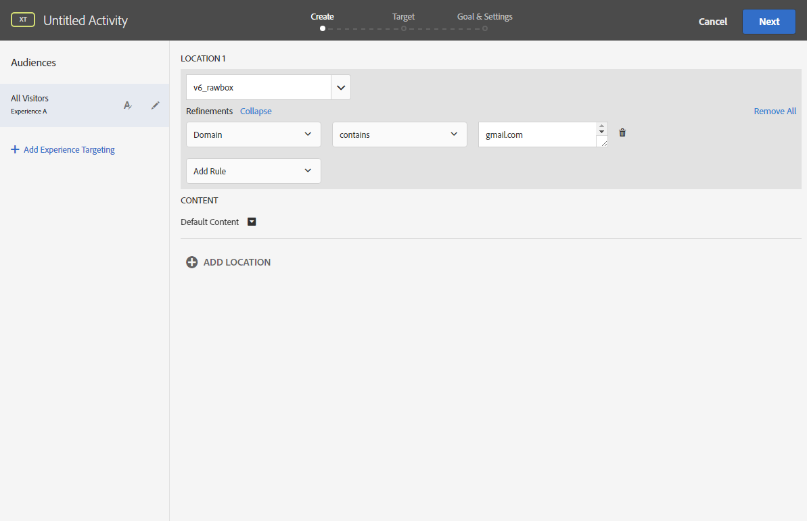

# Een dynamische afbeelding invoegen{#inserting-a-dynamic-image}

In deze sectie worden de stappen beschreven die moeten worden uitgevoerd in Adobe Campaign om een afbeelding van Adobe Target te integreren in een e-mailbericht.

U moet de volgende handelingen vooraf uitvoeren in Adobe Target:

* Maak een of meer [omleidingsvoorstellen](https://docs.adobe.com/help/en/target/using/experiences/offers/offer-redirect.html), waarin u de URL moet opgeven van de afbeelding die u wilt gebruiken.
* Maak een of meer [soorten publiek](https://marketing.adobe.com/resources/help/en_US/target/target/t_create-audience.html)om het doel van uw activiteit te definiëren.
* Maak een [op formulieren gebaseerde ervaringscomposer](https://docs.adobe.com/content/help/en/target/using/activities/abtest/create/test-create-ab.html) -activiteit, waarin u een rawbox moet selecteren en verschillende ervaringen moet opgeven, afhankelijk van het aantal nieuwe richtingsaanbiedingen. Voor elke ervaring moet u een van de nieuwe richtingsvoorstellen selecteren.

   Om deze ervaringen op te geven, kunt u segmenten maken met behulp van informatie uit Adobe Campaign. Als u gegevens uit Adobe Campaign wilt gebruiken in de selectieregels van de aanbieding, moet u de gegevens opgeven in het keuzemenu van Adobe Target.

Een Adobe Target-afbeelding invoegen in een Adobe Campagne-levering:

1. Maak een e-maillevering.
1. Selecteer in de beschikbare verpersoonlijkingsvelden **[!UICONTROL Include > Dynamic image served by Adobe Target]**.

   

1. Selecteer in het venster dat wordt geopend, de afbeelding die standaard in de e-mail wordt weergegeven. U kunt de URL van de afbeelding opgeven of een [gedeelde afbeelding](../../integrations/using/sharing-assets-with-adobe-experience-cloud.md)gebruiken.
1. Voer de naam in van het tekstvak dat is opgegeven in Adobe Target.
1. Voer in het **[!UICONTROL Landing Page]** veld een URL in als u de standaardafbeelding wilt omleiden naar een standaardbestemmingspagina. Deze URL is alleen bedoeld voor gevallen waarin de standaardafbeelding in de uiteindelijke e-mail wordt weergegeven en optioneel is.
1. Als u Enterprise-machtigingen gebruikt in uw instellingen in Adobe Target, voegt u de bijbehorende eigenschap in dit veld toe. Meer informatie over de rechten van Target Enterprise vindt u op [deze pagina](https://marketing.adobe.com/resources/help/en_US/target/target/properties-overview.html). Dit veld is optioneel en niet vereist als u de Enterprise-machtigingen in Target niet gebruikt.
1. Geef in **[!UICONTROL Additional decision parameters]** dit deelvenster de toewijzing op tussen de velden die zijn gedefinieerd in de Adobe Target-segmenten en de Adobe Campagne-velden. De Adobe-campagnevelden moeten zijn opgegeven in de keuzelijst.

   

   Het definiëren van een parameter in Adobe Target vindt plaats via het rawbox dat is gemaakt bij de integratie van de doelafbeelding in de Adobe-campagne en de optie **Verfijningen** .

   

   Het voorbeeld dat hier wordt getoond, laat zien hoe verschillende ervaringen voor mannen en vrouwen kunnen worden gedefinieerd.

U kunt ook verschillende gevallen definiëren op basis van het e-maildomein en het adres van de gebruiker. De gegevens worden automatisch hersteld vanuit de browser van de gebruiker wanneer het e-mailbericht wordt geopend.

Wanneer u een voorbeeld van een e-mailbericht weergeeft, kunt u bij het selecteren van verschillende profielen zien dat de ingevoegde afbeelding verandert afhankelijk van de parameters die zijn opgegeven in de activiteit Adobe Target en in de Adobe-campagne.

U kunt de resultaten van uw verzendingen meten in Adobe Target.

