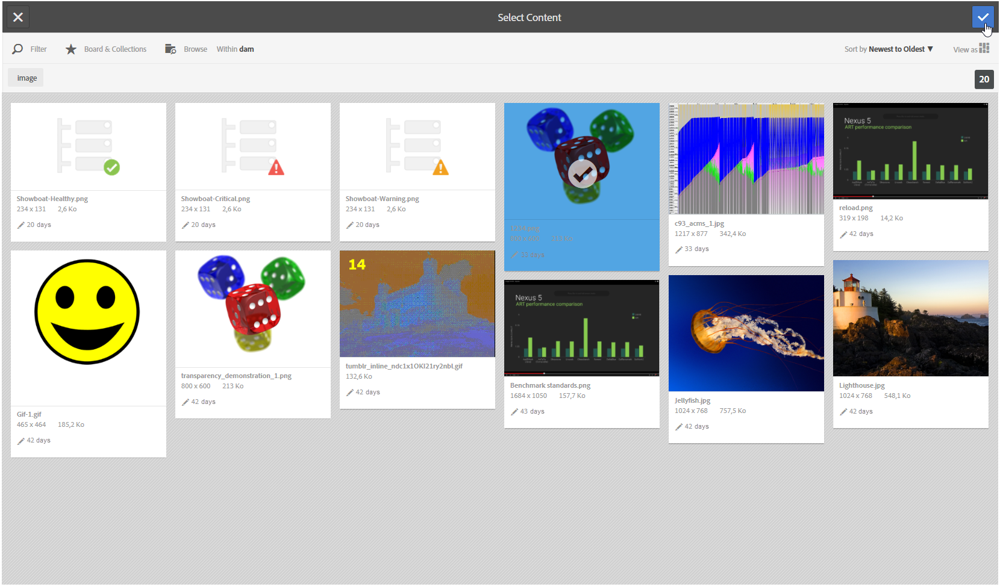

# Een gedeelde asset invoegen{#inserting-a-shared-asset}

Middelen die door Adobe Experience Cloud worden gedeeld, kunnen als volgt op uw e-mails en landingspagina&#39;s worden gebruikt:

1. Maak een nieuwe e-mail of een nieuwe bestemmingspagina.

   Als u elementen uit de Adobe Experience Manager-elementenbibliotheek gebruikt, gebruikt u een leveringssjabloon die is gemaakt bij het [configureren van de integratie](../../integrations/using/configuring-access-to-assets.md#integrating-with-aem-assets).

   Als u dit specifieke malplaatje niet hebt, zorg ervoor dat in de levering **Eigenschappen**, **[!UICONTROL Content editing mode]** (**[!UICONTROL Advanced]** lusje) aan **DCE** wordt geplaatst en dat de AEM externe rekening die u voor de toegang tot van uw het middelbibliotheek van AEM Assets wilt gebruiken wordt verstrekt.

1. Selecteer in het bewerkingsvenster de optie om een afbeelding toe te voegen:

   * Als u de [standaardbewerkingsmodus](../../delivery/using/defining-the-email-content.md#adding-images)gebruikt, selecteert u **[!UICONTROL Image]** > **[!UICONTROL Select a shared asset]**.

      

   * Als u de [geavanceerde bewerkingsmodus](../../web/using/about-campaign-html-editor.md) (DCE) gebruikt, gaat u naar een afbeeldingsblok en selecteert u vervolgens via het contextmenu **[!UICONTROL Select a shared asset]**.

      

      >[!NOTE]
      >
      >U kunt geen gedeelde afbeeldingen vanuit Adobe Campaign invoegen in [webtoegang](../../platform/using/adobe-campaign-workspace.md#console-and-web-access) wanneer u de DCE gebruikt.

1. Selecteer in het selectievenster dat wordt geopend een afbeelding en bevestig deze vervolgens.

   De beschikbare afbeeldingen zijn afkomstig uit uw Adobe Experience Cloud-bibliotheek of uw AEM Assets-bibliotheek, afhankelijk van de configuratie van uw Adobe Campaign-instantie. Raadpleeg de sectie Toegang [tot middelen](../../integrations/using/configuring-access-to-assets.md) configureren.

   

>[!NOTE]
>
>Als u de integratie met Adobe Target gebruikt, kunt u een gedeelde afbeelding als standaardafbeelding gebruiken. Zie [deze pagina](../../integrations/using/integrating-with-adobe-target.md).

