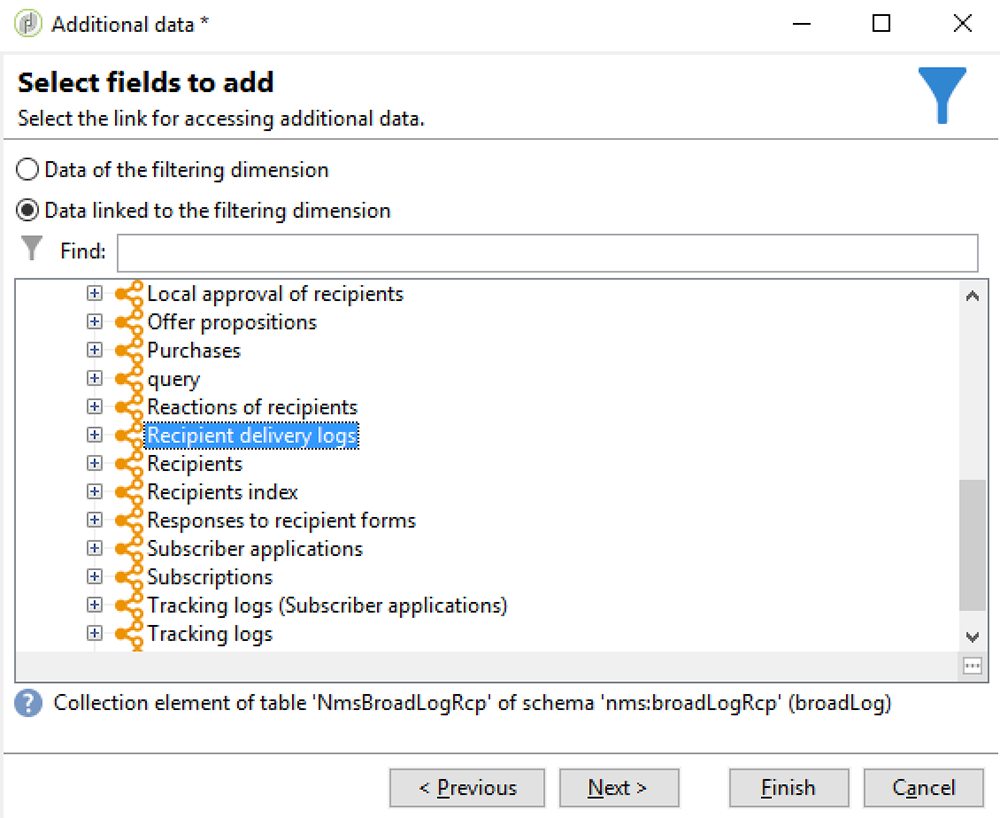
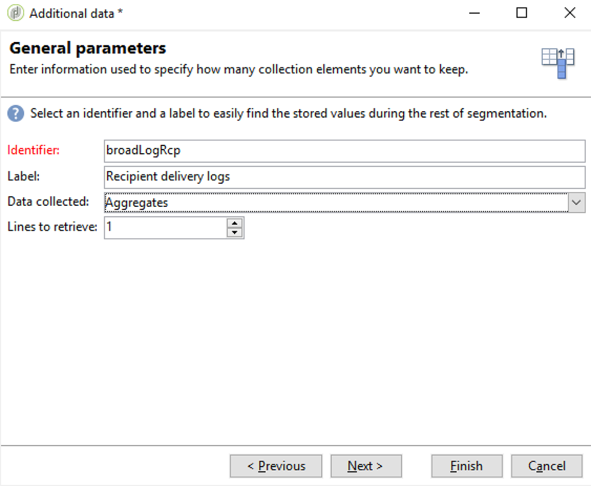

# Doelgroepen synchroniseren{#synchronizing-audiences}

U kunt een geavanceerde lijst maken met de geavanceerde functies van Campagne v7 en deze lijst direct en in real time delen met Campaign Standard (inclusief extra gegevens), zonder problemen. Uw gebruiker van de Campaign Standard kan dan het publiek in Adobe Campaign Standard verbruiken.

Complexe gericht gebruiken van extra gegevens die niet in Campaign Standard worden herhaald kan slechts worden bereikt gebruikend Campagne v7.

U kunt lijsten van ontvangers of gegevens ook eenvoudig delen die door een schakelaar zoals de Dynamiek van Microsoft met Campaign Standard komen.

In dit geval ziet u hoe u het doel van uw levering in Campagne v7 voorbereidt en hoe u dit doel en de aanvullende gegevens ervan opnieuw kunt gebruiken in een levering die u met Adobe Campaign Standard hebt gemaakt en verzonden.

>[!NOTE]
>
>U kunt gegevens ook verrijken met aggregaten en verzamelingen in Adobe Campaign Standard als alle benodigde gegevens al zijn gerepliceerd.

## Vereisten {#prerequisites}

Hiervoor hebt u het volgende nodig:

* Ontvangers die zijn opgeslagen in de Campagne v7-database en zijn gesynchroniseerd met Campaign Standard. Raadpleeg de sectie [Profielen synchroniseren](../../integrations/using/synchronizing-profiles.md).
* Aanvullende gegevens, zoals abonnementen of transacties die zijn opgeslagen in tabellen met betrekking tot namen:ontvangers in de Campagne v7-database. Deze gegevens kunnen uit de schema&#39;s OOB van de Campagne v7 of douanetabellen komen. Deze zijn standaard niet beschikbaar in Campaign Standard omdat ze niet zijn gesynchroniseerd.
* Recht om werkschema&#39;s in zowel Campagne v7 als Campaign Standard uit te voeren.
* Recht om een levering in Campaign Standard tot stand te brengen en uit te voeren.

## Een doelworkflow met aanvullende gegevens maken in Campagne v7 {#create-a-targeting-workflow-with-additional-data-in-campaign-v7}

Complexe gericht gebruiken van extra gegevens die niet in Campaign Standard worden herhaald kan slechts worden bereikt gebruikend Campagne v7.

Zodra het doel en zijn extra gegevens worden bepaald, is het mogelijk om het als lijst op te slaan die met Campaign Standard kan worden gedeeld.

>[!NOTE]
>
>Dit is een voorbeeld. Afhankelijk van uw vereisten, kunt u eenvoudig een lijst van ontvangers vragen en het met ACS zonder enige verdere verwerking delen. U kunt ook andere gegevensbeheeractiviteiten gebruiken om uw uiteindelijke doel voor te bereiden.

Zo krijgt u het uiteindelijke publiek en de aanvullende gegevens:

1. Maak een nieuwe workflow via **[!UICONTROL Profiles and Targets]** > **[!UICONTROL Jobs]** > **[!UICONTROL Targeting workflows]**.
1. Voeg een **[!UICONTROL Query]** activiteit toe en selecteer de ontvangers waarnaar u definitieve e-mail wilt verzenden. Bijvoorbeeld alle ontvangers tussen 18 en 30 jaar oud die in Frankrijk wonen.

   

1. Voeg aanvullende gegevens toe vanuit de query. Raadpleeg de sectie [Gegevens toevoegen](../../workflow/using/query.md#adding-data) voor meer informatie.

   In dit voorbeeld ziet u hoe u een aggregaat toevoegt om te tellen hoeveel leveringen een ontvanger in een jaar heeft ontvangen.

   Selecteer **[!UICONTROL Add data...]** in **[!UICONTROL Query]**.

   

1. Selecteer **[!UICONTROL Data linked to the filtering dimension]** en klik op **[!UICONTROL Next]**.

   

1. Kies **[!UICONTROL Data linked to the filtering dimension]** en selecteer dan **[!UICONTROL Recipient delivery logs]** knoop en klik **[!UICONTROL Next]**.

   

1. Selecteer **[!UICONTROL Aggregates]** in het **[!UICONTROL Data collected]** gebied en klik **[!UICONTROL Next]**.

   

1. Voeg een het filtreren voorwaarde toe om rekening slechts logboeken te houden die tijdens de laatste 365 dagen werden gecreeerd en **[!UICONTROL Next]** te klikken.

   

1. Definieer de uitvoerkolommen. Hier is de enige benodigde kolom die het aantal leveringen telt. Dat doet u als volgt:

   * Selecteer **[!UICONTROL Add]** rechts van het venster.
   * Klik in het venster **[!UICONTROL Select field]** op **[!UICONTROL Advanced selection]**.
   * Selecteer **[!UICONTROL Aggregate]** en **[!UICONTROL Count]**. Controleer de optie **[!UICONTROL Distinct]** en klik **[!UICONTROL Next]**.
   * Selecteer in de lijst met velden het veld dat wordt gebruikt voor de functie **Count**. Kies een veld dat altijd wordt gevuld, bijvoorbeeld het veld **[!UICONTROL Primary key]**, en klik op **[!UICONTROL Finish]**.
   * Wijzig de expressie in de kolom **[!UICONTROL Alias]**. Met deze alias kunt u de toegevoegde kolom in de uiteindelijke aflevering gemakkelijk ophalen. Bijvoorbeeld **NBDeliies**.
   * Klik **[!UICONTROL Finish]** en sparen de **[!UICONTROL Query]** activiteitenconfiguratie.

   

1. Sla de workflow op. Het volgende gedeelte laat zien hoe u de populatie deelt met ACS.

## Doel delen met Campaign Standard {#share-the-target-with-campaign-standard}

Zodra de doelpopulatie wordt bepaald, kunt u het met ACS door een **[!UICONTROL List update]** activiteit delen.

1. Voeg in de eerder gemaakte workflow een **[!UICONTROL List update]**-activiteit toe en geef de lijst op die u wilt bijwerken of maken.

   Geef de map op waarin u de lijst wilt opslaan in Campagne v7. Lijsten zijn onderworpen aan de omslagafbeelding die tijdens de implementatie wordt bepaald, die hun zichtbaarheid kan beïnvloeden zodra gedeeld in Campaign Standard. Raadpleeg de sectie [Rechten conversie](../../integrations/using/acs-connector-principles-and-data-cycle.md#rights-conversion).

1. Controleer of de optie **[!UICONTROL Share with ACS]** is ingeschakeld. Deze optie is standaard ingeschakeld.

   

1. Sla de workflow op en voer deze uit.

   Het doel en de aanvullende gegevens worden opgeslagen in een lijst in Campagne v7 en worden direct gedeeld als een publiek in de lijst in Campaign Standard. Alleen de profielen die zijn gerepliceerd, worden gedeeld met ACS.

Als een fout op **[!UICONTROL List update]** activiteit voorkomt, betekent het dat de synchronisatie met Campaign Standard kan ontbroken hebben. Als u meer details wilt zien over wat er fout is gegaan, gaat u naar **[!UICONTROL Administration]** > **[!UICONTROL ACS Connector]** > **[!UICONTROL Process]** > **[!UICONTROL Diagnosis]**. Deze map bevat synchronisatieworkflows die worden geactiveerd door de uitvoering van de **[!UICONTROL List update]**-activiteit. Raadpleeg de sectie [Problemen met de ACS-connector](../../integrations/using/troubleshooting-the-acs-connector.md) oplossen.

## Haal de gegevens op in Campaign Standard en gebruik deze in een levering {#retrieve-the-data-in-campaign-standard-and-use-it-in-a-delivery}

Zodra het richten werkschema in Campagne v7 wordt uitgevoerd, kunt u het lijstpubliek op read-only wijze van het **[!UICONTROL Audiences]** menu van Campaign Standard vinden.

Door een leveringswerkschema in Campaign Standard te creëren, is het dan mogelijk om dit publiek evenals de extra gegevens te gebruiken die het in een levering bevat.

1. Maak een nieuwe workflow in het menu **[!UICONTROL Marketing activities]**.
1. Voeg een **[!UICONTROL Read audience]** activiteit toe en selecteer het publiek u eerder van Campagne v7 deelde.

   Deze activiteit wordt gebruikt om de gegevens van het geselecteerde publiek terug te winnen. U kunt desgewenst ook een extra **[!UICONTROL Source Filtering]** toepassen door het tabblad Gebaseerd van deze activiteit te gebruiken.

1. Voeg een **[!UICONTROL Email delivery]** activiteit toe en vorm het zoals een andere [e-mailleveringsactiviteit](https://docs.adobe.com/content/help/en/campaign-standard/using/managing-processes-and-data/channel-activities/email-delivery.html).
1. Open de leveringsinhoud.
1. Een personalisatieveld toevoegen. Van popup, bepaal de plaats van de **[!UICONTROL Additional data (targetData)]** knoop. Dit knooppunt bevat de aanvullende gegevens van het publiek die zijn berekend in de initiële doelworkflow. U kunt ze als elk ander verpersoonlijkingsveld gebruiken.

   In dit voorbeeld zijn de aanvullende gegevens die afkomstig zijn van de oorspronkelijke doelworkflow het aantal leveringen dat in de laatste 365 dagen aan elke ontvanger is verzonden. De alias NBDeliies die is opgegeven in de doelworkflow is hier zichtbaar.

   

1. Sla de levering en de workflow op.

   De workflow kan nu worden uitgevoerd. De levering wordt geanalyseerd en kan worden verzonden.

   

## Uw levering {#send-and-monitor-your-delivery} verzenden en controleren

Zodra de levering en zijn inhoud klaar zijn, verzend de levering, zoals die met meer details in [deze sectie](https://docs.adobe.com/content/help/en/campaign-standard/using/managing-processes-and-data/channel-activities/email-delivery.html) wordt beschreven:

1. Voer de leveringswerkstroom uit. Met deze stap wordt het e-mailbericht voorbereid voor verzending.
1. Van het leveringsdashboard, bevestig manueel dat de levering kan worden verzonden.
1. Controleer de rapporten en logboeken van de levering:

   * **In Campaign Standard**: Toegangsrapporten   en   logboeken met betrekking tot de levering zoals voor elke levering.
   * **in Campagne v7 en Campaign Standard**: Logbestanden voor levering-id&#39;s, e-mailbrede logboeken en e-mailtracking worden gesynchroniseerd met Campagne v7. U kunt dan tot 360° mening van uw marketing campagnes van Campaign v7 krijgen.

      Quarantines worden automatisch opnieuw gesynchroniseerd naar Campagne v7. Hierdoor kan niet-te leveren informatie in aanmerking worden genomen voor het volgende doel dat wordt uitgevoerd in Campaign v7.

      Meer informatie over quarantainebeheer vindt u in Campaign Standard in [deze sectie](https://docs.adobe.com/content/help/en/campaign-standard/using/testing-and-sending/monitoring-messages/understanding-quarantine-management.html).

