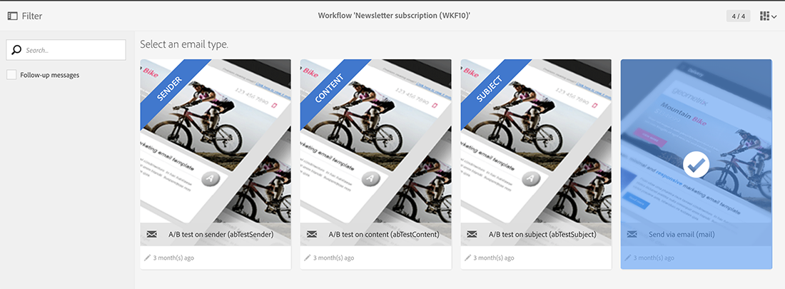
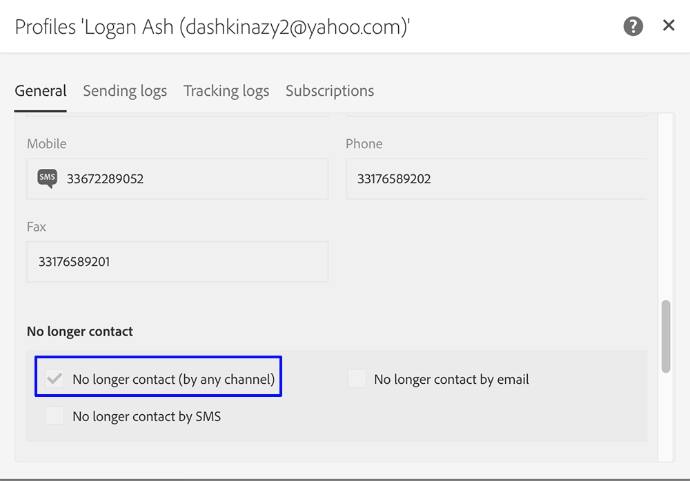

# Profielen synchroniseren{#synchronizing-profiles}

ACS Connector repliceert gegevens van Campaign v7 aan Campaign Standard. De gegevens die van Campagne v7 worden ontvangen kunnen in Campaign Standard worden gebruikt om leveringen tot stand te brengen. U kunt zien hoe profielen worden gesynchroniseerd door de hieronder vermelde bewerkingen uit te voeren.

* **Nieuwe ontvangers** toevoegen: Maak een nieuwe ontvanger in Campagne v7 en bevestig dat een overeenkomstig profiel aan Campaign Standard is herhaald. Zie [Een nieuwe ontvanger maken](#creating-a-new-recipient).
* **Ontvangers** bijwerken: Bewerk een nieuwe ontvanger in Campagne v7 en bekijk het bijbehorende profiel in Campaign Standard om te bevestigen dat de update is gerepliceerd. Zie [Een ontvanger bewerken](#editing-a-recipient).
* **Een workflow maken in Campaign Standard**: Maak een workflow in Campaign Standard die een query bevat met een publiek of profielen die zijn gerepliceerd uit Campagne v7. Zie [Een workflow maken](#creating-a-workflow).
* **Een levering maken in Campaign Standard**: Volg de workflow om de levering te voltooien. Zie [Een levering maken](#creating-a-delivery).
* **Controleer de koppeling** voor het opzeggen van abonnementen: Gebruik een het Webtoepassing van de Campagne v7 om ervoor te zorgen dat de keus van de ontvanger om aan de dienst af te melden wordt verzonden naar het gegevensbestand van de Campagne v7. De optie om het ontvangen van de dienst op te houden wordt herhaald aan Campaign Standard. Zie [De koppeling voor het opzeggen van abonnementen wijzigen](#changing-the-unsubscription-link).

## Vereisten {#prerequisites}

De volgende secties beschrijven hoe de Schakelaar ACS u helpt ontvangers in Campagne v7 toevoegen en uitgeven en dan hen in een levering van Campaign Standard gebruiken. ACS Connector vereist het volgende:

* Ontvangers in Campaign v7 zijn gerepliceerd naar Campaign Standard.
* Gebruikersrechten om workflows uit te voeren in zowel Campagne v7 als Campaign Standard.
* Gebruikersrechten om een levering te maken en uit te voeren in Campaign Standard.

## De koppeling {#changing-the-unsubscription-link} voor het opzeggen van abonnementen wijzigen

Wanneer een ontvanger in een e-mailbericht dat door Campaign Standard is verzonden op de koppeling voor het opzeggen van een abonnement klikt, wordt het bijbehorende profiel in Campaign Standard bijgewerkt. Om ervoor te zorgen dat een herhaald profiel de keus van een gebruiker om aan de dienst te onderschrijven omvat, moet de informatie naar Campagne v7 eerder dan Campaign Standard worden verzonden. Om de wijziging uit te voeren, wordt de service voor het ongedaan maken van abonnementen gekoppeld aan een Campagne v7-webtoepassing in plaats van aan Campaign Standard.

>[!NOTE]
>
>Vraag uw consultant om de webtoepassing voor de service voor abonnementen te configureren voordat u de onderstaande stappen uitvoert.

## Nieuwe ontvanger maken {#creating-a-new-recipient}

1. Creeer een nieuwe ontvanger in Campagne v7 voor replicatie aan Campaign Standard. Voer zoveel mogelijk gegevens in, zoals de achternaam, voornaam, e-mailadres en postadres van de ontvanger. Kies echter geen **[!UICONTROL Salutation]** omdat deze in de volgende sectie wordt toegevoegd: [Een ontvanger bewerken](#editing-a-recipient). Zie [Ontvangers toevoegen](../../platform/using/adding-profiles.md) voor meer informatie.

   

1. Bevestig dat de nieuwe ontvanger aan Campaign Standard is toegevoegd. Wanneer het herzien van het profiel, zorg ervoor dat de gegevens u in Campagne v7 inging ook beschikbaar in Campaign Standard is. Zie [Basisbeginselen van navigatie](https://docs.adobe.com/content/help/nl-NL/campaign-standard/using/getting-started/discovering-the-interface/interface-description.html) voor meer informatie over de locatie waar u naar profielen in Campaign Standard wilt zoeken.

   

   Door gebrek, is de periodieke replicatie voor Schakelaar ACS eens om de 15 minuten. Zie [Gegevensreplicatie](../../integrations/using/acs-connector-principles-and-data-cycle.md#data-replication) voor meer informatie.

## Een ontvanger {#editing-a-recipient} bewerken

De stappen hieronder voor het veranderen van één enkel punt van gegevens bieden een eenvoudig voorbeeld van hoe Campagne v7 het primaire gegevensbestand voor Campaign Standard wordt wanneer het gebruiken van gegevensreplicatie. Het wijzigen of verwijderen van herhaalde gegevens in Campagne v7 heeft hetzelfde effect op de overeenkomstige gegevens in Campaign Standard.

1. Kies de zojuist gemaakte ontvanger uit [Een nieuwe ontvanger maken](#creating-a-new-recipient) en bewerk de naam van de ontvanger. Kies bijvoorbeeld een **[!UICONTROL Salutation]** voor de ontvanger (bijvoorbeeld de heer of mevrouw). Zie [Een profiel bewerken](../../platform/using/editing-a-profile.md) voor meer informatie.

   

1. Bevestig dat de naam van de ontvanger is bijgewerkt in Campaign Standard. Zie [Basisbeginselen van navigatie](https://docs.adobe.com/content/help/en/campaign-standard/using/getting-started/discovering-the-interface/interface-description.html) voor meer informatie over de locatie waar u naar profielen in Campaign Standard wilt zoeken.

   

   Door gebrek, is de periodieke replicatie voor Schakelaar ACS eens om de 15 minuten. Zie [Gegevensreplicatie](../../integrations/using/acs-connector-principles-and-data-cycle.md#data-replication) voor meer informatie.

## Een workflow maken {#creating-a-workflow}

Profielen en services die zijn gerepliceerd vanuit Campaign v7, zijn beschikbaar voor digitale marketers om de rijke gegevens in Campaign Standard te benutten. In de onderstaande instructies ziet u hoe u een query toevoegt aan een Campaign Standard-workflow en deze vervolgens gebruikt met de gerepliceerde database.

Zie [Workflows](../../workflow/using/about-workflows.md) voor meer informatie en volledige instructies met betrekking tot Campaign Standard-workflows.

1. Ga naar Campaign Standard en klik **[!UICONTROL Marketing Activities]**.
1. Klik op **[!UICONTROL Create]** rechtsboven.
1. Klik op **[!UICONTROL Workflow]**.
1. Klik op **[!UICONTROL New workflow]** en **[!UICONTROL Next]**.
1. Voer in het veld **[!UICONTROL Label]** een naam in voor de workflow en geef indien nodig aanvullende informatie op. Klik op **[!UICONTROL Next]**.
1. Van **[!UICONTROL Targeting]** op de linkerzijde, sleep een **[!UICONTROL Query]** doel aan de werkruimte.

   

1. Dubbelklik op de activiteit **[!UICONTROL Query]** en kies een parameter die met de gerepliceerde database kan worden gebruikt. U kunt bijvoorbeeld:

   * Sleep **[!UICONTROL Profiles]** naar de werkruimte. Gebruik het veld pull-down menu om **[!UICONTROL Is external resource]** te kiezen om profielen te vinden die van Campagne v7 werden herhaald.
   * Sleep andere queryparameters om de gekopieerde profielen verder te activeren.

## Een levering {#creating-a-delivery} maken

>[!NOTE]
>
>De instructies voor het creëren van de levering zetten het werkschema met [het Creëren van een werkschema](#creating-a-workflow) voort.

Digitale marketers kunnen een Campagne v7-webtoepassing gebruiken om ervoor te zorgen dat de keuze van een ontvanger om zich af te melden voor een service naar de Campagne v7-database wordt verzonden. Nadat de ontvanger de unsubscription verbinding klikt, wordt de optie om op te houden die de dienst ontvangt herhaald van Campagne v7 aan Campaign Standard. Voor extra details, zie [Veranderend de unsubscription verbinding](#changing-the-unsubscription-link).

Voer de onderstaande stappen uit om een e-maillevering toe te voegen aan een bestaande workflow met de service voor het opzeggen van abonnementen die is gemaakt in Campagne v7. Zie dit [document](../../workflow/using/about-workflows.md) voor meer informatie en volledige instructies over Campaign Standard-workflows.

>[!NOTE]
>
>Vraag uw consultant om de webtoepassing voor de service voor abonnementen te configureren voordat u de onderstaande stappen uitvoert.

1. Klik **[!UICONTROL Channels]** op de linkerzijde.
1. Sleep **[!UICONTROL Email delivery]** naar de bestaande workflow in de werkruimte.

   

1. Dubbelklik op de **[!UICONTROL Email delivery]**-activiteit en kies **[!UICONTROL Single send email]** of **[!UICONTROL Recurring email]**. Selecteer de gewenste opties en klik op **[!UICONTROL Next]**.
1. Klik **[!UICONTROL Send via email]** en klik **[!UICONTROL Next]**.

   

1. Voer in het veld **[!UICONTROL Label]** een naam voor de levering in en geef indien nodig aanvullende informatie op. Klik op **[!UICONTROL Next]**.

   

1. Voer in het veld **[!UICONTROL Subject]** het onderwerp in dat wordt weergegeven in het e-mailpostvak van de ontvanger.
1. Klik **[!UICONTROL Change content]** om een malplaatje van HTML toe te voegen.

   

1. Kies inhoud die de koppeling bevat om het abonnement op de service op te zeggen. Klik op **[!UICONTROL Confirm]**.

   

1. De huidige koppeling voor het opzeggen van abonnementen moet worden vervangen door een nieuwe koppeling die gebruikmaakt van de webtoepassing die door uw consultant is gemaakt. Zoek de koppeling voor het opzeggen van abonnementen onder aan de e-mailinhoud en klik er eenmaal op. Klik op het prullenbakpictogram om de koppeling te verwijderen.

   

1. Klik binnen het zelfde inhoudsgebied en typ **Unsubscription link**.

   

1. Markeer de tekst met de cursor en klik op het ketingpictogram.
1. Klik op **[!UICONTROL Link to a landing page]**.

   

1. Klik op het mappictogram om de openingspagina te kiezen.

   

1. Kies de webtoepassing die door de consultant is gemaakt en klik op **[!UICONTROL Confirm]**.

   

1. Klik op **[!UICONTROL Create]**.
1. Ga terug naar de workflow door op de naam van de levering te klikken.

   

1. Klik **[!UICONTROL Start]** om de levering te verzenden. Het pictogram voor verzending via e-mail knippert om aan te geven dat het wordt voorbereid voor levering.

   

1. Dubbelklik op het kanaal **[!UICONTROL Email delivery]** en kies **[!UICONTROL Confirm]** om de e-mail te verzenden. Klik **[!UICONTROL OK]** om de berichten te verzenden.

   

## De service {#verifying-the-unsubscription-service} voor het annuleren van abonnementen controleren

Volg de instructies in [Een workflow maken](#creating-a-workflow) en [Een levering maken](#creating-a-delivery) voordat u naar de onderstaande stappen gaat.

1. De ontvanger klikt op de koppeling om het abonnement op te zeggen in de e-maillevering.

   

1. De ontvanger bevestigt het abonnement.

   

1. De ontvankelijke gegevens in Campagne v7 worden bijgewerkt om erop te wijzen dat de gebruiker heeft geabonneerd. Bevestig dat het vakje **[!UICONTROL No longer contact (by any channel)]** voor de ontvanger wordt gecontroleerd. Zie [Een profiel bewerken](../../platform/using/editing-a-profile.md) voor meer informatie over het weergeven van een ontvanger in Campagne v7.

   

1. Ga naar Campaign Standard en open de profieldetails voor de ontvanger. Bevestig dat een selectievakje naast **[!UICONTROL No longer contact (by any channel)]** verschijnt. Zie [Basisbeginselen van navigatie](https://docs.adobe.com/content/help/en/campaign-standard/using/getting-started/discovering-the-interface/interface-description.html) voor meer informatie over de locatie waar u naar profielen in Campaign Standard wilt zoeken.

   

