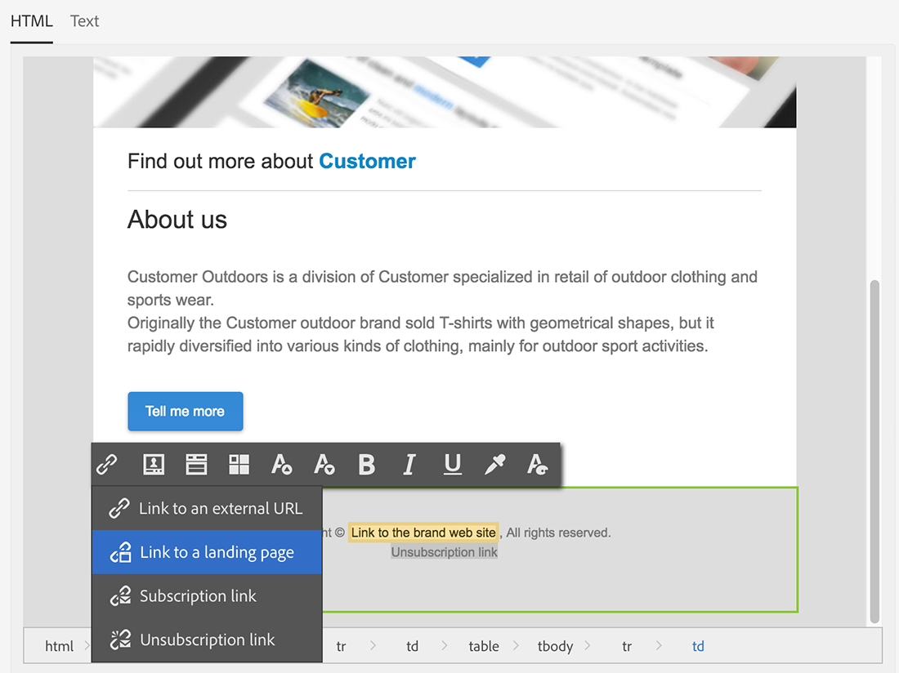

# Profielen synchroniseren{#synchronizing-profiles}

ACS Connector repliceert gegevens van Campaign v7 aan Campaign Standard. De gegevens die van Campagne v7 worden ontvangen kunnen in Campaign Standard worden gebruikt om leveringen tot stand te brengen. U kunt zien hoe profielen worden gesynchroniseerd door de hieronder vermelde bewerkingen uit te voeren.

* **Nieuwe ontvangers toevoegen**: Maak een nieuwe ontvanger in Campagne v7 en bevestig dat een overeenkomstig profiel aan Campaign Standard is herhaald. Zie [Een nieuwe ontvanger maken](#creating-a-new-recipient).
* **Ontvangers bijwerken**: Bewerk een nieuwe ontvanger in Campagne v7 en bekijk het bijbehorende profiel in Campaign Standard om te bevestigen dat de update is gerepliceerd. Zie [Een ontvanger bewerken](#editing-a-recipient).
* **Een workflow maken in Campaign Standard**: Maak een workflow in Campaign Standard die een query bevat met een publiek of profielen die zijn gerepliceerd uit Campagne v7. Zie [Een workflow maken](#creating-a-workflow).
* **Een levering maken in Campaign Standard**: Volg de workflow om de levering te voltooien. Zie [Een levering maken](#creating-a-delivery).
* **De koppeling voor het opzeggen van abonnementen controleren**: Gebruik een het Webtoepassing van de Campagne v7 om ervoor te zorgen dat de keus van de ontvanger om aan de dienst af te melden wordt verzonden naar het gegevensbestand van de Campagne v7. De optie om het ontvangen van de dienst op te houden wordt herhaald aan Campaign Standard. Zie [De koppeling voor het opzeggen van abonnementen wijzigen](#changing-the-unsubscription-link).

## Vereisten {#prerequisites}

De volgende secties beschrijven hoe de Schakelaar ACS u helpt ontvangers in Campagne v7 toevoegen en uitgeven en dan hen in een levering van Campaign Standard gebruiken. ACS Connector vereist het volgende:

* Ontvangers in Campaign v7 zijn gerepliceerd naar Campaign Standard.
* Gebruikersrechten om workflows uit te voeren in zowel Campagne v7 als Campaign Standard.
* Gebruikersrechten om een levering te maken en uit te voeren in Campaign Standard.

## De koppeling voor het opzeggen van abonnementen wijzigen {#changing-the-unsubscription-link}

Wanneer een ontvanger in een e-mailbericht dat door Campaign Standard is verzonden op de koppeling voor het opzeggen van een abonnement klikt, wordt het bijbehorende profiel in Campaign Standard bijgewerkt. Om ervoor te zorgen dat een herhaald profiel de keus van een gebruiker om aan de dienst te onderschrijven omvat, moet de informatie naar Campagne v7 eerder dan Campaign Standard worden verzonden. Om de wijziging uit te voeren, wordt de service voor het ongedaan maken van abonnementen gekoppeld aan een Campagne v7-webtoepassing in plaats van aan Campaign Standard.

>[!NOTE]
>
>Vraag uw consultant om de webtoepassing voor de service voor abonnementen te configureren voordat u de onderstaande stappen uitvoert.

## Een nieuwe ontvanger maken {#creating-a-new-recipient}

1. Creeer een nieuwe ontvanger in Campagne v7 voor replicatie aan Campaign Standard. Voer zoveel mogelijk gegevens in, zoals de achternaam, voornaam, e-mailadres en postadres van de ontvanger. Kies echter geen **[!UICONTROL Salutation]** aangezien het in de volgende sectie zal worden toegevoegd, [Een ontvanger bewerken](#editing-a-recipient). Zie voor meer informatie [Ontvangers toevoegen](../../platform/using/adding-profiles.md).

   

1. Bevestig dat de nieuwe ontvanger aan Campaign Standard is toegevoegd. Wanneer het herzien van het profiel, zorg ervoor dat de gegevens u in Campagne v7 inging ook beschikbaar in Campaign Standard is. Ga voor meer informatie over waar u naar profielen in Campaign Standard wilt zoeken naar [Basisbeginselen van navigatie](https://experienceleague.adobe.com/docs/campaign-standard/using/getting-started/discovering-the-interface/interface-description.html?lang=nl).

   

   Door gebrek, is de periodieke replicatie voor Schakelaar ACS eens om de 15 minuten. Zie voor meer informatie [Gegevensreplicatie](../../integrations/using/acs-connector-principles-and-data-cycle.md#data-replication).

## Een ontvanger bewerken {#editing-a-recipient}

De stappen hieronder voor het veranderen van één enkel punt van gegevens bieden een eenvoudig voorbeeld van hoe Campagne v7 het primaire gegevensbestand voor Campaign Standard wordt wanneer het gebruiken van gegevensreplicatie. Het wijzigen of verwijderen van herhaalde gegevens in Campagne v7 heeft hetzelfde effect op de overeenkomstige gegevens in Campaign Standard.

1. Kies de nieuwe ontvanger uit [Een nieuwe ontvanger maken](#creating-a-new-recipient) en bewerkt u de naam van de ontvanger. Kies bijvoorbeeld een **[!UICONTROL Salutation]** voor de ontvanger (bijvoorbeeld de heer of mevrouw). Zie voor meer informatie [Een profiel bewerken](../../platform/using/editing-a-profile.md).

   

1. Bevestig dat de naam van de ontvanger is bijgewerkt in Campaign Standard. Ga voor meer informatie over waar u naar profielen in Campaign Standard wilt zoeken naar [Basisbeginselen van navigatie](https://experienceleague.adobe.com/docs/campaign-standard/using/getting-started/discovering-the-interface/interface-description.html?lang=nl).

   

   Door gebrek, is de periodieke replicatie voor Schakelaar ACS eens om de 15 minuten. Zie voor meer informatie [Gegevensreplicatie](../../integrations/using/acs-connector-principles-and-data-cycle.md#data-replication).

## Een workflow maken {#creating-a-workflow}

Profielen en services die zijn gerepliceerd vanuit Campaign v7, zijn beschikbaar voor digitale marketers om de rijke gegevens in Campaign Standard te benutten. In de onderstaande instructies ziet u hoe u een query toevoegt aan een Campaign Standard-workflow en deze vervolgens gebruikt met de gerepliceerde database.

Voor meer informatie en volledige instructies over Campaign Standard-workflows raadpleegt u [Workflows](../../workflow/using/about-workflows.md).

1. Ga naar Campaign Standard en klik op **[!UICONTROL Marketing Activities]**.
1. Klikken **[!UICONTROL Create]** rechtsboven.
1. Klik op **[!UICONTROL Workflow]**.
1. Klikken **[!UICONTROL New workflow]** en **[!UICONTROL Next]**.
1. Voer een naam in voor de workflow in het dialoogvenster **[!UICONTROL Label]** en zo nodig aanvullende informatie. Klik op **[!UICONTROL Next]**.
1. Van **[!UICONTROL Targeting]** aan de linkerkant, sleep een **[!UICONTROL Query]** naar de werkruimte te gaan.

   

1. Dubbelklik op de knop **[!UICONTROL Query]** en kies een parameter die met het gerepliceerde gegevensbestand kan worden gebruikt. U kunt bijvoorbeeld:

   * Slepen **[!UICONTROL Profiles]** naar de werkruimte. Kies in het keuzemenu van het veld de optie **[!UICONTROL Is external resource]** om profielen te zoeken die vanuit Campagne v7 zijn gerepliceerd.
   * Sleep andere queryparameters om de gekopieerde profielen verder te activeren.

## Een levering maken {#creating-a-delivery}

>[!NOTE]
>
>De instructies voor het maken van de levering gaan verder met de workflow die is gestart met [Een workflow maken](#creating-a-workflow).

Digitale marketers kunnen een Campagne v7-webtoepassing gebruiken om ervoor te zorgen dat de keuze van een ontvanger om zich af te melden voor een service naar de Campagne v7-database wordt verzonden. Nadat de ontvanger de unsubscription verbinding klikt, wordt de optie om op te houden die de dienst ontvangt herhaald van Campagne v7 aan Campaign Standard. Zie voor meer informatie [De koppeling voor het opzeggen van abonnementen wijzigen](#changing-the-unsubscription-link).

Voer de onderstaande stappen uit om een e-maillevering toe te voegen aan een bestaande workflow met de service voor het opzeggen van abonnementen die is gemaakt in Campagne v7. Zie deze voor meer informatie en volledige instructies over Campaign Standard-workflows [document](../../workflow/using/about-workflows.md).

>[!NOTE]
>
>Vraag uw consultant om de webtoepassing voor de service voor abonnementen te configureren voordat u de onderstaande stappen uitvoert.

1. Klikken **[!UICONTROL Channels]** links.
1. Slepen **[!UICONTROL Email delivery]** naar de bestaande workflow in de werkruimte.

   

1. Dubbelklik op de knop **[!UICONTROL Email delivery]** activiteit en kies **[!UICONTROL Single send email]** of **[!UICONTROL Recurring email]**. Selecteer de gewenste opties en klik op **[!UICONTROL Next]**.
1. Klikken **[!UICONTROL Send via email]** en klik op **[!UICONTROL Next]**.

   

1. Voer een naam in voor de levering in het dialoogvenster **[!UICONTROL Label]** en zo nodig aanvullende informatie. Klik op **[!UICONTROL Next]**.

   

1. In de **[!UICONTROL Subject]** voert u het onderwerp in dat in het e-mailpostvak van de ontvanger wordt weergegeven.
1. Klikken **[!UICONTROL Change content]** om een HTML-sjabloon toe te voegen.

   

1. Kies inhoud die de koppeling bevat om het abonnement op de service op te zeggen. Klik op **[!UICONTROL Confirm]**.

   

1. De huidige koppeling voor het opzeggen van abonnementen moet worden vervangen door een nieuwe koppeling die gebruikmaakt van de webtoepassing die door uw consultant is gemaakt. Zoek de koppeling voor het opzeggen van abonnementen onder aan de e-mailinhoud en klik er eenmaal op. Klik op het prullenbakpictogram om de koppeling te verwijderen.

   

1. Klik binnen hetzelfde inhoudsgebied en typ **Koppeling met abonnement opheffen**.

   

1. Markeer de tekst met de cursor en klik op het ketingpictogram.
1. Klik op **[!UICONTROL Link to a landing page]**.

   

1. Klik op het mappictogram om de openingspagina te kiezen.

   

1. Kies de webtoepassing die door de consultant is gemaakt en klik op **[!UICONTROL Confirm]**.

   

1. Klik op **[!UICONTROL Create]**.
1. Ga terug naar de workflow door op de naam van de levering te klikken.

   

1. Klikken **[!UICONTROL Start]** om de levering te verzenden. Het pictogram voor verzending via e-mail knippert om aan te geven dat het wordt voorbereid voor levering.

   

1. Dubbelklik op de knop **[!UICONTROL Email delivery]** kanaal en kies **[!UICONTROL Confirm]** om de e-mail te verzenden. Klikken **[!UICONTROL OK]** om de berichten te verzenden.

   

## Verifieer de unsubscription-service {#verifying-the-unsubscription-service}

Volg de instructies in [Een workflow maken](#creating-a-workflow) en [Een levering maken](#creating-a-delivery) voordat u verdergaat naar de onderstaande stappen.

1. De ontvanger klikt op de koppeling om het abonnement op te zeggen in de e-maillevering.

   

1. De ontvanger bevestigt het abonnement.

   

1. De ontvankelijke gegevens in Campagne v7 worden bijgewerkt om erop te wijzen dat de gebruiker heeft geabonneerd. Bevestig dat het vak **[!UICONTROL No longer contact (by any channel)]** wordt gecontroleerd op de ontvanger. Leer hoe te om een ontvanger in Campagne v7 te bekijken, zie [Een profiel bewerken](../../platform/using/editing-a-profile.md).

   

1. Ga naar Campaign Standard en open de profieldetails voor de ontvanger. Bevestig dat naast **[!UICONTROL No longer contact (by any channel)]**. Ga voor meer informatie over waar u naar profielen in Campaign Standard wilt zoeken naar [Basisbeginselen van navigatie](https://experienceleague.adobe.com/docs/campaign-standard/using/getting-started/discovering-the-interface/interface-description.html?lang=nl).

   
