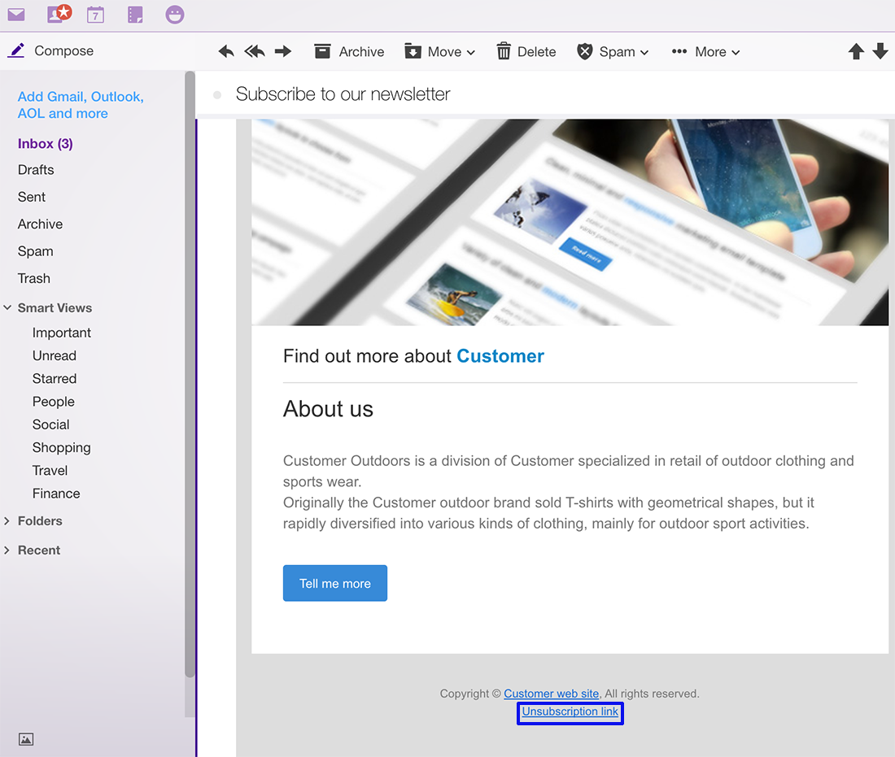

# Profielen synchroniseren{#synchronizing-profiles}

De Schakelaar ACS repliceert gegevens van Campagne v7 aan de Norm van de Campagne. De gegevens die van Campagne v7 worden ontvangen kunnen in de Norm van de Campagne worden gebruikt om leveringen tot stand te brengen. U kunt zien hoe profielen worden gesynchroniseerd door de hieronder vermelde bewerkingen uit te voeren.

* **Nieuwe ontvangers** toevoegen: Creeer een nieuwe ontvanger in Campagne v7 en bevestig dat een overeenkomstig profiel aan de Norm van de Campagne is herhaald. Zie [Een nieuwe ontvanger](#creating-a-new-recipient)maken.
* **Ontvangers** bijwerken: Bewerk een nieuwe ontvanger in Campagne v7 en bekijk het bijbehorende profiel in Campagnestandaard om te bevestigen dat de update is gerepliceerd. Zie Een ontvanger [bewerken](#editing-a-recipient).
* **Een workflow maken in de campagnestandaard**: Maak een workflow in Campagnestandaard die een query bevat met een publiek of profielen die zijn gerepliceerd vanuit Campagne v7. Zie [Een workflow](#creating-a-workflow)maken.
* **Een levering maken in Campagnestandaard**: Volg de workflow om de levering te voltooien. Zie [Een levering](#creating-a-delivery)maken.
* **Controleer de koppeling** voor het opzeggen van abonnementen: Gebruik een het Webtoepassing van de Campagne v7 om ervoor te zorgen dat de keus van de ontvanger om aan de dienst af te melden wordt verzonden naar het gegevensbestand van de Campagne v7. De optie om het ontvangen van de dienst op te houden wordt herhaald aan de Norm van de Campagne. Zie [De koppeling](#changing-the-unsubscription-link)voor abonnementen wijzigen.

## Vereisten {#prerequisites}

De volgende secties beschrijven hoe de Schakelaar ACS u helpt ontvangers in Campagne v7 toevoegen en uitgeven en dan hen in een Standaard levering van de Campagne gebruiken. ACS Connector vereist het volgende:

* Ontvangers in Campaign v7 zijn gerepliceerd naar Campaign Standard.
* Gebruikersrechten om workflows uit te voeren in zowel Campagne v7 als Campagnestandaard.
* Gebruikersrechten om een levering te maken en uit te voeren in Campagnestandaard.

## De koppeling voor het opzeggen van abonnementen wijzigen {#changing-the-unsubscription-link}

Wanneer een ontvanger klikt op de koppeling om het abonnement op te zeggen in een e-mailbericht dat is verzonden door Campagnestandaard, wordt het bijbehorende profiel in Campagnestandaard bijgewerkt. Om ervoor te zorgen dat een herhaald profiel de keus van een gebruiker aan de dienst omvat om zich af te melden, moet de informatie naar Campagne v7 eerder dan de Norm van de Campagne worden verzonden. Om de wijziging uit te voeren, wordt de service voor het opzeggen van abonnementen gekoppeld aan een webtoepassing voor Campagne v7 in plaats van aan de Campagnestandaard.

>[!NOTE]
>
>Vraag uw consultant om de webtoepassing voor de service voor abonnementen te configureren voordat u de onderstaande stappen uitvoert.

## Een nieuwe ontvanger maken {#creating-a-new-recipient}

1. Creeer een nieuwe ontvanger in Campagne v7 voor replicatie aan de Norm van de Campagne. Voer zoveel mogelijk gegevens in, zoals de achternaam, voornaam, e-mailadres en postadres van de ontvanger. Kies echter geen ontvanger **[!UICONTROL Salutation]** omdat deze in de volgende sectie wordt toegevoegd, namelijk [Een ontvanger](#editing-a-recipient)bewerken. Zie [Ontvangers](../../platform/using/adding-profiles.md)toevoegen voor meer informatie.

   

1. Bevestig dat de nieuwe ontvanger aan de Norm van de Campagne is toegevoegd. Wanneer het herzien van het profiel, zorg ervoor dat de gegevens u in Campagne v7 inging ook beschikbaar in de Norm van de Campagne is. Zie [Navigatiebeginselen](https://docs.adobe.com/content/help/en/campaign-standard/using/getting-started/discovering-the-interface/interface-description.html)voor meer informatie over de locatie waar u naar profielen wilt zoeken in de campagnestandaard.

   

   Door gebrek, is de periodieke replicatie voor Schakelaar ACS eens om de 15 minuten. Zie [Gegevensreplicatie](../../integrations/using/acs-connector-principles-and-data-cycle.md#data-replication)voor meer informatie.

## Een ontvanger bewerken {#editing-a-recipient}

De stappen hieronder voor het veranderen van één enkel punt van gegevens bieden een eenvoudig voorbeeld van hoe Campagne v7 het hoofdgegevensbestand voor de Standaard van de Campagne wanneer het gebruiken van gegevensreplicatie wordt. Het wijzigen of verwijderen van herhaalde gegevens in Campagne v7 heeft hetzelfde effect op de overeenkomstige gegevens in de Standaard van de Campagne.

1. Kies de nieuwe ontvanger uit [Een nieuwe ontvanger](#creating-a-new-recipient) maken en bewerk de naam van de ontvanger. Kies bijvoorbeeld een **[!UICONTROL Salutation]** voor de ontvanger (bijvoorbeeld de heer of mevrouw). Zie Een profiel bewerken voor meer informatie.

   

1. Bevestig dat de naam van de ontvanger is bijgewerkt in Campagnestandaard. Zie [Navigatiebeginselen](https://docs.adobe.com/content/help/en/campaign-standard/using/getting-started/discovering-the-interface/interface-description.html)voor meer informatie over de locatie waar u naar profielen wilt zoeken in de campagnestandaard.

   

   Door gebrek, is de periodieke replicatie voor Schakelaar ACS eens om de 15 minuten. Zie [Gegevensreplicatie](../../integrations/using/acs-connector-principles-and-data-cycle.md#data-replication)voor meer informatie.

## Een workflow maken {#creating-a-workflow}

Profielen en services die zijn gerepliceerd vanuit Campaign v7, zijn beschikbaar voor digitale marketers om de rijke gegevens in Campaign Standard te benutten. De instructies tonen hieronder hoe te om een vraag aan een Standaardwerkschema van de Campagne toe te voegen en dan het met het gerepliceerde gegevensbestand te gebruiken.

Zie [Workflows](https://docs.adobe.com/content/help/en/campaign-standard/using/managing-processes-and-data/about-workflows-and-data-management/workflow-data-and-processes.html)voor meer informatie en volledige instructies over de standaardworkflows voor campagnes.

1. Ga naar Campagnestandaard en klik **[!UICONTROL Marketing Activities]**.
1. Klik **[!UICONTROL Create]** in de rechterbovenhoek.
1. Klik **[!UICONTROL Workflow]**.
1. Klik **[!UICONTROL New workflow]** en **[!UICONTROL Next]**.
1. Voer een naam voor de workflow in het **[!UICONTROL Label]** veld in en geef desgewenst aanvullende informatie op. Klik **[!UICONTROL Next]**.
1. Sleep **[!UICONTROL Targeting]** een **[!UICONTROL Query]** doel van links naar de werkruimte.

   

1. Dubbelklik op de **[!UICONTROL Query]** activiteit en kies een parameter die met de gerepliceerde database kan worden gebruikt. U kunt bijvoorbeeld:

   * Sleep **[!UICONTROL Profiles]** naar de werkruimte. Gebruik het keuzemenu voor velden om te zoeken naar profielen die zijn gerepliceerd vanuit Campagne v7. **[!UICONTROL Is external resource]**
   * Sleep andere queryparameters om de gekopieerde profielen verder te activeren.

## Een levering maken {#creating-a-delivery}

>[!NOTE]
>
>De instructies voor het maken van de levering gaan verder met de workflow die is gestart met het [maken van een workflow](#creating-a-workflow).

Digitale marketers kunnen een Campagne v7-webtoepassing gebruiken om ervoor te zorgen dat de keuze van een ontvanger om zich af te melden voor een service naar de Campagne v7-database wordt verzonden. Nadat de ontvanger de unsubscription verbinding klikt, wordt de optie om op te houden die de dienst ontvangt herhaald van Campagne v7 aan de Norm van de Campagne. Zie [De koppeling](#changing-the-unsubscription-link)voor abonnementen wijzigen voor meer informatie.

Voer de onderstaande stappen uit om een e-maillevering toe te voegen aan een bestaande workflow met de service voor het opzeggen van abonnementen die is gemaakt in Campagne v7. Zie dit [document](https://docs.adobe.com/content/help/en/campaign-standard/using/managing-processes-and-data/about-workflows-and-data-management/workflow-data-and-processes.html)voor meer informatie en volledige instructies over workflows voor de campagnestandaard.

>[!NOTE]
>
>Vraag uw consultant om de webtoepassing voor de service voor abonnementen te configureren voordat u de onderstaande stappen uitvoert.

1. Klik **[!UICONTROL Channels]** links.
1. Sleep **[!UICONTROL Email delivery]** naar de bestaande workflow in de werkruimte.

   

1. Dubbelklik op de **[!UICONTROL Email delivery]** activiteit en kies **[!UICONTROL Single send email]** of **[!UICONTROL Recurring email]**. Selecteer de gewenste opties en klik op **[!UICONTROL Next]**.
1. Klik **[!UICONTROL Send via email]** en klik **[!UICONTROL Next]**.

   

1. Voer in het **[!UICONTROL Label]** veld een naam voor de levering in en geef desgewenst aanvullende informatie op. Klik **[!UICONTROL Next]**.

   

1. Voer in het **[!UICONTROL Subject]** veld het onderwerp in dat wordt weergegeven in het e-mailpostvak van de ontvanger.
1. Klik **[!UICONTROL Change content]** om een HTML-sjabloon toe te voegen.

   

1. Kies inhoud die de koppeling bevat om het abonnement op de service op te zeggen. Klik **[!UICONTROL Confirm]**.

   

1. De huidige koppeling voor het opzeggen van abonnementen moet worden vervangen door een nieuwe koppeling die gebruikmaakt van de webtoepassing die door uw consultant is gemaakt. Zoek de koppeling voor het opzeggen van abonnementen onder aan de e-mailinhoud en klik er eenmaal op. Klik op het prullenbakpictogram om de koppeling te verwijderen.

   

1. Klik binnen hetzelfde inhoudsgebied en typ de koppeling **Abonnement opzeggen**.

   

1. Markeer de tekst met de cursor en klik op het ketingpictogram.
1. Klik **[!UICONTROL Link to a landing page]**.

   

1. Klik op het mappictogram om de openingspagina te kiezen.

   

1. Kies de webtoepassing die door de consultant is gemaakt en klik op **[!UICONTROL Confirm]**.

   

1. Klik **[!UICONTROL Create]**.
1. Ga terug naar de workflow door op de naam van de levering te klikken.

   

1. Klik **[!UICONTROL Start]** om de levering te verzenden. Het pictogram voor verzending via e-mail knippert om aan te geven dat het wordt voorbereid voor levering.

   

1. Dubbelklik op het **[!UICONTROL Email delivery]** kanaal en kies **[!UICONTROL Confirm]** om de e-mail te verzenden. Klik **[!UICONTROL OK]** om de berichten te verzenden.

   

## De service voor het annuleren van abonnementen controleren {#verifying-the-unsubscription-service}

Volg de instructies in [Een workflow](#creating-a-workflow) maken en een levering  maken voordat u verdergaat naar de onderstaande stappen.

1. De ontvanger klikt op de koppeling om het abonnement op te zeggen in de e-maillevering.

   

1. De ontvanger bevestigt het abonnement.

   

1. De ontvankelijke gegevens in Campagne v7 worden bijgewerkt om erop te wijzen dat de gebruiker heeft geabonneerd. Bevestig dat het vakje voor de ontvanger **[!UICONTROL No longer contact (by any channel)]** wordt gecontroleerd. Zie Een profiel bewerken voor meer informatie over het weergeven van een ontvanger in Campagne v7.

   

1. Ga naar Campagnestandaard en open de profieldetails voor de ontvanger. Bevestig dat naast **[!UICONTROL No longer contact (by any channel)]** deze optie een selectievakje wordt weergegeven. Zie [Navigatiebeginselen](https://docs.adobe.com/content/help/en/campaign-standard/using/getting-started/discovering-the-interface/interface-description.html)voor meer informatie over de locatie waar u naar profielen wilt zoeken in de campagnestandaard.

   

