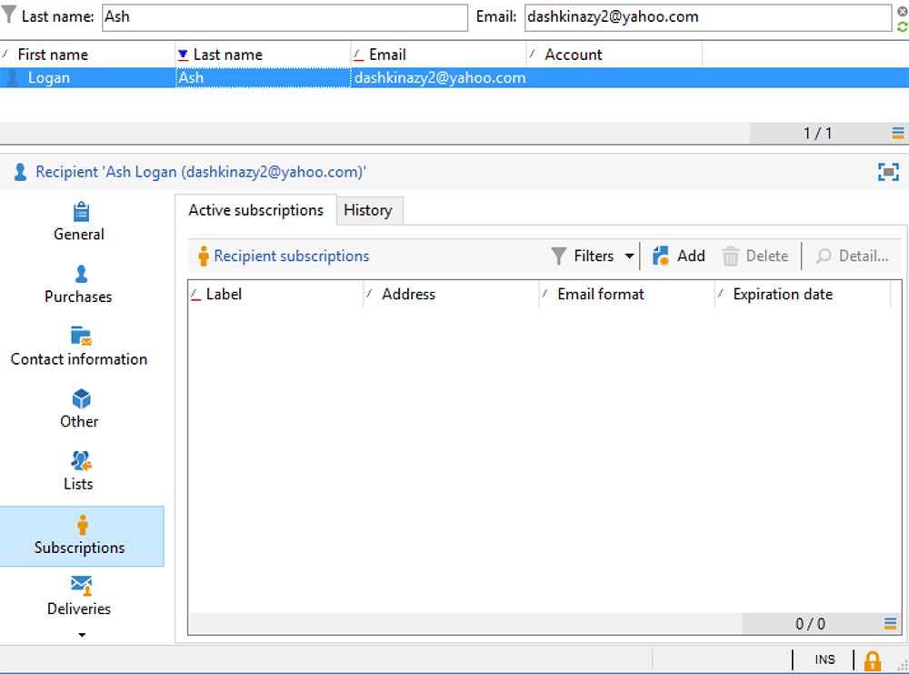
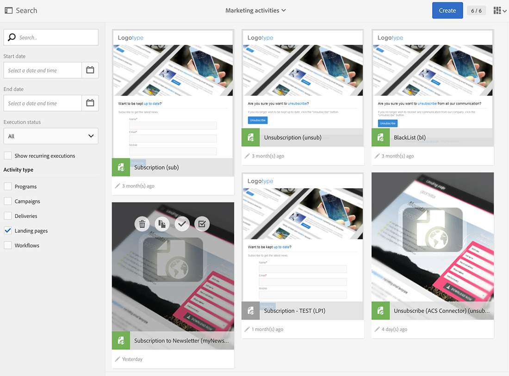

# Webapplicaties synchroniseren{#synchronizing-web-applications}

In dit geval, zullen wij een mededeling, gebruikend Campaign Standard, verzenden die een verbinding aan een Webtoepassing van de Campagne v7 omvat. Wanneer de ontvanger op de koppeling in de e-mail klikt, geeft de webtoepassing een formulier weer dat verschillende velden bevat die zijn voorgeladen met de gegevens van de ontvanger en een abonnementkoppeling naar een nieuwsbrief. De ontvanger kan zijn gegevens bijwerken evenals aan de dienst intekenen. Zijn profiel zal in Campaign v7 worden bijgewerkt en de informatie zal in Campaign Standard worden herhaald.

Als u veel services en webtoepassingen hebt in Campaign v7, kunt u ervoor kiezen deze niet allemaal opnieuw te maken in Campaign Standard. De Schakelaar ACS staat u toe om al uw bestaande het Webtoepassingen en de diensten van de Campagne v7 te gebruiken en hen te verbinden aan een levering die door Campaign Standard wordt verzonden.

## Vereisten {#prerequisites}

Hiervoor hebt u het volgende nodig:

* Ontvangers die zijn opgeslagen in de Campagne v7-database en zijn gesynchroniseerd met Campaign Standard. Zie de [Profielen synchroniseren](../../integrations/using/synchronizing-profiles.md) sectie.
* een service en een webtoepassing die zijn gemaakt en gepubliceerd in Campaign v7.
* de webtoepassing moet een **[!UICONTROL Pre-loading]** activiteit met behulp van **[!UICONTROL Adobe Campaign encryption]** identificatiemethode.

## Webtoepassing en -service maken {#creating-the-web-application-and-service}

In Campagne v7, kunt u Webtoepassingen tot stand brengen die ontvangers toestaan om aan de dienst in te tekenen. De webtoepassing en webservice zijn ontworpen en opgeslagen in Campagne v7 en u kunt deze service bijwerken via communicatie via een Campaign Standard. Raadpleeg voor meer informatie over webtoepassingen in Campagne v7 [deze sectie](../../web/using/adding-fields-to-a-web-form.md#subscription-checkboxes).

In Campaign v7 zijn de volgende objecten gemaakt:

* een nieuwsbrief
* een webtoepassing met een **[!UICONTROL Pre-loading]**, **[!UICONTROL Page]** en **[!UICONTROL Storage]** activiteit.

1. Ga naar **[!UICONTROL Resources > Online > Web applications]** en selecteert u een bestaande webtoepassing.

   

1. Bewerk de **[!UICONTROL Preloading]** activiteit. De **[!UICONTROL Auto-load data referenced in the form]** is ingeschakeld en **[!UICONTROL Adobe Campaign encryption]** de identificatiemethode is geselecteerd. Hierdoor kan de webtoepassing de formuliervelden vooraf laden met de gegevens die zijn opgeslagen in de Adobe Campaign-database. Zie [dit document](../../web/using/publishing-a-web-form.md#pre-loading-the-form-data).

   

1. Bewerk de **[!UICONTROL Page]**. Er zijn drie velden (Naam, E-mail en Telefoon) opgenomen, evenals een selectievakje om de ontvanger uit te nodigen zich in te schrijven op een nieuwsbrief (**[!UICONTROL Newsletter]** service).

   

1. Ga naar **[!UICONTROL Profiles and Target > Services and subscriptions]** en opent u de **[!UICONTROL Newsletter]** service. Dit is de dienst die van de mededeling van het Campaign Standard zal worden bijgewerkt. U kunt zien dat geen ontvanger zich op deze service heeft geabonneerd.

   

1. Ga naar **[!UICONTROL Profiles and Targets > Recipient]** en selecteer een ontvanger. U ziet dat dit profiel nog niet op de service is geabonneerd.

   

## De gegevens repliceren {#replicating-the-data}

Voor het repliceren van de benodigde gegevens tussen Campagne v7 en Campaign Standard zijn er verschillende sjablonen voor de replicatiewerkstroom beschikbaar. De **[!UICONTROL Profiles replication]** worden alle Campagne v7-ontvangers automatisch naar het Campaign Standard gerepliceerd. Zie [Technische en replicatieworkflows](../../integrations/using/acs-connector-principles-and-data-cycle.md#technical-and-replication-workflows). De **[!UICONTROL Landing pages replication]** de workflow maakt de replicatie mogelijk van de webtoepassingen die we in Campaign Standard willen gebruiken.

Ga als volgt te werk om te controleren of de gegevens correct zijn gerepliceerd:

1. Klik in het beginscherm op **[!UICONTROL Customer profiles]**.

   

1. Zoek naar uw Ontvanger van de Campagne v7 en controleer dat deze ontvanger in Campaign Standard verschijnt.

   

1. Klik in de bovenste balk op **[!UICONTROL Marketing activities]** en zoek naar de webtoepassing Campagne v7. Het wordt weergegeven als een openingspagina in Campaign Standard.

   

1. Klik op de knop **[!UICONTROL Adobe Campaign]** logo, in de linkerbovenhoek selecteert u **Profielen en publiek > Services** en controleer of de nieuwsbrief ook beschikbaar is.

   

## E-mail ontwerpen en verzenden {#designing-and-sending-the-email}

In dit deel, zullen wij zien hoe te om een verbinding, in een Campaign Standard e-mail, aan de landingspagina te omvatten die van een de Webtoepassing van de Campagne v7 wordt herhaald.

De stappen voor het maken, ontwerpen en verzenden van de e-mail zijn dezelfde als voor een klassieke e-mail. Zie de [Adobe Campaign Standard](https://experienceleague.adobe.com/docs/campaign-standard/using/campaign-standard-home.html?lang=nl) documentatie.

1. Maak een nieuwe e-mail en kies een of meer gerepliceerde profielen als het publiek.
1. Bewerk de inhoud en voeg een **[!UICONTROL Link to a landing page]**.

   

1. Selecteer de bestemmingspagina die van de het Webtoepassing van de Campagne v7 werd herhaald.

   

1. Bereid uw e-mail voor, verzend uw proefdrukken en verzend het definitieve e-mailbericht.
1. Een van de ontvangers opent de e-mail en klikt op de koppeling naar het abonnement op de nieuwsbrief.

   

1. Deze ontvanger voegt een telefoonnummer toe en schakelt het abonnementsvak voor de nieuwsbrief in.

   

## De bijgewerkte gegevens ophalen {#retrieving-the-updated-information}

Wanneer de ontvanger zijn gegevens bijwerkt via de webtoepassing, haalt Adobe Campaign v7 synchroon de bijgewerkte informatie op. Het wordt dan herhaald van Campaign v7 aan Campaign Standard.

1. Ga in Campagne v7 naar **[!UICONTROL Profiles and Target > Services and subscriptions]** en opent u de **[!UICONTROL Newsletter]** service. U ziet dat de ontvanger nu in de lijst met abonnees wordt weergegeven.

   

1. Ga naar **[!UICONTROL Profiles and Targets > Recipient]** en selecteert u de ontvanger. U kunt zien dat het telefoonnummer nu is opgeslagen.

   

1. In de **[!UICONTROL Subscriptions]** tab , we kunnen ook zien dat deze ontvanger zich heeft geabonneerd op de nieuwsbrief service .

   

1. Wacht een paar minuten totdat de workflow voor profielreplicatie wordt uitgevoerd.
1. In Campaign Standard, heb toegang tot uw ontvankelijk profiel om te controleren dat de bijgewerkte gegevens correct van Campagne v7 zijn herhaald.

   

1. Bewerk het profiel. U kunt zien dat het telefoonnummer is bijgewerkt.

   

1. Klik op de knop **[!UICONTROL Subscriptions]** tab. De nieuwsbrief wordt nu weergegeven.

   
