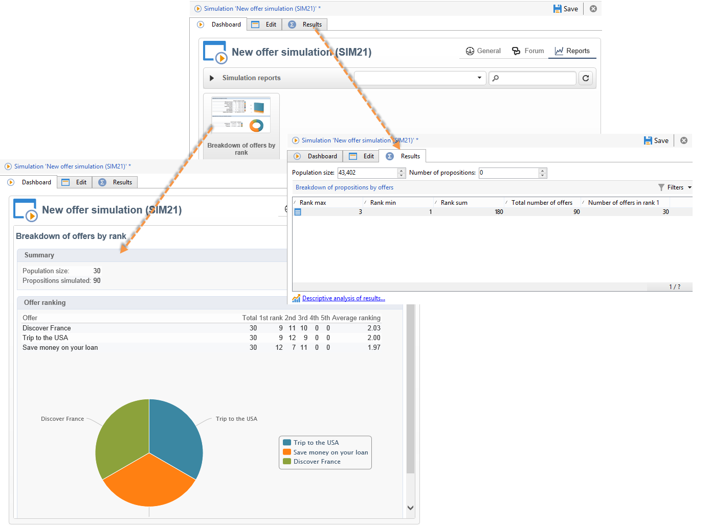

# Simulatie van aanbiedingen{#about-offers-simulation}

De **Simulatie** kunt u de distributie testen van aanbiedingen die tot een categorie of een omgeving behoren voordat u uw voorstel naar ontvangers verzendt.

Bij de simulatie wordt rekening gehouden met de context en de subsidiabiliteitsregels die eerder op aanbiedingen van toepassing waren (zie [Overzicht van de aanbiedingscatalogus](../../interaction/using/offer-catalog-overview.md)) en de regels voor de presentatie ervan (zie [Presentatie van aanbieding beheren](../../interaction/using/managing-offer-presentation.md)). Dit laat u diverse versies van uw aanbiedingsvoorstel testen en verfijnen zonder eigenlijk een aanbieding of over/onder het eisen van een doel te gebruiken, aangezien de simulatie geen effect op de gerichte ontvangers heeft.

Lees de onderstaande stappen voor meer informatie over het simuleren van een aanbieding.

[ U kunt ook deze video](https://helpx.adobe.com/campaign/classic/how-to/simulate-offer-in-acv6.html?playlist=/ccx/v1/collection/product/campaign/classic/segment/digital-marketers/explevel/intermediate/applaunch/introduction/collection.ccx.js&amp;ref=helpx.adobe.com) bekijken.

## Belangrijkste stappen voor het creëren van een simulatie {#main-steps-for-creating-a-simulation}

Voer de volgende stappen uit om een simulatie van uw aanbiedingen uit te voeren:

1. In de **[!UICONTROL Profiles and Targets]** klikt u op de knop **[!UICONTROL Simulations]** klikt u op de koppeling **[!UICONTROL Create]** knop.

   

1. Sla de simulatie op en bewerk deze die u zojuist hebt gemaakt.
1. Ga naar de **[!UICONTROL Edit]** en geeft u de uitvoeringsinstellingen op.

   Raadpleeg voor meer informatie hierover [Instellingen voor uitvoering](../../interaction/using/execution-settings.md).

   

   >[!NOTE]
   >
   >De montages van de uitvoering zijn slechts beschikbaar als u Interactie met Campagne gebruikt.

1. Geef het simulatiebereik op.

   Raadpleeg voor meer informatie hierover [Definitie van het toepassingsgebied](../../interaction/using/simulation-scope.md#definition-of-the-scope).

   

1. Rapportassen toevoegen om de **[!UICONTROL Offer distribution by rank]** rapport (optioneel).

   Raadpleeg voor meer informatie hierover [Rapportassen toevoegen](../../interaction/using/simulation-scope.md#adding-reporting-axes).

   

1. Klikken **[!UICONTROL Save]** om de simulatie-instellingen op te nemen.
1. Start de simulatie via het dashboard.

   

1. Controleer het simulatieresultaat en toon het analyserapport.

   Raadpleeg voor meer informatie hierover [Simulatie bijhouden](../../interaction/using/simulation-tracking.md).

   
