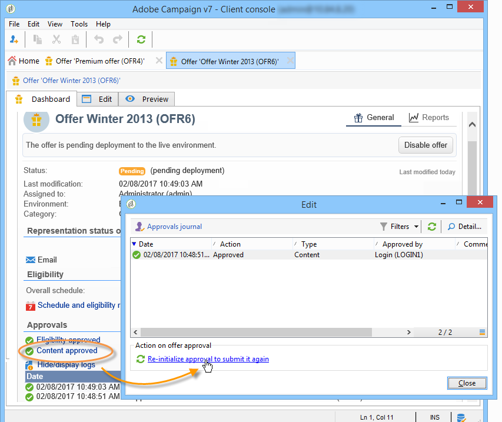
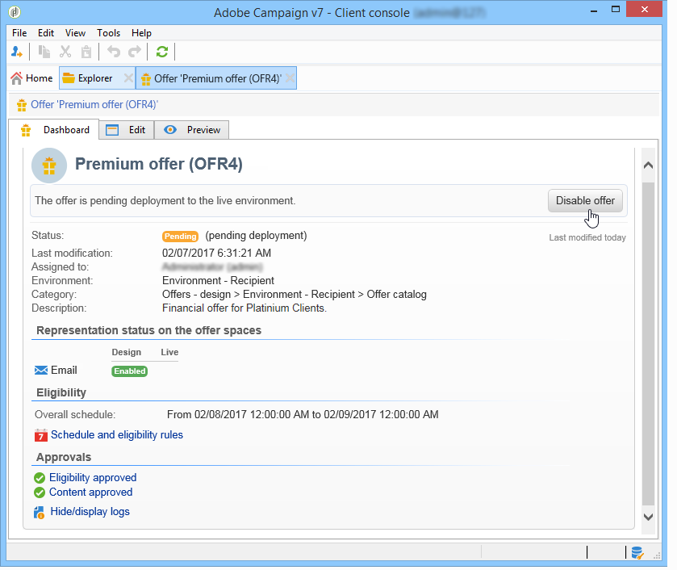

# Een aanbieding goedkeuren en activeren{#approving-and-activating-an-offer}

Zodra de inhoud van het aanbod volledig is, moet u het goedkeuren voor het worden gedupliceerd in het levende milieu en worden geleverd. Goedkeuring heeft betrekking op de inhoud van het aanbod en de geschiktheid ervan.

De banner op het aanbiedingsdashboard vertelt u of de aanbieding de goedkeuringscyclus moet of niet.

## Aanbiedingsinhoud goedkeuren {#approving-offer-content}

Als u inhoud van het aanbod goedkeurt, selecteert u de representatie(s) die u in de live omgeving beschikbaar wilt maken.

De inhoud van een aanbieding heeft één representatie per ruimte. Aangezien elke aanbiedingsruimte zijn eigen structuur en zijn eigen renderingfuncties heeft, kan de aanbiedingsvertegenwoordiging variëren.

U kunt de inhoud van het voorstel op bepaalde beschikbare ruimten goedkeuren en op andere plaatsen afwijzen.

>[!CAUTION]
>
>Zodra de inhoud en de geschiktheid van een aanbieding zijn goedgekeurd, wordt de publicatieworkflow (kennisgeving van aanbieding) automatisch uitgevoerd en wordt de aanbieding live en beschikbaar gesteld op alle geactiveerde ruimten.

Voer de volgende stappen uit om de inhoud van de aanbieding goed te keuren:

1. Klik op de **[!UICONTROL Approval]** knop en selecteer **[!UICONTROL Approve content]** in het pop-upmenu.

   

1. Selecteer in de vervolgkeuzelijst de weergaven die u wilt blijven bewerken of de weergaven die u wilt publiceren naar de live omgeving en klik op **[!UICONTROL Content approval]**.

   

   Zodra de inhoud van het voorstel wordt goedgekeurd, wordt de informatie bijgewerkt op de lijst van het aanbiedingdashboard.

   

   >[!NOTE]
   >
   >De **[!UICONTROL Content approved]** vermelding betekent niet dat alle aanbiedingsvormen zijn toegelaten en goedgekeurd. Hiermee wordt aangegeven dat het goedkeuringsproces voor inhoud is voltooid, ongeacht of alle aanbiedingen zijn ingeschakeld/goedgekeurd of niet.

## Aanbiedingsgeschiktheid voor goedkeuring {#approving-offer-eligibility}

Goedkeuring van de aanbieding betekent aanvaarding of afwijzing van de aanbiedingsgewichten en de toelatingsregels die ook in de aanbieding zijn geconfigureerd of die zijn overgenomen van de regels die in de bovenliggende categorie zijn gemaakt.

>[!CAUTION]
>
>Zodra de inhoud en de geschiktheid van een aanbieding zijn goedgekeurd, wordt de publicatieworkflow (kennisgeving van aanbieding) automatisch uitgevoerd en wordt de aanbieding live en beschikbaar gesteld op alle geactiveerde ruimten.

* Klik op de volledige lijst met regels om deze weer te geven **[!UICONTROL Schedule and eligibility rules]**.

   

* Als u de regels voor geschiktheid wilt wijzigen, klikt u op **[!UICONTROL Reject]** en vervolgens op **[!UICONTROL Eligibility approval]**.

   

   De verschillende statussen worden bijgewerkt op het aanboddddashboard.

   

* Klik op **[!UICONTROL Approve eligibility]** als je de voorwaarden van de aanbieding wilt accepteren.

   

   Goedkeuren, zo nodig een opmerking toevoegen en klikken **[!UICONTROL Eligibility approval]**.

   

   De verschillende statussen worden bijgewerkt op het aanboddddashboard.

   

## Goedkeuring bijhouden {#approval-tracking}

Goedkeuring kan worden gevolgd op het dashboard van de aanbieding. Klik **[!UICONTROL Hide/display logs]** om het te openen.

>[!NOTE]
>
>Tracking is ook beschikbaar op het **[!UICONTROL Audit]** tabblad van de aanbieding, met details over de opmerkingen van de revisoren.

## De goedkeuring opnieuw starten {#restart-the-approval}

Nadat de goedkeuring is gestart, kan deze opnieuw worden gestart. Volg deze instructies om dit te doen:

1. Klik op **[!UICONTROL Content approved]** het aanbiedingdashboard.
1. Selecteer in het **[!UICONTROL Edit]** venster dat wordt weergegeven de goedkeuring die u opnieuw wilt starten en klik op **[!UICONTROL Re-initialize approval to submit it again]**.
1. Bevestigen door te klikken **[!UICONTROL Ok]**.

## De aanbieding publiceren {#publishing-the-offer}

Zodra de inhoud en de geschiktheid van een aanbieding allebei zijn goedgekeurd, wordt de aanbieding gepubliceerd door een werkschema dat automatisch voor elke aanbieding loopt de goedkeuringscyclus is gebeëindigd. Het **[!UICONTROL Offer notification]** werkschema loopt ook elk uur om (indien nodig) de ruimten en de categorieën te synchroniseren in de aanbiedingscatalogus van het ontwerpmilieu aan het levende milieu.

Het dashboard van de aanbieding die beschikbaar is in de ontwerpomgeving bevat informatie over publiceren, waaronder de naam van de matching-aanbieding in de live omgeving.

Klik op het aanbiedingslabel om het aanbod weer te geven dat beschikbaar is in de live omgeving: de live aanbieding heeft een dashboard dat alle relevante informatie bevat .

## Een aanbieding uitschakelen {#disabling-an-offer}

Zodra de aanbieding wordt goedgekeurd, kunt u het onbruikbaar maken.

Ga hiertoe naar het dashboard voor een online aanbieding of een aanbieding die wacht om online te gaan en klik op **[!UICONTROL Disable offer]**.

U kunt een categorie ook rechtstreeks uitschakelen door naar het **[!UICONTROL Eligibility]** tabblad te gaan en het **[!UICONTROL Enabled]** vak te selecteren.

>[!NOTE]
>
>Wanneer een aanbieding in een ontwerpomgeving wordt verwijderd, wordt deze automatisch gedeactiveerd in de gekoppelde online omgeving. Na een bewaarperiode voor voorstellen worden de gedeactiveerde aanbiedingen uit de online omgeving verwijderd.

