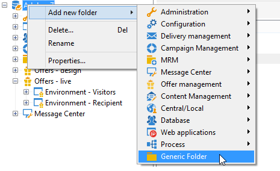

# Een testomgeving maken{#creating-a-test-environment}

Voer de volgende stappen uit om een testomgeving (sandboxmodus) te maken:

>[!IMPORTANT]
>
>Gebruik deze omgevingsmethode alleen voor testomgevingen. In alle andere gevallen, gebruik de tovenaar van de doelafbeelding. Raadpleeg voor meer informatie hierover [Een aanbiedingsomgeving maken](../../interaction/using/live-design-environments.md#creating-an-offer-environment).

1. Start de Adobe Campaign-verkenner en ga naar de hoofdmap van de instantie.
1. Klik met de rechtermuisknop en voeg een **[!UICONTROL Generic folder]** via de vervolgkeuzemenu&#39;s.

   

1. Ga vervolgens naar de map die u zojuist hebt gemaakt en voeg een **[!UICONTROL Offer environment]** met de rechtermuisknop op de menu&#39;s klikken.

   

1. Pas hetzelfde proces toe om de omgevingssubmappen en -elementen te maken.
1. Nadat uw tests zijn voltooid en u de omgeving wilt gebruiken in de productie, dupliceert u de aanbiedingen en spaties in de ontwerpomgeving. (Klik met de rechtermuisknop > **[!UICONTROL Actions]** > **[!UICONTROL Deploy]** ).

   
