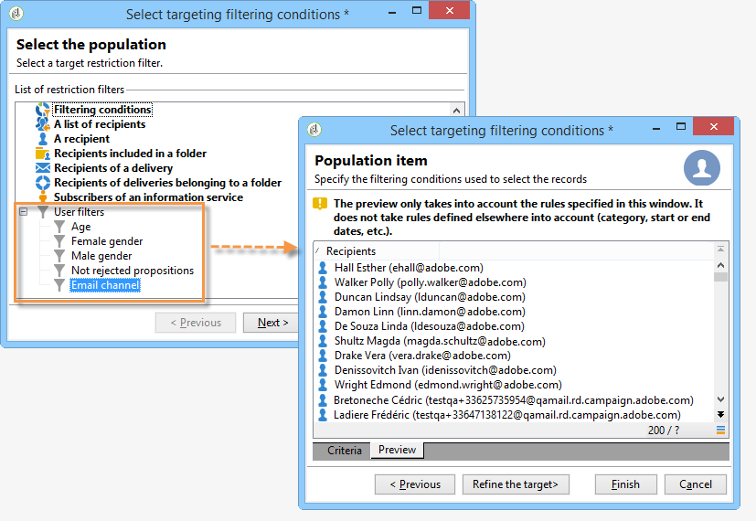
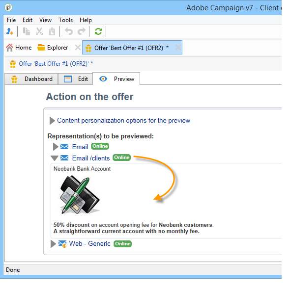

# Een aanbieding maken{#creating-an-offer}


## De aanbieding maken {#creating-the-offer}

Voer de volgende stappen uit om een aanbieding te maken:

1. Ga naar de tab **[!UICONTROL Campaigns]** en klik op de koppeling **[!UICONTROL Offers]** .

   

1. Klik op de knop **[!UICONTROL Create]**.

   

1. Wijzig het label en selecteer de categorie waartoe de aanbieding moet behoren.

   

1. Klik op **[!UICONTROL Save]** om de aanbieding te maken.

   

   De aanbieding is beschikbaar in het platform en zijn inhoud kan worden gevormd.

   

## Geschiktheid van aanbieding configureren {#configuring-offer-eligibility}

Definieer op het tabblad **[!UICONTROL Eligibility]** de periode waarin de aanbieding geldig is en kan worden weergegeven, de filters die op het doel en het aanbiedingsgewicht moeten worden toegepast.

### Vaststelling van de subsidiabiliteitsperiode van een aanbieding {#defining-the-eligibility-period-of-an-offer}

Om de subsidiabiliteitsperiode van de aanbieding te bepalen, gebruikt u de vervolgkeuzelijsten en selecteert u een begin- en einddatum in de kalender.


Buiten deze datums wordt de aanbieding niet geselecteerd door de interactie-engine. Als u ook de toelatingsdata voor de categorie van aanbiedingen hebt gevormd, zal de meest beperkende periode van toepassing zijn.

### Filters op het doel {#filters-on-the-target}

U kunt filters op het aanbiedingsdoel toepassen.

Klik hiertoe op de koppeling **[!UICONTROL Edit query]** en selecteer het filter dat u wilt toepassen. (Verwijs naar [ deze sectie ](../../platform/using/steps-to-create-a-query.md#step-4---filter-data)).


Als er al vooraf gedefinieerde filters zijn gemaakt, kunt u deze selecteren in de lijst met gebruikersfilters. Voor meer op dit, verwijs naar [ Creërend vooraf bepaalde filters ](../../interaction/using/creating-predefined-filters.md).



### Aanbiedingsgewicht {#offer-weight}

Om de motor in staat te stellen tussen verscheidene aanbiedingen te beslissen dat het doel verkiesbaar is, moet u één of meerdere gewichten aan de aanbieding toewijzen. U kunt filters op het doel indien nodig ook toepassen of de aanbiedingsruimte beperken waarop het gewicht van toepassing is. Een aanbod met een groter gewicht krijgt de voorkeur boven een aanbod met minder gewicht.

U kunt veelvoudige gewichten voor de zelfde aanbieding vormen, bijvoorbeeld om sup-periodes, specifieke doelstellingen of zelfs een aanbiedingsruimte te onderscheiden.

Bijvoorbeeld, kan een aanbieding een gewicht van A voor contacten hebben tussen 18 en 25 jaar en een gewicht van B voor contacten boven dat gamma. Als een aanbieding de hele zomer in aanmerking komt, kan zij ook een gewicht van A in juli en een gewicht van B in augustus hebben.

>[!NOTE]
>
>Het toegewezen gewicht kan tijdelijk worden gewijzigd op basis van de parameters van de categorie waartoe de aanbieding behoort. Voor meer op dit, verwijs naar [ Creërend aanbiedingscategorieën ](../../interaction/using/creating-offer-categories.md).

Voer de volgende stappen uit om een dikte in een aanbieding te maken:

1. Klik op **[!UICONTROL Add]**.

   

1. Wijzig het label en wijs een gewicht toe. Standaard is dit 1.

   

   >[!IMPORTANT]
   >
   >Indien geen gewicht wordt opgegeven (0), wordt het streefcijfer niet in aanmerking genomen voor de aanbieding.

1. Als u het gewicht gedurende een bepaalde periode wilt toepassen, definieert u de toelatingsdata.

   

1. Beperk zo nodig het gewicht tot een specifieke aanbiedingsruimte.

   

1. Pas een filter toe op een doel.

   

1. Klik op **[!UICONTROL OK]** om de dikte op te slaan.

   

   >[!NOTE]
   >
   >Als een doel in aanmerking komt voor meerdere gewichten voor een geselecteerde aanbieding, behoudt de motor het beste (hoogste) gewicht. Bij het oproepen van de aanbiedingsmotor, wordt een aanbieding een maximum van eens per contact geselecteerd.

### Samenvatting van de regels inzake de subsidiabiliteit van aanbiedingen {#a-summary-of-offer-eligibility-rules}

Zodra de configuratie is voltooid, zal een samenvatting van de subsidiabiliteitsregels beschikbaar zijn op het biederdashboard.

Klik op de koppeling **[!UICONTROL Schedule and eligibility rules]** om deze weer te geven.


## De inhoud van de aanbieding maken {#creating-the-offer-content}

1. Klik op de tab **[!UICONTROL Edit]** en klik vervolgens op de tab **[!UICONTROL Content]** .

   

1. Vul de verschillende velden van de inhoud van de aanbieding in.

   * **[!UICONTROL Title]** : geef de titel op die u wilt maken, die in uw voorstel wordt weergegeven. Waarschuwing: dit verwijst niet naar het label van de aanbieding, dat is gedefinieerd op het tabblad **[!UICONTROL General]** .
   * **[!UICONTROL Destination URL]** : geef de URL van je aanbieding op. Om correct te worden verwerkt, moet het met &quot;http://&quot;of &quot;https://&quot;beginnen.
   * **[!UICONTROL Image URL]** : geef een URL of een toegangspad op naar de afbeelding van uw aanbieding.
   * **[!UICONTROL HTML content]** / **[!UICONTROL Text content]** : voer de tekst van uw voorstel in op het tabblad dat u wilt gebruiken. Voor het genereren van reeksspatiëring moet **[!UICONTROL HTML content]** bestaan uit HTML-elementen die kunnen worden ingesloten in een `<div>` -tekstelement. Het resultaat van een `<table>` -element op de pagina HTML is bijvoorbeeld als volgt:

   ```
      <div> 
       <table>
        <tr>
         <th>Month</th>
         <th>Savings</th>   
        </tr>   
        <tr>    
         <td>January</td>
         <td>$100</td>   
        </tr> 
       </table> 
      </div>
   ```

   Het bepalen van acceptatie URL wordt voorgesteld in [ Vormend de status wanneer het voorstel ](../../interaction/using/creating-offer-spaces.md#configuring-the-status-when-the-proposition-is-accepted) sectie wordt goedgekeurd.

   

   Als u de vereiste velden wilt zoeken zoals deze zijn gedefinieerd tijdens de configuratie van de aanbiedingsruimte, klikt u op de koppeling **[!UICONTROL Content definitions]** om de lijst weer te geven. Voor meer op dit, verwijs naar [ Creërend aanbiedingsruimten ](../../interaction/using/creating-offer-spaces.md).

   

   In dit voorbeeld moet de aanbieding een titel, een afbeelding, HTML-inhoud en een doel-URL bevatten.

## Voorbeeld van de aanbieding bekijken {#previewing-the-offer}

Zodra de inhoud van uw voorstel is geconfigureerd, kunt u een voorbeeld van het voorstel bekijken zoals het voor de ontvanger wordt weergegeven. Dit doet u als volgt:

1. Klik op de tab **[!UICONTROL Preview]** .

   

1. Selecteer de representatie van het voorstel dat u wilt bekijken.

   

1. Als u de inhoud van de aanbieding hebt gepersonaliseerd, selecteer het doel van de aanbieding om personalisatie te bekijken.

   

## Het creëren van een hypothese over een aanbieding {#creating-a-hypothesis-on-an-offer}

Je kunt hypothesen maken voor je voorstellen. Hiermee kunt u de gevolgen van uw aanbiedingen voor de aankopen van het betrokken product bepalen.

>[!NOTE]
>
>Deze hypothesen worden uitgevoerd via Response Manager. Controleer hiervoor uw licentieovereenkomst.

Op het tabblad **[!UICONTROL Measure]** wordt verwezen naar de hypothesen die worden uitgevoerd op een aanbiedingsvoorstel.

Het creëren van hypotheses is gedetailleerd in [ deze pagina ](../../response/using/about-response-manager.md).


