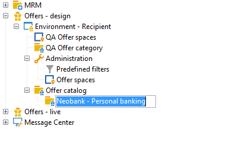
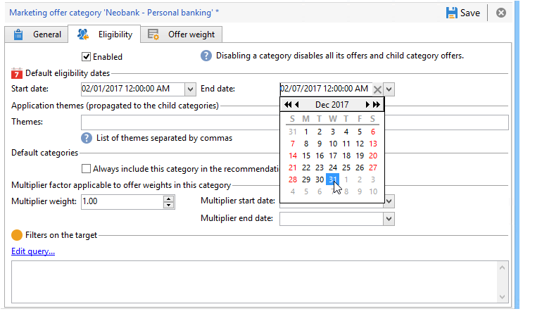

# Categorieën voorstellen maken{#creating-offer-categories}

Het creëren van categorieën aanbiedingen kan alleen in de **[!UICONTROL Design]** omgeving plaatsvinden. Zij worden automatisch in de **[!UICONTROL Live]** omgeving (d.w.z. beschikbaar gesteld) ingezet wanneer de gecreëerde/gewijzigde aanbieding(en) die zij bevatten, worden goedgekeurd. Standaard bevat de **[!UICONTROL Design]** omgeving een categorie voor alle aanbiedingen. U kunt subcategorieën maken om een hiërarchie toe te voegen aan de catalogusaanbiedingen.

Voor elke categorie kunt u de toelatingsdata bepalen, d.w.z. een periode waarna de aanbiedingen in de categorie niet langer aan hun doel mogen worden gepresenteerd. Als u wilt dat de aanbiedingen van een bepaalde categorie als prioriteit door de aanbiedingsmotor worden geselecteerd, om een product bijvoorbeeld beter toegankelijk te maken, kunt u hun gewicht gedurende een bepaalde periode verhogen door een vermenigvuldigingsgewicht aan de categorie toe te voegen.

Voer de volgende stappen uit om een extra categorie te maken:

1. Ga naar de **[!UICONTROL Offer catalog]** map.

   

1. Klik met de rechtermuisknop en selecteer een optie in de **[!UICONTROL Create a new "Offer category" folder]** vervolgkeuzelijst.

   

1. Geef de categorie een nieuwe naam. U kunt het label later bewerken met het **[!UICONTROL General]** tabblad.

   

   >[!NOTE]
   >
   >Herhaal deze stappen om zoveel categorieën te maken als nodig is.

   Daarna kunt u zo nodig:

   * u kunt toelatingsdatums toewijzen vanaf het **[!UICONTROL Eligibility]** tabblad.

      

   * Voer in het **[!UICONTROL Themes]** veld trefwoorden in die kunnen worden gebruikt om voorstellen te selecteren vanuit deze categorie.

      

      >[!NOTE]
      >
      >Wanneer u de aanbiedingsengine aanroept, wordt alleen het gedeelte van de catalogus geselecteerd waarin de thema&#39;s of categorieën overeenkomen met de parameters.

   * Je kunt tijdelijk het gewicht van een rubriek verhogen voor een bepaalde periode via het **[!UICONTROL Multiplier weight]** veld.

      

Op het dashboard van de aanbiedingen in de categorie staat een overzicht van de subsidiabiliteitsregels. Klik op de **[!UICONTROL Schedule and eligibility rules of the offer]** koppeling om deze weer te geven.

