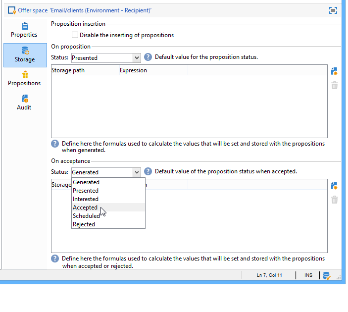
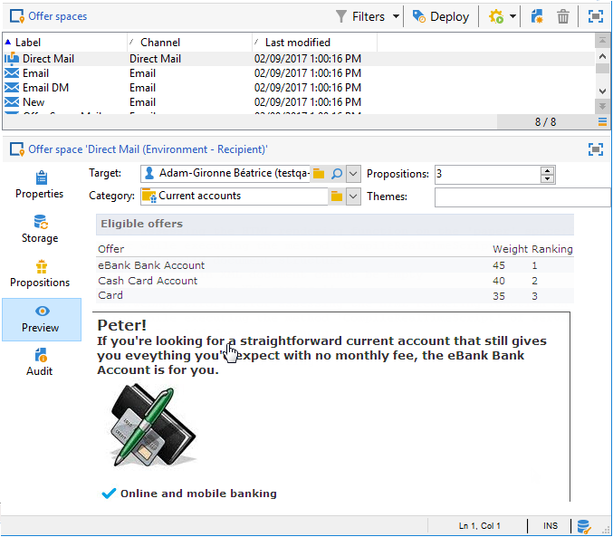

# Aanbiedingsruimten maken{#creating-offer-spaces}

De aanbieding ruimteverwezenlijking kan slechts door een **technische beheerder** met toegang tot de sub-omslag van de aanbiedingsruimte worden uitgevoerd. De ruimten van de aanbieding kunnen slechts in het ontwerpmilieu worden gecreeerd, en automatisch in het levende milieu tijdens aanbiedingsgoedkeuring worden gedupliceerd.

De inhoud van de catalogusaanbiedingen wordt gevormd in de aanbiedingsruimten. Standaard kan de inhoud de volgende velden bevatten: **[!UICONTROL Title]**, **[!UICONTROL Destination URL]**, **[!UICONTROL Image URL]**, **[!UICONTROL HTML content]** en **[!UICONTROL Text content]**. De gebiedsopeenvolging wordt gevormd in de aanbiedingsruimte.

Met geavanceerde parameters kunt u een contactidentificatietoets opgeven (die kan bestaan uit verschillende elementen, zoals de naam en het e-mailveld). Raadpleeg voor meer informatie de sectie [Een geïdentificeerd aanbod](../../interaction/using/integration-via-javascript--client-side-.md#presenting-an-identified-offer) presenteren.

De HTML- of XML-rendering wordt gemaakt via een renderfunctie. De volgorde van de velden die in de renderfunctie zijn gedefinieerd, moet gelijk zijn aan de volgorde die in de inhoud is geconfigureerd.


Pas het volgende proces toe om een nieuwe aanbiedingsruimte te maken:

1. Ga naar de lijst met aanbiedingsruimten en klik **[!UICONTROL New]**.

   

1. Selecteer het kanaal u wilt gebruiken en het etiket van de aanbiedingsruimte veranderen.

   

1. Schakel het **[!UICONTROL Enable unitary mode]** vakje in als een van de volgende gevallen op u van toepassing is:

   * U gebruikt Interactie met het Centrum van het Bericht
   * U gebruikt de eenheidswijze van de Interactie (binnenkomende interactie)

1. Ga naar het **[!UICONTROL Content field]** venster en klik **[!UICONTROL Add]**.

   

1. Ga naar het **[!UICONTROL Content]** knooppunt en selecteer de velden in de volgende volgorde: **[!UICONTROL Title]**, dan **[!UICONTROL Image URL]**, dan **[!UICONTROL HTML content]**, dan **[!UICONTROL Destination URL]**.

   

1. Schakel het **[!UICONTROL Required]** selectievakje in om elk veld verplicht te maken.

   >[!NOTE]
   >
   >Deze configuratie wordt gebruikt bij de voorproef en maakt aanbiedingsruimten ongeldig wanneer het publiceren als één van de verplichte elementen van de betrokken aanbieding mist. Als een aanbieding echter al live is op een aanbiedingsruimte, worden deze criteria niet in aanmerking genomen.

   

1. Klik **[!UICONTROL Edit functions]** om een renderfunctie te maken.

   Deze functies worden gebruikt om aanbiedingsvertegenwoordiging op een aanbiedingsruimte te produceren. Er zijn verschillende mogelijke indelingen: HTML of tekst voor uitgaande interacties en XML voor binnenkomende interacties.

   

1. Ga naar het **[!UICONTROL HTML rendering]** tabblad en selecteer **[!UICONTROL Overload the HTML rendering function]**.
1. Voeg uw renderfunctie in.

   

Indien nodig, kunt u de XML-renderfuncties voor binnenkomende interacties te veel laden. U kunt ook HTML- en tekstrenderfuncties overladen voor uitgaande interacties. Voor meer op dit, verwijs naar [Ongeveer binnenkomende kanalen](../../interaction/using/about-inbound-channels.md).

## Voorzettingsstatussen voorstellen {#offer-proposition-statuses}

Een aanbiedingsvoorstel kan verschillende statussen hebben afhankelijk van de interactie met de doelpopulatie. De interactie komt met een reeks waarden die op het aanbiedingsvoorstel tijdens zijn levenscyclus kunnen worden toegepast. Nochtans, zult u het platform moeten vormen zodat de status verandert wanneer het aanbiedingsvoorstel wordt gecreeerd en wordt goedgekeurd.

>[!NOTE]
>
>De status van het voorstel wordt niet onmiddellijk bijgewerkt. Deze wordt uitgevoerd door de workflow voor het bijhouden van gegevens, die elk uur wordt geactiveerd.

### Statuslijst {#status-list}

De interactie komt met de volgende waarden die kunnen worden gebruikt om de status van een aanbiedingsvoorstel te kwalificeren:

* **[!UICONTROL Accepted]**.
* **[!UICONTROL Scheduled]**.
* **[!UICONTROL Generated]**.
* **[!UICONTROL Interested]**.
* **[!UICONTROL Presented]**.
* **[!UICONTROL Rejected]**.

Deze waarden worden niet standaard toegepast: zij moeten worden gevormd.

>[!NOTE]
>
>De status van een aanbiedingsvoorstel wordt automatisch gewijzigd in &quot;Presenteerd&quot; als de aanbieding gekoppeld is aan een levering met de status &quot;Verzonden&quot;.

### De status configureren wanneer het voorstel wordt gemaakt {#configuring-the-status-when-the-proposition-is-created}

Wanneer een aanbiedingsvoorstel door de interactiemotor wordt gecreeerd wordt zijn status veranderd, of het een binnenkomende of een uitgaande interactie is. De keuze tussen deze twee waarden is afhankelijk van de manier waarop de aanbiedingsruimten in de **[!UICONTROL Design]** omgeving zijn geconfigureerd

Voor elke ruimte, kunt u de status vormen u wilt toepassen wanneer een voorstel wordt gecreeerd, afhankelijk van de informatie u in de aanbiedingsrapporten wilt tonen.

Hiervoor gebruikt u het volgende proces:

1. Ga naar de **[!UICONTROL Storage]** tab van de gewenste ruimte.
1. Selecteer de status die u op het voorstel wilt toepassen wanneer het wordt gecreeerd.

   

### De status configureren wanneer het voorstel wordt geaccepteerd {#configuring-the-status-when-the-proposition-is-accepted}

Zodra een aanbiedingsvoorstel is goedgekeurd, kunt u één van de waarden gebruiken die door gebrek worden verstrekt om de nieuwe status van het voorstel te vormen. De update is effectief wanneer een ontvanger op een koppeling in de aanbieding klikt, die de interactie-engine oproept.

Hiervoor gebruikt u het volgende proces:

1. Ga naar de **[!UICONTROL Storage]** tab van de gewenste ruimte.
1. Selecteer de status die u op het voorstel wilt toepassen wanneer het wordt goedgekeurd.

   

**Binnenkomende interactie**

Op het **[!UICONTROL Storage]** tabblad kunt u alleen statussen definiëren voor **voorgestelde** en **geaccepteerde** aanbiedingsvoorstellen. Voor binnenkomende interactie, zou de status van aanbiedingsvoorstellen direct in URL voor het roepen van de aanbiedingsmotor, eerder dan door de interface moeten worden gespecificeerd. Op deze manier kunt u opgeven welke status in andere gevallen moet worden toegepast, bijvoorbeeld wanneer een voorstel voor een aanbieding wordt afgewezen.

```
<BASE_URL>?a=UpdateStatus&p=<PRIMARY_KEY_OF_THE_PROPOSITION>&st=<NEW_STATUS_OF_THE_PROPOSITION>&r=<REDIRECT_URL>
```

Het voorstel (id **40004**) dat overeenkomt met het **Home Insurance** -aanbod dat op de **Neobank** -site wordt weergegeven, bevat bijvoorbeeld de volgende URL:

```
<BASE_URL>?a=UpdateStatus&p=<40004>&st=<3>&r=<"http://www.neobank.com/insurance/subscribe.html">
```

Zodra een bezoeker op het aanbod klikt en dus op de URL, wordt de **[!UICONTROL Accepted]** status (waarde **3**) toegepast op het voorstel en wordt de bezoeker omgeleid naar een nieuwe pagina van de **Neobank** -site om het verzekeringscontract op te zeggen.

>[!NOTE]
>
>Als u een andere status in de URL wilt opgeven (bijvoorbeeld als een aanbiedingsvoorstel wordt afgewezen), gebruikt u de waarde die overeenkomt met de gewenste status. Voorbeeld: **[!UICONTROL Rejected]** = &quot;5&quot;, **[!UICONTROL Presented]** = &quot;1&quot; enzovoort.
>
>Statussen en hun waarden kunnen worden opgehaald in het **[!UICONTROL Offer propositions (nms)]** gegevensschema. Raadpleeg [deze pagina](../../configuration/using/data-schemas.md)voor meer informatie.

**Uitgaande interactie**

In het geval van een uitgaande interactie, kunt u de **[!UICONTROL Interested]** status op een aanbiedingsvoorstel automatisch toepassen wanneer de levering een verbinding bevat. Voeg gewoon de waarde **_urlType=&quot;11&quot;** aan de koppeling toe:

```
<a _urlType="11" href="<DEST_URL>">Link inserted into the delivery</a>
```

## Voorvertoning aanbod per ruimte {#offer-preview-per-space}

Op dit tabblad kunt u de aanbiedingen bekijken waarvoor de ontvanger in aanmerking komt via een gekozen methode. In het onderstaande voorbeeld komt de begunstigde in aanmerking voor drie voorstellen per post.



Als een ontvanger niet in aanmerking komt voor een voorstel, wordt dit weergegeven in de voorvertoning.


In de voorvertoning kunnen contexten worden genegeerd wanneer deze beperkt zijn tot een spatie. Dit is het geval wanneer het interactieschema is uitgebreid om velden toe te voegen waarnaar in een ruimte wordt verwezen met behulp van een binnenkomend kanaal (zie voor meer informatie [het voorbeeld](../../interaction/using/extension-example.md)Extensie).
