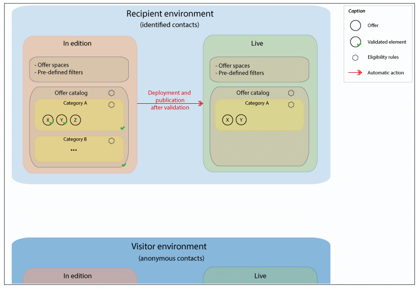

# Grondbeginselen{#fundamental-principles}

## Omgevingen implementeren {#deploying-environments}

Er zijn twee milieu&#39;s voor elke het richten dimensie die wordt gebruikt wanneer het beheren van aanbiedingen:

* Een ontwerpomgeving waarin de aanbiedingsmanager zorgt voor het maken en categoriseren van aanbiedingen, het bewerken ervan en het starten van het goedkeuringsproces zodat deze kunnen worden gebruikt. De regels voor elke categorie, de aanbiedingsruimten waarop aanbiedingen kunnen worden ingediend en de vooraf gedefinieerde filters die worden gebruikt om te bepalen of een aanbieding in aanmerking komt, worden ook in deze omgeving gedefinieerd.

   Categorieën kunnen ook handmatig worden gepubliceerd in de online omgeving.

   Het proces voor het goedkeuren van aanbiedingen wordt gedetailleerd beschreven in de sectie [Goedkeuring en activering van een aanbieding](../../interaction/using/approving-and-activating-an-offer.md) .

* Een live omgeving waarin goedgekeurde aanbiedingen van de ontwerpomgeving en de verschillende aanbiedingsruimten, filters, categorieën en regels die in de ontwerpomgeving zijn geconfigureerd, kunnen worden gevonden. Tijdens een vraag aan de aanbiedingsmotor, zal de motor altijd aanbiedingen van het levende milieu gebruiken.

Een aanbieding wordt slechts opgesteld op de aanbiedingsruimten die tijdens het goedkeuringsproces worden geselecteerd. Daarom kan een aanbieding levend maar onbruikbaar op een aanbiedingsruimte zijn die ook levend is.

## Interactietypen en contactmethoden {#interaction-types-and-contact-methods}

Er zijn twee mogelijke typen interactie: binnenkomende interacties (geïnitieerd door een contactpersoon) en uitgaande interacties (geïnitieerd door de aanbiedingsmaker).

Deze twee soorten interactie kunnen worden uitgevoerd in monitaire modus (aanbieding wordt berekend voor één contactpersoon) of in batchmodus (aanbieding wordt berekend voor een reeks contactpersonen). Over het algemeen worden binnenkomende interacties uitgevoerd in monitaire modus en uitgaande interacties in batchmodus. Er kunnen echter bepaalde uitzonderingen zijn, bijvoorbeeld voor transactiemeldingen, waarbij de uitgaande interactie in de eenheidsmodus wordt uitgevoerd (zie [deze paragraaf](../../message-center/using/about-transactional-messaging.md)).

Zodra een aanbieding kan of moet worden ingediend (volgens de uitgevoerde configuraties), speelt de aanbiedingsmotor de intermediaire rol: het berekent automatisch de best mogelijke aanbieding voor een contact tussen beschikbare die door ontvangen gegevens over het contact en de verschillende regels te combineren die kunnen worden toegepast zoals gespecificeerd in de toepassing.

