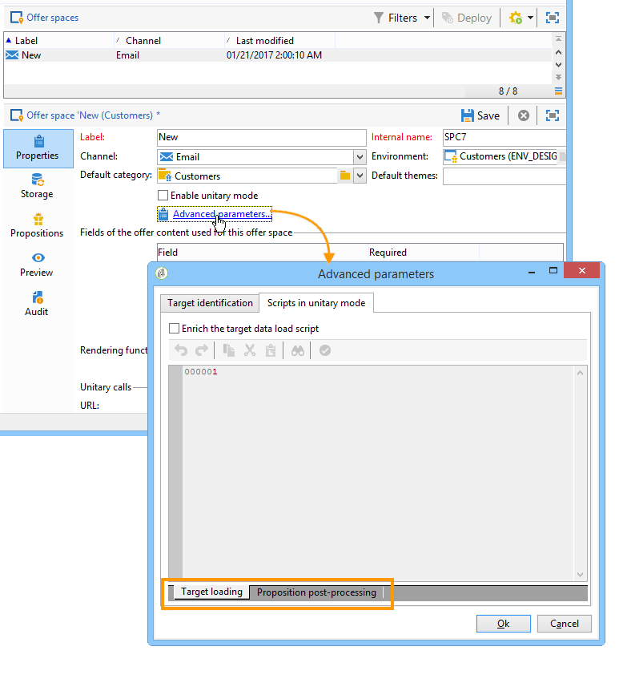

# Hooks{#hooks}

Met Hooks in Interaction kunt u het **standaardmotorgedrag** wijzigen.

De **[!UICONTROL Target loading]** en de **[!UICONTROL Proposition post-processing]** haken worden, in de Campagne van Adobe, in de aanbiedingsruimte gevormd:



De **[!UICONTROL Dynamic offer]** haak wordt gevormd met het aanbiedingsgewicht in de Campagne van Adobe:


## Doel laden {#target-loading}

Deze haak laat u het profiel van het contact (dat door uit-van-de-doosvraag) met extra gegevens van een extern systeem werd geladen verrijken.

De verzamelde gegevens moeten in de knoop van vraaggegevens (de knoop van de Interactie) worden opgenomen. Integrator moet het schema van vraaggegevens van tevoren hebben uitgebreid om de structuur van de verzamelde gegevens te bepalen. De gebruiker kan tot deze gegevens op de zelfde manier toegang hebben zoals voor standaardvraaggegevens (op een geschiktheidsregels en een verpersoonlijkingsniveau).

**Invoerparameters:**

* xmlInteraction (type xml): Interactieknooppunt
* aTargetId (tabeltype): doel-id
* sUuid230 (tekenreekstype): waarde van de uuid230 permanente cookie
* Nlid (tekenreekstype): waarde van het ongeldige sessiecookie

**Parameters retourneren:**

* verrijkt knooppunt Interaction (eerste parameter van deze haak)

>[!NOTE]
>
>De parameter **xmlInteraction** bevat zowel de vraaggegevens als het profiel van het contact dat door de uit-van-de-doos vraag werd geladen.

**Voorbeeld:**

```
// Call an external system to get additional data for the target
  var additionalData  = getUrl("https://EXTERNAL_SYSTEM?target=" + encodeURIComponent(aTargetId.join("|")));
  // Enrich the context with this data
  interaction.@additionalData = additionalData;
```

## Positie na verwerking {#proposition-post-processing-}

Met deze haak kunt u de consistentie en compatibiliteit van in aanmerking komende voorstellen in een bepaalde interactie controleren. U kunt hiermee ook een nieuwe functionaliteit voor scoring of waarschijnlijkheidsberekening definiëren.

Voorbeeld van het gebruik van consistentieregels:

* Het beperken van het aantal voorstellen in de zelfde vraag, verbonden aan het zelfde product, of de zelfde categorie.
* Alleen aanbiedingen die betrekking hebben op een product, worden in dezelfde interactie weergegeven.

De nabewerking wordt uitgevoerd na toepassing van de typologieregels en het in aanmerking komende sorteren van voorstellen, en vóór de prioriteringsstap.

**Invoerparameters:**

* Voorstel: tabel van subsidiabele voorstellen. Hier is een voorbeeld van de structuur van een element in deze tabel

   ```
   { offer_id:1234,
     weight:2}
   ```

* dicOffer (xml-type): een woordenboek van alle kenmerken van de in aanmerking komende aanbiedingen (aanbiedingscode, categorie-id, volledige naam van de categorie, begindatum, einddatum, label, interne naam, aanbiedingsidentiteitskaart, velden voor aanvullende aanbiedingen). Bijvoorbeeld

   ```
   { "1242": <offer category-id="61242" categoryFullName="/FULL/PATH/TO/CATEGORY/" code="CODE" endDate="" id="62473" label="LABEL" name="OFR38_OE4" product-id="43" startDate=""/>,
     "1243": ...}
   ```

* xmlTarget (type xml): profielgegevensknooppunt
* xmlInteraction (type xml): aanroepgegevensknooppunt
* iPropNumber (type geheel getal): aantal verwachte aanbiedingen

**Parameters retourneren:**

* lijst van gewijzigde voorstellen (eerste parameter van de haak)
* gewijzigd interactiepunt

**Voorbeeld:**

```
var aReturnedProps = [];

if( aProposition.length > 0 )
{
  var iReturnedProps = 0;
  for( var iPropIdx = 0; iPropIdx < aProposition.length && iReturnedProps < iPropNumber; iPropIdx ++ )
  {
    // Check a consistency rule for instance
    if( true )
    {
      aReturnedProps.push(aProposition[iPropIdx]);
      iReturnedProps++;
    }
  }
}

return aReturnedProps;
```

## Dynamische aanbieding {#dynamic-offer}

Deze haak staat u toe om een vraag aan een externe motor te maken om een lijst van producten te selecteren verbonden aan een aanbieding. Het wordt gevormd in de aanbieding na toelatingsregels, en vóór de toepassing van de typologieregels.

Vooreerst moet de integrator het **PropositionRcp** -schema uitbreiden met de aanvullende informatie over het product. Als u wilt opgeven waar deze gegevens worden opgeslagen, vindt u een **[!UICONTROL Proposition being processed]** koppeling op het **[!UICONTROL Storage]** tabblad van de ruimte


**Invoerparameters:**

* xmlOffer (type xml): aanbieding (aanbiedingscode, categorie-id, volledige naam van categorie, begindatum, einddatum, label, interne naam, aanbieding-id, velden voor extra aanbiedingen)
* dDikte: contextgewicht (dubbel type)
* xmlTarget (type xml): profielgegevensknooppunt
* xmlInteraction (type xml): aanroepgegevensknooppunt

**Parameters retourneren:**

Er wordt een tabel met te genereren voorstellen geretourneerd. Elk element van deze tabel bestaat uit de volgende informatie:

* aanbieding-id
* aanvullende productgegevens (bijvoorbeeld productcode)
* gewicht

>[!NOTE]
>
>Het systeem controleert of de aanbieding-id gelijk is voor zowel de invoer- als de retourparameters.

**Voorbeeld:**

```
var product = getUrl("https://EXTERNAL_SYSTEM?offerCode=" + encodeURIComponent(xmlOffer.@code));
if( product )
  return [{offer_id: parseInt(String(xmlOffer.@id)), weight: dWeight, productId: product}];
```

