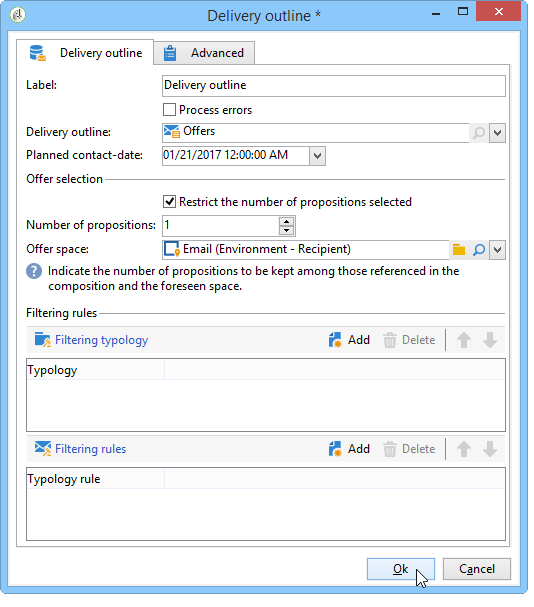
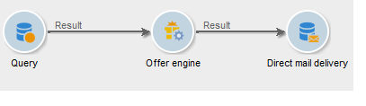

# Een aanbieding integreren via een workflow{#integrating-an-offer-via-a-workflow}

Buiten de leveringsactiviteit zelf, staan verscheidene werkschemaactiviteiten u toe om de manier te bepalen de aanbiedingen worden voorgesteld:

* Overzicht van levering
* Verrijking
* Aanbiedingsengine
* Aanbiedingen per cel

## Overzicht van levering {#delivery-outline}

Met de overzichtsactiviteit van de levering, die beschikbaar is in de workflows van de campagne, kunt u aanbiedingen presenteren waarnaar wordt verwezen in een leveringsoverzicht van de lopende campagne.

1. Voeg in een workflow een overzichtsactiviteit toe voordat u een leveringsactiviteit toevoegt.
1. Geef in de overzichtsactiviteit van de levering de omtrek op die u wilt gebruiken.

   Raadpleeg voor meer informatie over het opgeven van leveringscontouren de [Campagne - MRM](../../campaign/using/marketing-campaign-deliveries.md#associating-and-structuring-resources-linked-via-a-delivery-outline) hulplijn.

1. Vul de beschikbare velden in op basis van uw levering.
1. Er zijn twee mogelijke gevallen:

   * Als je de aanbiedingsengine wilt bellen, kun je het volgende controleren: **[!UICONTROL Restrict the number of propositions selected]** doos. Geef de aanbiedingsruimte en het aantal voorstellen op dat in de levering wordt weergegeven.

     De aanbiedingsmotor zal rekening houden met het gewicht van de aanbieding en de subsidiabiliteitsregels.

   * Als u niet de doos controleert, zullen alle aanbiedingen in het leveringsoverzicht worden voorgesteld zonder een vraag aan de aanbiedingsmotor te maken.

   >[!NOTE]
   >
   >In de voorvertoning wordt rekening gehouden met het aantal aanbiedingen dat in de levering is opgegeven. Bij het uitvoeren van een workflow wordt rekening gehouden met het nummer dat is opgegeven in het leveringsoverzicht.

   

## Verrijking {#enrichment}

Met de verrijkingsactiviteit kunt u aanbiedingen of koppelingen naar aanbiedingen voor ontvangers van de levering toevoegen.

>[!NOTE]
>
>Raadpleeg voor meer informatie over de verrijkingsactiviteit de desbetreffende documentatie in het gedeelte [Handleiding voor workflows](../../workflow/using/enrichment.md).

Bijvoorbeeld, kunt u de gegevens voor een ontvankelijke vraag vóór een levering verrijken.

Er zijn twee methoden om voorstellen voor aanbiedingen op te geven.

* Een aanbieding of een vraag van de aanbiedingsmotor specificeren.
* Verwijzen naar een koppeling naar een aanbieding.

### Het specificeren van een aanbieding of een vraag aan de aanbiedingsmotor {#specifying-an-offer-or-a-call-to-the-offer-engine}

Na het vormen van uw vraag (verwijs naar [Handleiding voor workflows](../../workflow/using/query.md)):

1. Voeg een verrijkingsactiviteit toe en open deze.
1. Selecteer op het tabblad **[!UICONTROL Enrichment]** de optie **[!UICONTROL Add data]**.
1. Selecteren **[!UICONTROL An offer proposition]** in de typen gegevens die moeten worden toegevoegd.

   

1. Geef een id en een label op voor het voorstel dat wordt toegevoegd.
1. Geef de selectie van de aanbieding op. Hiervoor zijn twee opties mogelijk:

   * **[!UICONTROL Search for the best offer in a category]** : controleer deze optie en geef de parameters op voor de aanroep van de aanbiedingsengine (ruimte, categorie of thema(&#39;s), contactdatum, aantal aanbiedingen dat u wilt behouden). De motor berekent automatisch de aanbieding(en) die volgens deze parameters moet worden toegevoegd. We raden u aan om de **[!UICONTROL Category]** of de **[!UICONTROL Theme]** in plaats van beide.

     

   * **[!UICONTROL A predefined offer]** : controleer deze optie en specificeer een aanbiedingsruimte, een specifieke aanbieding, en een contactdatum om de aanbieding direct te vormen die u, zonder de aanbiedingsmotor te roepen wilt toevoegen.

     

1. Dan vorm een leveringsactiviteit die aan uw gekozen kanaal beantwoordt. Raadpleeg voor meer informatie de [Een voorstel invoegen in een levering](../../interaction/using/integrating-an-offer-via-the-wizard.md#inserting-an-offer-proposition-into-a-delivery) sectie.

   >[!NOTE]
   >
   >Het aantal voorstellen dat beschikbaar is voor de voorvertoning is afhankelijk van de configuratie die wordt uitgevoerd in de verrijkingsactiviteit in plaats van een mogelijke configuratie die rechtstreeks in de levering wordt uitgevoerd.

### Verwijzen naar een koppeling naar een aanbieding {#referencing-a-link-to-an-offer}

U kunt ook verwijzen naar een koppeling naar een aanbieding in een verrijkingsactiviteit.

Hiervoor gebruikt u het volgende proces:

1. Selecteren **[!UICONTROL Add data]** in de activiteit **[!UICONTROL Enrichment]** tab.
1. Selecteer in het venster waarin u het type gegevens kiest dat u wilt toevoegen **[!UICONTROL A link]**.
1. Selecteer het type koppeling dat u wilt maken en het doel ervan. In dit geval is het doel het aanbiedingsschema.

   

1. Specificeer zich tussen de binnenkomende lijstgegevens in de verrijkingsactiviteit (hier de ontvankelijke lijst) en de aanbiedingstabel aan. U kunt bijvoorbeeld een aanbiedingscode koppelen aan een ontvanger.

   

1. Dan vorm een leveringsactiviteit die aan uw gekozen kanaal beantwoordt. Raadpleeg voor meer informatie de [Een voorstel invoegen in een levering](../../interaction/using/integrating-an-offer-via-the-wizard.md#inserting-an-offer-proposition-into-a-delivery) sectie.

   >[!NOTE]
   >
   >Het aantal voorvertoningen dat beschikbaar is voor de voorvertoning, is afhankelijk van de configuratie die in de levering wordt uitgevoerd.

### Opslaan van rankings- en gewichten voor aanbiedingen {#storing-offer-rankings-and-weights}

Standaard, wanneer een **verrijking** de activiteit wordt gebruikt om aanbiedingen te leveren, worden hun rangschikkingen en hun gewichten niet opgeslagen in de propositietabel.

>[!NOTE]
>
>Herinner me: **[!UICONTROL Offer engine]** Deze informatie wordt standaard opgeslagen door de activiteit.

U kunt deze gegevens echter als volgt opslaan:

1. Creeer een vraag aan de aanbiedingsmotor in een verrijkingsactiviteit die na een vraag en vóór een leveringsactiviteit wordt geplaatst. Zie de [Het specificeren van een aanbieding of een vraag aan de aanbiedingsmotor](../../interaction/using/integrating-an-offer-via-a-workflow.md#specifying-an-offer-or-a-call-to-the-offer-engine) sectie.
1. Selecteer in het hoofdvenster van de activiteit **[!UICONTROL Edit additional data...]**.

   

1. Voeg de **[!UICONTROL @rank]** kolommen voor de rangorde en **[!UICONTROL @weight]** voor het aanbiedingsgewicht.

   

1. Bevestig uw toevoeging en sla uw workflow op.

De levering slaat automatisch de rangschikking en het gewicht van de aanbiedingen op. Deze informatie is zichtbaar in de levering **[!UICONTROL Offers]** tab.

## Aanbiedingsengine {#offer-engine}

De **[!UICONTROL Offer engine]** Met activiteit kunt u ook een aanroep naar de aanbiedingsengine opgeven voordat de levering plaatsvindt.

Deze activiteit werkt volgens hetzelfde principe als de verrijkingsactiviteit met een motoraanroep, door de binnenkomende bevolkingsgegevens te verrijken met een aanbod dat door de motor wordt berekend, vóór de levering.

Na het vormen van uw vraag (verwijs naar [Handleiding voor workflows](../../workflow/using/query.md)):

1. Een **[!UICONTROL Offer engine]** activiteit.
1. Vul de verschillende beschikbare velden in om de oproep tot het aanbieden van motorparameters op te geven (beschikbare ruimte, categorie of thema(&#39;s), contactdatum, aantal aanbiedingen dat moet worden bewaard). De motor berekent automatisch de aanbieding(en) die volgens deze parameters moet worden toegevoegd.

   >[!NOTE]
   >
   >Waarschuwing: als u deze activiteit gebruikt, worden alleen de aanbiedingsvoorstellen opgeslagen die in de levering worden gebruikt.

   

1. Dan vorm een leveringsactiviteit die aan uw gekozen kanaal beantwoordt. Raadpleeg voor meer informatie de [Een voorstel invoegen in een levering](../../interaction/using/integrating-an-offer-via-the-wizard.md#inserting-an-offer-proposition-into-a-delivery) sectie.

## Aanbiedingen per cel {#offers-by-cell}

De **[!UICONTROL Offers by cell]** de activiteit laat u de binnenkomende bevolking (van een vraag bijvoorbeeld) in verscheidene segmenten verdelen en een aanbieding specificeren om voor elk van deze segmenten voor te stellen.

Hiervoor gebruikt u het volgende proces:

1. Voeg de **[!UICONTROL Offers by cell]** activiteit zodra u de doelpopulatie hebt gespecificeerd, dan open het.
1. In de **[!UICONTROL General]** selecteert u de aanbiedingsruimte waarop u de voorstellen wilt weergeven.
1. In de **[!UICONTROL Cells]** -tabblad, geeft u de verschillende subsets op met de **[!UICONTROL Add]** knop:

   * Geef de subsetpopulatie op met behulp van de beschikbare regels voor filteren en beperken.
   * Selecteer vervolgens het voorstel dat u aan de subset wilt presenteren. De beschikbare aanbiedingen zijn die welke in aanmerking komen op het aanbiedingsmilieu dat in de vorige stap werd geselecteerd.

     

1. Dan vorm een leveringsactiviteit die aan uw gekozen kanaal beantwoordt. Raadpleeg voor meer informatie de [Een voorstel invoegen in een levering](../../interaction/using/integrating-an-offer-via-the-wizard.md#inserting-an-offer-proposition-into-a-delivery) sectie.
