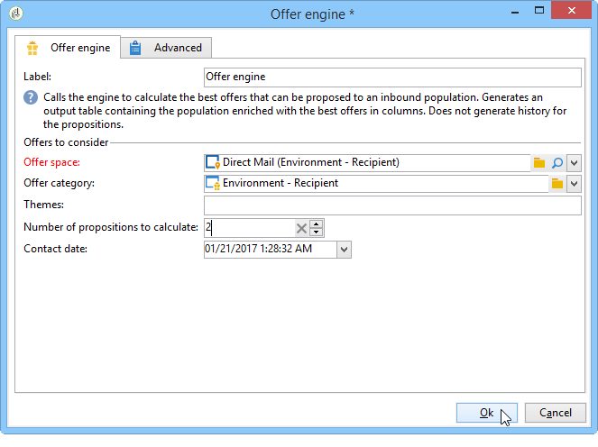
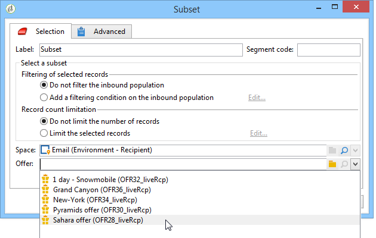

# Een aanbieding integreren via een workflow{#integrating-an-offer-via-a-workflow}

Buiten de leveringsactiviteit zelf, staan verscheidene werkschemaactiviteiten u toe om de manier te bepalen de aanbiedingen worden voorgesteld:

* Overzicht van levering
* Verrijking
* Aanbiedingsengine
* Aanbiedingen per cel

## Overzicht van levering {#delivery-outline}

Met de overzichtsactiviteit van de levering, die beschikbaar is in de workflows van de campagne, kunt u aanbiedingen presenteren waarnaar wordt verwezen in een leveringsoverzicht van de lopende campagne.

1. Voeg in een workflow een overzichtsactiviteit toe voordat u een leveringsactiviteit toevoegt.
1. Geef in de overzichtsactiviteit van de levering de omtrek op die u wilt gebruiken.

   Voor meer informatie over het specificeren van leveringsoverzichten, verwijs naar de [Campagne - MRM](../../campaign/using/marketing-campaign-deliveries.md#associating-and-structuring-resources-linked-via-a-delivery-outline) gids.

1. Vul de beschikbare velden in op basis van uw levering.
1. Er zijn twee mogelijke gevallen:

   * Schakel het **[!UICONTROL Restrict the number of propositions selected]** selectievakje in als je de aanbiedingsengine wilt bellen. Geef de aanbiedingsruimte en het aantal voorstellen op dat in de levering wordt weergegeven.

      De aanbiedingsmotor zal rekening houden met het gewicht van de aanbieding en de subsidiabiliteitsregels.

   * Als u niet de doos controleert, zullen alle aanbiedingen in het leveringsoverzicht worden voorgesteld zonder een vraag aan de aanbiedingsmotor te maken.
   >[!NOTE]
   >
   >In de voorvertoning wordt rekening gehouden met het aantal aanbiedingen dat in de levering is opgegeven. Bij het uitvoeren van een workflow wordt rekening gehouden met het nummer dat is opgegeven in het leveringsoverzicht.

   

## Verrijking {#enrichment}

Met de verrijkingsactiviteit kunt u aanbiedingen of koppelingen naar aanbiedingen voor ontvangers van de levering toevoegen.

>[!NOTE]
>
>Raadpleeg de desbetreffende documentatie in de handleiding [Workflows voor meer informatie over de verrijkingsactiviteit](../../workflow/using/enrichment.md).

Bijvoorbeeld, kunt u de gegevens voor een ontvankelijke vraag vóór een levering verrijken.

Er zijn twee methoden om voorstellen voor aanbiedingen op te geven.

* Het specificeren van een aanbieding of een vraag van de aanbiedingsmotor.
* Verwijzen naar een koppeling naar een aanbieding.

### Het specificeren van een aanbieding of een vraag aan de aanbiedingsmotor {#specifying-an-offer-or-a-call-to-the-offer-engine}

Na het vormen van uw vraag (verwijs naar de gids [van](../../workflow/using/query.md)Werkschema&#39;s):

1. Voeg een verrijkingsactiviteit toe en open deze.
1. Selecteer op het **[!UICONTROL Enrichment]** tabblad **[!UICONTROL Add data]**.
1. Selecteer **[!UICONTROL An offer proposition]** de typen gegevens die u wilt toevoegen.

   

1. Geef een id en een label op voor het voorstel dat wordt toegevoegd.
1. Geef de selectie van de aanbieding op. Hiervoor zijn twee mogelijkheden:

   * **[!UICONTROL Search for the best offer in a category]** : controleert deze optie en specificeert de parameters van de vraagvraag van de aanbiedingsmotor (aanbiedingsruimte, categorie of thema(s), contactdatum, aantal aan te houden aanbiedingen). De motor berekent automatisch de aanbieding(en) die volgens deze parameters moet worden toegevoegd. We raden u aan het veld **[!UICONTROL Category]** of het **[!UICONTROL Theme]** veld in plaats van beide tegelijk in te vullen.

      

   * **[!UICONTROL A predefined offer]** : controleer deze optie en specificeer een aanbiedingsruimte, een specifieke aanbieding, en een contactdatum om de aanbieding direct te vormen die u, zonder de aanbiedingsmotor te roepen wilt toevoegen.

      

1. Dan vorm een leveringsactiviteit die aan uw gekozen kanaal beantwoordt. Raadpleeg voor meer informatie de sectie Een voorstel [invoegen in een leveringsgedeelte](../../interaction/using/integrating-an-offer-via-the-wizard.md#inserting-an-offer-proposition-into-a-delivery) .

   >[!NOTE]
   >
   >Het aantal voorstellen dat beschikbaar is voor de voorvertoning is afhankelijk van de configuratie die wordt uitgevoerd in de verrijkingsactiviteit in plaats van een mogelijke configuratie die rechtstreeks in de levering wordt uitgevoerd.

### Verwijzen naar een koppeling naar een aanbieding {#referencing-a-link-to-an-offer}

U kunt ook verwijzen naar een koppeling naar een aanbieding in een verrijkingsactiviteit.

Hiervoor gebruikt u het volgende proces:

1. Selecteer **[!UICONTROL Add data]** op het **[!UICONTROL Enrichment]** tabblad Actie.
1. Selecteer in het venster waarin u het type gegevens kiest dat u wilt toevoegen **[!UICONTROL A link]**.
1. Selecteer het type koppeling dat u wilt maken en het doel ervan. In dit geval is het doel het aanbiedingsschema.

   

1. Specificeer zich tussen de binnenkomende lijstgegevens in de verrijkingsactiviteit (hier de ontvankelijke lijst) en de aanbiedingstabel aan. U kunt bijvoorbeeld een aanbiedingscode koppelen aan een ontvanger.

   

1. Dan vorm een leveringsactiviteit die aan uw gekozen kanaal beantwoordt. Raadpleeg voor meer informatie de sectie Een voorstel [invoegen in een leveringsgedeelte](../../interaction/using/integrating-an-offer-via-the-wizard.md#inserting-an-offer-proposition-into-a-delivery) .

   >[!NOTE]
   >
   >Het aantal voorvertoningen dat beschikbaar is voor de voorvertoning, is afhankelijk van de configuratie die in de levering wordt uitgevoerd.

### Opslaan van rankings- en gewichten voor aanbiedingen {#storing-offer-rankings-and-weights}

Wanneer een **verrijkingsactiviteit** wordt gebruikt om aanbiedingen te leveren, worden standaard hun classificaties en hun gewichten niet opgeslagen in de tabel met voorstellen.

>[!NOTE]
>
>Onthoud: Deze informatie wordt standaard opgeslagen in de **[!UICONTROL Offer engine]** activiteit.

U kunt deze gegevens echter als volgt opslaan:

1. Creeer een vraag aan de aanbiedingsmotor in een verrijkingsactiviteit die na een vraag en vóór een leveringsactiviteit wordt geplaatst. Verwijs naar het [Specifying een aanbieding of een vraag aan de sectie van de aanbiedingsmotor](../../interaction/using/integrating-an-offer-via-a-workflow.md#specifying-an-offer-or-a-call-to-the-offer-engine) .
1. Selecteer in het hoofdvenster van de activiteit **[!UICONTROL Edit additional data...]**.

   

1. Voeg de **[!UICONTROL @rank]** kolommen voor de rangorde en **[!UICONTROL @weight]** voor het aanbiedingsgewicht toe.

   

1. Bevestig uw toevoeging en sla uw workflow op.

De levering slaat automatisch de rangschikking en het gewicht van de aanbiedingen op. Deze informatie is zichtbaar op het **[!UICONTROL Offers]** tabblad van de levering.

## Aanbiedingsengine {#offer-engine}

De **[!UICONTROL Offer engine]** activiteit laat u ook een vraag aan de aanbiedingsmotor vóór de levering specificeren.

Deze activiteit werkt volgens hetzelfde principe als de verrijkingsactiviteit met een motoraanroep, door de binnenkomende bevolkingsgegevens te verrijken met een aanbod dat door de motor wordt berekend, vóór de levering.

Na het vormen van uw vraag (verwijs naar de gids [van](../../workflow/using/query.md)Werkschema&#39;s):

1. Voeg een **[!UICONTROL Offer engine]** activiteit toe en open.
1. Vul de verschillende beschikbare velden in om de oproep tot het aanbieden van motorparameters op te geven (beschikbare ruimte, categorie of thema(&#39;s), contactdatum, aantal aanbiedingen dat moet worden bewaard). De motor berekent automatisch de aanbieding(en) die volgens deze parameters moet worden toegevoegd.

   >[!NOTE]
   >
   >Waarschuwing: als je deze activiteit gebruikt, worden alleen de aanbiedingsvoorstellen opgeslagen die in de levering worden gebruikt.

   

1. Dan vorm een leveringsactiviteit die aan uw gekozen kanaal beantwoordt. Raadpleeg voor meer informatie de sectie Een voorstel [invoegen in een leveringsgedeelte](../../interaction/using/integrating-an-offer-via-the-wizard.md#inserting-an-offer-proposition-into-a-delivery) .

## Aanbiedingen per cel {#offers-by-cell}

De **[!UICONTROL Offers by cell]** activiteit laat u de binnenkomende bevolking (van een vraag bijvoorbeeld) in verscheidene segmenten verdelen en een aanbieding specificeren om voor elk van deze segmenten voor te stellen.

Hiervoor gebruikt u het volgende proces:

1. Voeg de **[!UICONTROL Offers by cell]** activiteit toe zodra u de doelbevolking hebt gespecificeerd, dan open het.
1. Selecteer op het **[!UICONTROL General]** tabblad de aanbiedingsruimte waarop u de voorstellen wilt weergeven.
1. Geef op het **[!UICONTROL Cells]** tabblad de verschillende subsets op met de **[!UICONTROL Add]** knop:

   * Geef de subsetpopulatie op met behulp van de beschikbare regels voor filteren en beperken.
   * Selecteer vervolgens het voorstel dat u aan de subset wilt presenteren. De beschikbare aanbiedingen zijn die welke in aanmerking komen op het aanbiedingsmilieu dat in de vorige stap werd geselecteerd.

      

1. Dan vorm een leveringsactiviteit die aan uw gekozen kanaal beantwoordt. Raadpleeg voor meer informatie de sectie Een voorstel [invoegen in een leveringsgedeelte](../../interaction/using/integrating-an-offer-via-the-wizard.md#inserting-an-offer-proposition-into-a-delivery) .

