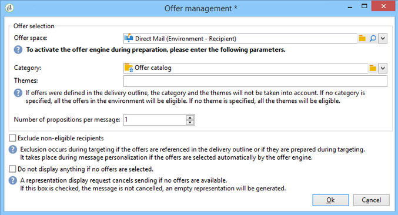

# Een aanbieding integreren via de wizard{#integrating-an-offer-via-the-wizard}

Wanneer het creëren van een levering, zijn er twee mogelijke methodes om aanbiedingen te integreren:

* De aanbiedingsmotor aanroepen in de hoofdtekst van een levering.
* Verwijzen naar aanbiedingen via de leveringscontouren van een campagne. Deze methode wordt over het algemeen gebruikt voor papiercampagnes.

## Het leveren met een vraag aan de aanbiedingsmotor {#delivering-with-a-call-to-the-offer-engine}

Als u een aanbieding wilt presenteren tijdens een marketingcampagne, maakt u gewoon een klassieke leveringsactie op basis van het gekozen kanaal. De aanbiedingsengine wordt aangeroepen wanneer de leveringsinhoud wordt gedefinieerd door op het **[!UICONTROL Offers]** pictogram op de werkbalk te klikken.

Raadpleeg [Aflevering](../../delivery/using/about-direct-mail-channel.md) en [Campagne](../../campaign/using/setting-up-marketing-campaigns.md)voor meer informatie over leveringen en marketingcampagnes.

### Belangrijkste stappen voor het invoegen van een aanbieding in een levering {#main-steps-for-inserting-an-offer-into-a-delivery}

Voer de volgende stappen uit om voorstellen voor aanbiedingen in te voegen in een levering:

1. Klik in het leveringsvenster op het pictogram Aanbiedingen.

   

1. Selecteer de ruimte die overeenkomt met uw aanbiedingsomgeving.

   

1. Als u de keuze van de motor van de aanbiedingen wilt verfijnen, selecteert u de categorie waaruit de aan te bieden aanbieding(en) deel uitmaakt of een of meer thema&#39;s. We raden u aan slechts één van deze velden tegelijk te gebruiken om overbelasting van de beperkingen te voorkomen.

   

   

1. Geef het aantal voorstellen op dat u in de leveringstekst wilt invoegen.

   

1. Selecteer zo nodig de **[!UICONTROL Exclude non-eligible recipients]** optie. Voor meer op dit, verwijs naar [Parameters voor het roepen van aanbiedingsmotor](#parameters-for-calling-offer-engine).

   

1. Selecteer zo nodig de **[!UICONTROL Do not display anything if no offers are selected]** optie. Voor meer op dit, verwijs naar [Parameters voor het roepen van aanbiedingsmotor](#parameters-for-calling-offer-engine).

   

1. Voeg de eigenschap(pen) in de leveringsinhoud in met de samenvoegvelden. Het aantal beschikbare voorstellen hangt van de manier af de motorvraag wordt gevormd en hun orde hangt van de prioriteit van aanbiedingen af.

   

1. Voltooi de inhoud en verzend uw levering zoals gewoonlijk.

   

### Parameters voor het aanroepen van de aanbiedingsengine {#parameters-for-calling-offer-engine}

* **[!UICONTROL Space]** : ruimte van de aanbiedingsomgeving die moet worden geselecteerd om de aanbiedingsengine te activeren.
* **[!UICONTROL Category]** : specifieke map waarin aanbiedingen worden gesorteerd. Als er geen categorie is opgegeven, zal de aanbiedingsengine rekening houden met alle aanbiedingen in de omgeving, tenzij een thema wordt geselecteerd.
* **[!UICONTROL Themes]** : sleutelwoorden die stroomopwaarts in de categorieën worden gedefinieerd. Deze fungeren als een filter en u kunt het aantal aanbiedingen dat moet worden weergegeven, verfijnen door ze in een set categorieën te selecteren.
* **[!UICONTROL Number of propositions]** : het aantal aanbiedingen dat door de motor wordt geretourneerd en dat in de leveringsbak kan worden ingevoegd. Als zij niet in het bericht worden opgenomen, zullen de aanbiedingen nog worden geproduceerd, maar niet voorgesteld.
* **[!UICONTROL Exclude non-eligible recipients]** : Met deze optie kunt u de uitsluiting activeren of deactiveren van ontvangers voor wie onvoldoende geschikte voorstellen zijn. Het aantal in aanmerking komende voorstellen kan lager zijn dan het gevraagde aantal voorstellen. Als deze doos wordt gecontroleerd, zullen de ontvangers die niet genoeg voorstellen hebben van de levering worden uitgesloten. Als u deze optie niet selecteert, worden deze ontvangers niet uitgesloten, maar hebben ze niet het gewenste aantal voorstellen.
* **[!UICONTROL Do not display anything if no offer is selected]** : Met deze optie kunt u kiezen hoe het bericht wordt verwerkt als een van de voorstellen niet bestaat. Als dit selectievakje is ingeschakeld, wordt de representatie van het ontbrekende voorstel niet weergegeven en wordt er geen inhoud weergegeven in het bericht voor dit voorstel. Als de doos niet wordt gecontroleerd, wordt het bericht zelf geannuleerd tijdens het verzenden en de ontvangers zullen geen berichten meer ontvangen.

### Een voorstel invoegen in een levering {#inserting-an-offer-proposition-into-a-delivery}

De weergave van de aanbiedingen die moeten worden gepresenteerd, wordt in de hoofdtekst van de levering ingevoegd via de samenvoegvelden. Het aantal voorstellen wordt bepaald in de parameters van de vraag van de aanbiedingsmotor.

De levering kan worden gepersonaliseerd met de velden van de aanbieding of, in het geval van een e-mail, met de renderfuncties.

## Leveren met leveringscontouren {#delivering-with-delivery-outlines}

Je kunt ook voorstellen in een levering presenteren met een leveringsoverzicht.

Voor meer informatie over leveringsoverzichten, verwijs naar de [Campagne - MRM](../../campaign/using/marketing-campaign-deliveries.md#associating-and-structuring-resources-linked-via-a-delivery-outline) gids.

1. Maak een nieuwe campagne of open een bestaande campagne.
1. Open de leveringsoverzichten via de campagne van **[!UICONTROL Edit]** > **[!UICONTROL Documents]** tabel.
1. Voeg een omtrek toe en voeg zoveel aanbiedingen in als u wilt door met de rechtermuisknop op de omtrek te klikken en **[!UICONTROL New]** > **[!UICONTROL Offer]** te selecteren en vervolgens de campagne op te slaan.

   

1. Maak een levering waarvan u de leveringscontouren kunt bekijken (bijvoorbeeld een direct-maillevering).
1. Klik op **[!UICONTROL Select a delivery outline]** Levering wanneer u de levering bewerkt.

   >[!NOTE]
   >
   >Afhankelijk van het type levering vindt u deze optie in het menu **[!UICONTROL Properties]** > **[!UICONTROL Advanced]** (bijvoorbeeld voor e-mailleveringen).

   

1. Gebruikend de **[!UICONTROL Offers]** knoop, kunt u de aanbiedingsruimte evenals het aantal aanbiedingen dan vormen om in de levering voor te stellen.

   

1. Voeg de voorstellen in het leveringslichaam toe gebruikend de verpersoonlijkingsgebieden (voor meer op dit, verwijs naar het [Invoegen van een aanbiedingsvoorstel in een leveringssectie](#inserting-an-offer-proposition-into-a-delivery) ), of in het geval van een directe postlevering, door het formaat van het extractiedossier uit te geven.

   De voorstellen zullen van de aanbiedingen worden geselecteerd waarnaar in het leveringsoverzicht wordt verwezen.

   >[!NOTE]
   >
   >Informatie over de rankings- en gewichten van de aanbieding wordt alleen in de tabel met voorstellen opgeslagen als de aanbiedingen rechtstreeks in de levering worden gegenereerd.

