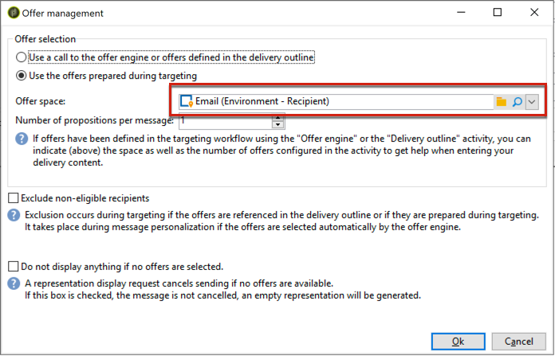
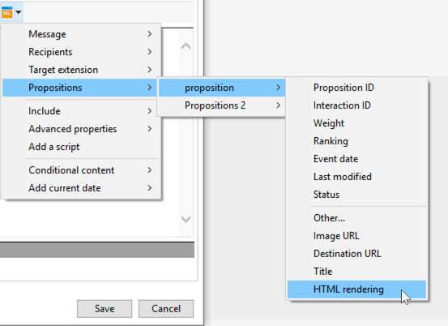

# Aanbevolen werkwijzen voor interactie{#interaction-best-practices}

## Algemene aanbevelingen {#general-recommendations}

In deze sectie wordt de aanbevolen aanpak beschreven voor het beheer van de Interactiemodule in Adobe Campaign Classic, inclusief geschiktheidsregels, vooraf gedefinieerde filters, workflowactiviteiten en databaseopties.

De interactie in de Campagne van Adobe vereist zorgvuldig beheer om efficiënt te werken. U moet een evenwicht vinden tussen het aantal contacten en het aantal aanbiedingencategorieën en aanbiedingen. Als deze factoren niet zorgvuldig worden behandeld, kunnen er problemen optreden in uw Adobe Campagne-instantie.

### Implementatie {#implementation}

Hieronder staan belangrijke elementen waarmee u rekening moet houden bij het implementeren en configureren van interacties.

* Voor partijmotor (typisch gebruikt in uitgaande mededelingen zoals e-mail), is de productie de belangrijkste zorg, aangezien de veelvoudige contacten tezelfdertijd kunnen worden behandeld. Het typische knelpunt is gegevensbestandprestaties.
* De belangrijkste beperking voor eenheidsmotor (typisch gebruikt in binnenkomende mededelingen zoals een banner op een website) is latentie, aangezien iemand een antwoord verwacht. Het typische knelpunt is de prestaties van de CPU.
* Het catalogusontwerp van de aanbieding heeft een enorme invloed op de prestaties van Adobe Campagne Classic.
* Als er veel aanbiedingen zijn, splitst u deze in verschillende aanbiedingcatalogi.

### Subsidiabiliteitsregels {#eligibility-rules}

Hieronder staan enkele beste praktijken met betrekking tot subsidiabiliteitsregels.

* Vereenvoudig de regels. De ingewikkeldheid van regels beïnvloedt prestaties aangezien het omhoog kijkt. Een complexe regel is elke regel die meer dan vijf voorwaarden heeft.
* Om de prestaties te verbeteren, kunnen de regels in verschillende vooraf bepaalde filters worden opgesplitst die over veelvoudige aanbiedingen worden gedeeld.
* Zet de meest beperkende regels voor aanbiedingencategorieën op de hoogst mogelijke positie in de boom. Dit doet ze door eerst de meeste contacten uit te filteren, het doelaantal te verminderen en te voorkomen dat ze door verdere regels worden verwerkt.
* Plaats de duurste regels in termen van tijd of verwerking onder aan de boom. Hierdoor worden deze regels alleen uitgevoerd voor het resterende doelpubliek.
* Begin bij een bepaalde categorie om te voorkomen dat de gehele boom wordt gescand.
* Om verwerkingstijd te besparen, precompute aggregaten in plaats van het bouwen van complexe regels met verbindingen. Om dit te doen, probeer om klantengegevens in een verwijzingstabel op te slaan die binnen toelatingsregels kan worden opgezocht.
* Gebruik een minimumaantal gewichten om het aantal vragen te beperken.
* Aanbevolen wordt een beperkt aantal aanbiedingen per aanbiedingsruimte te hebben. Hierdoor worden aanbiedingen in een bepaalde ruimte sneller opgehaald.
* Gebruik indexen, vooral bij veelgebruikte opzoekkolommen.

### Provisietabel {#proposition-table}

Hieronder staan enkele aanbevolen procedures voor de tabel met voorstellen.

* Gebruik een minimumaantal regels om de verwerking zo snel mogelijk te maken.
* Het aantal records in de tabel met voorstellen beperken: Bewaar alleen de records die nodig zijn om de statusupdate en de vereisten van de regels bij te houden en archiveer ze vervolgens in een ander systeem.
* Voer intensief gegevensbestandonderhoud op de propositietabel uit, zoals opnieuw bouwt indexen of ontspant lijst.
* Beperk het aantal voorgestelde voorstellen per doel. Stel niet meer in dan wat u gaat gebruiken.
* Vermijd zoveel mogelijk samengevoegde regels in de regelcriteria.

## Tips en trucs voor het beheren van aanbiedingen {#tips-managing-offers}

Deze sectie bevat gedetailleerder advies over het beheer van aanbiedingen en het gebruik van de Interactiemodule in Adobe Campaign Classic.

### Meerdere aanbiedingsruimten gebruiken in een e-maillevering {#multiple-offer-spaces}

Wanneer aanbiedingen in leveringen worden opgenomen, worden de aanbiedingen doorgaans stroomopwaarts geselecteerd in de campagneworkflow via een verrijkingsactiviteit (of een andere vergelijkbare activiteit).

Als u aanbiedingen in een verrijkingsactiviteit selecteert, kunt u kiezen welke ruimte u wilt gebruiken. Ongeacht de geselecteerde aanbiedingsruimte, hangt het menu voor de aanpassing van de levering echter af van de aanbiedingsruimte die in de levering is ingesteld.

In het onderstaande voorbeeld is de ruimte voor het aanbieden geselecteerd in de levering **[!UICONTROL Email (Environment - Recipient)]**:



Als er geen HTML-renderfunctie is ingesteld voor de aanbiedingsruimte die u in de levering selecteert, wordt deze niet weergegeven in het menu van de levering en kan deze niet worden geselecteerd. Ook dit staat los van de aanbiedingsruimte die in de verrijkingsactiviteit is geselecteerd.

In het onderstaande voorbeeld is de HTML-renderfunctie beschikbaar in de vervolgkeuzelijst omdat de aanbiedingsruimte die in de levering is geselecteerd, een renderfunctie heeft:



Deze functie voegt code in zoals: `<%@ include proposition="targetData.proposition" view="rendering/html" %>`.

Wanneer u het voorstel selecteert, is de waarde van het **[!UICONTROL view]** kenmerk als volgt:
* &quot;rendering/html&quot;: html-rendering. De HTML-renderfunctie wordt gebruikt.
* &quot;aanbieding/weergave/html&quot;: html-inhoud. De klasse maakt geen gebruik van de HTML-renderfunctie. Het bevat alleen het HTML-veld.

Wanneer u meerdere aanbiedingsruimten opneemt in één e-mailbestelling en sommige daarvan renderingfuncties hebben en andere niet, moet u onthouden welke mogelijkheden ruimtes bieden en welke ruimten renderfuncties bieden.

Daarom wordt u aangeraden voor alle aanbiedingsruimten een HTML-renderfunctie te definiëren, zelfs als uw aanbiedingsruimte alleen HTML-inhoud vereist.

### De positie in de tabel in het propositielogboek instellen {#rank-proposition-log-table}

De ruimten van de aanbieding hebben de capaciteit om gegevens in de propositietabel op te slaan wanneer de voorstellen worden geproduceerd of goedgekeurd:


Dit geldt echter alleen voor binnenkomende interacties.

Het is ook mogelijk om extra gegevens in de propositietabel op te slaan wanneer het gebruiken van uitgaande interactie, en ook wanneer het gebruiken van uitgaande aanbiedingen zonder de module van de Interactie.

Om het even welk gebied van de lijst van het werkschemamontabel de waarvan naam een gebiedsnaam in de propositietabel aanpast wordt gekopieerd in het zelfde gebied in de propositietabel.

Als u bijvoorbeeld handmatig (zonder interactie) een aanbieding in een verrijking selecteert, worden de standaardvelden als volgt gedefinieerd:


U kunt extra velden toevoegen, zoals een veld @rank:


Omdat er een veld in de tabel met voorstellen staat met de naam @rank, wordt de waarde in de tabel met werkstroomsjablonen gekopieerd.

Zie Een aanbieding [integreren via een workflow](../../interaction/using/integrating-an-offer-via-a-workflow.md#storing-offer-rankings-and-weights)voor meer informatie over het opslaan van extra velden in de tabel met profielen.

Voor uitgaande aanbiedingen met interactie is dit handig wanneer er meerdere aanbiedingen zijn geselecteerd en u wilt opnemen in welke volgorde deze in een e-mail worden weergegeven.

U kunt extra meta-gegevens in de propositietabel, zoals het huidige uitgeeft niveau ook direct opslaan, om historische verslagen over de uitgaven te houden op het tijdstip dat de aanbiedingen werden geproduceerd.

Wanneer het gebruiken van uitgaande Interactie, kan het @rank gebied worden toegevoegd, zoals in het voorbeeld hierboven, maar zijn waarde wordt automatisch geplaatst gebaseerd op de orde die door Interaction is teruggekeerd. Als u bijvoorbeeld Interactie gebruikt om drie aanbiedingen te selecteren, heeft het veld @rank de waarden 1, 2 en 3 geretourneerd.

Wanneer de gebruiker Interactie gebruikt en manueel aanbiedingen selecteert, kan de gebruiker beide benaderingen combineren. De gebruiker kan het veld @rank bijvoorbeeld handmatig instellen op 1 voor de handmatig geselecteerde aanbieding en een expressie zoals &quot;1 + @rank&quot; gebruiken voor de aanbiedingen die door Interactie worden geretourneerd. Ervan uitgaande dat Interactie drie aanbiedingen selecteert, worden de aanbiedingen die door beide benaderingen worden geretourneerd, gerangschikt in 1-4:


### NMS uitbreiden:aanbiedingsschema {#extending-nms-offer-schema}

Wanneer het uitbreiden van nms:aanbiedingsschema, zorg ervoor u de uit-van-de-doosstructuur reeds opstelling volgt:
* Definieer een nieuw veld voor de opslag van inhoud onder `<element name="view">`.
* Elk nieuw veld moet tweemaal worden gedefinieerd. Eenmaal als een regulier XML-veld en eenmaal als een CDATA XML-veld met &quot;_jst&quot; toegevoegd aan de naam. Bijvoorbeeld:

   ```
   <element label="Price" name="price" type="long" xml="true"/>
   <element advanced="true" label="Script price" name="price_jst" type="CDATA" xml="true"/>
   ```

* Alle velden die URL&#39;s bevatten die moeten worden bijgehouden, moeten worden geplaatst onder `<element name="trackedUrls">` de URL `<element name="view" >`.