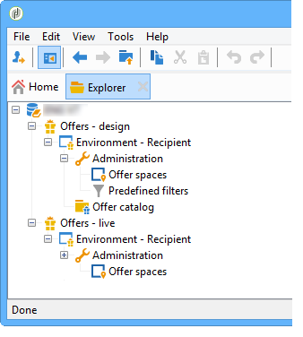
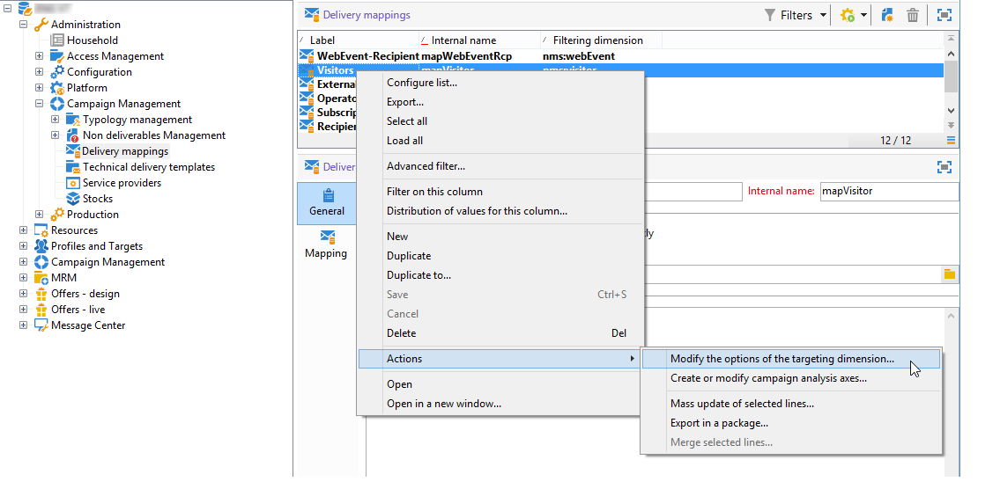

# Live/Design-omgevingen{#live-design-environments}

## Werkwijze {#operating-principle}

De interactie werkt met twee soorten aanbiedingsmilieu&#39;s:

* **[!UICONTROL Design]** biedt omgevingen die aanbiedingen bevatten die worden bewerkt en kunnen worden gewijzigd. Deze aanbiedingen zijn niet door de goedkeuringscyclus geweest en niet geleverd aan contacten.
* **[!UICONTROL Live]** biedt omgevingen die goedgekeurde aanbiedingen bevatten terwijl deze aan contactpersonen worden aangeboden. De aanbiedingen in deze omgeving zijn alleen-lezen.

Elke **[!UICONTROL Design]** -omgeving is gekoppeld aan een **[!UICONTROL Live]** -omgeving. Wanneer een aanbieding is voltooid, worden de inhoud en de subsidiabiliteitsregels ervan onderworpen aan een goedkeuringscyclus. Zodra deze cyclus is voltooid, wordt de betreffende aanbieding automatisch opgesteld aan het **[!UICONTROL Live]** milieu. Vanaf dat moment is het beschikbaar voor levering.

Interactie wordt standaard geleverd met een **[!UICONTROL Design]** -omgeving en een **[!UICONTROL Live]** -omgeving die eraan gekoppeld zijn. Beide milieu&#39;s worden pre-gevormd om de ingebouwde ontvankelijke lijst te richten.

>[!NOTE]
>
>Om een andere lijst (bezoekerslijst voor anonieme aanbiedingen of een specifieke ontvankelijke lijst) te richten, moet u de medewerker van de doelafbeelding gebruiken om de milieu&#39;s tot stand te brengen. Voor meer op dit, verwijs naar [ Creërend een aanbiedingsmilieu ](#creating-an-offer-environment).

De managers van de aanbieding en de leveringsmanagers hebben toegang tot verschillende meningen van het milieu. Leveringsmanagers kunnen alleen de **[!UICONTROL Live]** -aanbiedingsomgeving bekijken en de aanbiedingen gebruiken om deze te leveren. Aanbiedingsmanagers kunnen de **[!UICONTROL Design]** -omgeving weergeven en wijzigen en de **[!UICONTROL Live]** -omgeving weergeven. Voor meer op dit, verwijs naar [ profielen van de Exploitant ](../../interaction/using/operator-profiles.md).

## Een aanbiedingsomgeving maken {#creating-an-offer-environment}

Door gebrek, komt de Interactie met een vooraf gevormd milieu om de ontvankelijke lijst (geïdentificeerde aanbiedingen) te richten. Als u een andere tabel (bezoekerstabel voor anonieme aanbiedingen of een specifieke tabel voor ontvangers) als doel wilt instellen, moet u de volgende configuraties toepassen:

1. Plaats de cursor op het knooppunt **[!UICONTROL Administration]** > **[!UICONTROL Campaign management]** > **[!UICONTROL Delivery mappings]** . Klik met de rechtermuisknop op de leveringstoewijzing die u wilt gebruiken (**[!UICONTROL Visitors]** als u anonieme aanbiedingen wilt gebruiken) en selecteer **[!UICONTROL Actions]** > **[!UICONTROL Modify the options of the targeting dimension]** .

   

1. Klik op **[!UICONTROL Next]** om door te gaan naar het volgende scherm in de assistent, schakel het selectievakje **[!UICONTROL Generate a storage schema for propositions]** in en klik op **[!UICONTROL Save]** .

   

   >[!NOTE]
   >
   >Als het selectievakje al is ingeschakeld, schakelt u het uit en controleert u het opnieuw.

1. Adobe Campaign maakt twee omgevingen ( **[!UICONTROL Design]** en **[!UICONTROL Live]** ) met doelgegevens uit de eerder ingeschakelde doeltoewijzing. Het milieu wordt preconfigured met het richten informatie.

   Als u **[!UICONTROL Visitor]** mapping hebt geactiveerd, wordt het vak **[!UICONTROL Environment dedicated to incoming anonymous interactions]** automatisch ingeschakeld op het tabblad **[!UICONTROL General]** van de omgeving.

   Met deze optie kunt u anonieme interactiespecifieke functies activeren, vooral wanneer u omgevingen configureert die spaties bieden. U kunt opties ook vormen die u toestaan om van een &quot;geïdentificeerd&quot;milieu aan een &quot;anonieme&quot;milieu over te schakelen.

   U kunt bijvoorbeeld een koppeling maken tussen een ontvankelijke omgeving en een aanbiedingsruimte (geïdentificeerd contact) die overeenkomt met een bezoekersomgeving (niet-geïdentificeerd contact). Op deze manier worden verschillende aanbiedingen ter beschikking gesteld van de contactpersoon, afhankelijk van het feit of deze contactpersoon al dan niet wordt geïdentificeerd. Voor meer op dit, verwijs naar [ Creërend aanbiedingsruimten ](../../interaction/using/creating-offer-spaces.md).

   

>[!NOTE]
>
>Voor meer informatie over anonieme interactie op een binnenkomend kanaal, verwijs naar [ Anonieme interactie ](../../interaction/using/anonymous-interactions.md).
