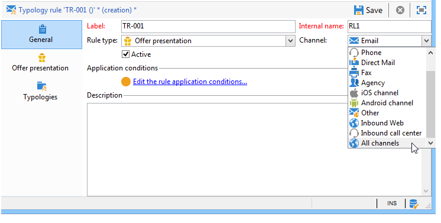
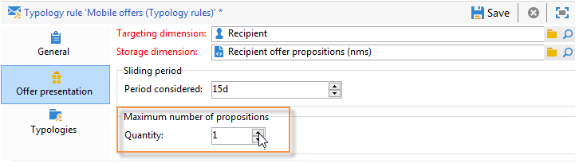

# Presentatie van aanbieding beheren{#managing-offer-presentation}

## Overzicht van presentatieregels {#presentation-rules-overview}

De interactie laat u de stroom van aanbiedingsvoorstellen controleren gebruikend presentatieregels. Deze regels, die specifiek zijn voor interactie, zijn typologische regels. Hiermee kunt u aanbiedingen uitsluiten op basis van de geschiedenis van voorstellen die al aan een ontvanger zijn gedaan. Er wordt naar verwezen in de omgeving

## Een aanbiedingspresentatieregel maken en ernaar verwijzen {#creating-and-referencing-an-offer-presentation-rule}

1. Ga naar **[!UICONTROL Administration]** > **[!UICONTROL Campaign management]** > **[!UICONTROL Typology management]** > **[!UICONTROL Typology rules]** knoop.
1. Maak een typologieregel en kies het type **[!UICONTROL Offer presentation]**.

   

1. Geef het kanaal op waarop de regel moet worden toegepast.

   

1. Vorm de de toepassingscriteria van de regel. Raadpleeg [Instellingen van presentatieregel](#presentation-rule-settings) voor meer informatie hierover.
1. Ga naar **[!UICONTROL Administration]** > **[!UICONTROL Campaign execution]** > **[!UICONTROL Typology management]** > **[!UICONTROL Typologies]** knoop en creeer een typologie die alle **[!UICONTROL Offer presentation]** typeregels zal groeperen.

   

1. Wanneer de typologie is gemaakt, plaatst u de cursor op de typologische regels en groepeert u deze in de typologie die u zojuist hebt gemaakt.

   

1. Verwijs in uw aanbiedingsomgeving naar de typologie met de vervolgkeuzelijst.

   

## Instellingen voor presentatieregel {#presentation-rule-settings}

### Toepassingscriteria {#application-criteria-}

Met de toepassingscriteria op het tabblad **[!UICONTROL General]** kunt u de aanbiedingen opgeven waarop de presentatieregel van toepassing is. Hiervoor moet u een query maken en de desbetreffende aanbiedingen kiezen, zoals hieronder beschreven.

1. In uw typologieregel, klik **[!UICONTROL Edit the rule application conditions...]** verbinding om uw vraag tot stand te brengen.

   

1. In het vraagvenster, kunt u een filter op de aanbiedingen toepassen waarop u wenst om een typologieregel toe te passen.

   U kunt bijvoorbeeld een aanbiedingscategorie selecteren.

   

### Afmetingen van aanbieding {#offer-dimensions}

Op **[!UICONTROL Offer presentation]** lusje, moet u de zelfde afmetingen voor de presentatieregel specificeren zoals die in het milieu worden gevormd.

De **[!UICONTROL Targeting dimension]** valt samen met de lijst van ontvangers (door gebrek: nms:ontvangers) die de voorstellen ontvangen. De **[!UICONTROL Storage dimension]** valt samen met de tabel die de voorpositiegeschiedenis bevat die is gekoppeld aan de doeldimensie (standaard:nms:propositionRcp).

>[!NOTE]
>
>U kunt ook niet-standaardtabellen gebruiken. Als u een specifieke het richten dimensie wilt gebruiken, zult u lijsten evenals een specifiek milieu moeten creëren gebruikend de doelafbeelding. Voor meer op dit, verwijs naar [Creërend een aanbiedingsmilieu](../../interaction/using/live-design-environments.md#creating-an-offer-environment).

### Periode {#period}

Dit is een verschuivende periode die begint op de presentatiedatum van de aanbieding. Er wordt een termijn vastgesteld voor de geldigheid van de voorstellen. De regel geldt niet voor voorstellen die na deze periode worden gedaan.

De periode begint **n** dagen voor de propositiedatum en eindigt **n** dagen daarna, waarbij **n** overeenkomt met het getal dat is ingevoerd in het veld **[!UICONTROL Period considered]**:

* Voor binnenkomende ruimten, is de voorstellingsdatum de datum van de aanbiedingspresentatie.
* Voor uitgaande ruimten, is de voorstellingsdatum de datum van het leveringscontact (bijvoorbeeld de leveringsdatum ingegaan in een het richten werkschema).

Gebruik de pijlen om het aantal dagen te wijzigen of om rechtstreeks een punt in te voeren (&quot;2d 6h&quot;, bijvoorbeeld).

### Aantal voorstellen {#number-of-propositions}

Het is mogelijk het hoogste aantal voorstellen te bepalen dat kan worden gedaan voordat de betrokken aanbieding(en) wordt (worden) uitgesloten.

Gebruik de pijlen om het aantal aanbiedingsvoorstellen te veranderen.

## Profielen en ontvangers definiëren {#defining-propositions-and-recipients}

In de sectie **[!UICONTROL Propositions to count]** kunt u zowel de ontvangers als de voorstellingen opgeven die leiden tot uitsluiting van de aanbiedingen die zijn gedefinieerd op het tabblad **[!UICONTROL General]** als deze een bepaald aantal keren voorkomen in de geschiedenis van de voorstellen.

### Profielen {#filtering-propositions} filteren

U kunt filtercriteria selecteren om voorstellen uit te sluiten die op het kanaal, de betrokken aanbiedingen of de status van eerder toegewezen voorstellen worden gebaseerd.

Deze criteria zijn de meest voorkomende toepassingen van de presentatieregels. Als u andere criteria wilt gebruiken, kunt u een query maken met de koppeling **[!UICONTROL Limit propositions...]**. Voor meer op dit, verwijs naar [Creërend een vraag op proposities](#creating-a-query-on-propositions) sectie.

* **Filter op het kanaal**

   **[!UICONTROL On the same channel only]** : Hiermee sluit u aanbiedingsvoorstellen uit op het kanaal dat op het  **[!UICONTROL General]** tabblad wordt opgegeven.

   Het kanaal dat voor de regel op het tabblad **[!UICONTROL General]** is opgegeven, is bijvoorbeeld e-mail. Als de aanbiedingen waarop de regel van toepassing is, tot dusverre alleen via het webkanaal worden aangeboden, kan de Interaction-engine de aanbiedingen in een e-maillevering presenteren. Als de aanbiedingen echter eenmaal per e-mail zijn verzonden, kiest de interactieengine een ander kanaal om de aanbiedingen weer te geven.

   >[!NOTE]
   >
   >We hebben het over het kanaal en niet over de ruimte. Als de regel een aanbieding op het webkanaal moet uitsluiten, wordt het aanbod dat bestemd is om in twee ruimten op een website te worden aangeboden (bijvoorbeeld in een banner en in de tekst van de pagina), niet op de site weergegeven als het al eerder is gepresenteerd.
   >
   >Voor een werkschema dat aanbiedingspresentatie impliceert, worden de regels slechts correct in aanmerking genomen als zij op **[!UICONTROL All channels]** worden gevormd.

* **Filter op de aanbieding**

   Met dit filter kunt u de aanbiedingsvoorstellen beperken tot specifieke groepen aanbiedingen.

   **[!UICONTROL All offers]** : standaardwaarde. Er wordt geen filter toegepast op de aanbiedingen.

   **[!UICONTROL Offer being presented]** : het aanbod dat op het  **[!UICONTROL General]** tabblad wordt vermeld, wordt uitgesloten als het al is gepresenteerd.

   **[!UICONTROL Offers from the same category]** : een aanbieding is uitgesloten indien reeds een voorstel van dezelfde categorie is ingediend.

   **[!UICONTROL The offers which the rule applies to]** : wanneer op het  **[!UICONTROL General]** tabblad meerdere aanbiedingen zijn gedefinieerd, wordt elk voorstel uit deze reeks aanbiedingen in aanmerking genomen en eindigt het in de uitsluiting van alle aanbiedingen als de propositiedrempel wordt bereikt.

   Aanbiedingen 2, 3 en 5 worden bijvoorbeeld gedefinieerd op het tabblad **[!UICONTROL General]**. Het maximumaantal voorstellen wordt ingesteld op 2. Als aanbiedingen 2 en 5 elk één keer worden gepresenteerd, wordt het aantal voorstellen geteld op 2. Dit heeft tot gevolg dat aanbod 3 nooit zal worden gepresenteerd.

* **Filter op de status van het voorstel**

   Met dit filter kunt u de meest frequente statussen kiezen voor voorstellen die in de voorpositiegeschiedenis in aanmerking moeten worden genomen.

   **[!UICONTROL Regardless of the proposition status]** : standaardwaarde. Er wordt geen filter toegepast op de status van het voorstel.

   **[!UICONTROL Accepted or rejected propositions]** : Hiermee sluit u eerder aangeboden voorstellen uit die zijn geaccepteerd of afgewezen.

   **[!UICONTROL Accepted propositions]** : Hiermee sluit u eerder aangeboden voorstellen uit die zijn geaccepteerd.

   **[!UICONTROL Rejected propositions]** : Hiermee sluit u eerder aangeboden voorstellen uit die zijn afgewezen.

### Ontvangers {#defining-recipients} definiëren

Om de ontvangers te specificeren, klik **[!UICONTROL Edit the query from the targeting dimension...]** verbinding en selecteer de ontvangers betrokken bij de regel.

### Een query maken op voorstellen {#creating-a-query-on-propositions}

Als u de voorstellen wilt opgeven die via een query moeten worden geteld, klikt u op de koppeling **[!UICONTROL Limit propositions...]** en geeft u de criteria op waarmee rekening moet worden gehouden.

In het volgende voorbeeld zijn de voorstellingen die na twee presentaties moeten worden geteld, die in de categorie **Speciale aanbiedingen** voor de ruimte **Call center**, met een gewicht onder **20**.

