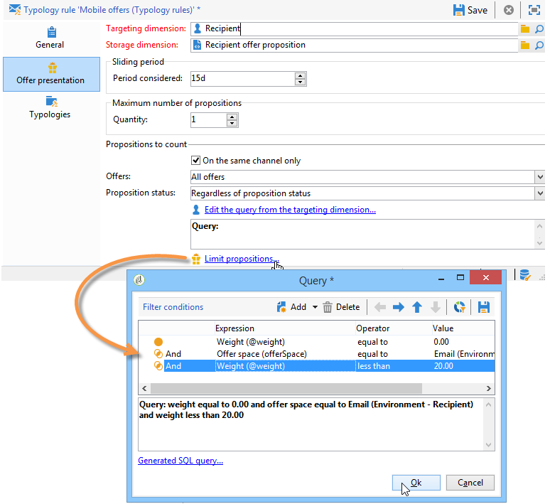

# Presentatie van aanbieding beheren{#managing-offer-presentation}

## Overzicht van presentatieregels {#presentation-rules-overview}

De interactie laat u de stroom van aanbiedingsvoorstellen controleren gebruikend presentatieregels. Deze regels, die specifiek zijn voor interactie, zijn typologische regels. Hiermee kunt u aanbiedingen uitsluiten op basis van de geschiedenis van voorstellen die al aan een ontvanger zijn gedaan. Er wordt naar verwezen in de omgeving

## Een presentatieregel voor aanbiedingen maken en ernaar verwijzen {#creating-and-referencing-an-offer-presentation-rule}

1. Ga naar de **[!UICONTROL Administration]** > **[!UICONTROL Campaign management]** > **[!UICONTROL Typology management]** > **[!UICONTROL Typology rules]** knooppunt.
1. Maak een typologieregel en kies de optie **[!UICONTROL Offer presentation]** type.

   

1. Geef het kanaal op waarop de regel moet worden toegepast.

   

1. Vorm de de toepassingscriteria van de regel. Raadpleeg voor meer informatie hierover [Instellingen voor presentatieregel](#presentation-rule-settings).
1. Ga naar de **[!UICONTROL Administration]** > **[!UICONTROL Campaign execution]** > **[!UICONTROL Typology management]** > **[!UICONTROL Typologies]** knoop en creeer een typologie die allen zal groeperen **[!UICONTROL Offer presentation]** typeregels.

   

1. Wanneer de typologie is gemaakt, plaatst u de cursor op de typologische regels en groepeert u deze in de typologie die u zojuist hebt gemaakt.

   

1. Verwijs in uw aanbiedingsomgeving naar de typologie met de vervolgkeuzelijst.

   

## Instellingen voor presentatieregel {#presentation-rule-settings}

### Toepassingscriteria {#application-criteria-}

De toepassingscriteria die beschikbaar zijn in de **[!UICONTROL General]** kunt u opgeven op welke aanbiedingen de presentatieregel van toepassing is. Hiervoor moet u een query maken en de desbetreffende aanbiedingen kiezen, zoals hieronder beschreven.

1. Klik in de typologieregel op de knop **[!UICONTROL Edit the rule application conditions...]** koppeling om uw query te maken.

   

1. In het vraagvenster, kunt u een filter op de aanbiedingen toepassen waarop u wenst om een typologieregel toe te passen.

   U kunt bijvoorbeeld een aanbiedingscategorie selecteren.

   

### Afmetingen voorstel {#offer-dimensions}

In de **[!UICONTROL Offer presentation]** , moet u dezelfde afmetingen voor de presentatieregel opgeven als de afmetingen die in de omgeving zijn geconfigureerd.

De **[!UICONTROL Targeting dimension]** komt overeen met de tabel met ontvangers (standaard: nms:ontvangers) die de voorstellen ontvangen. De **[!UICONTROL Storage dimension]** valt samen met de tabel die de voorpositiegeschiedenis bevat die is gekoppeld aan de doeldimensie (standaard:nms:propositionRcp).

>[!NOTE]
>
>U kunt ook niet-standaardtabellen gebruiken. Als u een specifieke het richten dimensie wilt gebruiken, zult u lijsten evenals een specifiek milieu moeten creëren gebruikend de doelafbeelding. Raadpleeg voor meer informatie hierover [Een aanbiedingsomgeving maken](../../interaction/using/live-design-environments.md#creating-an-offer-environment).

### Periode {#period}

Dit is een verschuivende periode die begint op de presentatiedatum van de aanbieding. Er wordt een termijn vastgesteld voor de geldigheid van de voorstellen. De regel geldt niet voor voorstellen die na deze periode worden gedaan.

De periode start **n** dagen vóór de datum en einddatum van het voorstel **n** dagen na **n** komt overeen met het nummer dat is ingevoerd in het **[!UICONTROL Period considered]** veld:

* Voor binnenkomende ruimten, is de voorstellingsdatum de datum van de aanbiedingspresentatie.
* Voor uitgaande ruimten, is de voorstellingsdatum de datum van het leveringscontact (bijvoorbeeld de leveringsdatum ingegaan in een het richten werkschema).

Gebruik de pijlen om het aantal dagen te wijzigen of om rechtstreeks een punt in te voeren (&quot;2d 6h&quot;, bijvoorbeeld).

### Aantal voorstellen {#number-of-propositions}

Het is mogelijk het hoogste aantal voorstellen te bepalen dat kan worden gedaan voordat de betrokken aanbieding(en) wordt (worden) uitgesloten.

Gebruik de pijlen om het aantal aanbiedingsvoorstellen te veranderen.

## Profielen en ontvangers definiëren {#defining-propositions-and-recipients}

De **[!UICONTROL Propositions to count]** in dit gedeelte kunt u zowel de ontvangers als de voorstellen opgeven die ertoe leiden dat de aanbiedingen die in het dialoogvenster **[!UICONTROL General]** tabblad als deze een bepaald aantal keren in de geschiedenis van de voorstellen worden weergegeven.

### Profielen filteren {#filtering-propositions}

U kunt filtercriteria selecteren om voorstellen uit te sluiten die op het kanaal, de betrokken aanbiedingen of de status van eerder toegewezen voorstellen worden gebaseerd.

Deze criteria zijn de meest voorkomende toepassingen van de presentatieregels. Als u andere criteria wilt gebruiken, kunt u een query maken met de opdracht **[!UICONTROL Limit propositions...]** koppeling. Raadpleeg voor meer informatie de [Query maken op voorvertoningen](#creating-a-query-on-propositions) sectie.

* **Filter op het kanaal**

   **[!UICONTROL On the same channel only]** : Hiermee kunt u voorstellen uitsluiten voor het kanaal dat is opgegeven in het dialoogvenster **[!UICONTROL General]** tab.

   Het kanaal dat bijvoorbeeld voor de regel is opgegeven in het dialoogvenster **[!UICONTROL General]** tab is e-mail. Als de aanbiedingen waarop de regel van toepassing is, tot dusverre alleen via het webkanaal worden aangeboden, kan de Interaction-engine de aanbiedingen in een e-maillevering presenteren. Als de aanbiedingen echter eenmaal per e-mail zijn verzonden, kiest de interactieengine een ander kanaal om de aanbiedingen weer te geven.

   >[!NOTE]
   >
   >We hebben het over het kanaal en niet over de ruimte. Als de regel een aanbieding op het webkanaal moet uitsluiten, wordt het aanbod dat bestemd is om in twee ruimten op een website te worden aangeboden (bijvoorbeeld in een banner en in de tekst van de pagina), niet op de site weergegeven als het al eerder is gepresenteerd.
   >
   >Voor een werkschema dat aanbiedingspresentatie impliceert, worden de regels slechts correct in aanmerking genomen als zij worden gevormd **[!UICONTROL All channels]**.

* **Filter op de aanbieding**

   Met dit filter kunt u de aanbiedingsvoorstellen beperken tot specifieke groepen aanbiedingen.

   **[!UICONTROL All offers]** : standaardwaarde. Er wordt geen filter toegepast op de aanbiedingen.

   **[!UICONTROL Offer being presented]** : het aanbod dat in het **[!UICONTROL General]** is uitgesloten als het al is weergegeven.

   **[!UICONTROL Offers from the same category]** : een aanbieding is uitgesloten indien reeds een voorstel van dezelfde categorie is ingediend.

   **[!UICONTROL The offers which the rule applies to]** : wanneer in het dialoogvenster **[!UICONTROL General]** tabs, wordt elk voorstel van deze reeks aanbiedingen in aanmerking genomen en eindigt de uitsluiting van alle aanbiedingen indien de propositiedrempel wordt bereikt.

   Aanbiedingen 2, 3 en 5 worden bijvoorbeeld gedefinieerd in de **[!UICONTROL General]** tab. Het maximumaantal voorstellen wordt ingesteld op 2. Als aanbiedingen 2 en 5 elk één keer worden gepresenteerd, wordt het aantal voorstellen geteld op 2. Dit heeft tot gevolg dat aanbod 3 nooit zal worden gepresenteerd.

* **Filter op de status van het voorstel**

   Met dit filter kunt u de meest frequente statussen kiezen voor voorstellen die in de voorpositiegeschiedenis in aanmerking moeten worden genomen.

   **[!UICONTROL Regardless of the proposition status]** : standaardwaarde. Er wordt geen filter toegepast op de status van het voorstel.

   **[!UICONTROL Accepted or rejected propositions]** : Hiermee sluit u eerder aangeboden voorstellen uit die zijn geaccepteerd of afgewezen.

   **[!UICONTROL Accepted propositions]** : Hiermee sluit u eerder aangeboden voorstellen uit die zijn geaccepteerd.

   **[!UICONTROL Rejected propositions]** : Hiermee sluit u eerder aangeboden voorstellen uit die zijn afgewezen.

### Ontvangers definiëren {#defining-recipients}

Klik op de knop **[!UICONTROL Edit the query from the targeting dimension...]** en selecteer de ontvangers waarop de regel betrekking heeft.

### Query maken op voorvertoningen {#creating-a-query-on-propositions}

Als u de voorstellen wilt opgeven die via een query moeten worden geteld, klikt u op de knop **[!UICONTROL Limit propositions...]** en de in aanmerking te nemen criteria specificeren.

In het volgende voorbeeld zijn de voorstellen die na twee presentaties moeten worden geteld, de voorstellen in het dialoogvenster **Speciale aanbiedingen** categorie, voor de **Bellen** ruimte, met een gewicht onder **20**.

