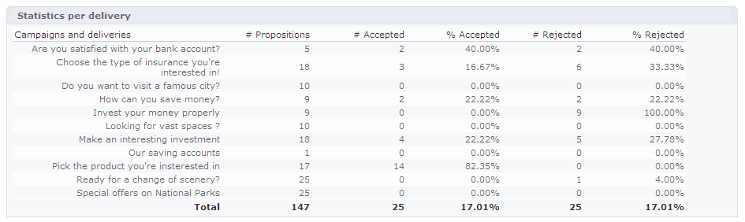

# Analyserapport van aanbiedingen{#offer-analysis-report}

De **[!UICONTROL Offer analysis]** bevat een overzicht van het aantal geaccepteerde of afgewezen voorstellen.

>[!NOTE]
>
>Deze functionaliteit is alleen online zichtbaar en alleen voor de leveringsmanager.

Statistieken worden gesorteerd op basis van drie criteria:

* Op datum:

   

* Op spatie:

   

* Per levering:

   

Gegevens kunnen worden gefilterd op basis van de verschillende criteria die beschikbaar zijn in de bovenste sectie van het rapport. Als u de gewenste criteria hebt geselecteerd, klikt u op de knop **[!UICONTROL Refresh]** koppeling om deze op het rapport toe te passen.

