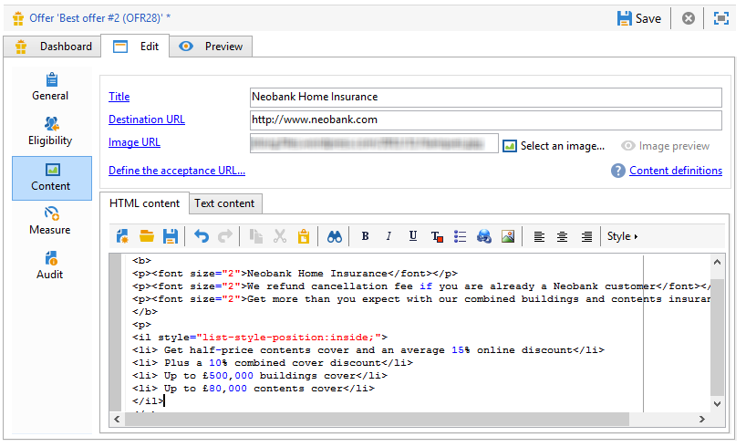
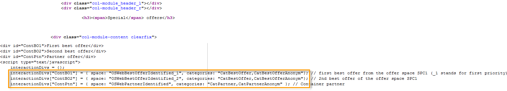

# Aanbiedingen op een inbound-kanaal{#offers-on-an-inbound-channel}


## Een voorstel aan een anonieme bezoeker presenteren {#presenting-an-offer-to-an-anonymous-visitor}

De Neobank-site wil op zijn website een aanbieding weergeven die gericht is op onbekende bezoekers die door de pagina bladeren.

Om deze interactie op te zetten, gaan we:

1. [Een anonieme omgeving maken](#creating-an-anonymous-environment)
1. [Anonieme aanbiedingsruimten maken](#creating-anonymous-offer-spaces)
1. [Een aanbiedingscategorie en een thema maken](#creating-an-offer-category-and-a-theme)
1. [Anonieme voorstellen maken.](#creating-anonymous-offers)
1. [Webaanbiedingsruimten op de website configureren](#configure-the-web-offer-space-on-the-website)

### Een anonieme omgeving maken {#creating-an-anonymous-environment}

Volg de procedure die in [ wordt beschreven Creërend een aanbiedingsmilieu ](../../interaction/using/live-design-environments.md#creating-an-offer-environment) om uw anoniem milieu tot stand te brengen dat op de **bezoekers**&#39; dimensies wordt gebaseerd.

U krijgt een boomstructuur met uw nieuwe omgeving:


### Anonieme aanbiedingsruimten maken {#creating-anonymous-offer-spaces}

1. In uw anoniem milieu (**Bezoekers**) gaan naar **[!UICONTROL Administration]** > **[!UICONTROL Spaces]** knoop.
1. Klik op **[!UICONTROL New]** om aanroepkanalen te maken.

   

   >[!NOTE]
   >
   >De ruimte wordt automatisch gekoppeld aan de anonieme omgeving.

1. Wijzig het label en selecteer het kanaal **[!UICONTROL Inbound Web]** . U moet ook het selectievakje **[!UICONTROL Enable unitary mode]** inschakelen.

   

1. Selecteer de velden voor aanbiedingsinhoud die voor de ruimte worden gebruikt en geef deze desgewenst op door het desbetreffende vak in te schakelen.

   Op die manier komen alle aanbiedingen die een van de volgende elementen missen, niet in aanmerking voor deze ruimte:

   * Titel
   * HTML-inhoud
   * URL afbeelding
   * Doel-URL

   

1. Bewerk de renderfunctie HTML bijvoorbeeld als volgt:

   ```
   function (imageUrl, targetUrl, shortContent, htmlSource){
         var html = "<p><b>" + shortContent + "</b></p>";
         html += "<p>" + htmlSource + "</p>";
         html += "<a _urlType='11' href='" + targetUrl + "'></a>";
         return html;
       }   
   ```

   >[!IMPORTANT]
   >
   >De renderfunctie moet de velden die voor de ruimte worden gebruikt een naam geven in de volgorde waarin deze eerder zijn geselecteerd, zodat de aanbiedingen correct worden weergegeven.

   

1. Bespaar de ruimte voor het voorstel.

### Een aanbiedingscategorie en een thema maken {#creating-an-offer-category-and-a-theme}

1. Ga naar het knooppunt **[!UICONTROL Offer catalog]** in de omgeving die u zojuist hebt gemaakt.
1. Klik met de rechtermuisknop op het knooppunt **[!UICONTROL Offer catalog]** en selecteer **[!UICONTROL Create a new 'Offer category' folder]** .

   Noem de nieuwe categorie, **Financiële producten** bijvoorbeeld.

1. Ga naar het 0} lusje van de categorie {en ga **financiering** als thema in, dan sparen veranderingen.**[!UICONTROL Eligibility]**

   

### Anonieme aanbiedingen maken {#creating-anonymous-offers}

1. Ga naar de rubriek die je zojuist hebt gemaakt.
1. Klik op **[!UICONTROL New]**.

   

1. Selecteer het anonieme aanbiedingstemplate uit de doos of een eerder gemaakte sjabloon.

   

1. Wijzig het label en sla je voorstel op.

   

1. Ga naar het tabblad **[!UICONTROL Eligibility]** en geef het gewicht van de aanbiedingen op volgens de context van de toepassing.

   In dit voorbeeld, wordt de aanbieding gevormd om op de homepage van de plaats als prioriteit tot het eind van het jaar worden getoond.

   

1. Ga naar het tabblad **[!UICONTROL Content]** en definieer de inhoud van de aanbieding.

   >[!NOTE]
   >
   >U kunt **[!UICONTROL Content definitions]** selecteren om de lijst met elementen weer te geven die nodig zijn voor de webruimte.

   

1. Maak een tweede voorstel.

   

1. Ga naar het tabblad **[!UICONTROL Eligibility]** en pas hetzelfde gewicht toe als voor de eerste aanbieding.
1. Voer de goedkeuringscyclus voor elke aanbieding uit om deze, evenals de goedgekeurde aanbiedingsruimten, beschikbaar te maken in de online omgeving.

### Webaanbiedingsruimte op de website configureren {#configure-the-web-offer-space-on-the-website}

Om de aanbiedingen te maken u enkel zichtbaar op de website hebt gevormd, neem een code van JavaScript in de pagina van de HTML van uw plaats op om de motor van de Interactie (voor meer op dit, verwijs naar [ Ongeveer binnenkomende kanalen ](../../interaction/using/about-inbound-channels.md)) op te roepen.

1. Ga naar de pagina van de HTML en neem een @id attribuut met een waarde op die de interne naam van de anonieme die aanbiedingsruimte aanpassen eerder wordt gecreeerd (verwijs naar [ het Creëren van anonieme aanbiedingsruimten ](#creating-anonymous-offer-spaces)), door **i_** wordt voorafgegaan.

   

1. Voeg de URL van de aanroep in.

   

   De blauwe dozen URL hierboven beantwoorden aan de instantienaam, de interne naam van het milieu (verwijs naar [ Creërend een anoniem milieu ](#creating-an-anonymous-environment)) en het thema verbonden aan de categorie ([ Creërend een aanbiedingscategorie en een thema ](#creating-an-offer-category-and-a-theme)). De laatste optie is facultatief.

Wanneer een bezoeker tot de homepage van de website toegang heeft, worden de aanbiedingen met het **financiering** thema getoond zoals gevormd op de pagina van de HTML.


Een gebruiker die de pagina meerdere keren bezoekt, ziet een van beide aanbiedingen in de categorie omdat aan beide hetzelfde gewicht is toegewezen.

## Overschakelen op een anonieme omgeving in het geval van niet-geïdentificeerde contacten {#switching-to-an-anonymous-environment-in-case-of-unidentified-contacts}

Het Neobank-bedrijf wil marketingaanbiedingen voor twee verschillende doelen maken. Het wil algemene aanbiedingen voor zijn anonieme websitebrowsers tonen. Als één van deze gebruikers een klant met herkenningstekens blijkt te zijn die door Neobank worden verstrekt, zou het bedrijf hen willen om gepersonaliseerde aanbiedingen te ontvangen zodra zij login.

Deze casestudy is gebaseerd op het volgende scenario:

1. Een bezoeker bladert door de Neobank-website zonder u aan te melden.

   

   Drie anonieme aanbiedingen worden getoond op de pagina: twee **Beste aanbiedingen van de Aanbieding** voor Neobank producten en één aanbieding van een Neobank partner.

   

1. De gebruiker, een Neobank klant, meldt zich aan met zijn geloofsbrieven.

   

   Er worden drie persoonlijke aanbiedingen weergegeven.

   

Om deze gevallenanalyse uit te voeren, moet u twee aanbiedingsmilieu&#39;s hebben: voor anonieme interactie en met aanbiedingen die specifiek voor geïdentificeerde contacten worden gevormd. Het geïdentificeerde aanbiedingsmilieu zal worden gevormd om aan het anonieme aanbiedingsmilieu automatisch over te schakelen als het contact niet wordt het programma geopend en daarom niet wordt geïdentificeerd.

Voer de volgende stappen uit:

* Maak een catalogus met aanbiedingen die specifiek zijn voor anonieme binnenkomende interacties door de volgende stappen uit te voeren:

   1. [Een omgeving voor anonieme contactpersonen maken](#creating-an-environment-for-anonymous-contacts)
   1. [Het vormen aanbiedingsruimten voor het anonieme milieu](#configuring-offer-spaces-for-the-anonymous-environment)
   1. [Aanbiedingscategorieën maken in een anonieme omgeving](#creating-offer-categories-in-an-anonymous-environment)
   1. [Aanbiedingen maken voor anonieme bezoekers](#creating-offers-for-anonymous-visitors)

* Maak een catalogus met aanbiedingen die specifiek zijn voor geïdentificeerde binnenkomende interacties met behulp van de volgende stappen:

   1. [Vorm de aanbiedingsruimten in het geïdentificeerde milieu](#configure-the-offer-spaces-in-the-identified-environment)
   1. [Aanbiedingscategorieën maken in een geïdentificeerde omgeving](#creating-offer-categories-in-an-identified-environment)
   1. [Aangepaste aanbiedingen maken](#creating-personalized-offers)

* Vorm de vraag aan de aanbiedingsmotor:

   1. [Aanbiedingsruimten op de webpagina configureren](#configuring-offer-spaces-on-the-web-page)
   1. [De geavanceerde instellingen van de opgegeven aanbiedingsruimten opgeven](#specifying-the-advanced-settings-of-the-identified-offer-spaces)

### Een omgeving voor anonieme contactpersonen maken {#creating-an-environment-for-anonymous-contacts}

1. Creeer een aanbiedingsmilieu voor anonieme binnenkomende interacties via de medewerker van de leveringsafbeelding (**Bezoeker** afbeelding). Voor meer op dit, verwijs naar [ Creërend een aanbiedingsmilieu ](../../interaction/using/live-design-environments.md#creating-an-offer-environment).

   

### Het vormen aanbiedingsruimten voor het anonieme milieu {#configuring-offer-spaces-for-the-anonymous-environment}

De aanbiedingen die op de website moeten worden voorgesteld behoren tot twee verschillende categorieën: **Beste Voorstel** en **Partner**. In dit voorbeeld maken we een specifieke aanbiedingsruimte voor elke categorie.

Om de aanbiedingsruimte tot stand te brengen om de **Beste categorie van het Aanbod** aan te passen, pas het volgende proces toe:

1. Ga in de Adobe Campaign-structuur naar de anonieme omgeving die u zojuist hebt gemaakt en voeg een aanbiedingsruimte toe.

   

1. Maak een nieuwe **[!UICONTROL Inbound web]** tekstruimte.

   

1. Ga een etiket voor het in: **Beste Anonieme Aanbieding van het Web** bijvoorbeeld.
1. Voeg de velden met aanbiedingsinhoud die voor deze aanbiedingsruimte worden gebruikt toe en configureer de renderfuncties.

   

   >[!IMPORTANT]
   >
   >De renderfunctie moet de velden die voor de ruimte worden gebruikt een naam geven in de volgorde waarin deze eerder zijn geselecteerd, zodat de aanbiedingen correct worden weergegeven.

1. Gebruik het zelfde proces om tot een binnenkomend WebChannel aanbiedingsruimte tot stand te brengen om de **categorie van de Partner aan te passen**.

   

### Aanbiedingscategorieën maken in een anonieme omgeving {#creating-offer-categories-in-an-anonymous-environment}

Begin door twee aanbiedingscategorieën te creëren: de **categorie van het Beste voorstel** en de **Partner** categorie. Elke categorie zal twee aanbiedingen voor anonieme contacten bevatten.

1. Ga naar de **[!UICONTROL Offer catalog]** in de anonieme omgeving die u net hebt gemaakt.
1. Voeg een **[!UICONTROL Offer category]** omslag met **Beste Voorstel** als etiket toe.

   

1. Creeer een tweede categorie met **Partner** als etiket.

   

### Aanbiedingen maken voor anonieme bezoekers {#creating-offers-for-anonymous-visitors}

We gaan nu twee aanbiedingen maken voor elk van de hierboven geschetste rubrieken.

1. Ga naar de **Beste aanbieding** categorie en creeer een anonieme aanbieding.

   

1. Ga naar het tabblad **[!UICONTROL Eligibility]** en geef het gewicht van de aanbiedingen op volgens de context van de toepassing.

   

1. Ga naar het tabblad **[!UICONTROL Content]** en definieer de inhoud van de aanbieding.

   

1. Creeer een tweede aanbieding in de **Beste voorstel** categorie.

   

1. Ga naar de **categorie van de Partner** en creeer een anonieme aanbieding.
1. Ga naar het tabblad **[!UICONTROL Content]** en definieer de inhoud van de aanbieding.

   

1. Ga naar het tabblad **[!UICONTROL Eligibility]** en geef het gewicht van de aanbiedingen op volgens de context van de toepassing.

   

1. Creeer een tweede aanbieding voor de **categorie van de Partner**.

   

1. Ga naar het tabblad **[!UICONTROL Eligibility]** en pas hetzelfde gewicht toe als dat u hebt toegepast op de eerste aanbieding in deze categorie, zodat de aanbiedingen achtereenvolgens op de website worden weergegeven.

   

1. Voer de goedkeuringscyclus voor elke aanbieding uit om ze live te laten gaan. Wanneer het goedkeuren van inhoud, activeer de **Partner** of **Beste Voorstel** aanbiedingsruimte, volgens de aanbieding.

### Vorm de aanbiedingsruimten in het geïdentificeerde milieu {#configure-the-offer-spaces-in-the-identified-environment}

De aanbiedingen die u op de website zult voorstellen worden genomen van twee verschillende categorieën: **Beste Aanbieding** en **Partner**. In dit voorbeeld willen we een specifieke spatie maken voor elke categorie.

Om de twee aanbiedingsruimten tot stand te brengen, pas de zelfde procedure toe zoals voor anonieme aanbiedingsruimten. Verwijs naar [ het Vormen aanbiedingsruimten voor het anonieme milieu ](#configuring-offer-spaces-for-the-anonymous-environment).

1. In de boom van Adobe Campaign, ga naar het milieu u enkel creeerde en **Beste Aanbieding** en **Partner** aanbiedingsruimten hebt toegevoegd.
1. Pas het proces toe dat in [ wordt gedetailleerd het Vormen aanbiedingsruimten voor het anonieme milieu ](#configuring-offer-spaces-for-the-anonymous-environment).

   

1. Selecteer de optie **[!UICONTROL Fall back on an anonymous environment if no individuals were identified]** .

   

1. Gebruikend de drop-down lijst, selecteer de anonieme die ruimte van de Webaanbieding eerder wordt gecreeerd (verwijs naar [ Vormende aanbiedingsruimten voor het anonieme milieu ](#configuring-offer-spaces-for-the-anonymous-environment)).

   

### De geavanceerde instellingen van de opgegeven aanbiedingsruimten opgeven {#specifying-the-advanced-settings-of-the-identified-offer-spaces}

In dit voorbeeld vindt de identificatie van de contactpersoon plaats via het e-mailadres in de Adobe Campaign-database. Pas het volgende proces toe om de e-mail voor ontvangers aan de ruimte toe te voegen:

1. Ga in de geïdentificeerde omgeving naar de map met aanbiedingsruimte.
1. Selecteer **Beste voorstel** aanbiedingsruimte en klik **[!UICONTROL Advanced parameters]**.

   

1. Klik op het tabblad **[!UICONTROL Target identification]** op **[!UICONTROL Add]**.

   

1. Klik op **[!UICONTROL Edit expression]** , ga naar de tabel met ontvangers en selecteer het veld **[!UICONTROL Email]** .

   

1. Klik **[!UICONTROL OK]** om het **[!UICONTROL Advanced parameters]** venster te sluiten en te beëindigen vormend **Beste voorstel** aanbiedingsruimte.
1. Pas het zelfde proces voor de **Partner** aanbiedingsruimte toe.

   

### Aanbiedingscategorieën maken in een geïdentificeerde omgeving {#creating-offer-categories-in-an-identified-environment}

Wij gaan twee afzonderlijke categorieën tot stand brengen: de **categorie van het Beste voorstel van 0} {en de** Partner **categorie, elk met twee gepersonaliseerde aanbiedingen.**

1. Ga naar het knooppunt **[!UICONTROL Offer catalogs]** in de opgegeven omgeving.
1. Zoals in het anonieme milieu, voeg twee **[!UICONTROL Offer category]** omslagen met **Beste Voorstel** en **Partner** als etiketten toe.

   

### Aangepaste aanbiedingen maken {#creating-personalized-offers}

We willen voor elke categorie twee persoonlijke aanbiedingen maken, dat wil zeggen vier aanbiedingen.

1. Ga naar de **Beste Aanbieding** categorie en creeer een eerste gepersonaliseerde aanbieding.

   

1. Ga naar het tabblad **[!UICONTROL Eligibility]** en geef het gewicht van de aanbiedingen op volgens de context van de toepassing.

   

1. Ga naar het tabblad **[!UICONTROL Content]** en definieer de inhoud van de aanbieding.

   

1. Creeer een tweede aanbieding in de **Beste voorstel** categorie.

   

1. Ga naar de **categorie van de Partner** en creeer een gepersonaliseerde aanbieding.

   

1. Ga naar het tabblad **[!UICONTROL Eligibility]** en geef het gewicht van de aanbiedingen op volgens de context van de toepassing.

   

1. Creeer een tweede aanbieding voor de **categorie van de Partner**.

   

1. Ga naar het tabblad **[!UICONTROL Eligibility]** en pas hetzelfde gewicht toe als dat u hebt toegepast op de eerste aanbieding in deze categorie, zodat de aanbiedingen achtereenvolgens op de website worden weergegeven.
1. Voer de goedkeuringscyclus voor elke aanbieding uit om deze bij te werken. Tijdens inhoudsgoedkeuring, activeer de **Partner** of **Beste Aanbiedingsruimten van de Aanbieding**.

### Aanbiedingsruimten op de webpagina configureren {#configuring-offer-spaces-on-the-web-page}

De website van het Neobank bedrijf heeft drie ruimten voor aanbiedingen: twee voor bank betrekking hebbende aanbiedingen van de **1} categorie van het Beste Voorstel {, en één voor aanbiedingen van de** 3} categorie van de Partner.****


Pas het volgende proces toe om deze aanbiedingsruimten op de HTML-pagina van de website te configureren:

1. Voeg drie toe aan de inhoud van de pagina HTML

   elementen met een kenmerk @id waarvan de waarde ons in staat stelt de aanbiedingen op te roepen in de verschillende aanbiedingsruimten van de website.

   

1. Voeg vervolgens het script in voor het definiëren van kenmerkwaarden.

   

   In dit voorbeeld, **ContBO1** en **ContBO2** ontvangen de waarde **OsWebBestOfferIdentified**, d.w.z. de interne naam van de **Beste Aanbiedingsruimte van de Aanbieding** die eerder in het geïdentificeerde milieu wordt gecreeerd. De **CatBestOffer** en **CatBestOfferAnonym** waarden passen de interne naam van de **** categorieën van de Beste aanbieding voor anonieme en geïdentificeerde milieu&#39;s aan.

   

   Eveneens, **ContPtn** ontvangt de **** waarde OSWebPartnerIdentified, die de interne naam van de **Partner** aanbiedingsruimte aanpast die in het geïdentificeerde milieu wordt gecreeerd. **CatPartner** en **CatPartnerAnonym** passen de interne naam van de **Partner** categorieën voor anonieme en geïdentificeerde milieu&#39;s aan.

   

1. Wijs de informatie toe die u de persoon zal identificeren die aan de Neobank plaats aan de **interactionTarget** variabele het programma opent.

   

   De identificatie van de persoon kan op een browser koekje, een lezingsparameter in URL, e-mail, of herkenningsteken van de persoon worden gebaseerd. Als een gebied van de ontvankelijke lijst buiten de primaire sleutel wordt gebruikt, moet het in de geavanceerde parameters van de ruimte worden bepaald (verwijs naar [ specificerend de geavanceerde montages van de geïdentificeerde aanbiedingsruimten ](#specifying-the-advanced-settings-of-the-identified-offer-spaces)).

1. Voeg de URL van de aanroep in.

   

   URL bevat **EnvNeobankRecip**, de interne naam van het geïdentificeerde milieu.

Wanneer u de webpagina opent, kunt u met het script de Interactie-engine oproepen om de inhoud van aanbiedingen in de relevante ruimten van de webpagina weer te geven. Bij één aanroep naar de Adobe Campaign-server bepaalt de engine de omgeving, de aanbiedingsruimte en de categorieën die moeten worden geselecteerd.

In dit voorbeeld, erkent de motor het geïdentificeerde milieu (**EnvNeobankIdnRecip**). Het identificeert de aanbiedingsruimte (**OSWebBestOfferIdentified**) en de **Beste 3} categorie van de Aanbieding (** CatBestOffer **) voor de eerste en tweede aanbiedingsruimten op de Web-pagina, evenals (** OSWebPartnerIdentified **) aanbiedingsruimte en de** categorie **(** CatPartner **) voor de derde aanbiedingsruimte op de plaats.**

Als de motor niet de ontvanger kan identificeren, schakelt het aan de anonieme aanbiedingsruimten van verwijzingen voorzien in de geïdentificeerde aanbiedingsruimten en naar de anonieme categorieën (**CatPartner** en **CatPartnerAnonym**) zoals die in het manuscript worden gespecificeerd.
