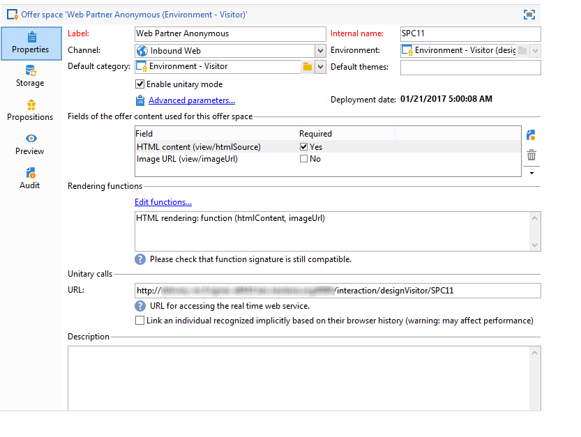
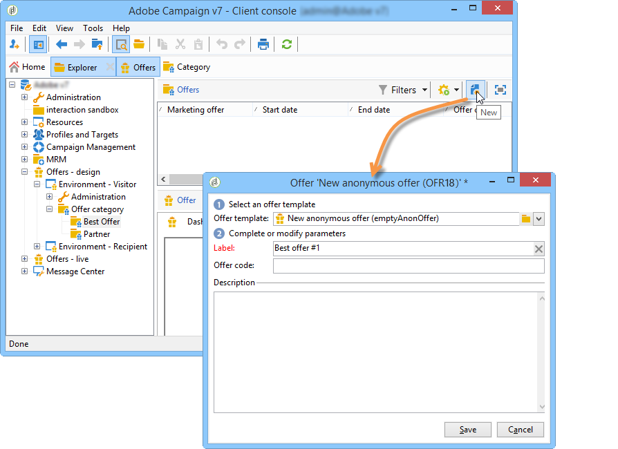
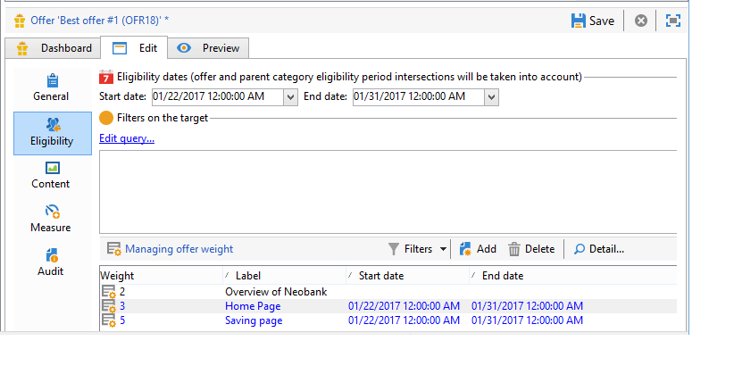
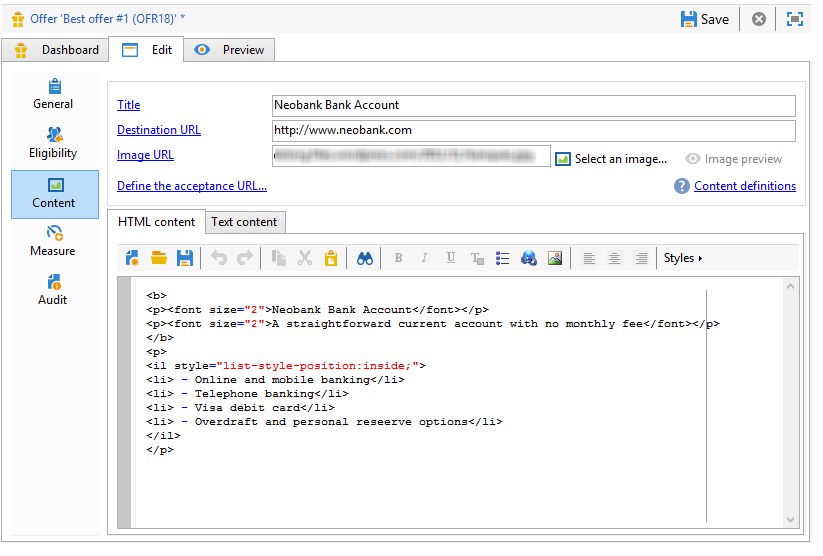
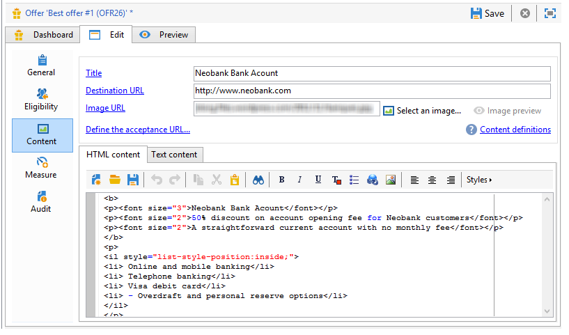

# Aanbiedingen op een inbound-kanaal{#offers-on-an-inbound-channel}


## Een voorstel aan een anonieme bezoeker presenteren {#presenting-an-offer-to-an-anonymous-visitor}

De Neobank-site wil op zijn website een aanbieding weergeven die gericht is op onbekende bezoekers die door de pagina bladeren.

Om deze interactie op te zetten, gaan we:

1. [Een anonieme omgeving maken](#creating-an-anonymous-environment)
1. [Anonieme aanbiedingsruimten maken](#creating-anonymous-offer-spaces)
1. [Een aanbiedingscategorie en een thema maken](#creating-an-offer-category-and-a-theme)
1. [Anonieme voorstellen maken.](#creating-anonymous-offers)
1. [Webaanbiedingsruimten op de website configureren](#configure-the-web-offer-space-on-the-website)

### Een anonieme omgeving maken {#creating-an-anonymous-environment}

Volg de in [Een aanbiedingsomgeving maken](../../interaction/using/live-design-environments.md#creating-an-offer-environment) om uw anonieme omgeving te maken op basis van de **Bezoekers**&#39; afmetingen.

U krijgt een boomstructuur met uw nieuwe omgeving:


### Anonieme aanbiedingsruimten maken {#creating-anonymous-offer-spaces}

1. In uw anonieme omgeving (**Bezoekers**) ga naar de **[!UICONTROL Administration]** > **[!UICONTROL Spaces]** knooppunt.
1. Klikken **[!UICONTROL New]** om vraagkanalen te creëren.

   

   >[!NOTE]
   >
   >De ruimte wordt automatisch gekoppeld aan de anonieme omgeving.

1. Wijzig het label en selecteer het **[!UICONTROL Inbound Web]** kanaal. U moet ook de **[!UICONTROL Enable unitary mode]** doos.

   

1. Selecteer de velden voor aanbiedingsinhoud die voor de ruimte worden gebruikt en geef deze desgewenst op door het desbetreffende vak in te schakelen.

   Op die manier komen alle aanbiedingen die een van de volgende elementen missen, niet in aanmerking voor deze ruimte:

   * Titel
   * HTML-inhoud
   * URL afbeelding
   * Doel-URL

   

1. Bewerk de renderfunctie HTML bijvoorbeeld als volgt:

   ```
   function (imageUrl, targetUrl, shortContent, htmlSource){
         var html = "<p><b>" + shortContent + "</b></p>";
         html += "<p>" + htmlSource + "</p>";
         html += "<a _urlType='11' href='" + targetUrl + "'></a>";
         return html;
       }   
   ```

   >[!IMPORTANT]
   >
   >De renderfunctie moet de velden die voor de ruimte worden gebruikt een naam geven in de volgorde waarin deze eerder zijn geselecteerd, zodat de aanbiedingen correct worden weergegeven.

   

1. Bespaar de ruimte voor het voorstel.

### Een aanbiedingscategorie en een thema maken {#creating-an-offer-category-and-a-theme}

1. Ga naar de **[!UICONTROL Offer catalog]** binnen de omgeving die u zojuist hebt gemaakt.
1. Klik met de rechtermuisknop op de knop **[!UICONTROL Offer catalog]** knooppunt en selecteer **[!UICONTROL Create a new 'Offer category' folder]**.

   Geef de nieuwe categorie een naam, **Financiële producten** bijvoorbeeld.

1. Ga naar de categorie **[!UICONTROL Eligibility]** en voert u in **financiering** als thema, dan sparen veranderingen.

   

### Anonieme aanbiedingen maken {#creating-anonymous-offers}

1. Ga naar de rubriek die je zojuist hebt gemaakt.
1. Klik op **[!UICONTROL New]**.

   

1. Selecteer het anonieme aanbiedingstemplate uit de doos of een eerder gemaakte sjabloon.

   

1. Wijzig het label en sla je voorstel op.

   

1. Ga naar de **[!UICONTROL Eligibility]** en geeft u het gewicht van de aanbiedingen aan volgens de toepassingscontext.

   In dit voorbeeld, wordt de aanbieding gevormd om op de homepage van de plaats als prioriteit tot het eind van het jaar worden getoond.

   

1. Ga naar de **[!UICONTROL Content]** en definieert u de inhoud van de aanbieding.

   >[!NOTE]
   >
   >U kunt **[!UICONTROL Content definitions]** om de lijst met elementen weer te geven die nodig zijn voor de webruimte.

   

1. Maak een tweede voorstel.

   

1. Ga naar de **[!UICONTROL Eligibility]** en past hetzelfde gewicht toe als voor de eerste aanbieding.
1. Voer de goedkeuringscyclus voor elke aanbieding uit om deze, evenals de goedgekeurde aanbiedingsruimten, beschikbaar te maken in de online omgeving.

### Webaanbiedingsruimte op de website configureren {#configure-the-web-offer-space-on-the-website}

Als u de aanbiedingen die u net hebt geconfigureerd zichtbaar wilt maken op de website, voegt u een JavaScript-code in de HTML-pagina van uw site in om de Interactie-engine op te roepen (raadpleeg voor meer informatie hierover: [Over binnenkomende kanalen](../../interaction/using/about-inbound-channels.md)).

1. Ga naar de pagina van de HTML en neem een attribuut @id met een waarde op die de interne naam van de anonieme aanbiedingsruimte aanpast die eerder wordt gecreeerd (verwijs naar [Anonieme aanbiedingsruimten maken](#creating-anonymous-offer-spaces)), voorafgegaan door **i_**.

   

1. Voeg de URL van de aanroep in.

   

   De blauwe URL-vakken hierboven komen overeen met de instantienaam, de interne naam van de omgeving (zie [Een anonieme omgeving maken](#creating-an-anonymous-environment)) en het thema van de categorie ([Een aanbiedingscategorie en een thema maken](#creating-an-offer-category-and-a-theme)). De laatste optie is facultatief.

Wanneer een bezoeker toegang krijgt tot de homepage van de website, worden de aanbiedingen met de **financiering** thema wordt getoond zoals gevormd op de pagina van de HTML.


Een gebruiker die de pagina meerdere keren bezoekt, ziet een van beide aanbiedingen in de categorie omdat aan beide hetzelfde gewicht is toegewezen.

## Overschakelen op een anonieme omgeving in het geval van niet-geïdentificeerde contacten {#switching-to-an-anonymous-environment-in-case-of-unidentified-contacts}

Het Neobank-bedrijf wil marketingaanbiedingen voor twee verschillende doelen maken. Het wil algemene aanbiedingen voor zijn anonieme websitebrowsers tonen. Als één van deze gebruikers een klant met herkenningstekens blijkt te zijn die door Neobank worden verstrekt, zou het bedrijf hen willen om gepersonaliseerde aanbiedingen te ontvangen zodra zij login.

Deze casestudy is gebaseerd op het volgende scenario:

1. Een bezoeker bladert door de Neobank-website zonder u aan te melden.

   

   Er worden drie anonieme aanbiedingen weergegeven op de pagina: twee **Beste voorstel** aanbiedingen voor Neobank producten en één aanbieding van een Neobank partner.

   

1. De gebruiker, een Neobank klant, meldt zich aan met zijn geloofsbrieven.

   

   Er worden drie persoonlijke aanbiedingen weergegeven.

   

Om deze gevallenanalyse uit te voeren, moet u twee aanbiedingsmilieu&#39;s hebben: voor anonieme interactie en met aanbiedingen die specifiek voor geïdentificeerde contacten worden gevormd. Het geïdentificeerde aanbiedingsmilieu zal worden gevormd om aan het anonieme aanbiedingsmilieu automatisch over te schakelen als het contact niet wordt het programma geopend en daarom niet wordt geïdentificeerd.

Voer de volgende stappen uit:

* Maak een catalogus met aanbiedingen die specifiek zijn voor anonieme binnenkomende interacties door de volgende stappen uit te voeren:

   1. [Een omgeving voor anonieme contactpersonen maken](#creating-an-environment-for-anonymous-contacts)
   1. [Het vormen aanbiedingsruimten voor het anonieme milieu](#configuring-offer-spaces-for-the-anonymous-environment)
   1. [Aanbiedingscategorieën maken in een anonieme omgeving](#creating-offer-categories-in-an-anonymous-environment)
   1. [Aanbiedingen maken voor anonieme bezoekers](#creating-offers-for-anonymous-visitors)

* Maak een catalogus met aanbiedingen die specifiek zijn voor geïdentificeerde binnenkomende interacties met behulp van de volgende stappen:

   1. [Vorm de aanbiedingsruimten in het geïdentificeerde milieu](#configure-the-offer-spaces-in-the-identified-environment)
   1. [Aanbiedingscategorieën maken in een geïdentificeerde omgeving](#creating-offer-categories-in-an-identified-environment)
   1. [Aangepaste aanbiedingen maken](#creating-personalized-offers)

* Vorm de vraag aan de aanbiedingsmotor:

   1. [Aanbiedingsruimten op de webpagina configureren](#configuring-offer-spaces-on-the-web-page)
   1. [De geavanceerde instellingen van de opgegeven aanbiedingsruimten opgeven](#specifying-the-advanced-settings-of-the-identified-offer-spaces)

### Een omgeving voor anonieme contactpersonen maken {#creating-an-environment-for-anonymous-contacts}

1. Creeer een aanbiedingsmilieu voor anonieme binnenkomende interactie via de afleveringstoewijzingstovenaar (**Bezoeker** afbeelding). Raadpleeg voor meer informatie hierover [Een aanbiedingsomgeving maken](../../interaction/using/live-design-environments.md#creating-an-offer-environment).

   

### Het vormen aanbiedingsruimten voor het anonieme milieu {#configuring-offer-spaces-for-the-anonymous-environment}

De aanbiedingen die op de website moeten worden gepresenteerd, behoren tot twee verschillende categorieën: **Beste voorstel** en **Partner**. In dit voorbeeld maken we een specifieke aanbiedingsruimte voor elke categorie.

Om de aanbiedingsruimte tot stand te brengen die aan **Beste voorstel** categorie, past het volgende proces toe:

1. Ga in de Adobe Campaign-structuur naar de anonieme omgeving die u zojuist hebt gemaakt en voeg een aanbiedingsruimte toe.

   

1. Een nieuwe **[!UICONTROL Inbound web]** tekstruimte.

   

1. Voer een label in voor dit item: **Beste anonieme aanbieding op internet** bijvoorbeeld.
1. Voeg de velden met aanbiedingsinhoud die voor deze aanbiedingsruimte worden gebruikt toe en configureer de renderfuncties.

   

   >[!IMPORTANT]
   >
   >De renderfunctie moet de velden die voor de ruimte worden gebruikt een naam geven in de volgorde waarin deze eerder zijn geselecteerd, zodat de aanbiedingen correct worden weergegeven.

1. Gebruik hetzelfde proces om een binnenkomend webkanaal met voldoende ruimte te maken voor de **Partner** categorie.

   

### Aanbiedingscategorieën maken in een anonieme omgeving {#creating-offer-categories-in-an-anonymous-environment}

Begin met het maken van twee categorieën aanbiedingen: de **Beste voorstel** en de **Partner** categorie. Elke categorie zal twee aanbiedingen voor anonieme contacten bevatten.

1. Ga naar de **[!UICONTROL Offer catalog]** in de anonieme omgeving die u zojuist hebt gemaakt.
1. Een **[!UICONTROL Offer category]** map met **Beste voorstel** als label.

   

1. Een tweede rubriek maken met **Partner** als label.

   

### Aanbiedingen maken voor anonieme bezoekers {#creating-offers-for-anonymous-visitors}

We gaan nu twee aanbiedingen maken voor elk van de hierboven geschetste rubrieken.

1. Ga naar de **Beste voorstel** een anonieme aanbieding maken.

   

1. Ga naar de **[!UICONTROL Eligibility]** en geeft u het gewicht van de aanbiedingen aan volgens de toepassingscontext.

   

1. Ga naar de **[!UICONTROL Content]** en definieert u de inhoud van de aanbieding.

   

1. Een tweede voorstel maken in het dialoogvenster **Beste voorstel** categorie.

   

1. Ga naar de **Partner** een anonieme aanbieding maken.
1. Ga naar de **[!UICONTROL Content]** en definieert u de inhoud van de aanbieding.

   

1. Ga naar de **[!UICONTROL Eligibility]** en geeft u het gewicht van de aanbiedingen aan volgens de toepassingscontext.

   

1. Een tweede voorstel maken voor de **Partner** categorie.

   

1. Ga naar de **[!UICONTROL Eligibility]** en past u hetzelfde gewicht toe dat u op de eerste aanbieding in deze categorie hebt toegepast, zodat de aanbiedingen achtereenvolgens op de website worden weergegeven.

   

1. Voer de goedkeuringscyclus voor elke aanbieding uit om ze live te laten gaan. Activeer bij het goedkeuren van inhoud het dialoogvenster **Partner** of **Beste voorstel** biedt ruimte aan, volgens de aanbieding.

### Vorm de aanbiedingsruimten in het geïdentificeerde milieu {#configure-the-offer-spaces-in-the-identified-environment}

De voorstellen die u op de website gaat presenteren, zijn afkomstig uit twee verschillende categorieën: **Beste voorstel** en **Partner**. In dit voorbeeld willen we een specifieke spatie maken voor elke categorie.

Om de twee aanbiedingsruimten tot stand te brengen, pas de zelfde procedure toe zoals voor anonieme aanbiedingsruimten. Zie [Het vormen aanbiedingsruimten voor het anonieme milieu](#configuring-offer-spaces-for-the-anonymous-environment).

1. Ga in de Adobe Campaign-boomstructuur naar de omgeving die u zojuist hebt gemaakt en voeg deze toe **Beste voorstel** en **Partner** bieden spaties aan.
1. Het in [Het vormen aanbiedingsruimten voor het anonieme milieu](#configuring-offer-spaces-for-the-anonymous-environment).

   

1. Selecteer de **[!UICONTROL Fall back on an anonymous environment if no individuals were identified]** -optie.

   

1. Selecteer met de vervolgkeuzelijst de anonieme webaanbiedingsruimte die u eerder hebt gemaakt (zie [Het vormen aanbiedingsruimten voor het anonieme milieu](#configuring-offer-spaces-for-the-anonymous-environment)).

   

### De geavanceerde instellingen van de opgegeven aanbiedingsruimten opgeven {#specifying-the-advanced-settings-of-the-identified-offer-spaces}

In dit voorbeeld vindt de identificatie van de contactpersoon plaats via het e-mailadres in de Adobe Campaign-database. Pas het volgende proces toe om de e-mail voor ontvangers aan de ruimte toe te voegen:

1. Ga in de geïdentificeerde omgeving naar de map met aanbiedingsruimte.
1. Selecteer de **Beste voorstel** biedt ruimte aan en klik op **[!UICONTROL Advanced parameters]**.

   

1. Klik op het tabblad **[!UICONTROL Target identification]** op **[!UICONTROL Add]**.

   

1. Klikken **[!UICONTROL Edit expression]**, ga naar de lijst van ontvangers en selecteer **[!UICONTROL Email]** veld.

   

1. Klikken **[!UICONTROL OK]** om de **[!UICONTROL Advanced parameters]** venster en klaar met het configureren van de **Beste voorstel** biedt ruimte aan.
1. Dezelfde procedure toepassen voor de **Partner** biedt ruimte aan.

   

### Aanbiedingscategorieën maken in een geïdentificeerde omgeving {#creating-offer-categories-in-an-identified-environment}

We gaan twee aparte categorieën creëren: de **Beste voorstel** en de **Partner** rubriek, elk met twee persoonlijke aanbiedingen.

1. Ga naar de **[!UICONTROL Offer catalogs]** in de geïdentificeerde omgeving.
1. Zoals in het anonieme milieu, voeg twee toe **[!UICONTROL Offer category]** mappen met **Beste voorstel** en **Partner** als een label.

   

### Aangepaste aanbiedingen maken {#creating-personalized-offers}

We willen voor elke categorie twee persoonlijke aanbiedingen maken, dat wil zeggen vier aanbiedingen.

1. Ga naar de **Beste voorstel** en maak een eerste persoonlijke aanbieding.

   

1. Ga naar de **[!UICONTROL Eligibility]** en geeft u het gewicht van de aanbiedingen aan volgens de toepassingscontext.

   

1. Ga naar de **[!UICONTROL Content]** en definieert u de inhoud van de aanbieding.

   

1. Een tweede voorstel maken in het dialoogvenster **Beste voorstel** categorie.

   

1. Ga naar de **Partner** rubriek en maak een persoonlijke aanbieding.

   

1. Ga naar de **[!UICONTROL Eligibility]** en geeft u het gewicht van de aanbiedingen aan volgens de toepassingscontext.

   

1. Een tweede voorstel maken voor de **Partner** categorie.

   

1. Ga naar de **[!UICONTROL Eligibility]** en past u hetzelfde gewicht toe dat u op de eerste aanbieding in deze categorie hebt toegepast, zodat de aanbiedingen achtereenvolgens op de website worden weergegeven.
1. Voer de goedkeuringscyclus voor elke aanbieding uit om deze bij te werken. Activeer tijdens het goedkeuren van inhoud de **Partner** of **Beste voorstel** bieden spaties aan.

### Aanbiedingsruimten op de webpagina configureren {#configuring-offer-spaces-on-the-web-page}

De website van Neobank heeft drie mogelijkheden voor aanbiedingen: twee voor bancaire aanbiedingen van de **Beste voorstel** en één voor voorstellen van de **Partner** categorie.


Pas het volgende proces toe om deze aanbiedingsruimten op de HTML-pagina van de website te configureren:

1. Voeg drie toe aan de inhoud van de pagina HTML

   elementen met een kenmerk @id waarvan de waarde ons in staat stelt de aanbiedingen op te roepen in de verschillende aanbiedingsruimten van de website.

   

1. Voeg vervolgens het script in voor het definiëren van kenmerkwaarden.

   

   In dit voorbeeld: **ContBO1** en **ContBO2** ontvangen de waarde **OsWebBestOfferIdentified**, d.w.z. de interne naam van **Beste voorstel** Biedt ruimte die eerder in de geïdentificeerde omgeving is gemaakt. De **CatBestOffer** en **CatBestOfferAnonym** waarden komen overeen met de interne naam van de **Beste voorstel** categorieën voor anonieme en geïdentificeerde omgevingen.

   

   Evenzo, **ContPtn** ontvangt **OSWebPartnerIdentified** waarde, die overeenkomt met de interne naam van de **Partner** biedt ruimte die in de geïdentificeerde omgeving is gemaakt. **CatPartner** en **CatPartnerAnonym** de interne naam van de **Partner** categorieën voor anonieme en geïdentificeerde omgevingen.

   

1. Wijs de informatie toe waarmee u de persoon kunt identificeren die zich aanmeldt bij de Neobank-site **interactionTarget** variabele.

   

   De identificatie van de persoon kan op een browser koekje, een lezingsparameter in URL, e-mail, of herkenningsteken van de persoon worden gebaseerd. Als een gebied van de ontvankelijke lijst buiten de primaire sleutel wordt gebruikt, moet het in de geavanceerde parameters van de ruimte worden bepaald (verwijs naar [De geavanceerde instellingen van de opgegeven aanbiedingsruimten opgeven](#specifying-the-advanced-settings-of-the-identified-offer-spaces)).

1. Voeg de URL van de aanroep in.

   

   De URL bevat **EnvNeobankRecip**, de interne naam van de geïdentificeerde omgeving.

Wanneer u de webpagina opent, kunt u met het script de Interactie-engine oproepen om de inhoud van aanbiedingen in de relevante ruimten van de webpagina weer te geven. Bij één aanroep naar de Adobe Campaign-server bepaalt de engine de omgeving, de aanbiedingsruimte en de categorieën die moeten worden geselecteerd.

In dit voorbeeld herkent de motor de geïdentificeerde omgeving (**EnvNeobankIdnRecip**). Het identificeert de aanbiedingsruimte (**OSWebBestOfferIdentified**) en de **Beste voorstel** rubriek (**CatBestOffer**) voor de spaties met de eerste en de tweede aanbieding op de webpagina en de (**OSWebPartnerIdentified**) biedt ruimte en de **Partner** rubriek (**CatPartner**) voor de derde aanbiedingsruimte op de site.

Als de motor niet de ontvanger kan identificeren, schakelt het aan de anonieme aanbiedingsruimten van verwijzingen voorzien in de geïdentificeerde aanbiedingsruimten en naar de anonieme categorieën (**CatPartner** en **CatPartnerAnonym**) zoals opgegeven in het script.
