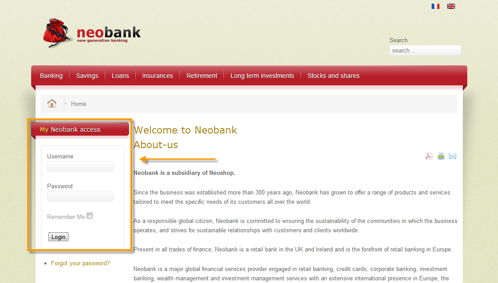

# Aanbiedingen op een binnenkomend kanaal{#offers-on-an-inbound-channel}

## Een aanbieding aan een anonieme bezoeker {#presenting-an-offer-to-an-anonymous-visitor} presenteren

De Neobank-site wil op zijn website een aanbieding weergeven die gericht is op onbekende bezoekers die door de pagina bladeren.

Om deze interactie op te zetten, gaan we:

1. [Een anonieme omgeving maken](#creating-an-anonymous-environment)
1. [Anonieme aanbiedingsruimten maken](#creating-anonymous-offer-spaces)
1. [Een aanbiedingscategorie en een thema maken](#creating-an-offer-category-and-a-theme)
1. [Anonieme voorstellen maken.](#creating-anonymous-offers)
1. [Webaanbiedingsruimten op de website configureren](#configure-the-web-offer-space-on-the-website)

### Een anonieme omgeving {#creating-an-anonymous-environment} maken

Volg de procedure in [Creërend een aanbiedingsmilieu](../../interaction/using/live-design-environments.md#creating-an-offer-environment) om uw anonieme milieu tot stand te brengen die op **Bezoekers**&#39; dimensies wordt gebaseerd.

U krijgt een boomstructuur met uw nieuwe omgeving:


### Anonieme aanbiedingsruimten maken {#creating-anonymous-offer-spaces}

1. In uw anonieme milieu (**Bezoekers**) ga naar **[!UICONTROL Administration]** > **[!UICONTROL Spaces]** knoop.
1. Klik **[!UICONTROL New]** om vraagkanalen tot stand te brengen.

   

   >[!NOTE]
   >
   >De ruimte wordt automatisch gekoppeld aan de anonieme omgeving.

1. Wijzig het label en selecteer het kanaal **[!UICONTROL Inbound Web]**. U moet ook het vakje **[!UICONTROL Enable unitary mode]** controleren.

   

1. Selecteer de velden voor aanbiedingsinhoud die voor de ruimte worden gebruikt en geef deze desgewenst op door het desbetreffende vak in te schakelen.

   Op die manier komen alle aanbiedingen die een van de volgende elementen missen, niet in aanmerking voor deze ruimte:

   * Titel
   * HTML-inhoud
   * URL afbeelding
   * Doel-URL

   

1. Bewerk de HTML-renderfunctie, bijvoorbeeld als volgt:

   ```
   function (imageUrl, targetUrl, shortContent, htmlSource){
         var html = "<p><b>" + shortContent + "</b></p>";
         html += "<p>" + htmlSource + "</p>";
         html += "<a _urlType='11' href='" + targetUrl + "'></a>";
         return html;
       }   
   ```

   >[!IMPORTANT]
   >
   >De renderfunctie moet de velden die voor de ruimte worden gebruikt een naam geven in de volgorde waarin deze eerder zijn geselecteerd, zodat de aanbiedingen correct worden weergegeven.

   

1. Bespaar de ruimte voor het voorstel.

### Een aanbiedingscategorie en een thema maken {#creating-an-offer-category-and-a-theme}

1. Ga naar de **[!UICONTROL Offer catalog]** knoop binnen het milieu u enkel hebt gecreeerd.
1. Klik met de rechtermuisknop op het knooppunt **[!UICONTROL Offer catalog]** en selecteer **[!UICONTROL Create a new 'Offer category' folder]**.

   Noem de nieuwe categorie, **Financiële producten** bijvoorbeeld.

1. Ga naar het **[!UICONTROL Eligibility]** lusje van de categorie en ga **financiering** als thema in, dan sparen veranderingen.

   

### Anonieme aanbiedingen {#creating-anonymous-offers} maken

1. Ga naar de rubriek die je zojuist hebt gemaakt.
1. Klik op **[!UICONTROL New]**.

   

1. Selecteer het anonieme aanbiedingstemplate uit de doos of een eerder gemaakte sjabloon.

   

1. Wijzig het label en sla je voorstel op.

   

1. Ga naar het tabblad **[!UICONTROL Eligibility]** en geef het gewicht van de aanbiedingen op volgens de toepassingscontext.

   In dit voorbeeld, wordt de aanbieding gevormd om op de homepage van de plaats als prioriteit tot het eind van het jaar worden getoond.

   

1. Ga naar het tabblad **[!UICONTROL Content]** en definieer de inhoud van de aanbieding.

   >[!NOTE]
   >
   >U kunt **[!UICONTROL Content definitions]** selecteren om de lijst van elementen te tonen die voor de Webruimte worden vereist.

   

1. Maak een tweede voorstel.

   

1. Ga naar het tabblad **[!UICONTROL Eligibility]** en pas hetzelfde gewicht toe als voor de eerste aanbieding.
1. Voer de goedkeuringscyclus voor elke aanbieding uit om deze, evenals de goedgekeurde aanbiedingsruimten, beschikbaar te maken in de online omgeving.

### Webaanbiedingsruimte op de website configureren {#configure-the-web-offer-space-on-the-website}

Om de aanbiedingen die u net hebt gevormd zichtbaar op de website te maken, neem een code JavaScript in de HTML- pagina van uw plaats op om de motor van de Interactie (voor meer op dit, verwijs naar [over binnenkomende kanalen](../../interaction/using/about-inbound-channels.md)) te roepen.

1. Ga naar de HTML-pagina en voeg een @id-kenmerk in met een waarde die overeenkomt met de interne naam van de anonieme aanbiedingsruimte die eerder is gemaakt (zie [Anonieme aanbiedingsruimten maken](#creating-anonymous-offer-spaces)), voorafgegaan door **i_**.

   

1. Voeg de URL van de aanroep in.

   

   De blauwe vakken URL hierboven corresponderen met de instantienaam, de interne naam van de omgeving (zie [Een anonieme omgeving maken](#creating-an-anonymous-environment)) en het thema dat is gekoppeld aan de categorie ([Een aanbiedingscategorie en een thema maken](#creating-an-offer-category-and-a-theme)). De laatste optie is facultatief.

Wanneer een bezoeker toegang krijgt tot de homepage van de website, worden de aanbiedingen met het **financieringsthema** weergegeven zoals deze op de HTML-pagina zijn geconfigureerd.


Een gebruiker die de pagina meerdere keren bezoekt, ziet een van beide aanbiedingen in de categorie omdat aan beide hetzelfde gewicht is toegewezen.

## Overschakelen naar een anonieme omgeving in het geval van niet-geïdentificeerde contactpersonen {#switching-to-an-anonymous-environment-in-case-of-unidentified-contacts}

Het Neobank-bedrijf wil marketingaanbiedingen voor twee verschillende doelen maken. Het wil algemene aanbiedingen voor zijn anonieme websitebrowsers tonen. Als één van deze gebruikers een klant met herkenningstekens blijkt te zijn die door Neobank worden verstrekt, zou het bedrijf hen willen om gepersonaliseerde aanbiedingen te ontvangen zodra zij login.

Deze casestudy is gebaseerd op het volgende scenario:

1. Een bezoeker bladert door de Neobank-website zonder u aan te melden.

   

   Er worden drie anonieme voorstellen weergegeven op de pagina: twee **Beste voorstel** aanbiedingen voor Neobank producten en één aanbieding van een Neobank partner.

   

1. De gebruiker, een Neobank klant, logt met zijn geloofsbrieven aan.

   

   Er worden drie persoonlijke aanbiedingen weergegeven.

   

Voor de implementatie van deze casestudy hebt u twee omgevingen nodig die u kunt bieden: één voor anonieme interactie en één met aanbiedingen die vooral voor geïdentificeerde contacten worden gevormd. Het geïdentificeerde aanbiedingsmilieu zal worden gevormd om aan het anonieme aanbiedingsmilieu automatisch over te schakelen als het contact niet wordt het programma geopend en daarom niet wordt geïdentificeerd.

Voer de volgende stappen uit:

* Maak een catalogus met aanbiedingen die specifiek zijn voor anonieme binnenkomende interacties door de volgende stappen uit te voeren:

   1. [Een omgeving voor anonieme contactpersonen maken](#creating-an-environment-for-anonymous-contacts)
   1. [Het vormen aanbiedingsruimten voor het anonieme milieu](#configuring-offer-spaces-for-the-anonymous-environment)
   1. [Aanbiedingscategorieën maken in een anonieme omgeving](#creating-offer-categories-in-an-anonymous-environment)
   1. [Aanbiedingen maken voor anonieme bezoekers](#creating-offers-for-anonymous-visitors)

* Maak een catalogus met aanbiedingen die specifiek zijn voor geïdentificeerde binnenkomende interacties met behulp van de volgende stappen:

   1. [Vorm de aanbiedingsruimten in het geïdentificeerde milieu](#configure-the-offer-spaces-in-the-identified-environment)
   1. [Aanbiedingscategorieën maken in een geïdentificeerde omgeving](#creating-offer-categories-in-an-identified-environment)
   1. [Aangepaste aanbiedingen maken](#creating-personalized-offers)

* Vorm de vraag aan de aanbiedingsmotor:

   1. [Aanbiedingsruimten op de webpagina configureren](#configuring-offer-spaces-on-the-web-page)
   1. [De geavanceerde instellingen van de opgegeven aanbiedingsruimten opgeven](#specifying-the-advanced-settings-of-the-identified-offer-spaces)

### Een omgeving maken voor anonieme contactpersonen {#creating-an-environment-for-anonymous-contacts}

1. Creeer een aanbiedingsmilieu voor anonieme binnenkomende interacties via de tovenaar van de leveringsafbeelding (**Visitor** afbeelding). Voor meer op dit, verwijs naar [Creërend een aanbiedingsmilieu](../../interaction/using/live-design-environments.md#creating-an-offer-environment).

   

### Het vormen aanbiedingsruimten voor het anonieme milieu {#configuring-offer-spaces-for-the-anonymous-environment}

De aanbiedingen die op de website moeten worden gepresenteerd, behoren tot twee verschillende categorieën: **Beste voorstel** en **Partner**. In dit voorbeeld maken we een specifieke aanbiedingsruimte voor elke categorie.

Als u de aanbiedingsruimte wilt aanpassen aan de categorie **Beste voorstel**, past u het volgende proces toe:

1. Ga in de Adobe Campaign-structuur naar de anonieme omgeving die u zojuist hebt gemaakt en voeg een aanbiedingsruimte toe.

   

1. Maak een nieuwe **[!UICONTROL Inbound web]**-tekstruimte.

   

1. Voer een label in voor dit item: **Beste anonieme aanbieding van het Web** bijvoorbeeld.
1. Voeg de velden met aanbiedingsinhoud die voor deze aanbiedingsruimte worden gebruikt toe en configureer de renderfuncties.

   

   >[!IMPORTANT]
   >
   >De renderfunctie moet de velden die voor de ruimte worden gebruikt een naam geven in de volgorde waarin deze eerder zijn geselecteerd, zodat de aanbiedingen correct worden weergegeven.

1. Gebruik het zelfde proces om een binnenkomend Webkanaalaanbiedingsruimte tot stand te brengen om de **Partner** categorie aan te passen.

   

### Aanbiedingscategorieën maken in een anonieme omgeving {#creating-offer-categories-in-an-anonymous-environment}

Begin met het maken van twee categorieën voorstellen: de categorie **Beste voorstel** en de categorie **Partner**. Elke categorie zal twee aanbiedingen voor anonieme contacten bevatten.

1. Ga naar **[!UICONTROL Offer catalog]** in het anonieme milieu dat u enkel hebt gecreeerd.
1. Voeg een **[!UICONTROL Offer category]** omslag met **Beste Aanbieding** als etiket toe.

   

1. Creeer een tweede categorie met **Partner** als etiket.

   

### Aanbiedingen maken voor anonieme bezoekers {#creating-offers-for-anonymous-visitors}

We gaan nu twee aanbiedingen maken voor elk van de hierboven geschetste rubrieken.

1. Ga naar de categorie **Beste voorstel** en maak een anonieme aanbieding.

   

1. Ga naar het tabblad **[!UICONTROL Eligibility]** en geef het gewicht van de aanbiedingen op volgens de toepassingscontext.

   

1. Ga naar het tabblad **[!UICONTROL Content]** en definieer de inhoud van de aanbieding.

   

1. Maak een tweede aanbieding in de categorie **Beste voorstel**.

   

1. Ga naar **Partner** categorie en creeer een anonieme aanbieding.
1. Ga naar het tabblad **[!UICONTROL Content]** en definieer de inhoud van de aanbieding.

   

1. Ga naar het tabblad **[!UICONTROL Eligibility]** en geef het gewicht van de aanbiedingen op volgens de toepassingscontext.

   

1. Creeer een tweede aanbieding voor de **Partner** categorie.

   

1. Ga naar het tabblad **[!UICONTROL Eligibility]** en pas het gewicht toe dat u op de eerste aanbieding in deze categorie hebt toegepast, zodat de aanbiedingen achtereenvolgens op de website worden weergegeven.

   

1. Voer de goedkeuringscyclus voor elke aanbieding uit om ze live te laten gaan. Bij het goedkeuren van inhoud, activeer **Partner** of **Beste Aanbiedingsruimte**, volgens de aanbieding.

### Vorm de aanbiedingsruimten in het geïdentificeerde milieu {#configure-the-offer-spaces-in-the-identified-environment}

De voorstellen die u op de website gaat presenteren, zijn afkomstig uit twee verschillende categorieën: **Beste voorstel** en **Partner**. In dit voorbeeld willen we een specifieke spatie maken voor elke categorie.

Om de twee aanbiedingsruimten tot stand te brengen, pas de zelfde procedure toe zoals voor anonieme aanbiedingsruimten. Verwijs naar [Het vormen aanbiedingsruimten voor het anonieme milieu](#configuring-offer-spaces-for-the-anonymous-environment).

1. In de boom van Adobe Campaign, ga naar het milieu u enkel hebt gecreeerd en **Beste Aanbieding** en **Partner** aanbiedt ruimten.
1. Pas het proces toe dat in [het Vormen aanbiedingsruimten voor het anonieme milieu](#configuring-offer-spaces-for-the-anonymous-environment) wordt gedetailleerd.

   

1. Selecteer de optie **[!UICONTROL Fall back on an anonymous environment if no individuals were identified]**.

   

1. Gebruikend de drop-down lijst, selecteer de anonieme eerder gecreeerd ruimte van de Webaanbieding (verwijs naar [het Vormen aanbiedingsruimten voor het anonieme milieu](#configuring-offer-spaces-for-the-anonymous-environment)).

   

### De geavanceerde instellingen van de opgegeven aanbiedingsruimten opgeven {#specifying-the-advanced-settings-of-the-identified-offer-spaces}

In dit voorbeeld vindt de identificatie van de contactpersoon plaats via het e-mailadres in de Adobe Campaign-database. Pas het volgende proces toe om de e-mail voor ontvangers aan de ruimte toe te voegen:

1. Ga in de geïdentificeerde omgeving naar de map met aanbiedingsruimte.
1. Selecteer **Beste voorstel** aanbiedingsruimte en klik **[!UICONTROL Advanced parameters]**.

   

1. Klik op het tabblad **[!UICONTROL Target identification]** op **[!UICONTROL Add]**.

   

1. Klik op **[!UICONTROL Edit expression]**, ga naar de tabel met ontvangers en selecteer het veld **[!UICONTROL Email]**.

   

1. Klik op **[!UICONTROL OK]** om het venster **[!UICONTROL Advanced parameters]** te sluiten en de **Aanbiedingsruimte** te voltooien.
1. Pas het zelfde proces voor **Partner** aanbiedingsruimte toe.

   

### Aanbiedingscategorieën maken in een geïdentificeerde omgeving {#creating-offer-categories-in-an-identified-environment}

We gaan twee aparte categorieën maken: de **Beste aanbieding** categorie en de **Partner** categorie, elk met twee gepersonaliseerde aanbiedingen.

1. Ga naar de **[!UICONTROL Offer catalogs]** knoop in het geïdentificeerde milieu.
1. Zoals in het anonieme milieu, voeg twee **[!UICONTROL Offer category]** omslagen met **Beste Aanbieding** en **Partner** als etiketten toe.

   

### Aangepaste aanbiedingen maken {#creating-personalized-offers}

We willen voor elke categorie twee persoonlijke aanbiedingen maken, dat wil zeggen vier aanbiedingen.

1. Ga naar de categorie **Beste voorstel** en maak een eerste persoonlijke aanbieding.

   

1. Ga naar het tabblad **[!UICONTROL Eligibility]** en geef het gewicht van de aanbiedingen op volgens de toepassingscontext.

   

1. Ga naar het tabblad **[!UICONTROL Content]** en definieer de inhoud van de aanbieding.

   

1. Maak een tweede aanbieding in de categorie **Beste voorstel**.

   

1. Ga naar **Partner** categorie en creeer een gepersonaliseerde aanbieding.

   

1. Ga naar het tabblad **[!UICONTROL Eligibility]** en geef het gewicht van de aanbiedingen op volgens de toepassingscontext.

   

1. Creeer een tweede aanbieding voor de **Partner** categorie.

   

1. Ga naar het tabblad **[!UICONTROL Eligibility]** en pas het gewicht toe dat u op de eerste aanbieding in deze categorie hebt toegepast, zodat de aanbiedingen achtereenvolgens op de website worden weergegeven.
1. Voer de goedkeuringscyclus voor elke aanbieding uit om deze bij te werken. Tijdens inhoudsgoedkeuring, activeer **Partner** of **Beste Aanbieding** aanbiedingsruimten.

### Aanbiedingsruimten configureren op de webpagina {#configuring-offer-spaces-on-the-web-page}

Op de website van Neobank vindt u drie mogelijkheden: twee voor aan bank gerelateerde aanbiedingen uit de categorie **Beste voorstel** en één voor aanbiedingen uit de categorie **Partner**.


Pas het volgende proces toe om deze aanbiedingsruimten op de HTML-pagina van de website te configureren:

1. Voeg in de inhoud van de HTML-pagina drie in

   elementen met een kenmerk @id waarvan de waarde ons in staat stelt de aanbiedingen op te roepen in de verschillende aanbiedingsruimten van de website.

   

1. Voeg vervolgens het script in voor het definiëren van kenmerkwaarden.

   

   In dit voorbeeld ontvangen **ContBO1** en **ContBO2** de waarde **OsWebBestOfferIdentified**, d.w.z. de interne naam van de **Best Offer** biedt ruimte die eerder in de geïdentificeerde omgeving is gemaakt. De waarden **CatBestOffer** en **CatBestOfferAnonym** komen overeen met de interne naam van de categorieën **Best Offer** voor anonieme en geïdentificeerde omgevingen.

   

   Op dezelfde manier ontvangt **ContPtn** de waarde **OSWebPartnerIdentified**, die overeenkomt met de interne naam van de **Partner** die ruimte aanbiedt die in de geïdentificeerde omgeving is gemaakt. **** CatPartnerand  **** CatPartnerAnonymmatch de interne naam van de  **** Partnercategorieën voor anonieme en geïdentificeerde milieu&#39;s.

   

1. Wijs de informatie toe die u de persoon zal identificeren die aan de Neobank plaats aan **interactionTarget** variabele het programma opent.

   

   De identificatie van de persoon kan op een browser koekje, een lezingsparameter in URL, e-mail, of herkenningsteken van de persoon worden gebaseerd. Als een gebied van de ontvankelijke lijst buiten de primaire sleutel wordt gebruikt, moet het in de geavanceerde parameters van de ruimte worden bepaald (verwijs naar [specificerend de geavanceerde montages van de geïdentificeerde aanbiedingsruimten](#specifying-the-advanced-settings-of-the-identified-offer-spaces)).

1. Voeg de URL van de aanroep in.

   

   De URL bevat **EnvNeobankRecip**, de interne naam van de geïdentificeerde omgeving.

Wanneer u de webpagina opent; Met het script kunt u de Interactie-engine opvragen om de inhoud van aanbiedingen in de relevante ruimten van de webpagina weer te geven. Bij één aanroep naar de Adobe Campaign-server bepaalt de engine de omgeving, de aanbiedingsruimte en de categorieën die moeten worden geselecteerd.

In dit voorbeeld herkent de engine de geïdentificeerde omgeving (**EnvNeobankIdnRecip**). Het identificeert de aanbiedingsruimte (**OSWebBestOfferIdentified**) en de **Beste aanbieding** categorie (**CatBestOffer**) voor de eerste en tweede aanbiedingsruimten op de webpagina, evenals (**OSWebPartnerIdentified a7/>) biedt ruimte en de** Partner **categorie (** CatPartner **) aan voor de derde aanbiedingsruimte op de site.**

Als de motor niet de ontvanger kan identificeren, schakelt het aan de anonieme aanbiedingsruimten van verwijzingen voorzien in de geïdentificeerde aanbiedingsruimten en naar de anonieme categorieën (**CatPartner** en **CatPartnerAnonym**) zoals gespecificeerd in het manuscript.
